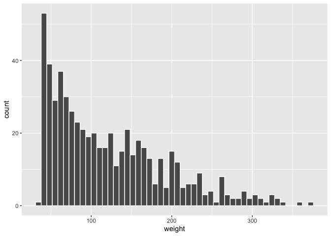
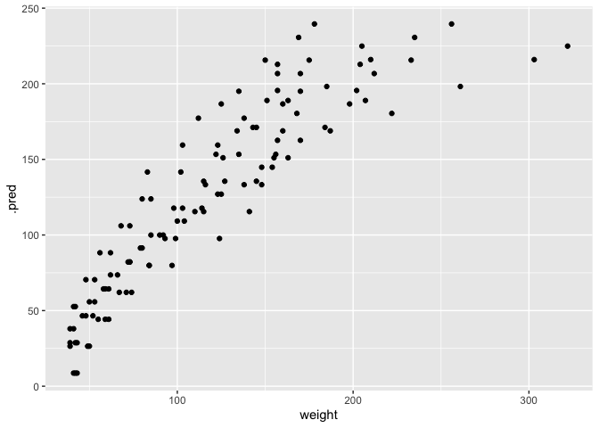

```r
library(tidyverse)
```

```
## ── Attaching core tidyverse packages ──────────────────────── tidyverse 2.0.0 ──
## ✔ dplyr     1.1.3     ✔ readr     2.1.4
## ✔ forcats   1.0.0     ✔ stringr   1.5.0
## ✔ ggplot2   3.4.3     ✔ tibble    3.2.1
## ✔ lubridate 1.9.2     ✔ tidyr     1.3.0
## ✔ purrr     1.0.2     
## ── Conflicts ────────────────────────────────────────── tidyverse_conflicts() ──
## ✖ dplyr::filter() masks stats::filter()
## ✖ dplyr::lag()    masks stats::lag()
## ℹ Use the conflicted package (<http://conflicted.r-lib.org/>) to force all conflicts to become errors
```

```r
library(tidymodels)
```

```
## ── Attaching packages ────────────────────────────────────── tidymodels 1.1.1 ──
## ✔ broom        1.0.5     ✔ rsample      1.2.0
## ✔ dials        1.2.0     ✔ tune         1.1.2
## ✔ infer        1.0.5     ✔ workflows    1.1.3
## ✔ modeldata    1.2.0     ✔ workflowsets 1.0.1
## ✔ parsnip      1.1.1     ✔ yardstick    1.2.0
## ✔ recipes      1.0.8     
## ── Conflicts ───────────────────────────────────────── tidymodels_conflicts() ──
## ✖ scales::discard() masks purrr::discard()
## ✖ dplyr::filter()   masks stats::filter()
## ✖ recipes::fixed()  masks stringr::fixed()
## ✖ dplyr::lag()      masks stats::lag()
## ✖ yardstick::spec() masks readr::spec()
## ✖ recipes::step()   masks stats::step()
## • Search for functions across packages at https://www.tidymodels.org/find/
```


We will use the ChickWeight data set. It is a built in dataset For info:


```r
?ChickWeight
#Weight versus age of chicks on different diets
```

To use it:


```r
data(ChickWeight)
# then it is an object in your environment
summary(ChickWeight)
```

```
##      weight           Time           Chick     Diet   
##  Min.   : 35.0   Min.   : 0.00   13     : 12   1:220  
##  1st Qu.: 63.0   1st Qu.: 4.00   9      : 12   2:120  
##  Median :103.0   Median :10.00   20     : 12   3:120  
##  Mean   :121.8   Mean   :10.72   10     : 12   4:118  
##  3rd Qu.:163.8   3rd Qu.:16.00   17     : 12          
##  Max.   :373.0   Max.   :21.00   19     : 12          
##                                  (Other):506
```

```r
# Or if you have skimr installed
skimr::skim(ChickWeight) #nicer summary
```


Table: Data summary

|                         |            |
|:------------------------|:-----------|
|Name                     |ChickWeight |
|Number of rows           |578         |
|Number of columns        |4           |
|_______________________  |            |
|Column type frequency:   |            |
|factor                   |2           |
|numeric                  |2           |
|________________________ |            |
|Group variables          |None        |


**Variable type: factor**

|skim_variable | n_missing| complete_rate|ordered | n_unique|top_counts                     |
|:-------------|---------:|-------------:|:-------|--------:|:------------------------------|
|Chick         |         0|             1|TRUE    |       50|13: 12, 9: 12, 20: 12, 10: 12  |
|Diet          |         0|             1|FALSE   |        4|1: 220, 2: 120, 3: 120, 4: 118 |


**Variable type: numeric**

|skim_variable | n_missing| complete_rate|   mean|    sd| p0| p25| p50|    p75| p100|hist  |
|:-------------|---------:|-------------:|------:|-----:|--:|---:|---:|------:|----:|:-----|
|weight        |         0|             1| 121.82| 71.07| 35|  63| 103| 163.75|  373|▇▅▂▁▁ |
|Time          |         0|             1|  10.72|  6.76|  0|   4|  10|  16.00|   21|▇▅▅▅▇ |

```r
head(ChickWeight)
```

```
##   weight Time Chick Diet
## 1     42    0     1    1
## 2     51    2     1    1
## 3     59    4     1    1
## 4     64    6     1    1
## 5     76    8     1    1
## 6     93   10     1    1
```

```r
#this is an example of repeated measures, each chick measured at different time points 
#also each chick is nested within a diet (only 1 diet per chick)
```

1.  Use rsample to create training and test sets from ChickWeight. Think
    about how you want this to be split. hint:: you may need to also use
    a function from Chapter 3. message me if you are stuck.

```r
set.seed(510)
chicks_split_simple <- initial_split(ChickWeight, prop=0.80)
chicks_split_simple
```

```
## <Training/Testing/Total>
## <462/116/578>
```

```r
chicks_train_simple <- training(chicks_split_simple)
chicks_test_simple  <-  testing(chicks_split_simple)
#this isn't good b/c it splits up data from a given chick 
```

Simple + Strata by weight

```r
ggplot(ChickWeight, aes(x = weight)) + 
  geom_histogram(bins = 50, col= "white") #data very right skewed by weight
```

<!-- -->

```r
#want stratified sampling 

set.seed(511)
chicks_split_strata <- initial_split(ChickWeight, prop=0.80, strata=weight)
chicks_split_strata
```

```
## <Training/Testing/Total>
## <461/117/578>
```

```r
chicks_train_strata <- training(chicks_split_strata)
chicks_test_strata  <-  testing(chicks_split_strata)
#stratifying by weight is good, but still need to fix the chicks problem
```

I need it to put different chicks in different sets, but keep all of a single chick's info together:

```r
set.seed(512)
chicks_split_chick <- 
  ChickWeight %>% 
  group_nest(Chick)  %>% 
  initial_split(prop=0.80)
chicks_split_chick
```

```
## <Training/Testing/Total>
## <40/10/50>
```

```r
chicks_train_chick <- training(chicks_split_chick)
chicks_test_chick  <-  testing(chicks_split_chick)

#won't let me also use a strata argument with this syntax
```


2.  Fit an lm to the ChickWeight (training) data set, modelling weight
    as a function of diet and time (and their interaction?), using
    parsnip tools. This really should be a mixed-effects model, so see
    if you can do that instead (e.g. with lme4 or stan as the engine).

```r
#regular linear model
lm_model <- 
  linear_reg() %>% 
  set_engine("lm")

chicks_train_chick_ungrouped <- chicks_train_chick %>% unnest(data)
chicks_train_chick_ungrouped
```

```
## # A tibble: 459 × 4
##    Chick weight  Time Diet 
##    <ord>  <dbl> <dbl> <fct>
##  1 40        41     0 3    
##  2 40        55     2 3    
##  3 40        66     4 3    
##  4 40        79     6 3    
##  5 40       101     8 3    
##  6 40       120    10 3    
##  7 40       154    12 3    
##  8 40       182    14 3    
##  9 40       215    16 3    
## 10 40       262    18 3    
## # ℹ 449 more rows
```

```r
lm_fit <- 
  lm_model %>% 
  fit(weight ~ Diet + Time, data = chicks_train_chick_ungrouped)

lm_fit %>% extract_fit_engine()
```

```
## 
## Call:
## stats::lm(formula = weight ~ Diet + Time, data = data)
## 
## Coefficients:
## (Intercept)        Diet2        Diet3        Diet4         Time  
##       8.667       20.085       43.982       29.335        8.900
```

```r
model_res <- 
  lm_fit %>% 
  extract_fit_engine() %>% 
  summary()
model_res
```

```
## 
## Call:
## stats::lm(formula = weight ~ Diet + Time, data = data)
## 
## Residuals:
##      Min       1Q   Median       3Q      Max 
## -141.642  -20.969   -2.059   17.271  133.461 
## 
## Coefficients:
##             Estimate Std. Error t value Pr(>|t|)    
## (Intercept)    8.667      3.908   2.218   0.0271 *  
## Diet2         20.085      4.989   4.026 6.65e-05 ***
## Diet3         43.982      4.770   9.221  < 2e-16 ***
## Diet4         29.335      4.802   6.109 2.16e-09 ***
## Time           8.899      0.262  33.963  < 2e-16 ***
## ---
## Signif. codes:  0 '***' 0.001 '**' 0.01 '*' 0.05 '.' 0.1 ' ' 1
## 
## Residual standard error: 37.91 on 454 degrees of freedom
## Multiple R-squared:  0.7363,	Adjusted R-squared:  0.7339 
## F-statistic: 316.8 on 4 and 454 DF,  p-value: < 2.2e-16
```

```r
param_est <- coef(model_res)
class(param_est)
```

```
## [1] "matrix" "array"
```

```r
param_est
```

```
##              Estimate Std. Error   t value      Pr(>|t|)
## (Intercept)  8.666661   3.907812  2.217779  2.706423e-02
## Diet2       20.085030   4.988751  4.026064  6.645987e-05
## Diet3       43.982351   4.769633  9.221329  1.107271e-18
## Diet4       29.335312   4.801850  6.109169  2.155418e-09
## Time         8.899518   0.262036 33.962957 1.003110e-126
```

```r
tidy(lm_fit) 
```

```
## # A tibble: 5 × 5
##   term        estimate std.error statistic   p.value
##   <chr>          <dbl>     <dbl>     <dbl>     <dbl>
## 1 (Intercept)     8.67     3.91       2.22 2.71e-  2
## 2 Diet2          20.1      4.99       4.03 6.65e-  5
## 3 Diet3          44.0      4.77       9.22 1.11e- 18
## 4 Diet4          29.3      4.80       6.11 2.16e-  9
## 5 Time            8.90     0.262     34.0  1.00e-126
```


```r
#mixed-effects model
library(multilevelmod)
show_engines('linear_reg')
```

```
## # A tibble: 13 × 2
##    engine     mode      
##    <chr>      <chr>     
##  1 lm         regression
##  2 glm        regression
##  3 glmnet     regression
##  4 stan       regression
##  5 spark      regression
##  6 keras      regression
##  7 brulee     regression
##  8 stan_glmer regression
##  9 lmer       regression
## 10 glmer      regression
## 11 gee        regression
## 12 lme        regression
## 13 gls        regression
```

```r
mixed_lm_model <-
  linear_reg() %>% 
  set_engine("lmer")

unique(chicks_train_chick_ungrouped$Time) #time should be nested within Chick which is nested within diet
```

```
##  [1]  0  2  4  6  8 10 12 14 16 18 20 21
```

```r
unique(chicks_train_chick_ungrouped$Diet)
```

```
## [1] 3 1 4 2
## Levels: 1 2 3 4
```

```r
lm_mixed_fit <- 
  mixed_lm_model %>% 
  fit(weight ~ Diet + (1|Diet/Time), data = chicks_train_chick_ungrouped) #I'm pretty sure this is the wrong syntax

lm_mixed_fit %>% extract_fit_engine()
```

```
## Linear mixed model fit by REML ['lmerMod']
## Formula: weight ~ Diet + (1 | Diet/Time)
##    Data: data
## REML criterion at convergence: 4730.228
## Random effects:
##  Groups    Name        Std.Dev.
##  Time:Diet (Intercept) 67.07   
##  Diet      (Intercept) 27.85   
##  Residual              36.27   
## Number of obs: 459, groups:  Time:Diet, 48; Diet, 4
## Fixed Effects:
## (Intercept)        Diet2        Diet3        Diet4  
##      104.90        21.01        44.90        30.36
```

```r
model_res <- 
  lm_mixed_fit %>% 
  extract_fit_engine() %>% 
  summary()
model_res
```

```
## Linear mixed model fit by REML ['lmerMod']
## Formula: weight ~ Diet + (1 | Diet/Time)
##    Data: data
## 
## REML criterion at convergence: 4730.2
## 
## Scaled residuals: 
##     Min      1Q  Median      3Q     Max 
## -4.1070 -0.2553 -0.0702  0.2422  3.5566 
## 
## Random effects:
##  Groups    Name        Variance Std.Dev.
##  Time:Diet (Intercept) 4498.5   67.07   
##  Diet      (Intercept)  775.6   27.85   
##  Residual              1315.2   36.27   
## Number of obs: 459, groups:  Time:Diet, 48; Diet, 4
## 
## Fixed effects:
##             Estimate Std. Error t value
## (Intercept)   104.90      34.02   3.083
## Diet2          21.01      48.21   0.436
## Diet3          44.90      48.19   0.932
## Diet4          30.36      48.19   0.630
## 
## Correlation of Fixed Effects:
##       (Intr) Diet2  Diet3 
## Diet2 -0.706              
## Diet3 -0.706  0.498       
## Diet4 -0.706  0.498  0.499
```

```r
param_est <- coef(model_res)
class(param_est)
```

```
## [1] "matrix" "array"
```

```r
param_est
```

```
##              Estimate Std. Error   t value
## (Intercept) 104.89903   34.02388 3.0831003
## Diet2        21.00573   48.20539 0.4357548
## Diet3        44.90305   48.18509 0.9318870
## Diet4        30.36458   48.18846 0.6301214
```

```r
#tidy(lm_mixed_fit) #Error: No tidy method for objects of class lmerMod
```


3.  Use your model to predict weight in your test set chicks. (using
    parsnip tools)

```r
chicks_test_chick_ungrouped <- chicks_test_chick %>% unnest(data)
chicks_test_chick_ungrouped
```

```
## # A tibble: 119 × 4
##    Chick weight  Time Diet 
##    <ord>  <dbl> <dbl> <fct>
##  1 8         42     0 1    
##  2 8         50     2 1    
##  3 8         61     4 1    
##  4 8         71     6 1    
##  5 8         84     8 1    
##  6 8         93    10 1    
##  7 8        110    12 1    
##  8 8        116    14 1    
##  9 8        126    16 1    
## 10 8        134    18 1    
## # ℹ 109 more rows
```

```r
predict(lm_fit, new_data = chicks_test_chick_ungrouped)
```

```
## # A tibble: 119 × 1
##     .pred
##     <dbl>
##  1   8.67
##  2  26.5 
##  3  44.3 
##  4  62.1 
##  5  79.9 
##  6  97.7 
##  7 115.  
##  8 133.  
##  9 151.  
## 10 169.  
## # ℹ 109 more rows
```

```r
pred_obs_data <- chicks_test_chick_ungrouped %>% 
  select(weight) %>% 
  bind_cols(predict(lm_fit, chicks_test_chick_ungrouped)) %>% 
  # Add 95% prediction intervals to the results:
  bind_cols(predict(lm_fit, chicks_test_chick_ungrouped, type = "pred_int")) 
pred_obs_data
```

```
## # A tibble: 119 × 4
##    weight  .pred .pred_lower .pred_upper
##     <dbl>  <dbl>       <dbl>       <dbl>
##  1     42   8.67      -66.2         83.6
##  2     50  26.5       -48.4        101. 
##  3     61  44.3       -30.5        119. 
##  4     71  62.1       -12.7        137. 
##  5     84  79.9         5.16       155. 
##  6     93  97.7        23.0        172. 
##  7    110 115.         40.8        190. 
##  8    116 133.         58.5        208. 
##  9    126 151.         76.3        226. 
## 10    134 169.         94.1        244. 
## # ℹ 109 more rows
```

4.  Plot predicted vs observed in your test data set.

```r
pred_obs_data %>% ggplot(aes(weight, .pred)) + geom_point()
```

<!-- -->


5.  Optional: recreate an Ames Neighborhood plot.

    1.  Tutorials are at <https://ggplot2tutor.com/tutorials/streetmaps>
        <https://joshuamccrain.com/tutorials/maps/streets_tutorial.html>
