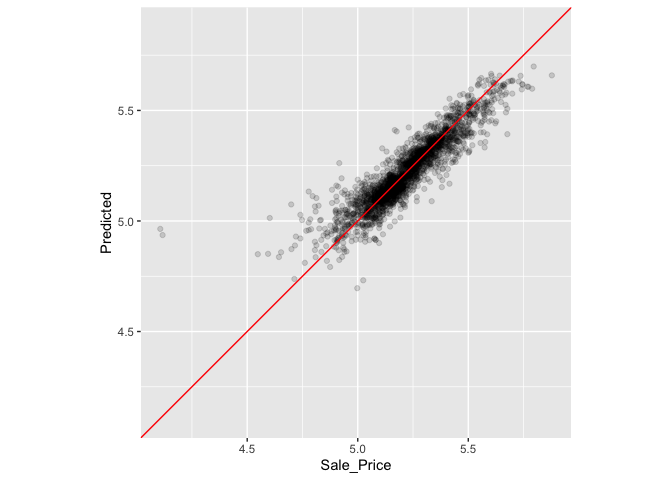

# Chapter 10 - Resampling for Evaluating Performance

<https://www.tmwr.org/resampling>

## Resubstitution Approach

When you measure performance on the same data used for training.

Example with Ames data: compare previously fitted lm model to a random forest model on the same training set.

Previous AMES code:


```r
library(tidymodels)
```

```
## ── Attaching packages ────────────────────────────────────── tidymodels 1.1.1 ──
```

```
## ✔ broom        1.0.5     ✔ recipes      1.0.8
## ✔ dials        1.2.0     ✔ rsample      1.2.0
## ✔ dplyr        1.1.3     ✔ tibble       3.2.1
## ✔ ggplot2      3.4.3     ✔ tidyr        1.3.0
## ✔ infer        1.0.5     ✔ tune         1.1.2
## ✔ modeldata    1.2.0     ✔ workflows    1.1.3
## ✔ parsnip      1.1.1     ✔ workflowsets 1.0.1
## ✔ purrr        1.0.2     ✔ yardstick    1.2.0
```

```
## ── Conflicts ───────────────────────────────────────── tidymodels_conflicts() ──
## ✖ purrr::discard() masks scales::discard()
## ✖ dplyr::filter()  masks stats::filter()
## ✖ dplyr::lag()     masks stats::lag()
## ✖ recipes::step()  masks stats::step()
## • Use tidymodels_prefer() to resolve common conflicts.
```

```r
data(ames)
ames <- mutate(ames, Sale_Price = log10(Sale_Price))

set.seed(502)
ames_split <- initial_split(ames, prop = 0.80, strata = Sale_Price)
ames_train <- training(ames_split)
ames_test  <-  testing(ames_split)

ames_rec <- 
  recipe(Sale_Price ~ Neighborhood + Gr_Liv_Area + Year_Built + Bldg_Type + 
           Latitude + Longitude, data = ames_train) %>%
  step_log(Gr_Liv_Area, base = 10) %>% 
  step_other(Neighborhood, threshold = 0.01) %>% 
  step_dummy(all_nominal_predictors()) %>% 
  step_interact( ~ Gr_Liv_Area:starts_with("Bldg_Type_") ) %>% 
  step_ns(Latitude, Longitude, deg_free = 20)
  
lm_model <- linear_reg() %>% set_engine("lm")

lm_wflow <- 
  workflow() %>% 
  add_model(lm_model) %>% 
  add_recipe(ames_rec)

lm_fit <- fit(lm_wflow, ames_train)
```

Random Forest model:


```r
rf_model <- 
  rand_forest(trees = 1000) %>% 
  set_engine("ranger") %>% 
  set_mode("regression")

rf_wflow <- 
  workflow() %>% 
  add_formula(
    Sale_Price ~ Neighborhood + Gr_Liv_Area + Year_Built + Bldg_Type + 
      Latitude + Longitude) %>% 
  add_model(rf_model) 

rf_fit <- rf_wflow %>% fit(data = ames_train)
```

Compare the linear and random forest models


```r
estimate_perf <- function(model, dat) {
  # Capture the names of the `model` and `dat` objects
  cl <- match.call()
  obj_name <- as.character(cl$model)
  data_name <- as.character(cl$dat)
  data_name <- gsub("ames_", "", data_name)
  
  # Estimate these metrics:
  reg_metrics <- metric_set(rmse, rsq)
  
  model %>%
    predict(dat) %>%
    bind_cols(dat %>% select(Sale_Price)) %>%
    reg_metrics(Sale_Price, .pred) %>%
    select(-.estimator) %>%
    mutate(object = obj_name, data = data_name)
}
```

Compute rmse and rsq


```r
estimate_perf(rf_fit, ames_train)
```

```
## # A tibble: 2 × 4
##   .metric .estimate object data 
##   <chr>       <dbl> <chr>  <chr>
## 1 rmse       0.0365 rf_fit train
## 2 rsq        0.960  rf_fit train
```

```r
estimate_perf(lm_fit, ames_train)
```

```
## # A tibble: 2 × 4
##   .metric .estimate object data 
##   <chr>       <dbl> <chr>  <chr>
## 1 rmse       0.0754 lm_fit train
## 2 rsq        0.816  lm_fit train
```

```r
#Random forest model seems ot have a better fit
```

Apply the rf model to the test set


```r
estimate_perf(rf_fit, ames_test)
```

```
## # A tibble: 2 × 4
##   .metric .estimate object data 
##   <chr>       <dbl> <chr>  <chr>
## 1 rmse       0.0704 rf_fit test 
## 2 rsq        0.852  rf_fit test
```

Much higher error on the test set than the training set.

-   Random forest models is an example of a low bias model --\> it can learn complex trends from the data ---\>sometimes nearly memorizes the training set

-   Linear regression model is consistent b/t training and test sets b/c of its limited complexity

## Resampling Methods

Only conducted on the training set

For each iteration of resampling the data is split into 2 subsamples (analysis and assessment set)

### Cross-Validation

V- fold CV - data randomly split into V sets of roughly equal size.

-   3-fold CV results in 3 iterations of resampling where one fold is held out for assessment and the other 2 folds are substrate for the model. The final resampling estimate avgs each of the V replicates

-   V=5 or 10 are more reliable; 10 is default for this book

    -   larger values ---\> small bias w/ substantial variance

    -   smaller values ---\>large bias but low variance

10-fold example with Ames data:


```r
set.seed(1001)
ames_folds <- vfold_cv(ames_train, v = 10)
ames_folds
```

```
## #  10-fold cross-validation 
## # A tibble: 10 × 2
##    splits             id    
##    <list>             <chr> 
##  1 <split [2107/235]> Fold01
##  2 <split [2107/235]> Fold02
##  3 <split [2108/234]> Fold03
##  4 <split [2108/234]> Fold04
##  5 <split [2108/234]> Fold05
##  6 <split [2108/234]> Fold06
##  7 <split [2108/234]> Fold07
##  8 <split [2108/234]> Fold08
##  9 <split [2108/234]> Fold09
## 10 <split [2108/234]> Fold10
```

```r
#[analysis/assessment]
```

Manually retrieve the partitioned data:


```r
# For the first fold:
ames_folds$splits[[1]] %>% analysis() %>% dim()
```

```
## [1] 2107   74
```

Variations of CV:

-   Repeated

-   Leave One Out (LOO)

-   Monte Carlo (MCCV)

#### Repeated CV

"To create *R* repeats of *V*-fold cross-validation, the same fold generation process is done *R* times to generate *R* collections of *V* partitions. Now, instead of averaging *V* statistics, V×R statistics produce the final resampling estimate. Due to the Central Limit Theorem, the summary statistics from each model tend toward a normal distribution, as long as we have a lot of data relative to V×R."


```r
vfold_cv(ames_train, v = 10, repeats = 5)
```

```
## #  10-fold cross-validation repeated 5 times 
## # A tibble: 50 × 3
##    splits             id      id2   
##    <list>             <chr>   <chr> 
##  1 <split [2107/235]> Repeat1 Fold01
##  2 <split [2107/235]> Repeat1 Fold02
##  3 <split [2108/234]> Repeat1 Fold03
##  4 <split [2108/234]> Repeat1 Fold04
##  5 <split [2108/234]> Repeat1 Fold05
##  6 <split [2108/234]> Repeat1 Fold06
##  7 <split [2108/234]> Repeat1 Fold07
##  8 <split [2108/234]> Repeat1 Fold08
##  9 <split [2108/234]> Repeat1 Fold09
## 10 <split [2108/234]> Repeat1 Fold10
## # ℹ 40 more rows
```

#### Leave-One-Out CV

"If there are n training set samples, n models are fit using n−1 rows of the training set. Each model predicts the single excluded data point. At the end of resampling, the n predictions are pooled to produce a single performance statistic."

Computationally excessive and may not have good stat properties.

#### Monte Carlo CV

"Like *V*-fold cross-validation, it allocates a fixed proportion of data to the assessment sets. The difference between MCCV and regular cross-validation is that, for MCCV, this proportion of the data is randomly selected each time. This results in assessment sets that are not mutually exclusive."


```r
mc_cv(ames_train, prop = 9/10, times = 20)
```

```
## # Monte Carlo cross-validation (0.9/0.1) with 20 resamples  
## # A tibble: 20 × 2
##    splits             id        
##    <list>             <chr>     
##  1 <split [2107/235]> Resample01
##  2 <split [2107/235]> Resample02
##  3 <split [2107/235]> Resample03
##  4 <split [2107/235]> Resample04
##  5 <split [2107/235]> Resample05
##  6 <split [2107/235]> Resample06
##  7 <split [2107/235]> Resample07
##  8 <split [2107/235]> Resample08
##  9 <split [2107/235]> Resample09
## 10 <split [2107/235]> Resample10
## 11 <split [2107/235]> Resample11
## 12 <split [2107/235]> Resample12
## 13 <split [2107/235]> Resample13
## 14 <split [2107/235]> Resample14
## 15 <split [2107/235]> Resample15
## 16 <split [2107/235]> Resample16
## 17 <split [2107/235]> Resample17
## 18 <split [2107/235]> Resample18
## 19 <split [2107/235]> Resample19
## 20 <split [2107/235]> Resample20
```

### Validation Sets

Single partition set aside to estimate performance

-   Initial data is split into a training, validation, and test set

-   Typically used when original pool of data is very large --\> single partition may be big enough to char. model performance

    
    ```r
    # Previously:
    set.seed(52)
    # To put 60% into training, 20% in validation, and 20% in testing:
    ames_val_split <- initial_validation_split(ames, prop = c(0.6, 0.2))
    ames_val_split
    ```
    
    ```
    ## <Training/Validation/Testing/Total>
    ## <1758/586/586/2930>
    ```
    
    ```r
    # Object used for resampling: 
    val_set <- validation_set(ames_val_split)
    val_set
    ```
    
    ```
    ## # A tibble: 1 × 2
    ##   splits             id        
    ##   <list>             <chr>     
    ## 1 <split [1758/586]> validation
    ```

### Bootstrapping

"A bootstrap sample of the training set is a sample that is the same size as the training set but is drawn *with replacement*. This means that some training set data points are selected multiple times for the analysis set."

-   assessment set = out-of-bag sample

-   Results in performance estimates with very low variance, but significant pessimistic bias (i.e. if true accuracy is 90%, it would estimate the value to be less than 90%)


```r
bootstraps(ames_train, times = 5)
```

```
## # Bootstrap sampling 
## # A tibble: 5 × 2
##   splits             id        
##   <list>             <chr>     
## 1 <split [2342/867]> Bootstrap1
## 2 <split [2342/869]> Bootstrap2
## 3 <split [2342/859]> Bootstrap3
## 4 <split [2342/858]> Bootstrap4
## 5 <split [2342/873]> Bootstrap5
```

### Rolling Forecasting Origin Resampling

For time series data when you need to be able to seasonal or other temporal trends in the data

-   estimate the model w/ historical data and evaluate it with the most recent data

-   The size of the initial analysis and assessment sets are specified. --\>The first iteration of resampling uses these sizes, starting from the beginning of the series. --\>The second iteration uses the same data sizes but shifts over by a set number of samples (discards the first training set sample)

-   Or "The analysis set can cumulatively grow (as opposed to remaining the same size). After the first initial analysis set, new samples can accrue without discarding the earlier data."

-   Or "The resamples need not increment by one. For example, for large data sets, the incremental block could be a week or month instead of a day."


```r
time_slices <- 
  tibble(x = 1:365) %>% 
  rolling_origin(initial = 6 * 30, assess = 30, skip = 29, cumulative = FALSE)

data_range <- function(x) {
  summarize(x, first = min(x), last = max(x))
}

map_dfr(time_slices$splits, ~   analysis(.x) %>% data_range())
```

```
## # A tibble: 6 × 2
##   first  last
##   <int> <int>
## 1     1   180
## 2    31   210
## 3    61   240
## 4    91   270
## 5   121   300
## 6   151   330
```

```r
map_dfr(time_slices$splits, ~ assessment(.x) %>% data_range())
```

```
## # A tibble: 6 × 2
##   first  last
##   <int> <int>
## 1   181   210
## 2   211   240
## 3   241   270
## 4   271   300
## 5   301   330
## 6   331   360
```

## Estimating Performance


```r
#model_spec %>% fit_resamples(formula,  resamples, ...)
#model_spec %>% fit_resamples(recipe,   resamples, ...)
#workflow   %>% fit_resamples(          resamples, ...)
```

Optional arguments to add to fit_resamples()

-   `metrics`: A metric set of performance statistics to compute. By default, regression models use RMSE and R^2^ while classification models compute the area under the ROC curve and overall accuracy.

-   `control`: A list created by `control_resamples()` with various options.

    -   `verbose`: A logical for printing logging.

    -   `extract`: A function for retaining objects from each model iteration

    -   `save_pred`: A logical for saving the assessment set predictions.


```r
#example using save_pred
keep_pred <- control_resamples(save_pred = TRUE, save_workflow = TRUE)

set.seed(1003)
rf_res <- 
  rf_wflow %>% 
  fit_resamples(resamples = ames_folds, control = keep_pred)
rf_res
```

```
## # Resampling results
## # 10-fold cross-validation 
## # A tibble: 10 × 5
##    splits             id     .metrics         .notes           .predictions
##    <list>             <chr>  <list>           <list>           <list>      
##  1 <split [2107/235]> Fold01 <tibble [2 × 4]> <tibble [0 × 3]> <tibble>    
##  2 <split [2107/235]> Fold02 <tibble [2 × 4]> <tibble [0 × 3]> <tibble>    
##  3 <split [2108/234]> Fold03 <tibble [2 × 4]> <tibble [0 × 3]> <tibble>    
##  4 <split [2108/234]> Fold04 <tibble [2 × 4]> <tibble [0 × 3]> <tibble>    
##  5 <split [2108/234]> Fold05 <tibble [2 × 4]> <tibble [0 × 3]> <tibble>    
##  6 <split [2108/234]> Fold06 <tibble [2 × 4]> <tibble [0 × 3]> <tibble>    
##  7 <split [2108/234]> Fold07 <tibble [2 × 4]> <tibble [0 × 3]> <tibble>    
##  8 <split [2108/234]> Fold08 <tibble [2 × 4]> <tibble [0 × 3]> <tibble>    
##  9 <split [2108/234]> Fold09 <tibble [2 × 4]> <tibble [0 × 3]> <tibble>    
## 10 <split [2108/234]> Fold10 <tibble [2 × 4]> <tibble [0 × 3]> <tibble>
```

```r
#metrics containes the assessment set performance stats
#notes contains any warnings or errors generated during resampling #predictions (when save_pred=TRUE) - tibbles w/ out of sample preds 
```

More usable format of performance metrics


```r
collect_metrics(rf_res)
```

```
## # A tibble: 2 × 6
##   .metric .estimator   mean     n std_err .config             
##   <chr>   <chr>       <dbl> <int>   <dbl> <chr>               
## 1 rmse    standard   0.0721    10 0.00306 Preprocessor1_Model1
## 2 rsq     standard   0.832     10 0.0108  Preprocessor1_Model1
```

```r
#thesea re averaged over the resampling replicates
#to get metrics for each resample use summarize=FALSE
```

Assessment set predictions:


```r
assess_res <- collect_predictions(rf_res)
assess_res
```

```
## # A tibble: 2,342 × 5
##    id     .pred  .row Sale_Price .config             
##    <chr>  <dbl> <int>      <dbl> <chr>               
##  1 Fold01  5.10    10       5.09 Preprocessor1_Model1
##  2 Fold01  4.92    27       4.90 Preprocessor1_Model1
##  3 Fold01  5.20    47       5.08 Preprocessor1_Model1
##  4 Fold01  5.13    52       5.10 Preprocessor1_Model1
##  5 Fold01  5.13    59       5.10 Preprocessor1_Model1
##  6 Fold01  5.13    63       5.11 Preprocessor1_Model1
##  7 Fold01  4.87    65       4.91 Preprocessor1_Model1
##  8 Fold01  4.98    66       5.04 Preprocessor1_Model1
##  9 Fold01  4.91    67       4.84 Preprocessor1_Model1
## 10 Fold01  4.92    68       5.01 Preprocessor1_Model1
## # ℹ 2,332 more rows
```

```r
#row matches the row of the OG row in the training set so that the data can be joined properly 
```

\*Note: "For some resampling methods, such as the bootstrap or repeated cross-validation, there will be multiple predictions per row of the original training set. To obtain summarized values (averages of the replicate predictions) use `collect_predictions(object, summarize = TRUE)`."

Compare the observed and held-out predicted values


```r
assess_res %>% 
  ggplot(aes(x = Sale_Price, y = .pred)) + 
  geom_point(alpha = .15) +
  geom_abline(color = "red") + 
  coord_obs_pred() + 
  ylab("Predicted")
```

<!-- -->

2 houses w/ low sale price that are overpredicted (2 dots on left side of above figure)


```r
over_predicted <- 
  assess_res %>% 
  mutate(residual = Sale_Price - .pred) %>% 
  arrange(desc(abs(residual))) %>% 
  slice(1:2)
over_predicted #pull out the two overpredicted houses 
```

```
## # A tibble: 2 × 6
##   id     .pred  .row Sale_Price .config              residual
##   <chr>  <dbl> <int>      <dbl> <chr>                   <dbl>
## 1 Fold09  4.96    32       4.11 Preprocessor1_Model1   -0.857
## 2 Fold08  4.94   317       4.12 Preprocessor1_Model1   -0.819
```

```r
ames_train %>% 
  slice(over_predicted$.row) %>% 
  select(Gr_Liv_Area, Neighborhood, Year_Built, Bedroom_AbvGr, Full_Bath) #find the two houses in the original data set with all of the other info 
```

```
## # A tibble: 2 × 5
##   Gr_Liv_Area Neighborhood           Year_Built Bedroom_AbvGr Full_Bath
##         <int> <fct>                       <int>         <int>     <int>
## 1         832 Old_Town                     1923             2         1
## 2         733 Iowa_DOT_and_Rail_Road       1952             2         1
```

### Use a validation set instead


```r
val_res <- rf_wflow %>% fit_resamples(resamples = val_set)
```

```
## Warning in `[.tbl_df`(x, is.finite(x <- as.numeric(x))): NAs introduced by
## coercion
```

```r
val_res
```

```
## # Resampling results
## #  
## # A tibble: 1 × 4
##   splits             id         .metrics         .notes          
##   <list>             <chr>      <list>           <list>          
## 1 <split [1758/586]> validation <tibble [2 × 4]> <tibble [0 × 3]>
```

```r
collect_metrics(val_res)
```

```
## # A tibble: 2 × 6
##   .metric .estimator   mean     n std_err .config             
##   <chr>   <chr>       <dbl> <int>   <dbl> <chr>               
## 1 rmse    standard   0.0725     1      NA Preprocessor1_Model1
## 2 rsq     standard   0.824      1      NA Preprocessor1_Model1
```

## Parallel Processing 

The models created during resampling could be fit simultaneously w/o issues (each one is independent).

"The **tune** package uses the [**foreach**](https://cran.r-project.org/package=foreach) package to facilitate parallel computations. These computations could be split across processors on the same computer or across different computers, depending on the chosen technology."

On a single computer the number of possible worker processes is determined as follows:


```r
# The number of physical cores in the hardware:
parallel::detectCores(logical = FALSE)
```

```
## [1] 2
```

```r
#2

# The number of possible independent processes that can 
# be simultaneously used:  
parallel::detectCores(logical = TRUE)
```

```
## [1] 4
```

```r
#4

#While these extra resources can improve performance, most of the speed-ups produced by parallel processing occur when processing uses fewer than the number of physical cores.
```

See the chapter for more info on parallel processing technologies.

\*Note: "the memory requirements multiply for each additional core used. For example, if the current data set is 2 GB in memory and three cores are used, the total memory requirement is 8 GB (2 for each worker process plus the original). Using too many cores might cause the computations (and the computer) to slow considerably."

## Saving the Resampled Objects

Resampling models are typically not retained b/c we usually don't need them after calc the performance stats. Once you have the best model, fit that again to the whole training set so that the model parameters can be estimated w/ more data

IF you do want to keep them use the extract option of control_resamples().

Fit a linear regression w/ the previously developed recipe:


```r
ames_rec <- 
  recipe(Sale_Price ~ Neighborhood + Gr_Liv_Area + Year_Built + Bldg_Type + 
           Latitude + Longitude, data = ames_train) %>%
  step_other(Neighborhood, threshold = 0.01) %>% 
  step_dummy(all_nominal_predictors()) %>% 
  step_interact( ~ Gr_Liv_Area:starts_with("Bldg_Type_") ) %>% 
  step_ns(Latitude, Longitude, deg_free = 20)

lm_wflow <-  
  workflow() %>% 
  add_recipe(ames_rec) %>% 
  add_model(linear_reg() %>% set_engine("lm")) 

lm_fit <- lm_wflow %>% fit(data = ames_train)

# Select the recipe: 
extract_recipe(lm_fit, estimated = TRUE)
```

```
## 
```

```
## ── Recipe ──────────────────────────────────────────────────────────────────────
```

```
## 
```

```
## ── Inputs
```

```
## Number of variables by role
```

```
## outcome:   1
## predictor: 6
```

```
## 
```

```
## ── Training information
```

```
## Training data contained 2342 data points and no incomplete rows.
```

```
## 
```

```
## ── Operations
```

```
## • Collapsing factor levels for: Neighborhood | Trained
```

```
## • Dummy variables from: Neighborhood, Bldg_Type | Trained
```

```
## • Interactions with: Gr_Liv_Area:(Bldg_Type_TwoFmCon + Bldg_Type_Duplex +
##   Bldg_Type_Twnhs + Bldg_Type_TwnhsE) | Trained
```

```
## • Natural splines on: Latitude, Longitude | Trained
```

Save the coeff for a fitted model object like so:


```r
get_model <- function(x) {
  extract_fit_parsnip(x) %>% tidy()
}


# Test it using: 
get_model(lm_fit)
```

```
## # A tibble: 73 × 5
##    term                             estimate  std.error statistic   p.value
##    <chr>                               <dbl>      <dbl>     <dbl>     <dbl>
##  1 (Intercept)                      1.54     0.298         5.16   2.61e-  7
##  2 Gr_Liv_Area                      0.000163 0.00000446   36.4    2.81e-229
##  3 Year_Built                       0.00177  0.000140     12.6    1.93e- 35
##  4 Neighborhood_College_Creek       0.00125  0.0350        0.0357 9.72e-  1
##  5 Neighborhood_Old_Town           -0.0718   0.0129       -5.55   3.18e-  8
##  6 Neighborhood_Edwards            -0.0957   0.0293       -3.27   1.09e-  3
##  7 Neighborhood_Somerset            0.0944   0.0199        4.74   2.31e-  6
##  8 Neighborhood_Northridge_Heights  0.158    0.0363        4.36   1.37e-  5
##  9 Neighborhood_Gilbert             0.0285   0.0330        0.864  3.88e-  1
## 10 Neighborhood_Sawyer             -0.0967   0.0275       -3.52   4.36e-  4
## # ℹ 63 more rows
```

Apply the function to the 10 resampled fits:


```r
ctrl <- control_resamples(extract = get_model)

lm_res <- lm_wflow %>%  fit_resamples(resamples = ames_folds, control = ctrl)
lm_res
```

```
## # Resampling results
## # 10-fold cross-validation 
## # A tibble: 10 × 5
##    splits             id     .metrics         .notes           .extracts       
##    <list>             <chr>  <list>           <list>           <list>          
##  1 <split [2107/235]> Fold01 <tibble [2 × 4]> <tibble [0 × 3]> <tibble [1 × 2]>
##  2 <split [2107/235]> Fold02 <tibble [2 × 4]> <tibble [0 × 3]> <tibble [1 × 2]>
##  3 <split [2108/234]> Fold03 <tibble [2 × 4]> <tibble [0 × 3]> <tibble [1 × 2]>
##  4 <split [2108/234]> Fold04 <tibble [2 × 4]> <tibble [0 × 3]> <tibble [1 × 2]>
##  5 <split [2108/234]> Fold05 <tibble [2 × 4]> <tibble [0 × 3]> <tibble [1 × 2]>
##  6 <split [2108/234]> Fold06 <tibble [2 × 4]> <tibble [0 × 3]> <tibble [1 × 2]>
##  7 <split [2108/234]> Fold07 <tibble [2 × 4]> <tibble [0 × 3]> <tibble [1 × 2]>
##  8 <split [2108/234]> Fold08 <tibble [2 × 4]> <tibble [0 × 3]> <tibble [1 × 2]>
##  9 <split [2108/234]> Fold09 <tibble [2 × 4]> <tibble [0 × 3]> <tibble [1 × 2]>
## 10 <split [2108/234]> Fold10 <tibble [2 × 4]> <tibble [0 × 3]> <tibble [1 × 2]>
```

What is the new extracts column?


```r
lm_res$.extracts[[1]]
```

```
## # A tibble: 1 × 2
##   .extracts         .config             
##   <list>            <chr>               
## 1 <tibble [73 × 5]> Preprocessor1_Model1
```

```r
# To get the results
lm_res$.extracts[[1]][[1]]
```

```
## [[1]]
## # A tibble: 73 × 5
##    term                             estimate  std.error statistic   p.value
##    <chr>                               <dbl>      <dbl>     <dbl>     <dbl>
##  1 (Intercept)                      1.48     0.320         4.62   4.11e-  6
##  2 Gr_Liv_Area                      0.000158 0.00000476   33.2    9.72e-194
##  3 Year_Built                       0.00180  0.000149     12.1    1.57e- 32
##  4 Neighborhood_College_Creek      -0.00163  0.0373       -0.0438 9.65e-  1
##  5 Neighborhood_Old_Town           -0.0757   0.0138       -5.47   4.92e-  8
##  6 Neighborhood_Edwards            -0.109    0.0310       -3.53   4.21e-  4
##  7 Neighborhood_Somerset            0.0832   0.0217        3.83   1.33e-  4
##  8 Neighborhood_Northridge_Heights  0.163    0.0401        4.06   5.19e-  5
##  9 Neighborhood_Gilbert             0.0304   0.0367        0.827  4.08e-  1
## 10 Neighborhood_Sawyer             -0.113    0.0291       -3.88   1.07e-  4
## # ℹ 63 more rows
```

Flatten and collect all the results


```r
all_coef <- map_dfr(lm_res$.extracts, ~ .x[[1]][[1]])
# Show the replicates for a single predictor:
filter(all_coef, term == "Year_Built")
```

```
## # A tibble: 10 × 5
##    term       estimate std.error statistic  p.value
##    <chr>         <dbl>     <dbl>     <dbl>    <dbl>
##  1 Year_Built  0.00180  0.000149      12.1 1.57e-32
##  2 Year_Built  0.00180  0.000151      12.0 6.45e-32
##  3 Year_Built  0.00185  0.000150      12.3 1.00e-33
##  4 Year_Built  0.00183  0.000147      12.5 1.90e-34
##  5 Year_Built  0.00184  0.000150      12.2 2.47e-33
##  6 Year_Built  0.00180  0.000150      12.0 3.35e-32
##  7 Year_Built  0.00179  0.000149      12.0 3.52e-32
##  8 Year_Built  0.00185  0.000145      12.7 1.47e-35
##  9 Year_Built  0.00158  0.000146      10.8 2.02e-26
## 10 Year_Built  0.00181  0.000148      12.2 3.02e-33
```
