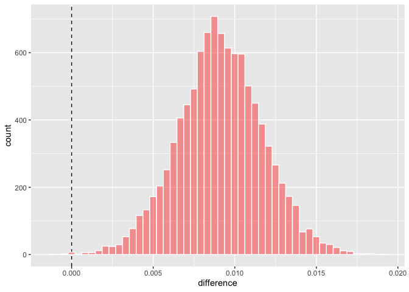

# Chapter 11 - Comparing Models with Resampling

<https://www.tmwr.org/compare>

### Previous AMES Code:


```r
library(tidymodels)
```

```
## ── Attaching packages ────────────────────────────────────── tidymodels 1.1.1 ──
```

```
## ✔ broom        1.0.5     ✔ recipes      1.0.8
## ✔ dials        1.2.0     ✔ rsample      1.2.0
## ✔ dplyr        1.1.3     ✔ tibble       3.2.1
## ✔ ggplot2      3.4.3     ✔ tidyr        1.3.0
## ✔ infer        1.0.5     ✔ tune         1.1.2
## ✔ modeldata    1.2.0     ✔ workflows    1.1.3
## ✔ parsnip      1.1.1     ✔ workflowsets 1.0.1
## ✔ purrr        1.0.2     ✔ yardstick    1.2.0
```

```
## ── Conflicts ───────────────────────────────────────── tidymodels_conflicts() ──
## ✖ purrr::discard() masks scales::discard()
## ✖ dplyr::filter()  masks stats::filter()
## ✖ dplyr::lag()     masks stats::lag()
## ✖ recipes::step()  masks stats::step()
## • Search for functions across packages at https://www.tidymodels.org/find/
```

```r
data(ames)
ames <- mutate(ames, Sale_Price = log10(Sale_Price))

set.seed(502)
ames_split <- initial_split(ames, prop = 0.80, strata = Sale_Price)
ames_train <- training(ames_split)
ames_test  <-  testing(ames_split)

ames_rec <- 
  recipe(Sale_Price ~ Neighborhood + Gr_Liv_Area + Year_Built + Bldg_Type + 
           Latitude + Longitude, data = ames_train) %>%
  step_log(Gr_Liv_Area, base = 10) %>% 
  step_other(Neighborhood, threshold = 0.01) %>% 
  step_dummy(all_nominal_predictors()) %>% 
  step_interact( ~ Gr_Liv_Area:starts_with("Bldg_Type_") ) %>% 
  step_ns(Latitude, Longitude, deg_free = 20)

lm_model <- linear_reg() %>% set_engine("lm")

lm_wflow <- 
  workflow() %>% 
  add_model(lm_model) %>% 
  add_recipe(ames_rec)

lm_fit <- fit(lm_wflow, ames_train)

rf_model <- 
  rand_forest(trees = 1000) %>% 
  set_engine("ranger") %>% 
  set_mode("regression")

rf_wflow <- 
  workflow() %>% 
  add_formula(
    Sale_Price ~ Neighborhood + Gr_Liv_Area + Year_Built + Bldg_Type + 
      Latitude + Longitude) %>% 
  add_model(rf_model) 

set.seed(1001)
ames_folds <- vfold_cv(ames_train, v = 10)

keep_pred <- control_resamples(save_pred = TRUE, save_workflow = TRUE)

set.seed(1003)
rf_res <- rf_wflow %>% fit_resamples(resamples = ames_folds, control = keep_pred)
```

## Creating Multiple Models with Workflow Sets

Create 3 different linear models that add preprocessing steps incrementally --\> test whether additional terms improve the model results


```r
library(tidymodels)
tidymodels_prefer()

basic_rec <- 
  recipe(Sale_Price ~ Neighborhood + Gr_Liv_Area + Year_Built + Bldg_Type + 
           Latitude + Longitude, data = ames_train) %>%
  step_log(Gr_Liv_Area, base = 10) %>% 
  step_other(Neighborhood, threshold = 0.01) %>% 
  step_dummy(all_nominal_predictors())

interaction_rec <- 
  basic_rec %>% 
  step_interact( ~ Gr_Liv_Area:starts_with("Bldg_Type_") ) 

spline_rec <- 
  interaction_rec %>% 
  step_ns(Latitude, Longitude, deg_free = 50)

preproc <- 
  list(basic = basic_rec, 
       interact = interaction_rec, 
       splines = spline_rec
  )

lm_models <- workflow_set(preproc, list(lm = linear_reg()), cross = FALSE) #combine the recipes into a single workflow set
lm_models
```

```
## # A workflow set/tibble: 3 × 4
##   wflow_id    info             option    result    
##   <chr>       <list>           <list>    <list>    
## 1 basic_lm    <tibble [1 × 4]> <opts[0]> <list [0]>
## 2 interact_lm <tibble [1 × 4]> <opts[0]> <list [0]>
## 3 splines_lm  <tibble [1 × 4]> <opts[0]> <list [0]>
```

Resample each model in turn

workflow_map() takes an initial argument = function to apply to the workflows, options to that function follow that argument


```r
lm_models <- 
  lm_models %>% 
  workflow_map("fit_resamples", 
               # Options to `workflow_map()`: 
               seed = 1101, #makes sure each model uses the same random number stream 
               verbose = TRUE, #prints the progress 
               # Options to `fit_resamples()`: 
               resamples = ames_folds, #give it the 10-fold partitioned Ames data from ch10
               control = keep_pred) #give it the control_resamples from ch10 that saves the predictions and workflows from the assessment set
```

```
## i 1 of 3 resampling: basic_lm
```

```
## ✔ 1 of 3 resampling: basic_lm (1.7s)
```

```
## i 2 of 3 resampling: interact_lm
```

```
## ✔ 2 of 3 resampling: interact_lm (2.6s)
```

```
## i 3 of 3 resampling: splines_lm
```

```
## ✔ 3 of 3 resampling: splines_lm (4.9s)
```

```r
lm_models
```

```
## # A workflow set/tibble: 3 × 4
##   wflow_id    info             option    result   
##   <chr>       <list>           <list>    <list>   
## 1 basic_lm    <tibble [1 × 4]> <opts[2]> <rsmp[+]>
## 2 interact_lm <tibble [1 × 4]> <opts[2]> <rsmp[+]>
## 3 splines_lm  <tibble [1 × 4]> <opts[2]> <rsmp[+]>
```

```r
lm_models$option[1]
```

```
## [[1]]
## a list of options with names:  'resamples', 'control'
```

Use collect_metrics() to collate the performance stats


```r
collect_metrics(lm_models) %>% 
  filter(.metric == "rmse")
```

```
## # A tibble: 3 × 9
##   wflow_id    .config      preproc model .metric .estimator   mean     n std_err
##   <chr>       <chr>        <chr>   <chr> <chr>   <chr>       <dbl> <int>   <dbl>
## 1 basic_lm    Preprocesso… recipe  line… rmse    standard   0.0803    10 0.00264
## 2 interact_lm Preprocesso… recipe  line… rmse    standard   0.0799    10 0.00272
## 3 splines_lm  Preprocesso… recipe  line… rmse    standard   0.0785    10 0.00282
```

Add the random forest model


```r
four_models <- 
  as_workflow_set(random_forest = rf_res) %>% 
  bind_rows(lm_models)
four_models
```

```
## # A workflow set/tibble: 4 × 4
##   wflow_id      info             option    result   
##   <chr>         <list>           <list>    <list>   
## 1 random_forest <tibble [1 × 4]> <opts[0]> <rsmp[+]>
## 2 basic_lm      <tibble [1 × 4]> <opts[2]> <rsmp[+]>
## 3 interact_lm   <tibble [1 × 4]> <opts[2]> <rsmp[+]>
## 4 splines_lm    <tibble [1 × 4]> <opts[2]> <rsmp[+]>
```

Plot R^2^


```r
library(ggrepel)
autoplot(four_models, metric = "rsq") +
  geom_text_repel(aes(label = wflow_id), nudge_x = 1/8, nudge_y = 1/100) +
  theme(legend.position = "none")
```

<!-- -->

## Comparing Resampled Performance Stats

Resample-to-resample component of variation - results for the same resample tend to be similar (i.e. some resamples/fold where performance across models tends to be low and others high).


```r
rsq_indiv_estimates <- 
  collect_metrics(four_models, summarize = FALSE) %>% 
  filter(.metric == "rsq") #filter to get only R2

rsq_wider <- 
  rsq_indiv_estimates %>% 
  select(wflow_id, .estimate, id) %>% 
  pivot_wider(id_cols = "id", names_from = "wflow_id", values_from = ".estimate")

corrr::correlate(rsq_wider %>% select(-id), quiet = TRUE)
```

```
## # A tibble: 4 × 5
##   term          random_forest basic_lm interact_lm splines_lm
##   <chr>                 <dbl>    <dbl>       <dbl>      <dbl>
## 1 random_forest        NA        0.876       0.878      0.879
## 2 basic_lm              0.876   NA           0.993      0.997
## 3 interact_lm           0.878    0.993      NA          0.987
## 4 splines_lm            0.879    0.997       0.987     NA
```

The correlations are high --\> across models, there are large w/in-resample corrs

Plot it:


```r
rsq_indiv_estimates %>% 
  mutate(wflow_id = reorder(wflow_id, .estimate)) %>% 
  ggplot(aes(x = wflow_id, y = .estimate, group = id, color = id)) + 
  geom_line(alpha = .5, linewidth = 1.25) + #lines connect the resamples 
  theme(legend.position = "none")
```

<!-- -->

Correlations --\> parallel lines


```r
rsq_wider %>% 
  with( cor.test(basic_lm, splines_lm) ) %>% 
  tidy() %>% 
  select(estimate, starts_with("conf"))
```

```
## # A tibble: 1 × 3
##   estimate conf.low conf.high
##      <dbl>    <dbl>     <dbl>
## 1    0.997    0.987     0.999
```

Confidence seem to imply that the correlations are real/significant.

\*Ignoring the resample-to-resample effect would bias the model comparisons to find no diffs b/t models.

**Practical effect size** - the change in the performance statistic of interest that would be considered a realistic difference that matters

-   This is of course very subjective

-   Ex: R^2^ that are within +/-2% would not be "practically" different

## Simple Hypothesis Testing Methods

Can use an ANOVA to make model comparisons. The resampling statistic would serve as the outcome data and the models as the predictors.

How to deal with resample effects?

-   Treat them as random effects

-   Use the differences in R^2^ values as the outcome data in the ANOVA. Since the outcomes are matched by resample, the diffs don't contain the resample effect. Can only compare two models at a time though.


```r
compare_lm <- 
  rsq_wider %>% 
  mutate(difference = splines_lm - basic_lm)

lm(difference ~ 1, data = compare_lm) %>% 
  tidy(conf.int = TRUE) %>% 
  select(estimate, p.value, starts_with("conf"))
```

```
## # A tibble: 1 × 4
##   estimate   p.value conf.low conf.high
##      <dbl>     <dbl>    <dbl>     <dbl>
## 1  0.00913 0.0000256  0.00650    0.0118
```

```r
# Alternatively, a paired t-test could also be used: 
rsq_wider %>% 
  with( t.test(splines_lm, basic_lm, paired = TRUE) ) %>%
  tidy() %>% 
  select(estimate, p.value, starts_with("conf"))
```

```
## # A tibble: 1 × 4
##   estimate   p.value conf.low conf.high
##      <dbl>     <dbl>    <dbl>     <dbl>
## 1  0.00913 0.0000256  0.00650    0.0118
```

## Bayesian Methods

Need *prior distribution* specifications for the model parameters.

-   The model assumes these before being exposed to the observed data.

-   Set the possible/probable ranges of the model parameters and have no unknown parameters

-   "In many cases, we might not have a strong opinion about the prior beyond it being symmetric and bell shaped." Large standard deviation ---\> fairly uninformative prior

    -   not overly restrictive in terms of the possible values that the parameters might take on ---\> data can have more of an influence during parameter estimation

Final distributions of the model parameters are combos of the priors and likelihood estimates ---\> *posterior distributions*

-   Full probabilistic desc of the model's estimated parameters

### Random Intercept Model 

Assume the resamples only change the intercept of the model.

-   Makes sense for this example since the effects seemed to be mostly parallel when we plotted them above (didn't change the slope too much)

tidyposterior package has functions to fit Bayesian models to compare resampled models

-   fits models with the rstanarm package.

    -   has default priors (see ?priors)

    -   estimation process is iterative and replicated several times in *chains*

```{=html}
<!-- -->
```
-   perf_mod() = main function

    -   for workflows: creates an ANOVA where groups correspond to the workflows

    -   single models: makes w/in model comparisons; groups = submodels defined by tuning parameters

    -   data frame produced by rsample that has columns of performance metrics associated w/ 2 or more model/workflow results


```r
library(tidyposterior)
library(rstanarm)
```

```
## Loading required package: Rcpp
```

```
## 
## Attaching package: 'Rcpp'
```

```
## The following object is masked from 'package:rsample':
## 
##     populate
```

```
## This is rstanarm version 2.32.1
```

```
## - See https://mc-stan.org/rstanarm/articles/priors for changes to default priors!
```

```
## - Default priors may change, so it's safest to specify priors, even if equivalent to the defaults.
```

```
## - For execution on a local, multicore CPU with excess RAM we recommend calling
```

```
##   options(mc.cores = parallel::detectCores())
```

```r
# The rstanarm package creates copious amounts of output; those results
# are not shown here but are worth inspecting for potential issues. The
# option `refresh = 0` can be used to eliminate the logging. 
rsq_anova <-
  perf_mod(
    four_models,
    metric = "rsq",
    prior_intercept = rstanarm::student_t(df = 1), #use default priors excpet for the random intercepts 
    chains = 4,
    iter = 5000, #tells the functin how long to run the estimation proess in each chain 
    seed = 1102 #estimation process uses random numbers 
  )
```

```
## 
## SAMPLING FOR MODEL 'continuous' NOW (CHAIN 1).
## Chain 1: 
## Chain 1: Gradient evaluation took 0.000267 seconds
## Chain 1: 1000 transitions using 10 leapfrog steps per transition would take 2.67 seconds.
## Chain 1: Adjust your expectations accordingly!
## Chain 1: 
## Chain 1: 
## Chain 1: Iteration:    1 / 5000 [  0%]  (Warmup)
## Chain 1: Iteration:  500 / 5000 [ 10%]  (Warmup)
## Chain 1: Iteration: 1000 / 5000 [ 20%]  (Warmup)
## Chain 1: Iteration: 1500 / 5000 [ 30%]  (Warmup)
## Chain 1: Iteration: 2000 / 5000 [ 40%]  (Warmup)
## Chain 1: Iteration: 2500 / 5000 [ 50%]  (Warmup)
## Chain 1: Iteration: 2501 / 5000 [ 50%]  (Sampling)
## Chain 1: Iteration: 3000 / 5000 [ 60%]  (Sampling)
## Chain 1: Iteration: 3500 / 5000 [ 70%]  (Sampling)
## Chain 1: Iteration: 4000 / 5000 [ 80%]  (Sampling)
## Chain 1: Iteration: 4500 / 5000 [ 90%]  (Sampling)
## Chain 1: Iteration: 5000 / 5000 [100%]  (Sampling)
## Chain 1: 
## Chain 1:  Elapsed Time: 6.561 seconds (Warm-up)
## Chain 1:                4.216 seconds (Sampling)
## Chain 1:                10.777 seconds (Total)
## Chain 1: 
## 
## SAMPLING FOR MODEL 'continuous' NOW (CHAIN 2).
## Chain 2: 
## Chain 2: Gradient evaluation took 7.9e-05 seconds
## Chain 2: 1000 transitions using 10 leapfrog steps per transition would take 0.79 seconds.
## Chain 2: Adjust your expectations accordingly!
## Chain 2: 
## Chain 2: 
## Chain 2: Iteration:    1 / 5000 [  0%]  (Warmup)
## Chain 2: Iteration:  500 / 5000 [ 10%]  (Warmup)
## Chain 2: Iteration: 1000 / 5000 [ 20%]  (Warmup)
## Chain 2: Iteration: 1500 / 5000 [ 30%]  (Warmup)
## Chain 2: Iteration: 2000 / 5000 [ 40%]  (Warmup)
## Chain 2: Iteration: 2500 / 5000 [ 50%]  (Warmup)
## Chain 2: Iteration: 2501 / 5000 [ 50%]  (Sampling)
## Chain 2: Iteration: 3000 / 5000 [ 60%]  (Sampling)
## Chain 2: Iteration: 3500 / 5000 [ 70%]  (Sampling)
## Chain 2: Iteration: 4000 / 5000 [ 80%]  (Sampling)
## Chain 2: Iteration: 4500 / 5000 [ 90%]  (Sampling)
## Chain 2: Iteration: 5000 / 5000 [100%]  (Sampling)
## Chain 2: 
## Chain 2:  Elapsed Time: 5.452 seconds (Warm-up)
## Chain 2:                3.323 seconds (Sampling)
## Chain 2:                8.775 seconds (Total)
## Chain 2: 
## 
## SAMPLING FOR MODEL 'continuous' NOW (CHAIN 3).
## Chain 3: 
## Chain 3: Gradient evaluation took 4.1e-05 seconds
## Chain 3: 1000 transitions using 10 leapfrog steps per transition would take 0.41 seconds.
## Chain 3: Adjust your expectations accordingly!
## Chain 3: 
## Chain 3: 
## Chain 3: Iteration:    1 / 5000 [  0%]  (Warmup)
## Chain 3: Iteration:  500 / 5000 [ 10%]  (Warmup)
## Chain 3: Iteration: 1000 / 5000 [ 20%]  (Warmup)
## Chain 3: Iteration: 1500 / 5000 [ 30%]  (Warmup)
## Chain 3: Iteration: 2000 / 5000 [ 40%]  (Warmup)
## Chain 3: Iteration: 2500 / 5000 [ 50%]  (Warmup)
## Chain 3: Iteration: 2501 / 5000 [ 50%]  (Sampling)
## Chain 3: Iteration: 3000 / 5000 [ 60%]  (Sampling)
## Chain 3: Iteration: 3500 / 5000 [ 70%]  (Sampling)
## Chain 3: Iteration: 4000 / 5000 [ 80%]  (Sampling)
## Chain 3: Iteration: 4500 / 5000 [ 90%]  (Sampling)
## Chain 3: Iteration: 5000 / 5000 [100%]  (Sampling)
## Chain 3: 
## Chain 3:  Elapsed Time: 5.439 seconds (Warm-up)
## Chain 3:                3.624 seconds (Sampling)
## Chain 3:                9.063 seconds (Total)
## Chain 3: 
## 
## SAMPLING FOR MODEL 'continuous' NOW (CHAIN 4).
## Chain 4: 
## Chain 4: Gradient evaluation took 4.1e-05 seconds
## Chain 4: 1000 transitions using 10 leapfrog steps per transition would take 0.41 seconds.
## Chain 4: Adjust your expectations accordingly!
## Chain 4: 
## Chain 4: 
## Chain 4: Iteration:    1 / 5000 [  0%]  (Warmup)
## Chain 4: Iteration:  500 / 5000 [ 10%]  (Warmup)
## Chain 4: Iteration: 1000 / 5000 [ 20%]  (Warmup)
## Chain 4: Iteration: 1500 / 5000 [ 30%]  (Warmup)
## Chain 4: Iteration: 2000 / 5000 [ 40%]  (Warmup)
## Chain 4: Iteration: 2500 / 5000 [ 50%]  (Warmup)
## Chain 4: Iteration: 2501 / 5000 [ 50%]  (Sampling)
## Chain 4: Iteration: 3000 / 5000 [ 60%]  (Sampling)
## Chain 4: Iteration: 3500 / 5000 [ 70%]  (Sampling)
## Chain 4: Iteration: 4000 / 5000 [ 80%]  (Sampling)
## Chain 4: Iteration: 4500 / 5000 [ 90%]  (Sampling)
## Chain 4: Iteration: 5000 / 5000 [100%]  (Sampling)
## Chain 4: 
## Chain 4:  Elapsed Time: 5.537 seconds (Warm-up)
## Chain 4:                3.075 seconds (Sampling)
## Chain 4:                8.612 seconds (Total)
## Chain 4:
```

Use tidy to extract posterior distributions


```r
model_post <- 
  rsq_anova %>% 
  # Take a random sample from the posterior distribution
  # so set the seed again to be reproducible. 
  tidy(seed = 1103) 

glimpse(model_post)
```

```
## Rows: 40,000
## Columns: 2
## $ model     <chr> "random_forest", "basic_lm", "interact_lm", "splines_lm", "r…
## $ posterior <dbl> 0.8175528, 0.7775118, 0.7807853, 0.7887989, 0.8272899, 0.785…
```

Plot the distributions


```r
model_post %>% 
  mutate(model = forcats::fct_inorder(model)) %>%
  ggplot(aes(x = posterior)) + 
  geom_histogram(bins = 50, color = "white", fill = "blue", alpha = 0.4) + 
  xlab("Posterior for mean Rsq") +
  facet_wrap(~ model, ncol = 1)
```

<!-- -->


```r
autoplot(rsq_anova) +
  geom_text_repel(aes(label = workflow), nudge_x = 1/8, nudge_y = 1/100) +
  theme(legend.position = "none")
```

<!-- -->


```r
autoplot(model_post) #overlaid density plots from the tidied object 
```

<!-- -->

Compare models

-   Start witht the basic vs. spline linear model


```r
rqs_diff <-
  contrast_models(rsq_anova,
                  list_1 = "splines_lm",
                  list_2 = "basic_lm",
                  seed = 1104)

rqs_diff %>% 
  as_tibble() %>% 
  ggplot(aes(x = difference)) + 
  geom_vline(xintercept = 0, lty = 2) + 
  geom_histogram(bins = 50, color = "white", fill = "red", alpha = 0.4)
```

<!-- -->

"The posterior shows that the center of the distribution is greater than zero (indicating that the model with splines typically had larger values) but does overlap with zero to a degree."

Compute the mean of the above distribution and the Bayesian analog to confidence intervals (credible intervals):


```r
summary(rqs_diff) %>% 
  select(-starts_with("pract"))
```

```
## # A tibble: 1 × 6
##   contrast               probability    mean   lower  upper  size
##   <chr>                        <dbl>   <dbl>   <dbl>  <dbl> <dbl>
## 1 splines_lm vs basic_lm       0.999 0.00913 0.00481 0.0134     0
```

"The `probability` column reflects the proportion of the posterior that is greater than zero. This is the probability that the positive difference is real. The value is not close to zero, providing a strong case for statistical significance, i.e., the idea that statistically the actual difference is not zero."

"However, the estimate of the mean difference is fairly close to zero. Recall that the practical effect size we suggested previously is 2%. With a posterior distribution, we can also compute the probability of being practically significant. In Bayesian analysis, this is a *ROPE estimate* (for Region Of Practical Equivalence, Kruschke and Liddell ([2018](https://www.tmwr.org/compare#ref-kruschke2018bayesian))). To estimate this, the `size` option to the summary function is used:"


```r
summary(rqs_diff, size = 0.02) %>% 
  select(contrast, starts_with("pract"))
```

```
## # A tibble: 1 × 4
##   contrast               pract_neg pract_equiv pract_pos
##   <chr>                      <dbl>       <dbl>     <dbl>
## 1 splines_lm vs basic_lm         0           1         0
```

pract_equiv column = prop of posterior w/in the ROPE. Large value ---\> for this effect size, high prob that the 2 models are practically the same.

-   Difference is nonzero, but small enough to not be practically meaningful

Use autoplot to compare each workflow to the current best model (random forest in this case)


```r
autoplot(rsq_anova, type = "ROPE", size = 0.02) +
  geom_text_repel(aes(label = workflow)) +
  theme(legend.position = "none")
```

<!-- -->

Low pract_equiv for the other models means that they are much different from the random forest model.

### The Effect of the Amount of Resampling

More resamples --\> increased precision of the overall resampling estimate.

"The width of the intervals decreases as more resamples are added. Clearly, going from ten resamples to thirty has a larger impact than going from eighty to 100. There are diminishing returns for using a \"large\" number of resamples (\"large\" will be different for different data sets)."
