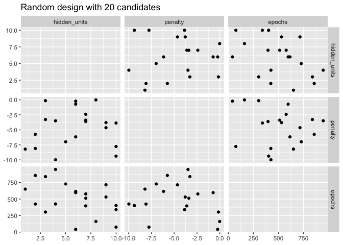
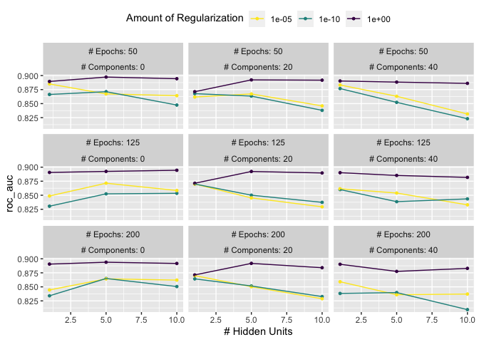
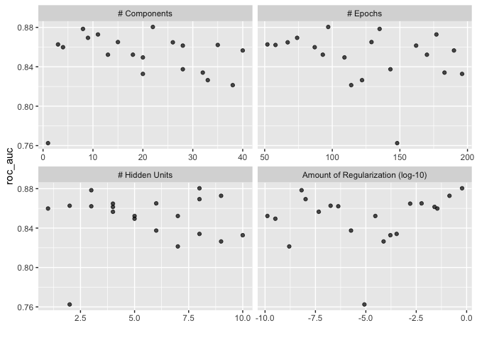

# Chapter 13 - Grid Search

<https://www.tmwr.org/grid-search>

### Previous AMES Code:


```r
library(tidymodels)
```

```
## ── Attaching packages ────────────────────────────────────── tidymodels 1.1.1 ──
```

```
## ✔ broom        1.0.5     ✔ recipes      1.0.8
## ✔ dials        1.2.0     ✔ rsample      1.2.0
## ✔ dplyr        1.1.3     ✔ tibble       3.2.1
## ✔ ggplot2      3.4.3     ✔ tidyr        1.3.0
## ✔ infer        1.0.5     ✔ tune         1.1.2
## ✔ modeldata    1.2.0     ✔ workflows    1.1.3
## ✔ parsnip      1.1.1     ✔ workflowsets 1.0.1
## ✔ purrr        1.0.2     ✔ yardstick    1.2.0
```

```
## ── Conflicts ───────────────────────────────────────── tidymodels_conflicts() ──
## ✖ purrr::discard() masks scales::discard()
## ✖ dplyr::filter()  masks stats::filter()
## ✖ dplyr::lag()     masks stats::lag()
## ✖ recipes::step()  masks stats::step()
## • Learn how to get started at https://www.tidymodels.org/start/
```

```r
tidymodels_prefer()
data(ames)
ames <- mutate(ames, Sale_Price = log10(Sale_Price))

set.seed(502)
ames_split <- initial_split(ames, prop = 0.80, strata = Sale_Price)
ames_train <- training(ames_split)
ames_test  <-  testing(ames_split)

ames_rec <- 
  recipe(Sale_Price ~ Neighborhood + Gr_Liv_Area + Year_Built + Bldg_Type + 
           Latitude + Longitude, data = ames_train) %>%
  step_log(Gr_Liv_Area, base = 10) %>% 
  step_other(Neighborhood, threshold = 0.01) %>% 
  step_dummy(all_nominal_predictors()) %>% 
  step_interact( ~ Gr_Liv_Area:starts_with("Bldg_Type_") ) %>% 
  step_ns(Latitude, Longitude, deg_free = 20)

lm_model <- linear_reg() %>% set_engine("lm")

lm_wflow <- 
  workflow() %>% 
  add_model(lm_model) %>% 
  add_recipe(ames_rec)

lm_fit <- fit(lm_wflow, ames_train)

rf_model <- 
  rand_forest(trees = 1000) %>% 
  set_engine("ranger") %>% 
  set_mode("regression")

rf_wflow <- 
  workflow() %>% 
  add_formula(
    Sale_Price ~ Neighborhood + Gr_Liv_Area + Year_Built + Bldg_Type + 
      Latitude + Longitude) %>% 
  add_model(rf_model) 

set.seed(1001)
ames_folds <- vfold_cv(ames_train, v = 10)

keep_pred <- control_resamples(save_pred = TRUE, save_workflow = TRUE)

set.seed(1003)
rf_res <- rf_wflow %>% fit_resamples(resamples = ames_folds, control = keep_pred)
```

## Regular and NonRegular Grids

Practice with the multilayer perception model (single layer artificial neural network)

Parameters for tuning:

-   \# hidden units

-   \# of fitting epochs/iterations in model training

-   amount of weight decay penalization


```r
library(tidymodels)
tidymodels_prefer()

mlp_spec <- 
  mlp(hidden_units = tune(), penalty = tune(), epochs = tune()) %>% 
  set_engine("nnet", trace = 0) %>% 
  set_mode("classification")
```

Extract the arguments w/ unknown values (parameters for tuning) and set their dials objects:


```r
mlp_param <- extract_parameter_set_dials(mlp_spec)
mlp_param %>% extract_parameter_dials("hidden_units")
```

```
## # Hidden Units (quantitative)
## Range: [1, 10]
```

```r
mlp_param %>% extract_parameter_dials("penalty")
```

```
## Amount of Regularization (quantitative)
## Transformer: log-10 [1e-100, Inf]
## Range (transformed scale): [-10, 0]
```

```r
mlp_param %>% extract_parameter_dials("epochs")
```

```
## # Epochs (quantitative)
## Range: [10, 1000]
```

### Regular Grids - combines each parameter factorially (uses all combos of the sets) 

1.  Create a distinct set of values for each parameter. The \# of possible values doesn't have to be the same for each parameter


```r
crossing(
  hidden_units = 1:3,
  penalty = c(0.0, 0.1),
  epochs = c(100, 200)
)
```

```
## # A tibble: 12 × 3
##    hidden_units penalty epochs
##           <int>   <dbl>  <dbl>
##  1            1     0      100
##  2            1     0      200
##  3            1     0.1    100
##  4            1     0.1    200
##  5            2     0      100
##  6            2     0      200
##  7            2     0.1    100
##  8            2     0.1    200
##  9            3     0      100
## 10            3     0      200
## 11            3     0.1    100
## 12            3     0.1    200
```

2.  Produce the grid


```r
grid_regular(mlp_param, 
             levels = 2) # number of levels per parameter to create 
```

```
## # A tibble: 8 × 3
##   hidden_units      penalty epochs
##          <int>        <dbl>  <int>
## 1            1 0.0000000001     10
## 2           10 0.0000000001     10
## 3            1 1                10
## 4           10 1                10
## 5            1 0.0000000001   1000
## 6           10 0.0000000001   1000
## 7            1 1              1000
## 8           10 1              1000
```


```r
mlp_param %>% 
  grid_regular(levels = c(hidden_units = 3, penalty = 2, epochs = 2)) #alternative way to use levels 
```

```
## # A tibble: 12 × 3
##    hidden_units      penalty epochs
##           <int>        <dbl>  <int>
##  1            1 0.0000000001     10
##  2            5 0.0000000001     10
##  3           10 0.0000000001     10
##  4            1 1                10
##  5            5 1                10
##  6           10 1                10
##  7            1 0.0000000001   1000
##  8            5 0.0000000001   1000
##  9           10 0.0000000001   1000
## 10            1 1              1000
## 11            5 1              1000
## 12           10 1              1000
```

Alternative method = fractional factorial designs (don't use all possible values of each set)

Potential downside: can be computationally expensive to use (esp. when there are medium-large \# of tuning parameters

Advantages:

-   many models whose tuning time decreases w/ a regular grid

-   relats and patterns b/t the tuning parameters & the model metrics are easily understood (little confounding b/t parameters)

### Irregular Grids - parameter combos are not formed from a small set of points 

#### Option 1 = use random sampling across the range of parameters. 

1.  generate independent uniform random #s across the parameter ranges. If the parameter has a transformation it will generate them on the transformed scale


```r
set.seed(1301)
mlp_param %>% 
  grid_random(size = 1000) %>% # 'size' is the number of combinations
  summary()
```

```
##   hidden_units       penalty              epochs     
##  Min.   : 1.000   Min.   :0.0000000   Min.   : 10.0  
##  1st Qu.: 3.000   1st Qu.:0.0000000   1st Qu.:265.8  
##  Median : 5.000   Median :0.0000061   Median :497.0  
##  Mean   : 5.381   Mean   :0.0437435   Mean   :509.5  
##  3rd Qu.: 8.000   3rd Qu.:0.0026854   3rd Qu.:761.0  
##  Max.   :10.000   Max.   :0.9814405   Max.   :999.0
```

Potential problems:

-   w/ small-medium grids, random values can result in overlapping parameter combos.

-   you need the grid to cover the whole parameter space, but the likelihood of that is lower w/ fewer grid values


```r
library(ggforce)
```

```
## Warning: package 'ggforce' was built under R version 4.3.2
```

```r
set.seed(1302)
mlp_param %>% 
  # The 'original = FALSE' option keeps penalty in log10 units
  grid_random(size = 20, original = FALSE) %>% 
  ggplot(aes(x = .panel_x, y = .panel_y)) + 
  geom_point() +
  geom_blank() +
  facet_matrix(vars(hidden_units, penalty, epochs), layer.diag = 2) + 
  labs(title = "Random design with 20 candidates")
```

<!-- -->

```r
#Can see some overlap in points 
```

#### Option 2 = space-filling designs: find a configuration of points that cover the parameter space w/ the smallest change of overlapping or redundant values 


```r
set.seed(1303)
mlp_param %>% 
  grid_latin_hypercube(size = 20, original = FALSE) %>% 
  ggplot(aes(x = .panel_x, y = .panel_y)) + 
  geom_point() +
  geom_blank() +
  facet_matrix(vars(hidden_units, penalty, epochs), layer.diag = 2) + 
  labs(title = "Latin Hypercube design with 20 candidates")
```

<!-- -->

```r
#less overlap in points and better exploration of the parameter space
```

## Evaluating the Grid

Each candidate set should be assessed using non-training data --\> resampling or validation methods needed

Then choose the best set: either the empirically best or simplest

Practice w/ dataset from automated microscopy lab tool for cancer research


```r
library(tidymodels)
data(cells)
cells <- cells %>% select(-case) #remove column not needed for analysis
```

Use 10-fold CV


```r
set.seed(1304)
cell_folds <- vfold_cv(cells)
```

High correlation b/t predictors --\> use PCA feature extraction


```r
mlp_rec <-
  recipe(class ~ ., data = cells) %>%
  step_YeoJohnson(all_numeric_predictors()) %>% #encourage more symmetric distribution of predictors (counter the skewed dist. before PCA)
  step_normalize(all_numeric_predictors()) %>% #normalize to be on same scale prior to PCA
  step_pca(all_numeric_predictors(), num_comp = tune()) %>% #PCA w/ tuning for # of components to retain 
  step_normalize(all_numeric_predictors()) #normalize again to corce predictors to have same mean and variance (lower rank components tend to have a wider range than higher-rank components)

mlp_wflow <- 
  workflow() %>% 
  add_model(mlp_spec) %>% 
  add_recipe(mlp_rec)
```

Create a parameter object


```r
mlp_param <- 
  mlp_wflow %>% 
  extract_parameter_set_dials() %>% 
  update(
    epochs = epochs(c(50, 200)),
    num_comp = num_comp(c(0, 40)) #0 PCA components = shortcut for comparing original predictors to PCA results 
  )
```

Conduct the grid search


```r
roc_res <- metric_set(roc_auc)
set.seed(1305)
mlp_reg_tune <-
  mlp_wflow %>% #model specificaiton or workflow = 1st argument 
  tune_grid( #similar to fit_resamples()
    cell_folds, #resampling object 
    grid = mlp_param #integer or data frame to pass to tune function
    #if grid is integer can use param_info to define the ranges 
    %>% grid_regular(levels = 3), #regular grid w/ 3 levels across resamples 
    metrics = roc_res #measure area under the ROC curve during resampling 
  )
mlp_reg_tune #this took a really long time to run for me 
```

```
## # Tuning results
## # 10-fold cross-validation 
## # A tibble: 10 × 4
##    splits             id     .metrics          .notes          
##    <list>             <chr>  <list>            <list>          
##  1 <split [1817/202]> Fold01 <tibble [81 × 8]> <tibble [0 × 3]>
##  2 <split [1817/202]> Fold02 <tibble [81 × 8]> <tibble [0 × 3]>
##  3 <split [1817/202]> Fold03 <tibble [81 × 8]> <tibble [0 × 3]>
##  4 <split [1817/202]> Fold04 <tibble [81 × 8]> <tibble [0 × 3]>
##  5 <split [1817/202]> Fold05 <tibble [81 × 8]> <tibble [0 × 3]>
##  6 <split [1817/202]> Fold06 <tibble [81 × 8]> <tibble [0 × 3]>
##  7 <split [1817/202]> Fold07 <tibble [81 × 8]> <tibble [0 × 3]>
##  8 <split [1817/202]> Fold08 <tibble [81 × 8]> <tibble [0 × 3]>
##  9 <split [1817/202]> Fold09 <tibble [81 × 8]> <tibble [0 × 3]>
## 10 <split [1818/201]> Fold10 <tibble [81 × 8]> <tibble [0 × 3]>
```

Plot performance profiles across tuning parameters:


```r
autoplot(mlp_reg_tune) + 
  scale_color_viridis_d(direction = -1) + 
  theme(legend.position = "top")
```

<!-- -->

```r
#the amount of penalization has the largest impact on the area under the ROC curve. 
#number of hidden units appears to matter most when the amount of regularization is low (and harms performance)
```

Show numerically best results:


```r
show_best(mlp_reg_tune) %>% select(-.estimator)
```

```
## # A tibble: 5 × 9
##   hidden_units penalty epochs num_comp .metric  mean     n std_err .config      
##          <int>   <dbl>  <int>    <int> <chr>   <dbl> <int>   <dbl> <chr>        
## 1            5       1     50        0 roc_auc 0.897    10 0.00857 Preprocessor…
## 2           10       1    125        0 roc_auc 0.895    10 0.00898 Preprocessor…
## 3           10       1     50        0 roc_auc 0.894    10 0.00960 Preprocessor…
## 4            5       1    200        0 roc_auc 0.894    10 0.00784 Preprocessor…
## 5            5       1    125        0 roc_auc 0.892    10 0.00822 Preprocessor…
```

```r
#several configs w/ similar performance 
```

Follow up with space-filling design to run the grid search w/ larger values of weight decay penalty


```r
set.seed(1306)
mlp_sfd_tune <-
  mlp_wflow %>%
  tune_grid(
    cell_folds,
    grid = 20,
    # Pass in the parameter object to use the appropriate range: 
    param_info = mlp_param,
    metrics = roc_res
  )
mlp_sfd_tune
```

```
## # Tuning results
## # 10-fold cross-validation 
## # A tibble: 10 × 4
##    splits             id     .metrics          .notes          
##    <list>             <chr>  <list>            <list>          
##  1 <split [1817/202]> Fold01 <tibble [20 × 8]> <tibble [0 × 3]>
##  2 <split [1817/202]> Fold02 <tibble [20 × 8]> <tibble [0 × 3]>
##  3 <split [1817/202]> Fold03 <tibble [20 × 8]> <tibble [0 × 3]>
##  4 <split [1817/202]> Fold04 <tibble [20 × 8]> <tibble [0 × 3]>
##  5 <split [1817/202]> Fold05 <tibble [20 × 8]> <tibble [0 × 3]>
##  6 <split [1817/202]> Fold06 <tibble [20 × 8]> <tibble [0 × 3]>
##  7 <split [1817/202]> Fold07 <tibble [20 × 8]> <tibble [0 × 3]>
##  8 <split [1817/202]> Fold08 <tibble [20 × 8]> <tibble [0 × 3]>
##  9 <split [1817/202]> Fold09 <tibble [20 × 8]> <tibble [0 × 3]>
## 10 <split [1818/201]> Fold10 <tibble [20 × 8]> <tibble [0 × 3]>
```


```r
autoplot(mlp_sfd_tune) #marginal effects plot
```

<!-- -->

```r
#note: values of the other tuning parameters can affect each panel.
```


```r
show_best(mlp_sfd_tune) %>% select(-.estimator)
```

```
## # A tibble: 5 × 9
##   hidden_units       penalty epochs num_comp .metric  mean     n std_err .config
##          <int>         <dbl>  <int>    <int> <chr>   <dbl> <int>   <dbl> <chr>  
## 1            8 0.594             97       22 roc_auc 0.880    10 0.00998 Prepro…
## 2            3 0.00000000649    135        8 roc_auc 0.878    10 0.00954 Prepro…
## 3            9 0.141            177       11 roc_auc 0.873    10 0.0104  Prepro…
## 4            8 0.0000000103      74        9 roc_auc 0.869    10 0.00761 Prepro…
## 5            6 0.00581          129       15 roc_auc 0.865    10 0.00658 Prepro…
```

Other notes: "The `extract` option to `control_grid()` allows the retention of the fitted models and/or recipes. Also, setting the `save_pred` option to `TRUE` retains the assessment set predictions and these can be accessed using `collect_predictions()`."

## Finalizing the Model

tune_grid() does not fit a final model, just helps you choose the appropriate tuning parameters.

Pick a final set of parameter values by:

-   manually picking values that seem appropriate from show_best() or

-   use a select\_\*() function

`select_best()` will choose the parameters with the numerically best results


```r
select_best(mlp_reg_tune, metric = "roc_auc")
```

```
## # A tibble: 1 × 5
##   hidden_units penalty epochs num_comp .config              
##          <int>   <dbl>  <int>    <int> <chr>                
## 1            5       1     50        0 Preprocessor1_Model08
```

Looking back at show_best from above, you can see there's a simpler option that performs similar to the one above


```r
logistic_param <-  #create tibble with the values of the simpler model 
  tibble(
    num_comp = 0,
    epochs = 125,
    hidden_units = 1,
    penalty = 1
  )

final_mlp_wflow <- 
  mlp_wflow %>% 
  finalize_workflow(logistic_param) #splice the values back into the workflow 
final_mlp_wflow
```

```
## ══ Workflow ════════════════════════════════════════════════════════════════════
## Preprocessor: Recipe
## Model: mlp()
## 
## ── Preprocessor ────────────────────────────────────────────────────────────────
## 4 Recipe Steps
## 
## • step_YeoJohnson()
## • step_normalize()
## • step_pca()
## • step_normalize()
## 
## ── Model ───────────────────────────────────────────────────────────────────────
## Single Layer Neural Network Model Specification (classification)
## 
## Main Arguments:
##   hidden_units = 1
##   penalty = 1
##   epochs = 125
## 
## Engine-Specific Arguments:
##   trace = 0
## 
## Computational engine: nnet
```

Fit model on entire training set:


```r
final_mlp_fit <- 
  final_mlp_wflow %>% 
  fit(cells)
```

\*Note: "If you did not use a workflow, finalization of a model and/or recipe is done using `finalize_model()` and `finalize_recipe()"`

## Tools for Creating Tuning Specifications

"The **usemodels** package can take a data frame and model formula, then write out R code for tuning the model."


```r
library(usemodels)

use_xgboost(Sale_Price ~ Neighborhood + Gr_Liv_Area + Year_Built + Bldg_Type + 
              Latitude + Longitude, 
            data = ames_train,
            # Add comments explaining some of the code:
            verbose = TRUE)
```

```
## xgboost_recipe <- 
##   recipe(formula = Sale_Price ~ Neighborhood + Gr_Liv_Area + Year_Built + Bldg_Type + 
##     Latitude + Longitude, data = ames_train) %>% 
##   step_zv(all_predictors()) 
## 
## xgboost_spec <- 
##   boost_tree(trees = tune(), min_n = tune(), tree_depth = tune(), learn_rate = tune(), 
##     loss_reduction = tune(), sample_size = tune()) %>% 
##   set_mode("classification") %>% 
##   set_engine("xgboost") 
## 
## xgboost_workflow <- 
##   workflow() %>% 
##   add_recipe(xgboost_recipe) %>% 
##   add_model(xgboost_spec) 
## 
## set.seed(60916)
## xgboost_tune <-
##   tune_grid(xgboost_workflow, resamples = stop("add your rsample object"), grid = stop("add number of candidate points"))
```

\*Note: "The **usemodels** package can also be used to create model fitting code with no tuning by setting the argument `tune = FALSE`."

## Tools for Efficient Grid Search

### Submodel Optimization 

Some models where multiple tuning parameters can be evaluated w/o refitting

Ex: "a PLS model created with 100 components can also make predictions for any `num_comp <= 100"`

See Section 13.5.1 for more examples.

### Parallel Processing

Can decrease execution time when resampling models.

See Section 13.5.2 for things to consider when deciding how to parallelize

### Benchmarking Boosted Trees

See section 13.5.3 for info.

### Access to Global Variables

"When using tidymodels, it is possible to use values in your local environment (usually the global environment) in model objects."

See section 13.5.4 for more info.

### Racing Methods

See section 13.5.5 for info.
