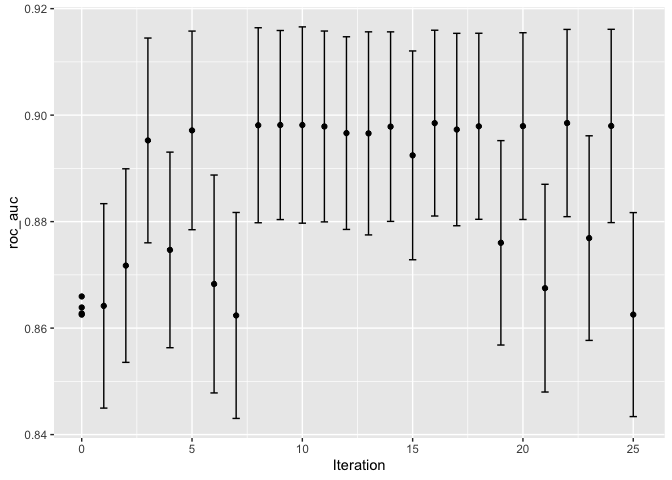
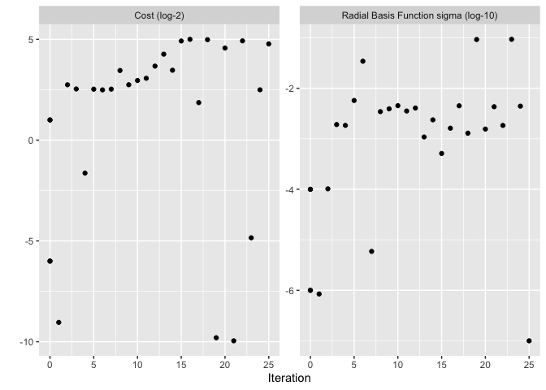
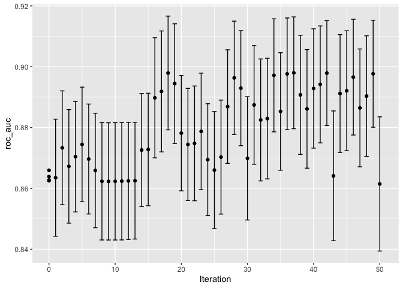
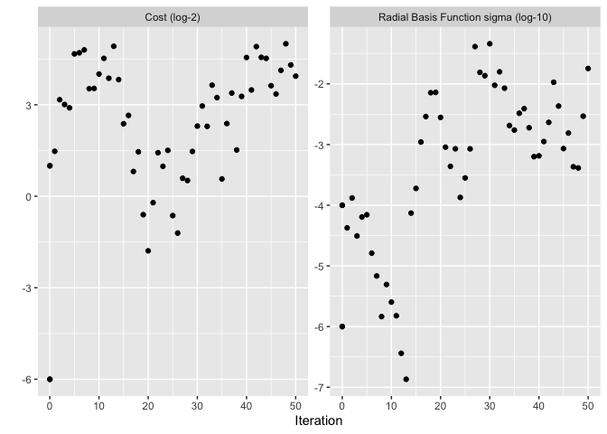

# Chapter 14 - Iterative Search

<https://www.tmwr.org/iterative-search>

Iterative search predicts which values to test next compared to grid which searches a pre-defined set of candidate values.

-   sensible approach when grid search isn't feasible or efficient

2 Search Methods

1.  Bayesian Optimization - uses a statistical model to predict better settings

2.  Simulated annealing - global search method

## Data from Last Chapter to reuse


```r
library(tidymodels)
```

```
## ── Attaching packages ────────────────────────────────────── tidymodels 1.1.1 ──
```

```
## ✔ broom        1.0.5     ✔ recipes      1.0.8
## ✔ dials        1.2.0     ✔ rsample      1.2.0
## ✔ dplyr        1.1.3     ✔ tibble       3.2.1
## ✔ ggplot2      3.4.3     ✔ tidyr        1.3.0
## ✔ infer        1.0.5     ✔ tune         1.1.2
## ✔ modeldata    1.2.0     ✔ workflows    1.1.3
## ✔ parsnip      1.1.1     ✔ workflowsets 1.0.1
## ✔ purrr        1.0.2     ✔ yardstick    1.2.0
```

```
## ── Conflicts ───────────────────────────────────────── tidymodels_conflicts() ──
## ✖ purrr::discard() masks scales::discard()
## ✖ dplyr::filter()  masks stats::filter()
## ✖ dplyr::lag()     masks stats::lag()
## ✖ recipes::step()  masks stats::step()
## • Use tidymodels_prefer() to resolve common conflicts.
```

```r
tidymodels_prefer()
library(finetune) #need this for sim_anneal fucntions 

data(cells)
cells <- cells %>% select(-case)

set.seed(1304)
cell_folds <- vfold_cv(cells)

roc_res <- metric_set(roc_auc)
```

## A Support Vector Machine Model

Using the same cell segmentation data from Chapter 13. This time using a support vector machine (SVM) model. Two tuning parameters to optimize are:

-   SVM cost value

-   Radial basis function kernel parameter \$\sigma


```r
svm_rec <- 
  recipe(class ~ ., data = cells) %>%
  step_YeoJohnson(all_numeric_predictors()) %>%
  step_normalize(all_numeric_predictors())

svm_spec <- 
  svm_rbf(cost = tune(), rbf_sigma = tune()) %>% 
  set_engine("kernlab") %>% 
  set_mode("classification")

svm_wflow <- 
  workflow() %>% 
  add_model(svm_spec) %>% 
  add_recipe(svm_rec)
```

Default parameter ranges:


```r
cost()
```

```
## Cost (quantitative)
## Transformer: log-2 [1e-100, Inf]
## Range (transformed scale): [-10, 5]
```

```r
rbf_sigma()
```

```
## Radial Basis Function sigma (quantitative)
## Transformer: log-10 [1e-100, Inf]
## Range (transformed scale): [-10, 0]
```

Can Slightly change the rbf_sigma parameter


```r
svm_param <- 
  svm_wflow %>% 
  extract_parameter_set_dials() %>% 
  update(rbf_sigma = rbf_sigma(c(-7, -1)))
```

Iterative search procedures require at least some resampled performance stats.

Create a small regular grid (they based this off a larger regular grid that they didn't share the code for in the chapter):


```r
set.seed(1401)
start_grid <- 
  svm_param %>% 
  update(
    cost = cost(c(-6, 1)),
    rbf_sigma = rbf_sigma(c(-6, -4))
  ) %>% 
  grid_regular(levels = 2)

set.seed(1402)
svm_initial <- 
  svm_wflow %>% 
  tune_grid(resamples = cell_folds, grid = start_grid, metrics = roc_res)

collect_metrics(svm_initial)
```

```
## # A tibble: 4 × 8
##     cost rbf_sigma .metric .estimator  mean     n std_err .config             
##    <dbl>     <dbl> <chr>   <chr>      <dbl> <int>   <dbl> <chr>               
## 1 0.0156  0.000001 roc_auc binary     0.864    10 0.00864 Preprocessor1_Model1
## 2 2       0.000001 roc_auc binary     0.863    10 0.00867 Preprocessor1_Model2
## 3 0.0156  0.0001   roc_auc binary     0.863    10 0.00862 Preprocessor1_Model3
## 4 2       0.0001   roc_auc binary     0.866    10 0.00855 Preprocessor1_Model4
```

These results can be ingested by the iterative tuning functions as initial values.

## Bayesian Optimization

1.  Analyze the current resampling results and create a predictive model to predict the tuning parameter values that have yet to be evaluated.

2.  Those values are then resampled

3.  Those results are then used in another predictive model and so on

4.  Proceeds for a set number of iterations or until no further improvements occur

Primary concerns:

-   How to create the model

-   How to select parameters recommended by that model

### A Gaussian Process (GP) Model

GP = collection of random vars ---\> joint prob. dist. = multivariate Gaussian

Those random vars = collection of performance metrics for the tuning parameter candidate values

GP models are specified by their mean and covariance functions. Covariance = most impactful on the nature of the model

-   As distance b/t 2 tuning parameter combos increases the covariance b/t performance metrics increases exponentially

-   Allows the model to represent highly nonlinear relats b/t model performance and tuning parameters when sample sizes are low

-   Model becomes computationally expensive with more tuning parameter combos

Iterative Process: "Based on the initial grid of four results (collect_metrics(svm_initial)), the GP model is fit, candidates are predicted, and a fifth tuning parameter combination is selected. We compute performance estimates for the new configuration, the GP is refit with the five existing results (and so on)."

### Acquisition Functions

These functions facilitate the tradeoff b/t mean and variance of GP models.

-   *Exploration* biases the selection towards regions where there are fewer (if any) observed candidate models. This tends to give more weight to candidates with higher variance and focuses on finding new results.

-   *Exploitation* principally relies on the mean prediction to find the best (mean) value. It focuses on existing results.

*expected improvement* - even if one set of parameters results in a better mean fit, a set that has a slightly smaller mean, but a higher variance and therefore more overall prob. area above the current best results would have the higher expected improvement.

### The tune_bayes() Function

Similar to tune_grid(), but with the below additional arguments:

-   `iter` = max number of search iterations.

-   `initial` can be either an integer, an object produced using `tune_grid()`, or one of the racing functions.

    -   Using an integer specifies the size of a space-filling design that is sampled prior to the first GP model.

-   `objective` = argument for which acquisition function should be used.

    -   The **tune** package contains functions to pass here, such as `exp_improve()` or `conf_bound()`.

-   The `param_info` argument, in this case, specifies the range of the parameters as well as any transformations that are used.

    -   These are used to define the search space.

    -   In situations where the default parameter objects are insufficient, `param_info` is used to override the defaults.

The `control` argument now uses the results of `control_bayes()`. Some helpful arguments there are:

-   `no_improve` = integer that will stop the search if improved parameters are not discovered within `no_improve` iterations.

-   `uncertain`= integer (or `Inf`) that will take an *uncertainty sample* if there is no improvement within `uncertain` iterations.

    -   This will select the next candidate that has large variation.

    -   It has the effect of pure exploration since it does not consider the mean prediction.

-   `verbose` = print logging information as the search proceeds.


```r
ctrl <- control_bayes(verbose = TRUE)

set.seed(1403)
svm_bo <-
  svm_wflow %>%
  tune_bayes(
    resamples = cell_folds,
    metrics = roc_res,
    initial = svm_initial,
    param_info = svm_param,
    iter = 25,
    control = ctrl
  )
```

```
## i Gaussian process model
```

```
## ✓ Gaussian process model
```

```
## i Generating 5000 candidates
```

```
## i Predicted candidates
```

```
## i Estimating performance
```

```
## i Fold01: preprocessor 1/1
```

```
## ✓ Fold01: preprocessor 1/1
```

```
## i Fold01: preprocessor 1/1, model 1/1
```

```
## ✓ Fold01: preprocessor 1/1, model 1/1
```

```
## i Fold01: preprocessor 1/1, model 1/1 (extracts)
```

```
## i Fold01: preprocessor 1/1, model 1/1 (predictions)
```

```
## i Fold02: preprocessor 1/1
```

```
## ✓ Fold02: preprocessor 1/1
```

```
## i Fold02: preprocessor 1/1, model 1/1
```

```
## ✓ Fold02: preprocessor 1/1, model 1/1
```

```
## i Fold02: preprocessor 1/1, model 1/1 (extracts)
```

```
## i Fold02: preprocessor 1/1, model 1/1 (predictions)
```

```
## i Fold03: preprocessor 1/1
```

```
## ✓ Fold03: preprocessor 1/1
```

```
## i Fold03: preprocessor 1/1, model 1/1
```

```
## ✓ Fold03: preprocessor 1/1, model 1/1
```

```
## i Fold03: preprocessor 1/1, model 1/1 (extracts)
```

```
## i Fold03: preprocessor 1/1, model 1/1 (predictions)
```

```
## i Fold04: preprocessor 1/1
```

```
## ✓ Fold04: preprocessor 1/1
```

```
## i Fold04: preprocessor 1/1, model 1/1
```

```
## ✓ Fold04: preprocessor 1/1, model 1/1
```

```
## i Fold04: preprocessor 1/1, model 1/1 (extracts)
```

```
## i Fold04: preprocessor 1/1, model 1/1 (predictions)
```

```
## i Fold05: preprocessor 1/1
```

```
## ✓ Fold05: preprocessor 1/1
```

```
## i Fold05: preprocessor 1/1, model 1/1
```

```
## ✓ Fold05: preprocessor 1/1, model 1/1
```

```
## i Fold05: preprocessor 1/1, model 1/1 (extracts)
```

```
## i Fold05: preprocessor 1/1, model 1/1 (predictions)
```

```
## i Fold06: preprocessor 1/1
```

```
## ✓ Fold06: preprocessor 1/1
```

```
## i Fold06: preprocessor 1/1, model 1/1
```

```
## ✓ Fold06: preprocessor 1/1, model 1/1
```

```
## i Fold06: preprocessor 1/1, model 1/1 (extracts)
```

```
## i Fold06: preprocessor 1/1, model 1/1 (predictions)
```

```
## i Fold07: preprocessor 1/1
```

```
## ✓ Fold07: preprocessor 1/1
```

```
## i Fold07: preprocessor 1/1, model 1/1
```

```
## ✓ Fold07: preprocessor 1/1, model 1/1
```

```
## i Fold07: preprocessor 1/1, model 1/1 (extracts)
```

```
## i Fold07: preprocessor 1/1, model 1/1 (predictions)
```

```
## i Fold08: preprocessor 1/1
```

```
## ✓ Fold08: preprocessor 1/1
```

```
## i Fold08: preprocessor 1/1, model 1/1
```

```
## ✓ Fold08: preprocessor 1/1, model 1/1
```

```
## i Fold08: preprocessor 1/1, model 1/1 (extracts)
```

```
## i Fold08: preprocessor 1/1, model 1/1 (predictions)
```

```
## i Fold09: preprocessor 1/1
```

```
## ✓ Fold09: preprocessor 1/1
```

```
## i Fold09: preprocessor 1/1, model 1/1
```

```
## ✓ Fold09: preprocessor 1/1, model 1/1
```

```
## i Fold09: preprocessor 1/1, model 1/1 (extracts)
```

```
## i Fold09: preprocessor 1/1, model 1/1 (predictions)
```

```
## i Fold10: preprocessor 1/1
```

```
## ✓ Fold10: preprocessor 1/1
```

```
## i Fold10: preprocessor 1/1, model 1/1
```

```
## ✓ Fold10: preprocessor 1/1, model 1/1
```

```
## i Fold10: preprocessor 1/1, model 1/1 (extracts)
```

```
## i Fold10: preprocessor 1/1, model 1/1 (predictions)
```

```
## ✓ Estimating performance
```

```
## i Gaussian process model
```

```
## ✓ Gaussian process model
```

```
## i Generating 5000 candidates
```

```
## i Predicted candidates
```

```
## i Estimating performance
```

```
## i Fold01: preprocessor 1/1
```

```
## ✓ Fold01: preprocessor 1/1
```

```
## i Fold01: preprocessor 1/1, model 1/1
```

```
## ✓ Fold01: preprocessor 1/1, model 1/1
```

```
## i Fold01: preprocessor 1/1, model 1/1 (extracts)
```

```
## i Fold01: preprocessor 1/1, model 1/1 (predictions)
```

```
## i Fold02: preprocessor 1/1
```

```
## ✓ Fold02: preprocessor 1/1
```

```
## i Fold02: preprocessor 1/1, model 1/1
```

```
## ✓ Fold02: preprocessor 1/1, model 1/1
```

```
## i Fold02: preprocessor 1/1, model 1/1 (extracts)
```

```
## i Fold02: preprocessor 1/1, model 1/1 (predictions)
```

```
## i Fold03: preprocessor 1/1
```

```
## ✓ Fold03: preprocessor 1/1
```

```
## i Fold03: preprocessor 1/1, model 1/1
```

```
## ✓ Fold03: preprocessor 1/1, model 1/1
```

```
## i Fold03: preprocessor 1/1, model 1/1 (extracts)
```

```
## i Fold03: preprocessor 1/1, model 1/1 (predictions)
```

```
## i Fold04: preprocessor 1/1
```

```
## ✓ Fold04: preprocessor 1/1
```

```
## i Fold04: preprocessor 1/1, model 1/1
```

```
## ✓ Fold04: preprocessor 1/1, model 1/1
```

```
## i Fold04: preprocessor 1/1, model 1/1 (extracts)
```

```
## i Fold04: preprocessor 1/1, model 1/1 (predictions)
```

```
## i Fold05: preprocessor 1/1
```

```
## ✓ Fold05: preprocessor 1/1
```

```
## i Fold05: preprocessor 1/1, model 1/1
```

```
## ✓ Fold05: preprocessor 1/1, model 1/1
```

```
## i Fold05: preprocessor 1/1, model 1/1 (extracts)
```

```
## i Fold05: preprocessor 1/1, model 1/1 (predictions)
```

```
## i Fold06: preprocessor 1/1
```

```
## ✓ Fold06: preprocessor 1/1
```

```
## i Fold06: preprocessor 1/1, model 1/1
```

```
## ✓ Fold06: preprocessor 1/1, model 1/1
```

```
## i Fold06: preprocessor 1/1, model 1/1 (extracts)
```

```
## i Fold06: preprocessor 1/1, model 1/1 (predictions)
```

```
## i Fold07: preprocessor 1/1
```

```
## ✓ Fold07: preprocessor 1/1
```

```
## i Fold07: preprocessor 1/1, model 1/1
```

```
## ✓ Fold07: preprocessor 1/1, model 1/1
```

```
## i Fold07: preprocessor 1/1, model 1/1 (extracts)
```

```
## i Fold07: preprocessor 1/1, model 1/1 (predictions)
```

```
## i Fold08: preprocessor 1/1
```

```
## ✓ Fold08: preprocessor 1/1
```

```
## i Fold08: preprocessor 1/1, model 1/1
```

```
## ✓ Fold08: preprocessor 1/1, model 1/1
```

```
## i Fold08: preprocessor 1/1, model 1/1 (extracts)
```

```
## i Fold08: preprocessor 1/1, model 1/1 (predictions)
```

```
## i Fold09: preprocessor 1/1
```

```
## ✓ Fold09: preprocessor 1/1
```

```
## i Fold09: preprocessor 1/1, model 1/1
```

```
## ✓ Fold09: preprocessor 1/1, model 1/1
```

```
## i Fold09: preprocessor 1/1, model 1/1 (extracts)
```

```
## i Fold09: preprocessor 1/1, model 1/1 (predictions)
```

```
## i Fold10: preprocessor 1/1
```

```
## ✓ Fold10: preprocessor 1/1
```

```
## i Fold10: preprocessor 1/1, model 1/1
```

```
## ✓ Fold10: preprocessor 1/1, model 1/1
```

```
## i Fold10: preprocessor 1/1, model 1/1 (extracts)
```

```
## i Fold10: preprocessor 1/1, model 1/1 (predictions)
```

```
## ✓ Estimating performance
```

```
## i Gaussian process model
```

```
## ✓ Gaussian process model
```

```
## i Generating 5000 candidates
```

```
## i Predicted candidates
```

```
## i Estimating performance
```

```
## i Fold01: preprocessor 1/1
```

```
## ✓ Fold01: preprocessor 1/1
```

```
## i Fold01: preprocessor 1/1, model 1/1
```

```
## ✓ Fold01: preprocessor 1/1, model 1/1
```

```
## i Fold01: preprocessor 1/1, model 1/1 (extracts)
```

```
## i Fold01: preprocessor 1/1, model 1/1 (predictions)
```

```
## i Fold02: preprocessor 1/1
```

```
## ✓ Fold02: preprocessor 1/1
```

```
## i Fold02: preprocessor 1/1, model 1/1
```

```
## ✓ Fold02: preprocessor 1/1, model 1/1
```

```
## i Fold02: preprocessor 1/1, model 1/1 (extracts)
```

```
## i Fold02: preprocessor 1/1, model 1/1 (predictions)
```

```
## i Fold03: preprocessor 1/1
```

```
## ✓ Fold03: preprocessor 1/1
```

```
## i Fold03: preprocessor 1/1, model 1/1
```

```
## ✓ Fold03: preprocessor 1/1, model 1/1
```

```
## i Fold03: preprocessor 1/1, model 1/1 (extracts)
```

```
## i Fold03: preprocessor 1/1, model 1/1 (predictions)
```

```
## i Fold04: preprocessor 1/1
```

```
## ✓ Fold04: preprocessor 1/1
```

```
## i Fold04: preprocessor 1/1, model 1/1
```

```
## ✓ Fold04: preprocessor 1/1, model 1/1
```

```
## i Fold04: preprocessor 1/1, model 1/1 (extracts)
```

```
## i Fold04: preprocessor 1/1, model 1/1 (predictions)
```

```
## i Fold05: preprocessor 1/1
```

```
## ✓ Fold05: preprocessor 1/1
```

```
## i Fold05: preprocessor 1/1, model 1/1
```

```
## ✓ Fold05: preprocessor 1/1, model 1/1
```

```
## i Fold05: preprocessor 1/1, model 1/1 (extracts)
```

```
## i Fold05: preprocessor 1/1, model 1/1 (predictions)
```

```
## i Fold06: preprocessor 1/1
```

```
## ✓ Fold06: preprocessor 1/1
```

```
## i Fold06: preprocessor 1/1, model 1/1
```

```
## ✓ Fold06: preprocessor 1/1, model 1/1
```

```
## i Fold06: preprocessor 1/1, model 1/1 (extracts)
```

```
## i Fold06: preprocessor 1/1, model 1/1 (predictions)
```

```
## i Fold07: preprocessor 1/1
```

```
## ✓ Fold07: preprocessor 1/1
```

```
## i Fold07: preprocessor 1/1, model 1/1
```

```
## ✓ Fold07: preprocessor 1/1, model 1/1
```

```
## i Fold07: preprocessor 1/1, model 1/1 (extracts)
```

```
## i Fold07: preprocessor 1/1, model 1/1 (predictions)
```

```
## i Fold08: preprocessor 1/1
```

```
## ✓ Fold08: preprocessor 1/1
```

```
## i Fold08: preprocessor 1/1, model 1/1
```

```
## ✓ Fold08: preprocessor 1/1, model 1/1
```

```
## i Fold08: preprocessor 1/1, model 1/1 (extracts)
```

```
## i Fold08: preprocessor 1/1, model 1/1 (predictions)
```

```
## i Fold09: preprocessor 1/1
```

```
## ✓ Fold09: preprocessor 1/1
```

```
## i Fold09: preprocessor 1/1, model 1/1
```

```
## ✓ Fold09: preprocessor 1/1, model 1/1
```

```
## i Fold09: preprocessor 1/1, model 1/1 (extracts)
```

```
## i Fold09: preprocessor 1/1, model 1/1 (predictions)
```

```
## i Fold10: preprocessor 1/1
```

```
## ✓ Fold10: preprocessor 1/1
```

```
## i Fold10: preprocessor 1/1, model 1/1
```

```
## ✓ Fold10: preprocessor 1/1, model 1/1
```

```
## i Fold10: preprocessor 1/1, model 1/1 (extracts)
```

```
## i Fold10: preprocessor 1/1, model 1/1 (predictions)
```

```
## ✓ Estimating performance
```

```
## i Gaussian process model
```

```
## ✓ Gaussian process model
```

```
## i Generating 5000 candidates
```

```
## i Predicted candidates
```

```
## i Estimating performance
```

```
## i Fold01: preprocessor 1/1
```

```
## ✓ Fold01: preprocessor 1/1
```

```
## i Fold01: preprocessor 1/1, model 1/1
```

```
## ✓ Fold01: preprocessor 1/1, model 1/1
```

```
## i Fold01: preprocessor 1/1, model 1/1 (extracts)
```

```
## i Fold01: preprocessor 1/1, model 1/1 (predictions)
```

```
## i Fold02: preprocessor 1/1
```

```
## ✓ Fold02: preprocessor 1/1
```

```
## i Fold02: preprocessor 1/1, model 1/1
```

```
## ✓ Fold02: preprocessor 1/1, model 1/1
```

```
## i Fold02: preprocessor 1/1, model 1/1 (extracts)
```

```
## i Fold02: preprocessor 1/1, model 1/1 (predictions)
```

```
## i Fold03: preprocessor 1/1
```

```
## ✓ Fold03: preprocessor 1/1
```

```
## i Fold03: preprocessor 1/1, model 1/1
```

```
## ✓ Fold03: preprocessor 1/1, model 1/1
```

```
## i Fold03: preprocessor 1/1, model 1/1 (extracts)
```

```
## i Fold03: preprocessor 1/1, model 1/1 (predictions)
```

```
## i Fold04: preprocessor 1/1
```

```
## ✓ Fold04: preprocessor 1/1
```

```
## i Fold04: preprocessor 1/1, model 1/1
```

```
## ✓ Fold04: preprocessor 1/1, model 1/1
```

```
## i Fold04: preprocessor 1/1, model 1/1 (extracts)
```

```
## i Fold04: preprocessor 1/1, model 1/1 (predictions)
```

```
## i Fold05: preprocessor 1/1
```

```
## ✓ Fold05: preprocessor 1/1
```

```
## i Fold05: preprocessor 1/1, model 1/1
```

```
## ✓ Fold05: preprocessor 1/1, model 1/1
```

```
## i Fold05: preprocessor 1/1, model 1/1 (extracts)
```

```
## i Fold05: preprocessor 1/1, model 1/1 (predictions)
```

```
## i Fold06: preprocessor 1/1
```

```
## ✓ Fold06: preprocessor 1/1
```

```
## i Fold06: preprocessor 1/1, model 1/1
```

```
## ✓ Fold06: preprocessor 1/1, model 1/1
```

```
## i Fold06: preprocessor 1/1, model 1/1 (extracts)
```

```
## i Fold06: preprocessor 1/1, model 1/1 (predictions)
```

```
## i Fold07: preprocessor 1/1
```

```
## ✓ Fold07: preprocessor 1/1
```

```
## i Fold07: preprocessor 1/1, model 1/1
```

```
## ✓ Fold07: preprocessor 1/1, model 1/1
```

```
## i Fold07: preprocessor 1/1, model 1/1 (extracts)
```

```
## i Fold07: preprocessor 1/1, model 1/1 (predictions)
```

```
## i Fold08: preprocessor 1/1
```

```
## ✓ Fold08: preprocessor 1/1
```

```
## i Fold08: preprocessor 1/1, model 1/1
```

```
## ✓ Fold08: preprocessor 1/1, model 1/1
```

```
## i Fold08: preprocessor 1/1, model 1/1 (extracts)
```

```
## i Fold08: preprocessor 1/1, model 1/1 (predictions)
```

```
## i Fold09: preprocessor 1/1
```

```
## ✓ Fold09: preprocessor 1/1
```

```
## i Fold09: preprocessor 1/1, model 1/1
```

```
## ✓ Fold09: preprocessor 1/1, model 1/1
```

```
## i Fold09: preprocessor 1/1, model 1/1 (extracts)
```

```
## i Fold09: preprocessor 1/1, model 1/1 (predictions)
```

```
## i Fold10: preprocessor 1/1
```

```
## ✓ Fold10: preprocessor 1/1
```

```
## i Fold10: preprocessor 1/1, model 1/1
```

```
## ✓ Fold10: preprocessor 1/1, model 1/1
```

```
## i Fold10: preprocessor 1/1, model 1/1 (extracts)
```

```
## i Fold10: preprocessor 1/1, model 1/1 (predictions)
```

```
## ✓ Estimating performance
```

```
## i Gaussian process model
```

```
## ✓ Gaussian process model
```

```
## i Generating 5000 candidates
```

```
## i Predicted candidates
```

```
## i Estimating performance
```

```
## i Fold01: preprocessor 1/1
```

```
## ✓ Fold01: preprocessor 1/1
```

```
## i Fold01: preprocessor 1/1, model 1/1
```

```
## ✓ Fold01: preprocessor 1/1, model 1/1
```

```
## i Fold01: preprocessor 1/1, model 1/1 (extracts)
```

```
## i Fold01: preprocessor 1/1, model 1/1 (predictions)
```

```
## i Fold02: preprocessor 1/1
```

```
## ✓ Fold02: preprocessor 1/1
```

```
## i Fold02: preprocessor 1/1, model 1/1
```

```
## ✓ Fold02: preprocessor 1/1, model 1/1
```

```
## i Fold02: preprocessor 1/1, model 1/1 (extracts)
```

```
## i Fold02: preprocessor 1/1, model 1/1 (predictions)
```

```
## i Fold03: preprocessor 1/1
```

```
## ✓ Fold03: preprocessor 1/1
```

```
## i Fold03: preprocessor 1/1, model 1/1
```

```
## ✓ Fold03: preprocessor 1/1, model 1/1
```

```
## i Fold03: preprocessor 1/1, model 1/1 (extracts)
```

```
## i Fold03: preprocessor 1/1, model 1/1 (predictions)
```

```
## i Fold04: preprocessor 1/1
```

```
## ✓ Fold04: preprocessor 1/1
```

```
## i Fold04: preprocessor 1/1, model 1/1
```

```
## ✓ Fold04: preprocessor 1/1, model 1/1
```

```
## i Fold04: preprocessor 1/1, model 1/1 (extracts)
```

```
## i Fold04: preprocessor 1/1, model 1/1 (predictions)
```

```
## i Fold05: preprocessor 1/1
```

```
## ✓ Fold05: preprocessor 1/1
```

```
## i Fold05: preprocessor 1/1, model 1/1
```

```
## ✓ Fold05: preprocessor 1/1, model 1/1
```

```
## i Fold05: preprocessor 1/1, model 1/1 (extracts)
```

```
## i Fold05: preprocessor 1/1, model 1/1 (predictions)
```

```
## i Fold06: preprocessor 1/1
```

```
## ✓ Fold06: preprocessor 1/1
```

```
## i Fold06: preprocessor 1/1, model 1/1
```

```
## ✓ Fold06: preprocessor 1/1, model 1/1
```

```
## i Fold06: preprocessor 1/1, model 1/1 (extracts)
```

```
## i Fold06: preprocessor 1/1, model 1/1 (predictions)
```

```
## i Fold07: preprocessor 1/1
```

```
## ✓ Fold07: preprocessor 1/1
```

```
## i Fold07: preprocessor 1/1, model 1/1
```

```
## ✓ Fold07: preprocessor 1/1, model 1/1
```

```
## i Fold07: preprocessor 1/1, model 1/1 (extracts)
```

```
## i Fold07: preprocessor 1/1, model 1/1 (predictions)
```

```
## i Fold08: preprocessor 1/1
```

```
## ✓ Fold08: preprocessor 1/1
```

```
## i Fold08: preprocessor 1/1, model 1/1
```

```
## ✓ Fold08: preprocessor 1/1, model 1/1
```

```
## i Fold08: preprocessor 1/1, model 1/1 (extracts)
```

```
## i Fold08: preprocessor 1/1, model 1/1 (predictions)
```

```
## i Fold09: preprocessor 1/1
```

```
## ✓ Fold09: preprocessor 1/1
```

```
## i Fold09: preprocessor 1/1, model 1/1
```

```
## ✓ Fold09: preprocessor 1/1, model 1/1
```

```
## i Fold09: preprocessor 1/1, model 1/1 (extracts)
```

```
## i Fold09: preprocessor 1/1, model 1/1 (predictions)
```

```
## i Fold10: preprocessor 1/1
```

```
## ✓ Fold10: preprocessor 1/1
```

```
## i Fold10: preprocessor 1/1, model 1/1
```

```
## ✓ Fold10: preprocessor 1/1, model 1/1
```

```
## i Fold10: preprocessor 1/1, model 1/1 (extracts)
```

```
## i Fold10: preprocessor 1/1, model 1/1 (predictions)
```

```
## ✓ Estimating performance
```

```
## i Gaussian process model
```

```
## ✓ Gaussian process model
```

```
## i Generating 5000 candidates
```

```
## i Predicted candidates
```

```
## i Estimating performance
```

```
## i Fold01: preprocessor 1/1
```

```
## ✓ Fold01: preprocessor 1/1
```

```
## i Fold01: preprocessor 1/1, model 1/1
```

```
## ✓ Fold01: preprocessor 1/1, model 1/1
```

```
## i Fold01: preprocessor 1/1, model 1/1 (extracts)
```

```
## i Fold01: preprocessor 1/1, model 1/1 (predictions)
```

```
## i Fold02: preprocessor 1/1
```

```
## ✓ Fold02: preprocessor 1/1
```

```
## i Fold02: preprocessor 1/1, model 1/1
```

```
## ✓ Fold02: preprocessor 1/1, model 1/1
```

```
## i Fold02: preprocessor 1/1, model 1/1 (extracts)
```

```
## i Fold02: preprocessor 1/1, model 1/1 (predictions)
```

```
## i Fold03: preprocessor 1/1
```

```
## ✓ Fold03: preprocessor 1/1
```

```
## i Fold03: preprocessor 1/1, model 1/1
```

```
## ✓ Fold03: preprocessor 1/1, model 1/1
```

```
## i Fold03: preprocessor 1/1, model 1/1 (extracts)
```

```
## i Fold03: preprocessor 1/1, model 1/1 (predictions)
```

```
## i Fold04: preprocessor 1/1
```

```
## ✓ Fold04: preprocessor 1/1
```

```
## i Fold04: preprocessor 1/1, model 1/1
```

```
## ✓ Fold04: preprocessor 1/1, model 1/1
```

```
## i Fold04: preprocessor 1/1, model 1/1 (extracts)
```

```
## i Fold04: preprocessor 1/1, model 1/1 (predictions)
```

```
## i Fold05: preprocessor 1/1
```

```
## ✓ Fold05: preprocessor 1/1
```

```
## i Fold05: preprocessor 1/1, model 1/1
```

```
## ✓ Fold05: preprocessor 1/1, model 1/1
```

```
## i Fold05: preprocessor 1/1, model 1/1 (extracts)
```

```
## i Fold05: preprocessor 1/1, model 1/1 (predictions)
```

```
## i Fold06: preprocessor 1/1
```

```
## ✓ Fold06: preprocessor 1/1
```

```
## i Fold06: preprocessor 1/1, model 1/1
```

```
## ✓ Fold06: preprocessor 1/1, model 1/1
```

```
## i Fold06: preprocessor 1/1, model 1/1 (extracts)
```

```
## i Fold06: preprocessor 1/1, model 1/1 (predictions)
```

```
## i Fold07: preprocessor 1/1
```

```
## ✓ Fold07: preprocessor 1/1
```

```
## i Fold07: preprocessor 1/1, model 1/1
```

```
## ✓ Fold07: preprocessor 1/1, model 1/1
```

```
## i Fold07: preprocessor 1/1, model 1/1 (extracts)
```

```
## i Fold07: preprocessor 1/1, model 1/1 (predictions)
```

```
## i Fold08: preprocessor 1/1
```

```
## ✓ Fold08: preprocessor 1/1
```

```
## i Fold08: preprocessor 1/1, model 1/1
```

```
## ✓ Fold08: preprocessor 1/1, model 1/1
```

```
## i Fold08: preprocessor 1/1, model 1/1 (extracts)
```

```
## i Fold08: preprocessor 1/1, model 1/1 (predictions)
```

```
## i Fold09: preprocessor 1/1
```

```
## ✓ Fold09: preprocessor 1/1
```

```
## i Fold09: preprocessor 1/1, model 1/1
```

```
## ✓ Fold09: preprocessor 1/1, model 1/1
```

```
## i Fold09: preprocessor 1/1, model 1/1 (extracts)
```

```
## i Fold09: preprocessor 1/1, model 1/1 (predictions)
```

```
## i Fold10: preprocessor 1/1
```

```
## ✓ Fold10: preprocessor 1/1
```

```
## i Fold10: preprocessor 1/1, model 1/1
```

```
## ✓ Fold10: preprocessor 1/1, model 1/1
```

```
## i Fold10: preprocessor 1/1, model 1/1 (extracts)
```

```
## i Fold10: preprocessor 1/1, model 1/1 (predictions)
```

```
## ✓ Estimating performance
```

```
## i Gaussian process model
```

```
## ✓ Gaussian process model
```

```
## i Generating 5000 candidates
```

```
## i Predicted candidates
```

```
## i Estimating performance
```

```
## i Fold01: preprocessor 1/1
```

```
## ✓ Fold01: preprocessor 1/1
```

```
## i Fold01: preprocessor 1/1, model 1/1
```

```
## ✓ Fold01: preprocessor 1/1, model 1/1
```

```
## i Fold01: preprocessor 1/1, model 1/1 (extracts)
```

```
## i Fold01: preprocessor 1/1, model 1/1 (predictions)
```

```
## i Fold02: preprocessor 1/1
```

```
## ✓ Fold02: preprocessor 1/1
```

```
## i Fold02: preprocessor 1/1, model 1/1
```

```
## ✓ Fold02: preprocessor 1/1, model 1/1
```

```
## i Fold02: preprocessor 1/1, model 1/1 (extracts)
```

```
## i Fold02: preprocessor 1/1, model 1/1 (predictions)
```

```
## i Fold03: preprocessor 1/1
```

```
## ✓ Fold03: preprocessor 1/1
```

```
## i Fold03: preprocessor 1/1, model 1/1
```

```
## ✓ Fold03: preprocessor 1/1, model 1/1
```

```
## i Fold03: preprocessor 1/1, model 1/1 (extracts)
```

```
## i Fold03: preprocessor 1/1, model 1/1 (predictions)
```

```
## i Fold04: preprocessor 1/1
```

```
## ✓ Fold04: preprocessor 1/1
```

```
## i Fold04: preprocessor 1/1, model 1/1
```

```
## ✓ Fold04: preprocessor 1/1, model 1/1
```

```
## i Fold04: preprocessor 1/1, model 1/1 (extracts)
```

```
## i Fold04: preprocessor 1/1, model 1/1 (predictions)
```

```
## i Fold05: preprocessor 1/1
```

```
## ✓ Fold05: preprocessor 1/1
```

```
## i Fold05: preprocessor 1/1, model 1/1
```

```
## ✓ Fold05: preprocessor 1/1, model 1/1
```

```
## i Fold05: preprocessor 1/1, model 1/1 (extracts)
```

```
## i Fold05: preprocessor 1/1, model 1/1 (predictions)
```

```
## i Fold06: preprocessor 1/1
```

```
## ✓ Fold06: preprocessor 1/1
```

```
## i Fold06: preprocessor 1/1, model 1/1
```

```
## ✓ Fold06: preprocessor 1/1, model 1/1
```

```
## i Fold06: preprocessor 1/1, model 1/1 (extracts)
```

```
## i Fold06: preprocessor 1/1, model 1/1 (predictions)
```

```
## i Fold07: preprocessor 1/1
```

```
## ✓ Fold07: preprocessor 1/1
```

```
## i Fold07: preprocessor 1/1, model 1/1
```

```
## ✓ Fold07: preprocessor 1/1, model 1/1
```

```
## i Fold07: preprocessor 1/1, model 1/1 (extracts)
```

```
## i Fold07: preprocessor 1/1, model 1/1 (predictions)
```

```
## i Fold08: preprocessor 1/1
```

```
## ✓ Fold08: preprocessor 1/1
```

```
## i Fold08: preprocessor 1/1, model 1/1
```

```
## ✓ Fold08: preprocessor 1/1, model 1/1
```

```
## i Fold08: preprocessor 1/1, model 1/1 (extracts)
```

```
## i Fold08: preprocessor 1/1, model 1/1 (predictions)
```

```
## i Fold09: preprocessor 1/1
```

```
## ✓ Fold09: preprocessor 1/1
```

```
## i Fold09: preprocessor 1/1, model 1/1
```

```
## ✓ Fold09: preprocessor 1/1, model 1/1
```

```
## i Fold09: preprocessor 1/1, model 1/1 (extracts)
```

```
## i Fold09: preprocessor 1/1, model 1/1 (predictions)
```

```
## i Fold10: preprocessor 1/1
```

```
## ✓ Fold10: preprocessor 1/1
```

```
## i Fold10: preprocessor 1/1, model 1/1
```

```
## ✓ Fold10: preprocessor 1/1, model 1/1
```

```
## i Fold10: preprocessor 1/1, model 1/1 (extracts)
```

```
## i Fold10: preprocessor 1/1, model 1/1 (predictions)
```

```
## ✓ Estimating performance
```

```
## i Gaussian process model
```

```
## ✓ Gaussian process model
```

```
## i Generating 5000 candidates
```

```
## i Predicted candidates
```

```
## i Estimating performance
```

```
## i Fold01: preprocessor 1/1
```

```
## ✓ Fold01: preprocessor 1/1
```

```
## i Fold01: preprocessor 1/1, model 1/1
```

```
## ✓ Fold01: preprocessor 1/1, model 1/1
```

```
## i Fold01: preprocessor 1/1, model 1/1 (extracts)
```

```
## i Fold01: preprocessor 1/1, model 1/1 (predictions)
```

```
## i Fold02: preprocessor 1/1
```

```
## ✓ Fold02: preprocessor 1/1
```

```
## i Fold02: preprocessor 1/1, model 1/1
```

```
## ✓ Fold02: preprocessor 1/1, model 1/1
```

```
## i Fold02: preprocessor 1/1, model 1/1 (extracts)
```

```
## i Fold02: preprocessor 1/1, model 1/1 (predictions)
```

```
## i Fold03: preprocessor 1/1
```

```
## ✓ Fold03: preprocessor 1/1
```

```
## i Fold03: preprocessor 1/1, model 1/1
```

```
## ✓ Fold03: preprocessor 1/1, model 1/1
```

```
## i Fold03: preprocessor 1/1, model 1/1 (extracts)
```

```
## i Fold03: preprocessor 1/1, model 1/1 (predictions)
```

```
## i Fold04: preprocessor 1/1
```

```
## ✓ Fold04: preprocessor 1/1
```

```
## i Fold04: preprocessor 1/1, model 1/1
```

```
## ✓ Fold04: preprocessor 1/1, model 1/1
```

```
## i Fold04: preprocessor 1/1, model 1/1 (extracts)
```

```
## i Fold04: preprocessor 1/1, model 1/1 (predictions)
```

```
## i Fold05: preprocessor 1/1
```

```
## ✓ Fold05: preprocessor 1/1
```

```
## i Fold05: preprocessor 1/1, model 1/1
```

```
## ✓ Fold05: preprocessor 1/1, model 1/1
```

```
## i Fold05: preprocessor 1/1, model 1/1 (extracts)
```

```
## i Fold05: preprocessor 1/1, model 1/1 (predictions)
```

```
## i Fold06: preprocessor 1/1
```

```
## ✓ Fold06: preprocessor 1/1
```

```
## i Fold06: preprocessor 1/1, model 1/1
```

```
## ✓ Fold06: preprocessor 1/1, model 1/1
```

```
## i Fold06: preprocessor 1/1, model 1/1 (extracts)
```

```
## i Fold06: preprocessor 1/1, model 1/1 (predictions)
```

```
## i Fold07: preprocessor 1/1
```

```
## ✓ Fold07: preprocessor 1/1
```

```
## i Fold07: preprocessor 1/1, model 1/1
```

```
## ✓ Fold07: preprocessor 1/1, model 1/1
```

```
## i Fold07: preprocessor 1/1, model 1/1 (extracts)
```

```
## i Fold07: preprocessor 1/1, model 1/1 (predictions)
```

```
## i Fold08: preprocessor 1/1
```

```
## ✓ Fold08: preprocessor 1/1
```

```
## i Fold08: preprocessor 1/1, model 1/1
```

```
## ✓ Fold08: preprocessor 1/1, model 1/1
```

```
## i Fold08: preprocessor 1/1, model 1/1 (extracts)
```

```
## i Fold08: preprocessor 1/1, model 1/1 (predictions)
```

```
## i Fold09: preprocessor 1/1
```

```
## ✓ Fold09: preprocessor 1/1
```

```
## i Fold09: preprocessor 1/1, model 1/1
```

```
## ✓ Fold09: preprocessor 1/1, model 1/1
```

```
## i Fold09: preprocessor 1/1, model 1/1 (extracts)
```

```
## i Fold09: preprocessor 1/1, model 1/1 (predictions)
```

```
## i Fold10: preprocessor 1/1
```

```
## ✓ Fold10: preprocessor 1/1
```

```
## i Fold10: preprocessor 1/1, model 1/1
```

```
## ✓ Fold10: preprocessor 1/1, model 1/1
```

```
## i Fold10: preprocessor 1/1, model 1/1 (extracts)
```

```
## i Fold10: preprocessor 1/1, model 1/1 (predictions)
```

```
## ✓ Estimating performance
```

```
## i Gaussian process model
```

```
## ✓ Gaussian process model
```

```
## i Generating 5000 candidates
```

```
## i Predicted candidates
```

```
## i Estimating performance
```

```
## i Fold01: preprocessor 1/1
```

```
## ✓ Fold01: preprocessor 1/1
```

```
## i Fold01: preprocessor 1/1, model 1/1
```

```
## ✓ Fold01: preprocessor 1/1, model 1/1
```

```
## i Fold01: preprocessor 1/1, model 1/1 (extracts)
```

```
## i Fold01: preprocessor 1/1, model 1/1 (predictions)
```

```
## i Fold02: preprocessor 1/1
```

```
## ✓ Fold02: preprocessor 1/1
```

```
## i Fold02: preprocessor 1/1, model 1/1
```

```
## ✓ Fold02: preprocessor 1/1, model 1/1
```

```
## i Fold02: preprocessor 1/1, model 1/1 (extracts)
```

```
## i Fold02: preprocessor 1/1, model 1/1 (predictions)
```

```
## i Fold03: preprocessor 1/1
```

```
## ✓ Fold03: preprocessor 1/1
```

```
## i Fold03: preprocessor 1/1, model 1/1
```

```
## ✓ Fold03: preprocessor 1/1, model 1/1
```

```
## i Fold03: preprocessor 1/1, model 1/1 (extracts)
```

```
## i Fold03: preprocessor 1/1, model 1/1 (predictions)
```

```
## i Fold04: preprocessor 1/1
```

```
## ✓ Fold04: preprocessor 1/1
```

```
## i Fold04: preprocessor 1/1, model 1/1
```

```
## ✓ Fold04: preprocessor 1/1, model 1/1
```

```
## i Fold04: preprocessor 1/1, model 1/1 (extracts)
```

```
## i Fold04: preprocessor 1/1, model 1/1 (predictions)
```

```
## i Fold05: preprocessor 1/1
```

```
## ✓ Fold05: preprocessor 1/1
```

```
## i Fold05: preprocessor 1/1, model 1/1
```

```
## ✓ Fold05: preprocessor 1/1, model 1/1
```

```
## i Fold05: preprocessor 1/1, model 1/1 (extracts)
```

```
## i Fold05: preprocessor 1/1, model 1/1 (predictions)
```

```
## i Fold06: preprocessor 1/1
```

```
## ✓ Fold06: preprocessor 1/1
```

```
## i Fold06: preprocessor 1/1, model 1/1
```

```
## ✓ Fold06: preprocessor 1/1, model 1/1
```

```
## i Fold06: preprocessor 1/1, model 1/1 (extracts)
```

```
## i Fold06: preprocessor 1/1, model 1/1 (predictions)
```

```
## i Fold07: preprocessor 1/1
```

```
## ✓ Fold07: preprocessor 1/1
```

```
## i Fold07: preprocessor 1/1, model 1/1
```

```
## ✓ Fold07: preprocessor 1/1, model 1/1
```

```
## i Fold07: preprocessor 1/1, model 1/1 (extracts)
```

```
## i Fold07: preprocessor 1/1, model 1/1 (predictions)
```

```
## i Fold08: preprocessor 1/1
```

```
## ✓ Fold08: preprocessor 1/1
```

```
## i Fold08: preprocessor 1/1, model 1/1
```

```
## ✓ Fold08: preprocessor 1/1, model 1/1
```

```
## i Fold08: preprocessor 1/1, model 1/1 (extracts)
```

```
## i Fold08: preprocessor 1/1, model 1/1 (predictions)
```

```
## i Fold09: preprocessor 1/1
```

```
## ✓ Fold09: preprocessor 1/1
```

```
## i Fold09: preprocessor 1/1, model 1/1
```

```
## ✓ Fold09: preprocessor 1/1, model 1/1
```

```
## i Fold09: preprocessor 1/1, model 1/1 (extracts)
```

```
## i Fold09: preprocessor 1/1, model 1/1 (predictions)
```

```
## i Fold10: preprocessor 1/1
```

```
## ✓ Fold10: preprocessor 1/1
```

```
## i Fold10: preprocessor 1/1, model 1/1
```

```
## ✓ Fold10: preprocessor 1/1, model 1/1
```

```
## i Fold10: preprocessor 1/1, model 1/1 (extracts)
```

```
## i Fold10: preprocessor 1/1, model 1/1 (predictions)
```

```
## ✓ Estimating performance
```

```
## i Gaussian process model
```

```
## ✓ Gaussian process model
```

```
## i Generating 5000 candidates
```

```
## i Predicted candidates
```

```
## i Estimating performance
```

```
## i Fold01: preprocessor 1/1
```

```
## ✓ Fold01: preprocessor 1/1
```

```
## i Fold01: preprocessor 1/1, model 1/1
```

```
## ✓ Fold01: preprocessor 1/1, model 1/1
```

```
## i Fold01: preprocessor 1/1, model 1/1 (extracts)
```

```
## i Fold01: preprocessor 1/1, model 1/1 (predictions)
```

```
## i Fold02: preprocessor 1/1
```

```
## ✓ Fold02: preprocessor 1/1
```

```
## i Fold02: preprocessor 1/1, model 1/1
```

```
## ✓ Fold02: preprocessor 1/1, model 1/1
```

```
## i Fold02: preprocessor 1/1, model 1/1 (extracts)
```

```
## i Fold02: preprocessor 1/1, model 1/1 (predictions)
```

```
## i Fold03: preprocessor 1/1
```

```
## ✓ Fold03: preprocessor 1/1
```

```
## i Fold03: preprocessor 1/1, model 1/1
```

```
## ✓ Fold03: preprocessor 1/1, model 1/1
```

```
## i Fold03: preprocessor 1/1, model 1/1 (extracts)
```

```
## i Fold03: preprocessor 1/1, model 1/1 (predictions)
```

```
## i Fold04: preprocessor 1/1
```

```
## ✓ Fold04: preprocessor 1/1
```

```
## i Fold04: preprocessor 1/1, model 1/1
```

```
## ✓ Fold04: preprocessor 1/1, model 1/1
```

```
## i Fold04: preprocessor 1/1, model 1/1 (extracts)
```

```
## i Fold04: preprocessor 1/1, model 1/1 (predictions)
```

```
## i Fold05: preprocessor 1/1
```

```
## ✓ Fold05: preprocessor 1/1
```

```
## i Fold05: preprocessor 1/1, model 1/1
```

```
## ✓ Fold05: preprocessor 1/1, model 1/1
```

```
## i Fold05: preprocessor 1/1, model 1/1 (extracts)
```

```
## i Fold05: preprocessor 1/1, model 1/1 (predictions)
```

```
## i Fold06: preprocessor 1/1
```

```
## ✓ Fold06: preprocessor 1/1
```

```
## i Fold06: preprocessor 1/1, model 1/1
```

```
## ✓ Fold06: preprocessor 1/1, model 1/1
```

```
## i Fold06: preprocessor 1/1, model 1/1 (extracts)
```

```
## i Fold06: preprocessor 1/1, model 1/1 (predictions)
```

```
## i Fold07: preprocessor 1/1
```

```
## ✓ Fold07: preprocessor 1/1
```

```
## i Fold07: preprocessor 1/1, model 1/1
```

```
## ✓ Fold07: preprocessor 1/1, model 1/1
```

```
## i Fold07: preprocessor 1/1, model 1/1 (extracts)
```

```
## i Fold07: preprocessor 1/1, model 1/1 (predictions)
```

```
## i Fold08: preprocessor 1/1
```

```
## ✓ Fold08: preprocessor 1/1
```

```
## i Fold08: preprocessor 1/1, model 1/1
```

```
## ✓ Fold08: preprocessor 1/1, model 1/1
```

```
## i Fold08: preprocessor 1/1, model 1/1 (extracts)
```

```
## i Fold08: preprocessor 1/1, model 1/1 (predictions)
```

```
## i Fold09: preprocessor 1/1
```

```
## ✓ Fold09: preprocessor 1/1
```

```
## i Fold09: preprocessor 1/1, model 1/1
```

```
## ✓ Fold09: preprocessor 1/1, model 1/1
```

```
## i Fold09: preprocessor 1/1, model 1/1 (extracts)
```

```
## i Fold09: preprocessor 1/1, model 1/1 (predictions)
```

```
## i Fold10: preprocessor 1/1
```

```
## ✓ Fold10: preprocessor 1/1
```

```
## i Fold10: preprocessor 1/1, model 1/1
```

```
## ✓ Fold10: preprocessor 1/1, model 1/1
```

```
## i Fold10: preprocessor 1/1, model 1/1 (extracts)
```

```
## i Fold10: preprocessor 1/1, model 1/1 (predictions)
```

```
## ✓ Estimating performance
```

```
## i Gaussian process model
```

```
## ✓ Gaussian process model
```

```
## i Generating 5000 candidates
```

```
## i Predicted candidates
```

```
## i Estimating performance
```

```
## i Fold01: preprocessor 1/1
```

```
## ✓ Fold01: preprocessor 1/1
```

```
## i Fold01: preprocessor 1/1, model 1/1
```

```
## ✓ Fold01: preprocessor 1/1, model 1/1
```

```
## i Fold01: preprocessor 1/1, model 1/1 (extracts)
```

```
## i Fold01: preprocessor 1/1, model 1/1 (predictions)
```

```
## i Fold02: preprocessor 1/1
```

```
## ✓ Fold02: preprocessor 1/1
```

```
## i Fold02: preprocessor 1/1, model 1/1
```

```
## ✓ Fold02: preprocessor 1/1, model 1/1
```

```
## i Fold02: preprocessor 1/1, model 1/1 (extracts)
```

```
## i Fold02: preprocessor 1/1, model 1/1 (predictions)
```

```
## i Fold03: preprocessor 1/1
```

```
## ✓ Fold03: preprocessor 1/1
```

```
## i Fold03: preprocessor 1/1, model 1/1
```

```
## ✓ Fold03: preprocessor 1/1, model 1/1
```

```
## i Fold03: preprocessor 1/1, model 1/1 (extracts)
```

```
## i Fold03: preprocessor 1/1, model 1/1 (predictions)
```

```
## i Fold04: preprocessor 1/1
```

```
## ✓ Fold04: preprocessor 1/1
```

```
## i Fold04: preprocessor 1/1, model 1/1
```

```
## ✓ Fold04: preprocessor 1/1, model 1/1
```

```
## i Fold04: preprocessor 1/1, model 1/1 (extracts)
```

```
## i Fold04: preprocessor 1/1, model 1/1 (predictions)
```

```
## i Fold05: preprocessor 1/1
```

```
## ✓ Fold05: preprocessor 1/1
```

```
## i Fold05: preprocessor 1/1, model 1/1
```

```
## ✓ Fold05: preprocessor 1/1, model 1/1
```

```
## i Fold05: preprocessor 1/1, model 1/1 (extracts)
```

```
## i Fold05: preprocessor 1/1, model 1/1 (predictions)
```

```
## i Fold06: preprocessor 1/1
```

```
## ✓ Fold06: preprocessor 1/1
```

```
## i Fold06: preprocessor 1/1, model 1/1
```

```
## ✓ Fold06: preprocessor 1/1, model 1/1
```

```
## i Fold06: preprocessor 1/1, model 1/1 (extracts)
```

```
## i Fold06: preprocessor 1/1, model 1/1 (predictions)
```

```
## i Fold07: preprocessor 1/1
```

```
## ✓ Fold07: preprocessor 1/1
```

```
## i Fold07: preprocessor 1/1, model 1/1
```

```
## ✓ Fold07: preprocessor 1/1, model 1/1
```

```
## i Fold07: preprocessor 1/1, model 1/1 (extracts)
```

```
## i Fold07: preprocessor 1/1, model 1/1 (predictions)
```

```
## i Fold08: preprocessor 1/1
```

```
## ✓ Fold08: preprocessor 1/1
```

```
## i Fold08: preprocessor 1/1, model 1/1
```

```
## ✓ Fold08: preprocessor 1/1, model 1/1
```

```
## i Fold08: preprocessor 1/1, model 1/1 (extracts)
```

```
## i Fold08: preprocessor 1/1, model 1/1 (predictions)
```

```
## i Fold09: preprocessor 1/1
```

```
## ✓ Fold09: preprocessor 1/1
```

```
## i Fold09: preprocessor 1/1, model 1/1
```

```
## ✓ Fold09: preprocessor 1/1, model 1/1
```

```
## i Fold09: preprocessor 1/1, model 1/1 (extracts)
```

```
## i Fold09: preprocessor 1/1, model 1/1 (predictions)
```

```
## i Fold10: preprocessor 1/1
```

```
## ✓ Fold10: preprocessor 1/1
```

```
## i Fold10: preprocessor 1/1, model 1/1
```

```
## ✓ Fold10: preprocessor 1/1, model 1/1
```

```
## i Fold10: preprocessor 1/1, model 1/1 (extracts)
```

```
## i Fold10: preprocessor 1/1, model 1/1 (predictions)
```

```
## ✓ Estimating performance
```

```
## i Gaussian process model
```

```
## ✓ Gaussian process model
```

```
## i Generating 5000 candidates
```

```
## i Predicted candidates
```

```
## i Estimating performance
```

```
## i Fold01: preprocessor 1/1
```

```
## ✓ Fold01: preprocessor 1/1
```

```
## i Fold01: preprocessor 1/1, model 1/1
```

```
## ✓ Fold01: preprocessor 1/1, model 1/1
```

```
## i Fold01: preprocessor 1/1, model 1/1 (extracts)
```

```
## i Fold01: preprocessor 1/1, model 1/1 (predictions)
```

```
## i Fold02: preprocessor 1/1
```

```
## ✓ Fold02: preprocessor 1/1
```

```
## i Fold02: preprocessor 1/1, model 1/1
```

```
## ✓ Fold02: preprocessor 1/1, model 1/1
```

```
## i Fold02: preprocessor 1/1, model 1/1 (extracts)
```

```
## i Fold02: preprocessor 1/1, model 1/1 (predictions)
```

```
## i Fold03: preprocessor 1/1
```

```
## ✓ Fold03: preprocessor 1/1
```

```
## i Fold03: preprocessor 1/1, model 1/1
```

```
## ✓ Fold03: preprocessor 1/1, model 1/1
```

```
## i Fold03: preprocessor 1/1, model 1/1 (extracts)
```

```
## i Fold03: preprocessor 1/1, model 1/1 (predictions)
```

```
## i Fold04: preprocessor 1/1
```

```
## ✓ Fold04: preprocessor 1/1
```

```
## i Fold04: preprocessor 1/1, model 1/1
```

```
## ✓ Fold04: preprocessor 1/1, model 1/1
```

```
## i Fold04: preprocessor 1/1, model 1/1 (extracts)
```

```
## i Fold04: preprocessor 1/1, model 1/1 (predictions)
```

```
## i Fold05: preprocessor 1/1
```

```
## ✓ Fold05: preprocessor 1/1
```

```
## i Fold05: preprocessor 1/1, model 1/1
```

```
## ✓ Fold05: preprocessor 1/1, model 1/1
```

```
## i Fold05: preprocessor 1/1, model 1/1 (extracts)
```

```
## i Fold05: preprocessor 1/1, model 1/1 (predictions)
```

```
## i Fold06: preprocessor 1/1
```

```
## ✓ Fold06: preprocessor 1/1
```

```
## i Fold06: preprocessor 1/1, model 1/1
```

```
## ✓ Fold06: preprocessor 1/1, model 1/1
```

```
## i Fold06: preprocessor 1/1, model 1/1 (extracts)
```

```
## i Fold06: preprocessor 1/1, model 1/1 (predictions)
```

```
## i Fold07: preprocessor 1/1
```

```
## ✓ Fold07: preprocessor 1/1
```

```
## i Fold07: preprocessor 1/1, model 1/1
```

```
## ✓ Fold07: preprocessor 1/1, model 1/1
```

```
## i Fold07: preprocessor 1/1, model 1/1 (extracts)
```

```
## i Fold07: preprocessor 1/1, model 1/1 (predictions)
```

```
## i Fold08: preprocessor 1/1
```

```
## ✓ Fold08: preprocessor 1/1
```

```
## i Fold08: preprocessor 1/1, model 1/1
```

```
## ✓ Fold08: preprocessor 1/1, model 1/1
```

```
## i Fold08: preprocessor 1/1, model 1/1 (extracts)
```

```
## i Fold08: preprocessor 1/1, model 1/1 (predictions)
```

```
## i Fold09: preprocessor 1/1
```

```
## ✓ Fold09: preprocessor 1/1
```

```
## i Fold09: preprocessor 1/1, model 1/1
```

```
## ✓ Fold09: preprocessor 1/1, model 1/1
```

```
## i Fold09: preprocessor 1/1, model 1/1 (extracts)
```

```
## i Fold09: preprocessor 1/1, model 1/1 (predictions)
```

```
## i Fold10: preprocessor 1/1
```

```
## ✓ Fold10: preprocessor 1/1
```

```
## i Fold10: preprocessor 1/1, model 1/1
```

```
## ✓ Fold10: preprocessor 1/1, model 1/1
```

```
## i Fold10: preprocessor 1/1, model 1/1 (extracts)
```

```
## i Fold10: preprocessor 1/1, model 1/1 (predictions)
```

```
## ✓ Estimating performance
```

```
## i Gaussian process model
```

```
## ✓ Gaussian process model
```

```
## i Generating 5000 candidates
```

```
## i Predicted candidates
```

```
## i Estimating performance
```

```
## i Fold01: preprocessor 1/1
```

```
## ✓ Fold01: preprocessor 1/1
```

```
## i Fold01: preprocessor 1/1, model 1/1
```

```
## ✓ Fold01: preprocessor 1/1, model 1/1
```

```
## i Fold01: preprocessor 1/1, model 1/1 (extracts)
```

```
## i Fold01: preprocessor 1/1, model 1/1 (predictions)
```

```
## i Fold02: preprocessor 1/1
```

```
## ✓ Fold02: preprocessor 1/1
```

```
## i Fold02: preprocessor 1/1, model 1/1
```

```
## ✓ Fold02: preprocessor 1/1, model 1/1
```

```
## i Fold02: preprocessor 1/1, model 1/1 (extracts)
```

```
## i Fold02: preprocessor 1/1, model 1/1 (predictions)
```

```
## i Fold03: preprocessor 1/1
```

```
## ✓ Fold03: preprocessor 1/1
```

```
## i Fold03: preprocessor 1/1, model 1/1
```

```
## ✓ Fold03: preprocessor 1/1, model 1/1
```

```
## i Fold03: preprocessor 1/1, model 1/1 (extracts)
```

```
## i Fold03: preprocessor 1/1, model 1/1 (predictions)
```

```
## i Fold04: preprocessor 1/1
```

```
## ✓ Fold04: preprocessor 1/1
```

```
## i Fold04: preprocessor 1/1, model 1/1
```

```
## ✓ Fold04: preprocessor 1/1, model 1/1
```

```
## i Fold04: preprocessor 1/1, model 1/1 (extracts)
```

```
## i Fold04: preprocessor 1/1, model 1/1 (predictions)
```

```
## i Fold05: preprocessor 1/1
```

```
## ✓ Fold05: preprocessor 1/1
```

```
## i Fold05: preprocessor 1/1, model 1/1
```

```
## ✓ Fold05: preprocessor 1/1, model 1/1
```

```
## i Fold05: preprocessor 1/1, model 1/1 (extracts)
```

```
## i Fold05: preprocessor 1/1, model 1/1 (predictions)
```

```
## i Fold06: preprocessor 1/1
```

```
## ✓ Fold06: preprocessor 1/1
```

```
## i Fold06: preprocessor 1/1, model 1/1
```

```
## ✓ Fold06: preprocessor 1/1, model 1/1
```

```
## i Fold06: preprocessor 1/1, model 1/1 (extracts)
```

```
## i Fold06: preprocessor 1/1, model 1/1 (predictions)
```

```
## i Fold07: preprocessor 1/1
```

```
## ✓ Fold07: preprocessor 1/1
```

```
## i Fold07: preprocessor 1/1, model 1/1
```

```
## ✓ Fold07: preprocessor 1/1, model 1/1
```

```
## i Fold07: preprocessor 1/1, model 1/1 (extracts)
```

```
## i Fold07: preprocessor 1/1, model 1/1 (predictions)
```

```
## i Fold08: preprocessor 1/1
```

```
## ✓ Fold08: preprocessor 1/1
```

```
## i Fold08: preprocessor 1/1, model 1/1
```

```
## ✓ Fold08: preprocessor 1/1, model 1/1
```

```
## i Fold08: preprocessor 1/1, model 1/1 (extracts)
```

```
## i Fold08: preprocessor 1/1, model 1/1 (predictions)
```

```
## i Fold09: preprocessor 1/1
```

```
## ✓ Fold09: preprocessor 1/1
```

```
## i Fold09: preprocessor 1/1, model 1/1
```

```
## ✓ Fold09: preprocessor 1/1, model 1/1
```

```
## i Fold09: preprocessor 1/1, model 1/1 (extracts)
```

```
## i Fold09: preprocessor 1/1, model 1/1 (predictions)
```

```
## i Fold10: preprocessor 1/1
```

```
## ✓ Fold10: preprocessor 1/1
```

```
## i Fold10: preprocessor 1/1, model 1/1
```

```
## ✓ Fold10: preprocessor 1/1, model 1/1
```

```
## i Fold10: preprocessor 1/1, model 1/1 (extracts)
```

```
## i Fold10: preprocessor 1/1, model 1/1 (predictions)
```

```
## ✓ Estimating performance
```

```
## i Gaussian process model
```

```
## ✓ Gaussian process model
```

```
## i Generating 5000 candidates
```

```
## i Predicted candidates
```

```
## i Estimating performance
```

```
## i Fold01: preprocessor 1/1
```

```
## ✓ Fold01: preprocessor 1/1
```

```
## i Fold01: preprocessor 1/1, model 1/1
```

```
## ✓ Fold01: preprocessor 1/1, model 1/1
```

```
## i Fold01: preprocessor 1/1, model 1/1 (extracts)
```

```
## i Fold01: preprocessor 1/1, model 1/1 (predictions)
```

```
## i Fold02: preprocessor 1/1
```

```
## ✓ Fold02: preprocessor 1/1
```

```
## i Fold02: preprocessor 1/1, model 1/1
```

```
## ✓ Fold02: preprocessor 1/1, model 1/1
```

```
## i Fold02: preprocessor 1/1, model 1/1 (extracts)
```

```
## i Fold02: preprocessor 1/1, model 1/1 (predictions)
```

```
## i Fold03: preprocessor 1/1
```

```
## ✓ Fold03: preprocessor 1/1
```

```
## i Fold03: preprocessor 1/1, model 1/1
```

```
## ✓ Fold03: preprocessor 1/1, model 1/1
```

```
## i Fold03: preprocessor 1/1, model 1/1 (extracts)
```

```
## i Fold03: preprocessor 1/1, model 1/1 (predictions)
```

```
## i Fold04: preprocessor 1/1
```

```
## ✓ Fold04: preprocessor 1/1
```

```
## i Fold04: preprocessor 1/1, model 1/1
```

```
## ✓ Fold04: preprocessor 1/1, model 1/1
```

```
## i Fold04: preprocessor 1/1, model 1/1 (extracts)
```

```
## i Fold04: preprocessor 1/1, model 1/1 (predictions)
```

```
## i Fold05: preprocessor 1/1
```

```
## ✓ Fold05: preprocessor 1/1
```

```
## i Fold05: preprocessor 1/1, model 1/1
```

```
## ✓ Fold05: preprocessor 1/1, model 1/1
```

```
## i Fold05: preprocessor 1/1, model 1/1 (extracts)
```

```
## i Fold05: preprocessor 1/1, model 1/1 (predictions)
```

```
## i Fold06: preprocessor 1/1
```

```
## ✓ Fold06: preprocessor 1/1
```

```
## i Fold06: preprocessor 1/1, model 1/1
```

```
## ✓ Fold06: preprocessor 1/1, model 1/1
```

```
## i Fold06: preprocessor 1/1, model 1/1 (extracts)
```

```
## i Fold06: preprocessor 1/1, model 1/1 (predictions)
```

```
## i Fold07: preprocessor 1/1
```

```
## ✓ Fold07: preprocessor 1/1
```

```
## i Fold07: preprocessor 1/1, model 1/1
```

```
## ✓ Fold07: preprocessor 1/1, model 1/1
```

```
## i Fold07: preprocessor 1/1, model 1/1 (extracts)
```

```
## i Fold07: preprocessor 1/1, model 1/1 (predictions)
```

```
## i Fold08: preprocessor 1/1
```

```
## ✓ Fold08: preprocessor 1/1
```

```
## i Fold08: preprocessor 1/1, model 1/1
```

```
## ✓ Fold08: preprocessor 1/1, model 1/1
```

```
## i Fold08: preprocessor 1/1, model 1/1 (extracts)
```

```
## i Fold08: preprocessor 1/1, model 1/1 (predictions)
```

```
## i Fold09: preprocessor 1/1
```

```
## ✓ Fold09: preprocessor 1/1
```

```
## i Fold09: preprocessor 1/1, model 1/1
```

```
## ✓ Fold09: preprocessor 1/1, model 1/1
```

```
## i Fold09: preprocessor 1/1, model 1/1 (extracts)
```

```
## i Fold09: preprocessor 1/1, model 1/1 (predictions)
```

```
## i Fold10: preprocessor 1/1
```

```
## ✓ Fold10: preprocessor 1/1
```

```
## i Fold10: preprocessor 1/1, model 1/1
```

```
## ✓ Fold10: preprocessor 1/1, model 1/1
```

```
## i Fold10: preprocessor 1/1, model 1/1 (extracts)
```

```
## i Fold10: preprocessor 1/1, model 1/1 (predictions)
```

```
## ✓ Estimating performance
```

```
## i Gaussian process model
```

```
## ✓ Gaussian process model
```

```
## i Generating 5000 candidates
```

```
## i Predicted candidates
```

```
## i Estimating performance
```

```
## i Fold01: preprocessor 1/1
```

```
## ✓ Fold01: preprocessor 1/1
```

```
## i Fold01: preprocessor 1/1, model 1/1
```

```
## ✓ Fold01: preprocessor 1/1, model 1/1
```

```
## i Fold01: preprocessor 1/1, model 1/1 (extracts)
```

```
## i Fold01: preprocessor 1/1, model 1/1 (predictions)
```

```
## i Fold02: preprocessor 1/1
```

```
## ✓ Fold02: preprocessor 1/1
```

```
## i Fold02: preprocessor 1/1, model 1/1
```

```
## ✓ Fold02: preprocessor 1/1, model 1/1
```

```
## i Fold02: preprocessor 1/1, model 1/1 (extracts)
```

```
## i Fold02: preprocessor 1/1, model 1/1 (predictions)
```

```
## i Fold03: preprocessor 1/1
```

```
## ✓ Fold03: preprocessor 1/1
```

```
## i Fold03: preprocessor 1/1, model 1/1
```

```
## ✓ Fold03: preprocessor 1/1, model 1/1
```

```
## i Fold03: preprocessor 1/1, model 1/1 (extracts)
```

```
## i Fold03: preprocessor 1/1, model 1/1 (predictions)
```

```
## i Fold04: preprocessor 1/1
```

```
## ✓ Fold04: preprocessor 1/1
```

```
## i Fold04: preprocessor 1/1, model 1/1
```

```
## ✓ Fold04: preprocessor 1/1, model 1/1
```

```
## i Fold04: preprocessor 1/1, model 1/1 (extracts)
```

```
## i Fold04: preprocessor 1/1, model 1/1 (predictions)
```

```
## i Fold05: preprocessor 1/1
```

```
## ✓ Fold05: preprocessor 1/1
```

```
## i Fold05: preprocessor 1/1, model 1/1
```

```
## ✓ Fold05: preprocessor 1/1, model 1/1
```

```
## i Fold05: preprocessor 1/1, model 1/1 (extracts)
```

```
## i Fold05: preprocessor 1/1, model 1/1 (predictions)
```

```
## i Fold06: preprocessor 1/1
```

```
## ✓ Fold06: preprocessor 1/1
```

```
## i Fold06: preprocessor 1/1, model 1/1
```

```
## ✓ Fold06: preprocessor 1/1, model 1/1
```

```
## i Fold06: preprocessor 1/1, model 1/1 (extracts)
```

```
## i Fold06: preprocessor 1/1, model 1/1 (predictions)
```

```
## i Fold07: preprocessor 1/1
```

```
## ✓ Fold07: preprocessor 1/1
```

```
## i Fold07: preprocessor 1/1, model 1/1
```

```
## ✓ Fold07: preprocessor 1/1, model 1/1
```

```
## i Fold07: preprocessor 1/1, model 1/1 (extracts)
```

```
## i Fold07: preprocessor 1/1, model 1/1 (predictions)
```

```
## i Fold08: preprocessor 1/1
```

```
## ✓ Fold08: preprocessor 1/1
```

```
## i Fold08: preprocessor 1/1, model 1/1
```

```
## ✓ Fold08: preprocessor 1/1, model 1/1
```

```
## i Fold08: preprocessor 1/1, model 1/1 (extracts)
```

```
## i Fold08: preprocessor 1/1, model 1/1 (predictions)
```

```
## i Fold09: preprocessor 1/1
```

```
## ✓ Fold09: preprocessor 1/1
```

```
## i Fold09: preprocessor 1/1, model 1/1
```

```
## ✓ Fold09: preprocessor 1/1, model 1/1
```

```
## i Fold09: preprocessor 1/1, model 1/1 (extracts)
```

```
## i Fold09: preprocessor 1/1, model 1/1 (predictions)
```

```
## i Fold10: preprocessor 1/1
```

```
## ✓ Fold10: preprocessor 1/1
```

```
## i Fold10: preprocessor 1/1, model 1/1
```

```
## ✓ Fold10: preprocessor 1/1, model 1/1
```

```
## i Fold10: preprocessor 1/1, model 1/1 (extracts)
```

```
## i Fold10: preprocessor 1/1, model 1/1 (predictions)
```

```
## ✓ Estimating performance
```

```
## i Gaussian process model
```

```
## ✓ Gaussian process model
```

```
## i Generating 5000 candidates
```

```
## i Predicted candidates
```

```
## i Estimating performance
```

```
## i Fold01: preprocessor 1/1
```

```
## ✓ Fold01: preprocessor 1/1
```

```
## i Fold01: preprocessor 1/1, model 1/1
```

```
## ✓ Fold01: preprocessor 1/1, model 1/1
```

```
## i Fold01: preprocessor 1/1, model 1/1 (extracts)
```

```
## i Fold01: preprocessor 1/1, model 1/1 (predictions)
```

```
## i Fold02: preprocessor 1/1
```

```
## ✓ Fold02: preprocessor 1/1
```

```
## i Fold02: preprocessor 1/1, model 1/1
```

```
## ✓ Fold02: preprocessor 1/1, model 1/1
```

```
## i Fold02: preprocessor 1/1, model 1/1 (extracts)
```

```
## i Fold02: preprocessor 1/1, model 1/1 (predictions)
```

```
## i Fold03: preprocessor 1/1
```

```
## ✓ Fold03: preprocessor 1/1
```

```
## i Fold03: preprocessor 1/1, model 1/1
```

```
## ✓ Fold03: preprocessor 1/1, model 1/1
```

```
## i Fold03: preprocessor 1/1, model 1/1 (extracts)
```

```
## i Fold03: preprocessor 1/1, model 1/1 (predictions)
```

```
## i Fold04: preprocessor 1/1
```

```
## ✓ Fold04: preprocessor 1/1
```

```
## i Fold04: preprocessor 1/1, model 1/1
```

```
## ✓ Fold04: preprocessor 1/1, model 1/1
```

```
## i Fold04: preprocessor 1/1, model 1/1 (extracts)
```

```
## i Fold04: preprocessor 1/1, model 1/1 (predictions)
```

```
## i Fold05: preprocessor 1/1
```

```
## ✓ Fold05: preprocessor 1/1
```

```
## i Fold05: preprocessor 1/1, model 1/1
```

```
## ✓ Fold05: preprocessor 1/1, model 1/1
```

```
## i Fold05: preprocessor 1/1, model 1/1 (extracts)
```

```
## i Fold05: preprocessor 1/1, model 1/1 (predictions)
```

```
## i Fold06: preprocessor 1/1
```

```
## ✓ Fold06: preprocessor 1/1
```

```
## i Fold06: preprocessor 1/1, model 1/1
```

```
## ✓ Fold06: preprocessor 1/1, model 1/1
```

```
## i Fold06: preprocessor 1/1, model 1/1 (extracts)
```

```
## i Fold06: preprocessor 1/1, model 1/1 (predictions)
```

```
## i Fold07: preprocessor 1/1
```

```
## ✓ Fold07: preprocessor 1/1
```

```
## i Fold07: preprocessor 1/1, model 1/1
```

```
## ✓ Fold07: preprocessor 1/1, model 1/1
```

```
## i Fold07: preprocessor 1/1, model 1/1 (extracts)
```

```
## i Fold07: preprocessor 1/1, model 1/1 (predictions)
```

```
## i Fold08: preprocessor 1/1
```

```
## ✓ Fold08: preprocessor 1/1
```

```
## i Fold08: preprocessor 1/1, model 1/1
```

```
## ✓ Fold08: preprocessor 1/1, model 1/1
```

```
## i Fold08: preprocessor 1/1, model 1/1 (extracts)
```

```
## i Fold08: preprocessor 1/1, model 1/1 (predictions)
```

```
## i Fold09: preprocessor 1/1
```

```
## ✓ Fold09: preprocessor 1/1
```

```
## i Fold09: preprocessor 1/1, model 1/1
```

```
## ✓ Fold09: preprocessor 1/1, model 1/1
```

```
## i Fold09: preprocessor 1/1, model 1/1 (extracts)
```

```
## i Fold09: preprocessor 1/1, model 1/1 (predictions)
```

```
## i Fold10: preprocessor 1/1
```

```
## ✓ Fold10: preprocessor 1/1
```

```
## i Fold10: preprocessor 1/1, model 1/1
```

```
## ✓ Fold10: preprocessor 1/1, model 1/1
```

```
## i Fold10: preprocessor 1/1, model 1/1 (extracts)
```

```
## i Fold10: preprocessor 1/1, model 1/1 (predictions)
```

```
## ✓ Estimating performance
```

```
## i Gaussian process model
```

```
## ✓ Gaussian process model
```

```
## i Generating 5000 candidates
```

```
## i Predicted candidates
```

```
## i Estimating performance
```

```
## i Fold01: preprocessor 1/1
```

```
## ✓ Fold01: preprocessor 1/1
```

```
## i Fold01: preprocessor 1/1, model 1/1
```

```
## ✓ Fold01: preprocessor 1/1, model 1/1
```

```
## i Fold01: preprocessor 1/1, model 1/1 (extracts)
```

```
## i Fold01: preprocessor 1/1, model 1/1 (predictions)
```

```
## i Fold02: preprocessor 1/1
```

```
## ✓ Fold02: preprocessor 1/1
```

```
## i Fold02: preprocessor 1/1, model 1/1
```

```
## ✓ Fold02: preprocessor 1/1, model 1/1
```

```
## i Fold02: preprocessor 1/1, model 1/1 (extracts)
```

```
## i Fold02: preprocessor 1/1, model 1/1 (predictions)
```

```
## i Fold03: preprocessor 1/1
```

```
## ✓ Fold03: preprocessor 1/1
```

```
## i Fold03: preprocessor 1/1, model 1/1
```

```
## ✓ Fold03: preprocessor 1/1, model 1/1
```

```
## i Fold03: preprocessor 1/1, model 1/1 (extracts)
```

```
## i Fold03: preprocessor 1/1, model 1/1 (predictions)
```

```
## i Fold04: preprocessor 1/1
```

```
## ✓ Fold04: preprocessor 1/1
```

```
## i Fold04: preprocessor 1/1, model 1/1
```

```
## ✓ Fold04: preprocessor 1/1, model 1/1
```

```
## i Fold04: preprocessor 1/1, model 1/1 (extracts)
```

```
## i Fold04: preprocessor 1/1, model 1/1 (predictions)
```

```
## i Fold05: preprocessor 1/1
```

```
## ✓ Fold05: preprocessor 1/1
```

```
## i Fold05: preprocessor 1/1, model 1/1
```

```
## ✓ Fold05: preprocessor 1/1, model 1/1
```

```
## i Fold05: preprocessor 1/1, model 1/1 (extracts)
```

```
## i Fold05: preprocessor 1/1, model 1/1 (predictions)
```

```
## i Fold06: preprocessor 1/1
```

```
## ✓ Fold06: preprocessor 1/1
```

```
## i Fold06: preprocessor 1/1, model 1/1
```

```
## ✓ Fold06: preprocessor 1/1, model 1/1
```

```
## i Fold06: preprocessor 1/1, model 1/1 (extracts)
```

```
## i Fold06: preprocessor 1/1, model 1/1 (predictions)
```

```
## i Fold07: preprocessor 1/1
```

```
## ✓ Fold07: preprocessor 1/1
```

```
## i Fold07: preprocessor 1/1, model 1/1
```

```
## ✓ Fold07: preprocessor 1/1, model 1/1
```

```
## i Fold07: preprocessor 1/1, model 1/1 (extracts)
```

```
## i Fold07: preprocessor 1/1, model 1/1 (predictions)
```

```
## i Fold08: preprocessor 1/1
```

```
## ✓ Fold08: preprocessor 1/1
```

```
## i Fold08: preprocessor 1/1, model 1/1
```

```
## ✓ Fold08: preprocessor 1/1, model 1/1
```

```
## i Fold08: preprocessor 1/1, model 1/1 (extracts)
```

```
## i Fold08: preprocessor 1/1, model 1/1 (predictions)
```

```
## i Fold09: preprocessor 1/1
```

```
## ✓ Fold09: preprocessor 1/1
```

```
## i Fold09: preprocessor 1/1, model 1/1
```

```
## ✓ Fold09: preprocessor 1/1, model 1/1
```

```
## i Fold09: preprocessor 1/1, model 1/1 (extracts)
```

```
## i Fold09: preprocessor 1/1, model 1/1 (predictions)
```

```
## i Fold10: preprocessor 1/1
```

```
## ✓ Fold10: preprocessor 1/1
```

```
## i Fold10: preprocessor 1/1, model 1/1
```

```
## ✓ Fold10: preprocessor 1/1, model 1/1
```

```
## i Fold10: preprocessor 1/1, model 1/1 (extracts)
```

```
## i Fold10: preprocessor 1/1, model 1/1 (predictions)
```

```
## ✓ Estimating performance
```

```
## i Gaussian process model
```

```
## ✓ Gaussian process model
```

```
## i Generating 5000 candidates
```

```
## i Predicted candidates
```

```
## i Estimating performance
```

```
## i Fold01: preprocessor 1/1
```

```
## ✓ Fold01: preprocessor 1/1
```

```
## i Fold01: preprocessor 1/1, model 1/1
```

```
## ✓ Fold01: preprocessor 1/1, model 1/1
```

```
## i Fold01: preprocessor 1/1, model 1/1 (extracts)
```

```
## i Fold01: preprocessor 1/1, model 1/1 (predictions)
```

```
## i Fold02: preprocessor 1/1
```

```
## ✓ Fold02: preprocessor 1/1
```

```
## i Fold02: preprocessor 1/1, model 1/1
```

```
## ✓ Fold02: preprocessor 1/1, model 1/1
```

```
## i Fold02: preprocessor 1/1, model 1/1 (extracts)
```

```
## i Fold02: preprocessor 1/1, model 1/1 (predictions)
```

```
## i Fold03: preprocessor 1/1
```

```
## ✓ Fold03: preprocessor 1/1
```

```
## i Fold03: preprocessor 1/1, model 1/1
```

```
## ✓ Fold03: preprocessor 1/1, model 1/1
```

```
## i Fold03: preprocessor 1/1, model 1/1 (extracts)
```

```
## i Fold03: preprocessor 1/1, model 1/1 (predictions)
```

```
## i Fold04: preprocessor 1/1
```

```
## ✓ Fold04: preprocessor 1/1
```

```
## i Fold04: preprocessor 1/1, model 1/1
```

```
## ✓ Fold04: preprocessor 1/1, model 1/1
```

```
## i Fold04: preprocessor 1/1, model 1/1 (extracts)
```

```
## i Fold04: preprocessor 1/1, model 1/1 (predictions)
```

```
## i Fold05: preprocessor 1/1
```

```
## ✓ Fold05: preprocessor 1/1
```

```
## i Fold05: preprocessor 1/1, model 1/1
```

```
## ✓ Fold05: preprocessor 1/1, model 1/1
```

```
## i Fold05: preprocessor 1/1, model 1/1 (extracts)
```

```
## i Fold05: preprocessor 1/1, model 1/1 (predictions)
```

```
## i Fold06: preprocessor 1/1
```

```
## ✓ Fold06: preprocessor 1/1
```

```
## i Fold06: preprocessor 1/1, model 1/1
```

```
## ✓ Fold06: preprocessor 1/1, model 1/1
```

```
## i Fold06: preprocessor 1/1, model 1/1 (extracts)
```

```
## i Fold06: preprocessor 1/1, model 1/1 (predictions)
```

```
## i Fold07: preprocessor 1/1
```

```
## ✓ Fold07: preprocessor 1/1
```

```
## i Fold07: preprocessor 1/1, model 1/1
```

```
## ✓ Fold07: preprocessor 1/1, model 1/1
```

```
## i Fold07: preprocessor 1/1, model 1/1 (extracts)
```

```
## i Fold07: preprocessor 1/1, model 1/1 (predictions)
```

```
## i Fold08: preprocessor 1/1
```

```
## ✓ Fold08: preprocessor 1/1
```

```
## i Fold08: preprocessor 1/1, model 1/1
```

```
## ✓ Fold08: preprocessor 1/1, model 1/1
```

```
## i Fold08: preprocessor 1/1, model 1/1 (extracts)
```

```
## i Fold08: preprocessor 1/1, model 1/1 (predictions)
```

```
## i Fold09: preprocessor 1/1
```

```
## ✓ Fold09: preprocessor 1/1
```

```
## i Fold09: preprocessor 1/1, model 1/1
```

```
## ✓ Fold09: preprocessor 1/1, model 1/1
```

```
## i Fold09: preprocessor 1/1, model 1/1 (extracts)
```

```
## i Fold09: preprocessor 1/1, model 1/1 (predictions)
```

```
## i Fold10: preprocessor 1/1
```

```
## ✓ Fold10: preprocessor 1/1
```

```
## i Fold10: preprocessor 1/1, model 1/1
```

```
## ✓ Fold10: preprocessor 1/1, model 1/1
```

```
## i Fold10: preprocessor 1/1, model 1/1 (extracts)
```

```
## i Fold10: preprocessor 1/1, model 1/1 (predictions)
```

```
## ✓ Estimating performance
```

```
## i Gaussian process model
```

```
## ✓ Gaussian process model
```

```
## i Generating 5000 candidates
```

```
## i Predicted candidates
```

```
## i Estimating performance
```

```
## i Fold01: preprocessor 1/1
```

```
## ✓ Fold01: preprocessor 1/1
```

```
## i Fold01: preprocessor 1/1, model 1/1
```

```
## ✓ Fold01: preprocessor 1/1, model 1/1
```

```
## i Fold01: preprocessor 1/1, model 1/1 (extracts)
```

```
## i Fold01: preprocessor 1/1, model 1/1 (predictions)
```

```
## i Fold02: preprocessor 1/1
```

```
## ✓ Fold02: preprocessor 1/1
```

```
## i Fold02: preprocessor 1/1, model 1/1
```

```
## ✓ Fold02: preprocessor 1/1, model 1/1
```

```
## i Fold02: preprocessor 1/1, model 1/1 (extracts)
```

```
## i Fold02: preprocessor 1/1, model 1/1 (predictions)
```

```
## i Fold03: preprocessor 1/1
```

```
## ✓ Fold03: preprocessor 1/1
```

```
## i Fold03: preprocessor 1/1, model 1/1
```

```
## ✓ Fold03: preprocessor 1/1, model 1/1
```

```
## i Fold03: preprocessor 1/1, model 1/1 (extracts)
```

```
## i Fold03: preprocessor 1/1, model 1/1 (predictions)
```

```
## i Fold04: preprocessor 1/1
```

```
## ✓ Fold04: preprocessor 1/1
```

```
## i Fold04: preprocessor 1/1, model 1/1
```

```
## ✓ Fold04: preprocessor 1/1, model 1/1
```

```
## i Fold04: preprocessor 1/1, model 1/1 (extracts)
```

```
## i Fold04: preprocessor 1/1, model 1/1 (predictions)
```

```
## i Fold05: preprocessor 1/1
```

```
## ✓ Fold05: preprocessor 1/1
```

```
## i Fold05: preprocessor 1/1, model 1/1
```

```
## ✓ Fold05: preprocessor 1/1, model 1/1
```

```
## i Fold05: preprocessor 1/1, model 1/1 (extracts)
```

```
## i Fold05: preprocessor 1/1, model 1/1 (predictions)
```

```
## i Fold06: preprocessor 1/1
```

```
## ✓ Fold06: preprocessor 1/1
```

```
## i Fold06: preprocessor 1/1, model 1/1
```

```
## ✓ Fold06: preprocessor 1/1, model 1/1
```

```
## i Fold06: preprocessor 1/1, model 1/1 (extracts)
```

```
## i Fold06: preprocessor 1/1, model 1/1 (predictions)
```

```
## i Fold07: preprocessor 1/1
```

```
## ✓ Fold07: preprocessor 1/1
```

```
## i Fold07: preprocessor 1/1, model 1/1
```

```
## ✓ Fold07: preprocessor 1/1, model 1/1
```

```
## i Fold07: preprocessor 1/1, model 1/1 (extracts)
```

```
## i Fold07: preprocessor 1/1, model 1/1 (predictions)
```

```
## i Fold08: preprocessor 1/1
```

```
## ✓ Fold08: preprocessor 1/1
```

```
## i Fold08: preprocessor 1/1, model 1/1
```

```
## ✓ Fold08: preprocessor 1/1, model 1/1
```

```
## i Fold08: preprocessor 1/1, model 1/1 (extracts)
```

```
## i Fold08: preprocessor 1/1, model 1/1 (predictions)
```

```
## i Fold09: preprocessor 1/1
```

```
## ✓ Fold09: preprocessor 1/1
```

```
## i Fold09: preprocessor 1/1, model 1/1
```

```
## ✓ Fold09: preprocessor 1/1, model 1/1
```

```
## i Fold09: preprocessor 1/1, model 1/1 (extracts)
```

```
## i Fold09: preprocessor 1/1, model 1/1 (predictions)
```

```
## i Fold10: preprocessor 1/1
```

```
## ✓ Fold10: preprocessor 1/1
```

```
## i Fold10: preprocessor 1/1, model 1/1
```

```
## ✓ Fold10: preprocessor 1/1, model 1/1
```

```
## i Fold10: preprocessor 1/1, model 1/1 (extracts)
```

```
## i Fold10: preprocessor 1/1, model 1/1 (predictions)
```

```
## ✓ Estimating performance
```

```
## i Gaussian process model
```

```
## ✓ Gaussian process model
```

```
## i Generating 5000 candidates
```

```
## i Predicted candidates
```

```
## i Estimating performance
```

```
## i Fold01: preprocessor 1/1
```

```
## ✓ Fold01: preprocessor 1/1
```

```
## i Fold01: preprocessor 1/1, model 1/1
```

```
## ✓ Fold01: preprocessor 1/1, model 1/1
```

```
## i Fold01: preprocessor 1/1, model 1/1 (extracts)
```

```
## i Fold01: preprocessor 1/1, model 1/1 (predictions)
```

```
## i Fold02: preprocessor 1/1
```

```
## ✓ Fold02: preprocessor 1/1
```

```
## i Fold02: preprocessor 1/1, model 1/1
```

```
## ✓ Fold02: preprocessor 1/1, model 1/1
```

```
## i Fold02: preprocessor 1/1, model 1/1 (extracts)
```

```
## i Fold02: preprocessor 1/1, model 1/1 (predictions)
```

```
## i Fold03: preprocessor 1/1
```

```
## ✓ Fold03: preprocessor 1/1
```

```
## i Fold03: preprocessor 1/1, model 1/1
```

```
## ✓ Fold03: preprocessor 1/1, model 1/1
```

```
## i Fold03: preprocessor 1/1, model 1/1 (extracts)
```

```
## i Fold03: preprocessor 1/1, model 1/1 (predictions)
```

```
## i Fold04: preprocessor 1/1
```

```
## ✓ Fold04: preprocessor 1/1
```

```
## i Fold04: preprocessor 1/1, model 1/1
```

```
## ✓ Fold04: preprocessor 1/1, model 1/1
```

```
## i Fold04: preprocessor 1/1, model 1/1 (extracts)
```

```
## i Fold04: preprocessor 1/1, model 1/1 (predictions)
```

```
## i Fold05: preprocessor 1/1
```

```
## ✓ Fold05: preprocessor 1/1
```

```
## i Fold05: preprocessor 1/1, model 1/1
```

```
## ✓ Fold05: preprocessor 1/1, model 1/1
```

```
## i Fold05: preprocessor 1/1, model 1/1 (extracts)
```

```
## i Fold05: preprocessor 1/1, model 1/1 (predictions)
```

```
## i Fold06: preprocessor 1/1
```

```
## ✓ Fold06: preprocessor 1/1
```

```
## i Fold06: preprocessor 1/1, model 1/1
```

```
## ✓ Fold06: preprocessor 1/1, model 1/1
```

```
## i Fold06: preprocessor 1/1, model 1/1 (extracts)
```

```
## i Fold06: preprocessor 1/1, model 1/1 (predictions)
```

```
## i Fold07: preprocessor 1/1
```

```
## ✓ Fold07: preprocessor 1/1
```

```
## i Fold07: preprocessor 1/1, model 1/1
```

```
## ✓ Fold07: preprocessor 1/1, model 1/1
```

```
## i Fold07: preprocessor 1/1, model 1/1 (extracts)
```

```
## i Fold07: preprocessor 1/1, model 1/1 (predictions)
```

```
## i Fold08: preprocessor 1/1
```

```
## ✓ Fold08: preprocessor 1/1
```

```
## i Fold08: preprocessor 1/1, model 1/1
```

```
## ✓ Fold08: preprocessor 1/1, model 1/1
```

```
## i Fold08: preprocessor 1/1, model 1/1 (extracts)
```

```
## i Fold08: preprocessor 1/1, model 1/1 (predictions)
```

```
## i Fold09: preprocessor 1/1
```

```
## ✓ Fold09: preprocessor 1/1
```

```
## i Fold09: preprocessor 1/1, model 1/1
```

```
## ✓ Fold09: preprocessor 1/1, model 1/1
```

```
## i Fold09: preprocessor 1/1, model 1/1 (extracts)
```

```
## i Fold09: preprocessor 1/1, model 1/1 (predictions)
```

```
## i Fold10: preprocessor 1/1
```

```
## ✓ Fold10: preprocessor 1/1
```

```
## i Fold10: preprocessor 1/1, model 1/1
```

```
## ✓ Fold10: preprocessor 1/1, model 1/1
```

```
## i Fold10: preprocessor 1/1, model 1/1 (extracts)
```

```
## i Fold10: preprocessor 1/1, model 1/1 (predictions)
```

```
## ✓ Estimating performance
```

```
## i Gaussian process model
```

```
## ✓ Gaussian process model
```

```
## i Generating 5000 candidates
```

```
## i Predicted candidates
```

```
## i Estimating performance
```

```
## i Fold01: preprocessor 1/1
```

```
## ✓ Fold01: preprocessor 1/1
```

```
## i Fold01: preprocessor 1/1, model 1/1
```

```
## ✓ Fold01: preprocessor 1/1, model 1/1
```

```
## i Fold01: preprocessor 1/1, model 1/1 (extracts)
```

```
## i Fold01: preprocessor 1/1, model 1/1 (predictions)
```

```
## i Fold02: preprocessor 1/1
```

```
## ✓ Fold02: preprocessor 1/1
```

```
## i Fold02: preprocessor 1/1, model 1/1
```

```
## ✓ Fold02: preprocessor 1/1, model 1/1
```

```
## i Fold02: preprocessor 1/1, model 1/1 (extracts)
```

```
## i Fold02: preprocessor 1/1, model 1/1 (predictions)
```

```
## i Fold03: preprocessor 1/1
```

```
## ✓ Fold03: preprocessor 1/1
```

```
## i Fold03: preprocessor 1/1, model 1/1
```

```
## ✓ Fold03: preprocessor 1/1, model 1/1
```

```
## i Fold03: preprocessor 1/1, model 1/1 (extracts)
```

```
## i Fold03: preprocessor 1/1, model 1/1 (predictions)
```

```
## i Fold04: preprocessor 1/1
```

```
## ✓ Fold04: preprocessor 1/1
```

```
## i Fold04: preprocessor 1/1, model 1/1
```

```
## ✓ Fold04: preprocessor 1/1, model 1/1
```

```
## i Fold04: preprocessor 1/1, model 1/1 (extracts)
```

```
## i Fold04: preprocessor 1/1, model 1/1 (predictions)
```

```
## i Fold05: preprocessor 1/1
```

```
## ✓ Fold05: preprocessor 1/1
```

```
## i Fold05: preprocessor 1/1, model 1/1
```

```
## ✓ Fold05: preprocessor 1/1, model 1/1
```

```
## i Fold05: preprocessor 1/1, model 1/1 (extracts)
```

```
## i Fold05: preprocessor 1/1, model 1/1 (predictions)
```

```
## i Fold06: preprocessor 1/1
```

```
## ✓ Fold06: preprocessor 1/1
```

```
## i Fold06: preprocessor 1/1, model 1/1
```

```
## ✓ Fold06: preprocessor 1/1, model 1/1
```

```
## i Fold06: preprocessor 1/1, model 1/1 (extracts)
```

```
## i Fold06: preprocessor 1/1, model 1/1 (predictions)
```

```
## i Fold07: preprocessor 1/1
```

```
## ✓ Fold07: preprocessor 1/1
```

```
## i Fold07: preprocessor 1/1, model 1/1
```

```
## ✓ Fold07: preprocessor 1/1, model 1/1
```

```
## i Fold07: preprocessor 1/1, model 1/1 (extracts)
```

```
## i Fold07: preprocessor 1/1, model 1/1 (predictions)
```

```
## i Fold08: preprocessor 1/1
```

```
## ✓ Fold08: preprocessor 1/1
```

```
## i Fold08: preprocessor 1/1, model 1/1
```

```
## ✓ Fold08: preprocessor 1/1, model 1/1
```

```
## i Fold08: preprocessor 1/1, model 1/1 (extracts)
```

```
## i Fold08: preprocessor 1/1, model 1/1 (predictions)
```

```
## i Fold09: preprocessor 1/1
```

```
## ✓ Fold09: preprocessor 1/1
```

```
## i Fold09: preprocessor 1/1, model 1/1
```

```
## ✓ Fold09: preprocessor 1/1, model 1/1
```

```
## i Fold09: preprocessor 1/1, model 1/1 (extracts)
```

```
## i Fold09: preprocessor 1/1, model 1/1 (predictions)
```

```
## i Fold10: preprocessor 1/1
```

```
## ✓ Fold10: preprocessor 1/1
```

```
## i Fold10: preprocessor 1/1, model 1/1
```

```
## ✓ Fold10: preprocessor 1/1, model 1/1
```

```
## i Fold10: preprocessor 1/1, model 1/1 (extracts)
```

```
## i Fold10: preprocessor 1/1, model 1/1 (predictions)
```

```
## ✓ Estimating performance
```

```
## i Gaussian process model
```

```
## ✓ Gaussian process model
```

```
## i Generating 5000 candidates
```

```
## i Predicted candidates
```

```
## i Estimating performance
```

```
## i Fold01: preprocessor 1/1
```

```
## ✓ Fold01: preprocessor 1/1
```

```
## i Fold01: preprocessor 1/1, model 1/1
```

```
## ✓ Fold01: preprocessor 1/1, model 1/1
```

```
## i Fold01: preprocessor 1/1, model 1/1 (extracts)
```

```
## i Fold01: preprocessor 1/1, model 1/1 (predictions)
```

```
## i Fold02: preprocessor 1/1
```

```
## ✓ Fold02: preprocessor 1/1
```

```
## i Fold02: preprocessor 1/1, model 1/1
```

```
## ✓ Fold02: preprocessor 1/1, model 1/1
```

```
## i Fold02: preprocessor 1/1, model 1/1 (extracts)
```

```
## i Fold02: preprocessor 1/1, model 1/1 (predictions)
```

```
## i Fold03: preprocessor 1/1
```

```
## ✓ Fold03: preprocessor 1/1
```

```
## i Fold03: preprocessor 1/1, model 1/1
```

```
## ✓ Fold03: preprocessor 1/1, model 1/1
```

```
## i Fold03: preprocessor 1/1, model 1/1 (extracts)
```

```
## i Fold03: preprocessor 1/1, model 1/1 (predictions)
```

```
## i Fold04: preprocessor 1/1
```

```
## ✓ Fold04: preprocessor 1/1
```

```
## i Fold04: preprocessor 1/1, model 1/1
```

```
## ✓ Fold04: preprocessor 1/1, model 1/1
```

```
## i Fold04: preprocessor 1/1, model 1/1 (extracts)
```

```
## i Fold04: preprocessor 1/1, model 1/1 (predictions)
```

```
## i Fold05: preprocessor 1/1
```

```
## ✓ Fold05: preprocessor 1/1
```

```
## i Fold05: preprocessor 1/1, model 1/1
```

```
## ✓ Fold05: preprocessor 1/1, model 1/1
```

```
## i Fold05: preprocessor 1/1, model 1/1 (extracts)
```

```
## i Fold05: preprocessor 1/1, model 1/1 (predictions)
```

```
## i Fold06: preprocessor 1/1
```

```
## ✓ Fold06: preprocessor 1/1
```

```
## i Fold06: preprocessor 1/1, model 1/1
```

```
## ✓ Fold06: preprocessor 1/1, model 1/1
```

```
## i Fold06: preprocessor 1/1, model 1/1 (extracts)
```

```
## i Fold06: preprocessor 1/1, model 1/1 (predictions)
```

```
## i Fold07: preprocessor 1/1
```

```
## ✓ Fold07: preprocessor 1/1
```

```
## i Fold07: preprocessor 1/1, model 1/1
```

```
## ✓ Fold07: preprocessor 1/1, model 1/1
```

```
## i Fold07: preprocessor 1/1, model 1/1 (extracts)
```

```
## i Fold07: preprocessor 1/1, model 1/1 (predictions)
```

```
## i Fold08: preprocessor 1/1
```

```
## ✓ Fold08: preprocessor 1/1
```

```
## i Fold08: preprocessor 1/1, model 1/1
```

```
## ✓ Fold08: preprocessor 1/1, model 1/1
```

```
## i Fold08: preprocessor 1/1, model 1/1 (extracts)
```

```
## i Fold08: preprocessor 1/1, model 1/1 (predictions)
```

```
## i Fold09: preprocessor 1/1
```

```
## ✓ Fold09: preprocessor 1/1
```

```
## i Fold09: preprocessor 1/1, model 1/1
```

```
## ✓ Fold09: preprocessor 1/1, model 1/1
```

```
## i Fold09: preprocessor 1/1, model 1/1 (extracts)
```

```
## i Fold09: preprocessor 1/1, model 1/1 (predictions)
```

```
## i Fold10: preprocessor 1/1
```

```
## ✓ Fold10: preprocessor 1/1
```

```
## i Fold10: preprocessor 1/1, model 1/1
```

```
## ✓ Fold10: preprocessor 1/1, model 1/1
```

```
## i Fold10: preprocessor 1/1, model 1/1 (extracts)
```

```
## i Fold10: preprocessor 1/1, model 1/1 (predictions)
```

```
## ✓ Estimating performance
```

```
## i Gaussian process model
```

```
## ✓ Gaussian process model
```

```
## i Generating 5000 candidates
```

```
## i Predicted candidates
```

```
## i Estimating performance
```

```
## i Fold01: preprocessor 1/1
```

```
## ✓ Fold01: preprocessor 1/1
```

```
## i Fold01: preprocessor 1/1, model 1/1
```

```
## ✓ Fold01: preprocessor 1/1, model 1/1
```

```
## i Fold01: preprocessor 1/1, model 1/1 (extracts)
```

```
## i Fold01: preprocessor 1/1, model 1/1 (predictions)
```

```
## i Fold02: preprocessor 1/1
```

```
## ✓ Fold02: preprocessor 1/1
```

```
## i Fold02: preprocessor 1/1, model 1/1
```

```
## ✓ Fold02: preprocessor 1/1, model 1/1
```

```
## i Fold02: preprocessor 1/1, model 1/1 (extracts)
```

```
## i Fold02: preprocessor 1/1, model 1/1 (predictions)
```

```
## i Fold03: preprocessor 1/1
```

```
## ✓ Fold03: preprocessor 1/1
```

```
## i Fold03: preprocessor 1/1, model 1/1
```

```
## ✓ Fold03: preprocessor 1/1, model 1/1
```

```
## i Fold03: preprocessor 1/1, model 1/1 (extracts)
```

```
## i Fold03: preprocessor 1/1, model 1/1 (predictions)
```

```
## i Fold04: preprocessor 1/1
```

```
## ✓ Fold04: preprocessor 1/1
```

```
## i Fold04: preprocessor 1/1, model 1/1
```

```
## ✓ Fold04: preprocessor 1/1, model 1/1
```

```
## i Fold04: preprocessor 1/1, model 1/1 (extracts)
```

```
## i Fold04: preprocessor 1/1, model 1/1 (predictions)
```

```
## i Fold05: preprocessor 1/1
```

```
## ✓ Fold05: preprocessor 1/1
```

```
## i Fold05: preprocessor 1/1, model 1/1
```

```
## ✓ Fold05: preprocessor 1/1, model 1/1
```

```
## i Fold05: preprocessor 1/1, model 1/1 (extracts)
```

```
## i Fold05: preprocessor 1/1, model 1/1 (predictions)
```

```
## i Fold06: preprocessor 1/1
```

```
## ✓ Fold06: preprocessor 1/1
```

```
## i Fold06: preprocessor 1/1, model 1/1
```

```
## ✓ Fold06: preprocessor 1/1, model 1/1
```

```
## i Fold06: preprocessor 1/1, model 1/1 (extracts)
```

```
## i Fold06: preprocessor 1/1, model 1/1 (predictions)
```

```
## i Fold07: preprocessor 1/1
```

```
## ✓ Fold07: preprocessor 1/1
```

```
## i Fold07: preprocessor 1/1, model 1/1
```

```
## ✓ Fold07: preprocessor 1/1, model 1/1
```

```
## i Fold07: preprocessor 1/1, model 1/1 (extracts)
```

```
## i Fold07: preprocessor 1/1, model 1/1 (predictions)
```

```
## i Fold08: preprocessor 1/1
```

```
## ✓ Fold08: preprocessor 1/1
```

```
## i Fold08: preprocessor 1/1, model 1/1
```

```
## ✓ Fold08: preprocessor 1/1, model 1/1
```

```
## i Fold08: preprocessor 1/1, model 1/1 (extracts)
```

```
## i Fold08: preprocessor 1/1, model 1/1 (predictions)
```

```
## i Fold09: preprocessor 1/1
```

```
## ✓ Fold09: preprocessor 1/1
```

```
## i Fold09: preprocessor 1/1, model 1/1
```

```
## ✓ Fold09: preprocessor 1/1, model 1/1
```

```
## i Fold09: preprocessor 1/1, model 1/1 (extracts)
```

```
## i Fold09: preprocessor 1/1, model 1/1 (predictions)
```

```
## i Fold10: preprocessor 1/1
```

```
## ✓ Fold10: preprocessor 1/1
```

```
## i Fold10: preprocessor 1/1, model 1/1
```

```
## ✓ Fold10: preprocessor 1/1, model 1/1
```

```
## i Fold10: preprocessor 1/1, model 1/1 (extracts)
```

```
## i Fold10: preprocessor 1/1, model 1/1 (predictions)
```

```
## ✓ Estimating performance
```

```
## i Gaussian process model
```

```
## ✓ Gaussian process model
```

```
## i Generating 5000 candidates
```

```
## i Predicted candidates
```

```
## i Estimating performance
```

```
## i Fold01: preprocessor 1/1
```

```
## ✓ Fold01: preprocessor 1/1
```

```
## i Fold01: preprocessor 1/1, model 1/1
```

```
## ✓ Fold01: preprocessor 1/1, model 1/1
```

```
## i Fold01: preprocessor 1/1, model 1/1 (extracts)
```

```
## i Fold01: preprocessor 1/1, model 1/1 (predictions)
```

```
## i Fold02: preprocessor 1/1
```

```
## ✓ Fold02: preprocessor 1/1
```

```
## i Fold02: preprocessor 1/1, model 1/1
```

```
## ✓ Fold02: preprocessor 1/1, model 1/1
```

```
## i Fold02: preprocessor 1/1, model 1/1 (extracts)
```

```
## i Fold02: preprocessor 1/1, model 1/1 (predictions)
```

```
## i Fold03: preprocessor 1/1
```

```
## ✓ Fold03: preprocessor 1/1
```

```
## i Fold03: preprocessor 1/1, model 1/1
```

```
## ✓ Fold03: preprocessor 1/1, model 1/1
```

```
## i Fold03: preprocessor 1/1, model 1/1 (extracts)
```

```
## i Fold03: preprocessor 1/1, model 1/1 (predictions)
```

```
## i Fold04: preprocessor 1/1
```

```
## ✓ Fold04: preprocessor 1/1
```

```
## i Fold04: preprocessor 1/1, model 1/1
```

```
## ✓ Fold04: preprocessor 1/1, model 1/1
```

```
## i Fold04: preprocessor 1/1, model 1/1 (extracts)
```

```
## i Fold04: preprocessor 1/1, model 1/1 (predictions)
```

```
## i Fold05: preprocessor 1/1
```

```
## ✓ Fold05: preprocessor 1/1
```

```
## i Fold05: preprocessor 1/1, model 1/1
```

```
## ✓ Fold05: preprocessor 1/1, model 1/1
```

```
## i Fold05: preprocessor 1/1, model 1/1 (extracts)
```

```
## i Fold05: preprocessor 1/1, model 1/1 (predictions)
```

```
## i Fold06: preprocessor 1/1
```

```
## ✓ Fold06: preprocessor 1/1
```

```
## i Fold06: preprocessor 1/1, model 1/1
```

```
## ✓ Fold06: preprocessor 1/1, model 1/1
```

```
## i Fold06: preprocessor 1/1, model 1/1 (extracts)
```

```
## i Fold06: preprocessor 1/1, model 1/1 (predictions)
```

```
## i Fold07: preprocessor 1/1
```

```
## ✓ Fold07: preprocessor 1/1
```

```
## i Fold07: preprocessor 1/1, model 1/1
```

```
## ✓ Fold07: preprocessor 1/1, model 1/1
```

```
## i Fold07: preprocessor 1/1, model 1/1 (extracts)
```

```
## i Fold07: preprocessor 1/1, model 1/1 (predictions)
```

```
## i Fold08: preprocessor 1/1
```

```
## ✓ Fold08: preprocessor 1/1
```

```
## i Fold08: preprocessor 1/1, model 1/1
```

```
## ✓ Fold08: preprocessor 1/1, model 1/1
```

```
## i Fold08: preprocessor 1/1, model 1/1 (extracts)
```

```
## i Fold08: preprocessor 1/1, model 1/1 (predictions)
```

```
## i Fold09: preprocessor 1/1
```

```
## ✓ Fold09: preprocessor 1/1
```

```
## i Fold09: preprocessor 1/1, model 1/1
```

```
## ✓ Fold09: preprocessor 1/1, model 1/1
```

```
## i Fold09: preprocessor 1/1, model 1/1 (extracts)
```

```
## i Fold09: preprocessor 1/1, model 1/1 (predictions)
```

```
## i Fold10: preprocessor 1/1
```

```
## ✓ Fold10: preprocessor 1/1
```

```
## i Fold10: preprocessor 1/1, model 1/1
```

```
## ✓ Fold10: preprocessor 1/1, model 1/1
```

```
## i Fold10: preprocessor 1/1, model 1/1 (extracts)
```

```
## i Fold10: preprocessor 1/1, model 1/1 (predictions)
```

```
## ✓ Estimating performance
```

```
## i Gaussian process model
```

```
## ✓ Gaussian process model
```

```
## i Generating 5000 candidates
```

```
## i Predicted candidates
```

```
## i Estimating performance
```

```
## i Fold01: preprocessor 1/1
```

```
## ✓ Fold01: preprocessor 1/1
```

```
## i Fold01: preprocessor 1/1, model 1/1
```

```
## ✓ Fold01: preprocessor 1/1, model 1/1
```

```
## i Fold01: preprocessor 1/1, model 1/1 (extracts)
```

```
## i Fold01: preprocessor 1/1, model 1/1 (predictions)
```

```
## i Fold02: preprocessor 1/1
```

```
## ✓ Fold02: preprocessor 1/1
```

```
## i Fold02: preprocessor 1/1, model 1/1
```

```
## ✓ Fold02: preprocessor 1/1, model 1/1
```

```
## i Fold02: preprocessor 1/1, model 1/1 (extracts)
```

```
## i Fold02: preprocessor 1/1, model 1/1 (predictions)
```

```
## i Fold03: preprocessor 1/1
```

```
## ✓ Fold03: preprocessor 1/1
```

```
## i Fold03: preprocessor 1/1, model 1/1
```

```
## ✓ Fold03: preprocessor 1/1, model 1/1
```

```
## i Fold03: preprocessor 1/1, model 1/1 (extracts)
```

```
## i Fold03: preprocessor 1/1, model 1/1 (predictions)
```

```
## i Fold04: preprocessor 1/1
```

```
## ✓ Fold04: preprocessor 1/1
```

```
## i Fold04: preprocessor 1/1, model 1/1
```

```
## ✓ Fold04: preprocessor 1/1, model 1/1
```

```
## i Fold04: preprocessor 1/1, model 1/1 (extracts)
```

```
## i Fold04: preprocessor 1/1, model 1/1 (predictions)
```

```
## i Fold05: preprocessor 1/1
```

```
## ✓ Fold05: preprocessor 1/1
```

```
## i Fold05: preprocessor 1/1, model 1/1
```

```
## ✓ Fold05: preprocessor 1/1, model 1/1
```

```
## i Fold05: preprocessor 1/1, model 1/1 (extracts)
```

```
## i Fold05: preprocessor 1/1, model 1/1 (predictions)
```

```
## i Fold06: preprocessor 1/1
```

```
## ✓ Fold06: preprocessor 1/1
```

```
## i Fold06: preprocessor 1/1, model 1/1
```

```
## ✓ Fold06: preprocessor 1/1, model 1/1
```

```
## i Fold06: preprocessor 1/1, model 1/1 (extracts)
```

```
## i Fold06: preprocessor 1/1, model 1/1 (predictions)
```

```
## i Fold07: preprocessor 1/1
```

```
## ✓ Fold07: preprocessor 1/1
```

```
## i Fold07: preprocessor 1/1, model 1/1
```

```
## ✓ Fold07: preprocessor 1/1, model 1/1
```

```
## i Fold07: preprocessor 1/1, model 1/1 (extracts)
```

```
## i Fold07: preprocessor 1/1, model 1/1 (predictions)
```

```
## i Fold08: preprocessor 1/1
```

```
## ✓ Fold08: preprocessor 1/1
```

```
## i Fold08: preprocessor 1/1, model 1/1
```

```
## ✓ Fold08: preprocessor 1/1, model 1/1
```

```
## i Fold08: preprocessor 1/1, model 1/1 (extracts)
```

```
## i Fold08: preprocessor 1/1, model 1/1 (predictions)
```

```
## i Fold09: preprocessor 1/1
```

```
## ✓ Fold09: preprocessor 1/1
```

```
## i Fold09: preprocessor 1/1, model 1/1
```

```
## ✓ Fold09: preprocessor 1/1, model 1/1
```

```
## i Fold09: preprocessor 1/1, model 1/1 (extracts)
```

```
## i Fold09: preprocessor 1/1, model 1/1 (predictions)
```

```
## i Fold10: preprocessor 1/1
```

```
## ✓ Fold10: preprocessor 1/1
```

```
## i Fold10: preprocessor 1/1, model 1/1
```

```
## ✓ Fold10: preprocessor 1/1, model 1/1
```

```
## i Fold10: preprocessor 1/1, model 1/1 (extracts)
```

```
## i Fold10: preprocessor 1/1, model 1/1 (predictions)
```

```
## ✓ Estimating performance
```

```r
#Not sure the verbose argument worked for me I got output like:
#i Gaussian process model
#✓ Gaussian process model
#i Generating 5000 candidates
#i Predicted candidates
#i Estimating performance
#✓ Estimating performance
```

Use same functions as grid search for interrogating the results:


```r
show_best(svm_bo)
```

```
## # A tibble: 5 × 9
##    cost rbf_sigma .metric .estimator  mean     n std_err .config .iter
##   <dbl>     <dbl> <chr>   <chr>      <dbl> <int>   <dbl> <chr>   <int>
## 1 30.4    0.00184 roc_auc binary     0.899    10 0.00789 Iter22     22
## 2 32.0    0.00162 roc_auc binary     0.898    10 0.00783 Iter16     16
## 3  7.77   0.00452 roc_auc binary     0.898    10 0.00827 Iter10     10
## 4  6.71   0.00392 roc_auc binary     0.898    10 0.00797 Iter9       9
## 5 11.0    0.00345 roc_auc binary     0.898    10 0.00822 Iter8       8
```

```r
autoplot(svm_bo, type = "performance") #shows how the outcome (ROC in this case) changed over the search 
```

<!-- -->

```r
#My plot looks different from theirs...

autoplot(svm_bo, type = "parameters") #shows parameter values over iterations 
```

<!-- -->

## Simulated Annealing

General nonlinear search routine

-   Can navigate many different search landscapes (inlcuding discontinuous functions)

-   Can reassess previous solutions

### Simulated Annealing Search Process

1.  Starts with an initial value

2.  Controlled random walk through parameter space

3.  Each new candidate parameter = small perturbation of prev. value --\> keeps new point w/in a local neighborhood

4.  New candidate parameter = resampled to obtain corresponding performance value

5.  If get better results than prev. parameters, it is accepted as new best and process continues

6.  If get worse results could still use it to proceed

    1.  Likelihood of accepting a bad result decreases as performance becomes worse (slightly worse result has a better chance of acceptance than a big drop)

    2.  Wants to accept fewer suboptimal values as the search proceeds so \# of iterations also affects acceptance prob.

"The acceptance probabilities of simulated annealing allow the search to proceed in the wrong direction, at least for the short term, with the potential to find a much better region of the parameter space in the long run."

Can adjust coefficients to find an acceptance prob. profile that suits your needs.

-    In `finetune::control_sim_anneal()`, the default for this `cooling_coef` argument is 0.02.

-   Decreasing that value encourages the search to be more accepting of poor results

Can specify a restart threshold to revisit the last globally best parameter settings if there are a string of failures

IMP: need to define how to perturb the tuning parameters from iteration to iteration

-   *generalized simulated annealing -* For continuous tuning parameters, we define a small radius to specify the local \"neighborhood.\"

### The tune_sim_anneal() funtion

Syntax the same as tune_bayes() except no options for acquisiton functions or uncertainty sampling.

Use control_sim_anneal() to define the local neighborhood and cooling schedule:

-   `no_improve` = integer that will stop the search if no global best or improved results are discovered within `no_improve` iterations.

    -   Accepted suboptimal or discarded parameters count as \"no improvement.\"

-   `restart` = number of iterations with no new best results before starting from the previous best results.

-   `radius` = numeric vector on (0, 1) that defines the minimum and maximum radius of the local neighborhood around the initial point.

-   `flip` = probability value that defines the chances of altering the value of categorical or integer parameters.

-   `cooling_coef` is the c coefficient in the acceptance prob. equation that modulates how quickly the acceptance probability decreases over iterations.

    -   Larger values of `cooling_coef` decrease the probability of accepting a suboptimal parameter setting.


```r
ctrl_sa <- control_sim_anneal(verbose = TRUE, no_improve = 10L)

set.seed(1404)
svm_sa <-
  svm_wflow %>%
  tune_sim_anneal(
    resamples = cell_folds,
    metrics = roc_res,
    initial = svm_initial,
    param_info = svm_param,
    iter = 50,
    control = ctrl_sa
  )
```

```
## Optimizing roc_auc
```

```
## Initial best: 0.86594
```

```
## i Fold01: preprocessor 1/1
```

```
## ✓ Fold01: preprocessor 1/1
```

```
## i Fold01: preprocessor 1/1, model 1/1
```

```
## ✓ Fold01: preprocessor 1/1, model 1/1
```

```
## i Fold01: preprocessor 1/1, model 1/1 (extracts)
```

```
## i Fold01: preprocessor 1/1, model 1/1 (predictions)
```

```
## i Fold02: preprocessor 1/1
```

```
## ✓ Fold02: preprocessor 1/1
```

```
## i Fold02: preprocessor 1/1, model 1/1
```

```
## ✓ Fold02: preprocessor 1/1, model 1/1
```

```
## i Fold02: preprocessor 1/1, model 1/1 (extracts)
```

```
## i Fold02: preprocessor 1/1, model 1/1 (predictions)
```

```
## i Fold03: preprocessor 1/1
```

```
## ✓ Fold03: preprocessor 1/1
```

```
## i Fold03: preprocessor 1/1, model 1/1
```

```
## ✓ Fold03: preprocessor 1/1, model 1/1
```

```
## i Fold03: preprocessor 1/1, model 1/1 (extracts)
```

```
## i Fold03: preprocessor 1/1, model 1/1 (predictions)
```

```
## i Fold04: preprocessor 1/1
```

```
## ✓ Fold04: preprocessor 1/1
```

```
## i Fold04: preprocessor 1/1, model 1/1
```

```
## ✓ Fold04: preprocessor 1/1, model 1/1
```

```
## i Fold04: preprocessor 1/1, model 1/1 (extracts)
```

```
## i Fold04: preprocessor 1/1, model 1/1 (predictions)
```

```
## i Fold05: preprocessor 1/1
```

```
## ✓ Fold05: preprocessor 1/1
```

```
## i Fold05: preprocessor 1/1, model 1/1
```

```
## ✓ Fold05: preprocessor 1/1, model 1/1
```

```
## i Fold05: preprocessor 1/1, model 1/1 (extracts)
```

```
## i Fold05: preprocessor 1/1, model 1/1 (predictions)
```

```
## i Fold06: preprocessor 1/1
```

```
## ✓ Fold06: preprocessor 1/1
```

```
## i Fold06: preprocessor 1/1, model 1/1
```

```
## ✓ Fold06: preprocessor 1/1, model 1/1
```

```
## i Fold06: preprocessor 1/1, model 1/1 (extracts)
```

```
## i Fold06: preprocessor 1/1, model 1/1 (predictions)
```

```
## i Fold07: preprocessor 1/1
```

```
## ✓ Fold07: preprocessor 1/1
```

```
## i Fold07: preprocessor 1/1, model 1/1
```

```
## ✓ Fold07: preprocessor 1/1, model 1/1
```

```
## i Fold07: preprocessor 1/1, model 1/1 (extracts)
```

```
## i Fold07: preprocessor 1/1, model 1/1 (predictions)
```

```
## i Fold08: preprocessor 1/1
```

```
## ✓ Fold08: preprocessor 1/1
```

```
## i Fold08: preprocessor 1/1, model 1/1
```

```
## ✓ Fold08: preprocessor 1/1, model 1/1
```

```
## i Fold08: preprocessor 1/1, model 1/1 (extracts)
```

```
## i Fold08: preprocessor 1/1, model 1/1 (predictions)
```

```
## i Fold09: preprocessor 1/1
```

```
## ✓ Fold09: preprocessor 1/1
```

```
## i Fold09: preprocessor 1/1, model 1/1
```

```
## ✓ Fold09: preprocessor 1/1, model 1/1
```

```
## i Fold09: preprocessor 1/1, model 1/1 (extracts)
```

```
## i Fold09: preprocessor 1/1, model 1/1 (predictions)
```

```
## i Fold10: preprocessor 1/1
```

```
## ✓ Fold10: preprocessor 1/1
```

```
## i Fold10: preprocessor 1/1, model 1/1
```

```
## ✓ Fold10: preprocessor 1/1, model 1/1
```

```
## i Fold10: preprocessor 1/1, model 1/1 (extracts)
```

```
## i Fold10: preprocessor 1/1, model 1/1 (predictions)
```

```
## 1 ◯ accept suboptimal  roc_auc=0.86351 (+/-0.008642)
```

```
## i Fold01: preprocessor 1/1
```

```
## ✓ Fold01: preprocessor 1/1
```

```
## i Fold01: preprocessor 1/1, model 1/1
```

```
## ✓ Fold01: preprocessor 1/1, model 1/1
```

```
## i Fold01: preprocessor 1/1, model 1/1 (extracts)
```

```
## i Fold01: preprocessor 1/1, model 1/1 (predictions)
```

```
## i Fold02: preprocessor 1/1
```

```
## ✓ Fold02: preprocessor 1/1
```

```
## i Fold02: preprocessor 1/1, model 1/1
```

```
## ✓ Fold02: preprocessor 1/1, model 1/1
```

```
## i Fold02: preprocessor 1/1, model 1/1 (extracts)
```

```
## i Fold02: preprocessor 1/1, model 1/1 (predictions)
```

```
## i Fold03: preprocessor 1/1
```

```
## ✓ Fold03: preprocessor 1/1
```

```
## i Fold03: preprocessor 1/1, model 1/1
```

```
## ✓ Fold03: preprocessor 1/1, model 1/1
```

```
## i Fold03: preprocessor 1/1, model 1/1 (extracts)
```

```
## i Fold03: preprocessor 1/1, model 1/1 (predictions)
```

```
## i Fold04: preprocessor 1/1
```

```
## ✓ Fold04: preprocessor 1/1
```

```
## i Fold04: preprocessor 1/1, model 1/1
```

```
## ✓ Fold04: preprocessor 1/1, model 1/1
```

```
## i Fold04: preprocessor 1/1, model 1/1 (extracts)
```

```
## i Fold04: preprocessor 1/1, model 1/1 (predictions)
```

```
## i Fold05: preprocessor 1/1
```

```
## ✓ Fold05: preprocessor 1/1
```

```
## i Fold05: preprocessor 1/1, model 1/1
```

```
## ✓ Fold05: preprocessor 1/1, model 1/1
```

```
## i Fold05: preprocessor 1/1, model 1/1 (extracts)
```

```
## i Fold05: preprocessor 1/1, model 1/1 (predictions)
```

```
## i Fold06: preprocessor 1/1
```

```
## ✓ Fold06: preprocessor 1/1
```

```
## i Fold06: preprocessor 1/1, model 1/1
```

```
## ✓ Fold06: preprocessor 1/1, model 1/1
```

```
## i Fold06: preprocessor 1/1, model 1/1 (extracts)
```

```
## i Fold06: preprocessor 1/1, model 1/1 (predictions)
```

```
## i Fold07: preprocessor 1/1
```

```
## ✓ Fold07: preprocessor 1/1
```

```
## i Fold07: preprocessor 1/1, model 1/1
```

```
## ✓ Fold07: preprocessor 1/1, model 1/1
```

```
## i Fold07: preprocessor 1/1, model 1/1 (extracts)
```

```
## i Fold07: preprocessor 1/1, model 1/1 (predictions)
```

```
## i Fold08: preprocessor 1/1
```

```
## ✓ Fold08: preprocessor 1/1
```

```
## i Fold08: preprocessor 1/1, model 1/1
```

```
## ✓ Fold08: preprocessor 1/1, model 1/1
```

```
## i Fold08: preprocessor 1/1, model 1/1 (extracts)
```

```
## i Fold08: preprocessor 1/1, model 1/1 (predictions)
```

```
## i Fold09: preprocessor 1/1
```

```
## ✓ Fold09: preprocessor 1/1
```

```
## i Fold09: preprocessor 1/1, model 1/1
```

```
## ✓ Fold09: preprocessor 1/1, model 1/1
```

```
## i Fold09: preprocessor 1/1, model 1/1 (extracts)
```

```
## i Fold09: preprocessor 1/1, model 1/1 (predictions)
```

```
## i Fold10: preprocessor 1/1
```

```
## ✓ Fold10: preprocessor 1/1
```

```
## i Fold10: preprocessor 1/1, model 1/1
```

```
## ✓ Fold10: preprocessor 1/1, model 1/1
```

```
## i Fold10: preprocessor 1/1, model 1/1 (extracts)
```

```
## i Fold10: preprocessor 1/1, model 1/1 (predictions)
```

```
## 2 ♥ new best           roc_auc=0.87334 (+/-0.008402)
```

```
## i Fold01: preprocessor 1/1
```

```
## ✓ Fold01: preprocessor 1/1
```

```
## i Fold01: preprocessor 1/1, model 1/1
```

```
## ✓ Fold01: preprocessor 1/1, model 1/1
```

```
## i Fold01: preprocessor 1/1, model 1/1 (extracts)
```

```
## i Fold01: preprocessor 1/1, model 1/1 (predictions)
```

```
## i Fold02: preprocessor 1/1
```

```
## ✓ Fold02: preprocessor 1/1
```

```
## i Fold02: preprocessor 1/1, model 1/1
```

```
## ✓ Fold02: preprocessor 1/1, model 1/1
```

```
## i Fold02: preprocessor 1/1, model 1/1 (extracts)
```

```
## i Fold02: preprocessor 1/1, model 1/1 (predictions)
```

```
## i Fold03: preprocessor 1/1
```

```
## ✓ Fold03: preprocessor 1/1
```

```
## i Fold03: preprocessor 1/1, model 1/1
```

```
## ✓ Fold03: preprocessor 1/1, model 1/1
```

```
## i Fold03: preprocessor 1/1, model 1/1 (extracts)
```

```
## i Fold03: preprocessor 1/1, model 1/1 (predictions)
```

```
## i Fold04: preprocessor 1/1
```

```
## ✓ Fold04: preprocessor 1/1
```

```
## i Fold04: preprocessor 1/1, model 1/1
```

```
## ✓ Fold04: preprocessor 1/1, model 1/1
```

```
## i Fold04: preprocessor 1/1, model 1/1 (extracts)
```

```
## i Fold04: preprocessor 1/1, model 1/1 (predictions)
```

```
## i Fold05: preprocessor 1/1
```

```
## ✓ Fold05: preprocessor 1/1
```

```
## i Fold05: preprocessor 1/1, model 1/1
```

```
## ✓ Fold05: preprocessor 1/1, model 1/1
```

```
## i Fold05: preprocessor 1/1, model 1/1 (extracts)
```

```
## i Fold05: preprocessor 1/1, model 1/1 (predictions)
```

```
## i Fold06: preprocessor 1/1
```

```
## ✓ Fold06: preprocessor 1/1
```

```
## i Fold06: preprocessor 1/1, model 1/1
```

```
## ✓ Fold06: preprocessor 1/1, model 1/1
```

```
## i Fold06: preprocessor 1/1, model 1/1 (extracts)
```

```
## i Fold06: preprocessor 1/1, model 1/1 (predictions)
```

```
## i Fold07: preprocessor 1/1
```

```
## ✓ Fold07: preprocessor 1/1
```

```
## i Fold07: preprocessor 1/1, model 1/1
```

```
## ✓ Fold07: preprocessor 1/1, model 1/1
```

```
## i Fold07: preprocessor 1/1, model 1/1 (extracts)
```

```
## i Fold07: preprocessor 1/1, model 1/1 (predictions)
```

```
## i Fold08: preprocessor 1/1
```

```
## ✓ Fold08: preprocessor 1/1
```

```
## i Fold08: preprocessor 1/1, model 1/1
```

```
## ✓ Fold08: preprocessor 1/1, model 1/1
```

```
## i Fold08: preprocessor 1/1, model 1/1 (extracts)
```

```
## i Fold08: preprocessor 1/1, model 1/1 (predictions)
```

```
## i Fold09: preprocessor 1/1
```

```
## ✓ Fold09: preprocessor 1/1
```

```
## i Fold09: preprocessor 1/1, model 1/1
```

```
## ✓ Fold09: preprocessor 1/1, model 1/1
```

```
## i Fold09: preprocessor 1/1, model 1/1 (extracts)
```

```
## i Fold09: preprocessor 1/1, model 1/1 (predictions)
```

```
## i Fold10: preprocessor 1/1
```

```
## ✓ Fold10: preprocessor 1/1
```

```
## i Fold10: preprocessor 1/1, model 1/1
```

```
## ✓ Fold10: preprocessor 1/1, model 1/1
```

```
## i Fold10: preprocessor 1/1, model 1/1 (extracts)
```

```
## i Fold10: preprocessor 1/1, model 1/1 (predictions)
```

```
## 3 ◯ accept suboptimal  roc_auc=0.86724 (+/-0.00838)
```

```
## i Fold01: preprocessor 1/1
```

```
## ✓ Fold01: preprocessor 1/1
```

```
## i Fold01: preprocessor 1/1, model 1/1
```

```
## ✓ Fold01: preprocessor 1/1, model 1/1
```

```
## i Fold01: preprocessor 1/1, model 1/1 (extracts)
```

```
## i Fold01: preprocessor 1/1, model 1/1 (predictions)
```

```
## i Fold02: preprocessor 1/1
```

```
## ✓ Fold02: preprocessor 1/1
```

```
## i Fold02: preprocessor 1/1, model 1/1
```

```
## ✓ Fold02: preprocessor 1/1, model 1/1
```

```
## i Fold02: preprocessor 1/1, model 1/1 (extracts)
```

```
## i Fold02: preprocessor 1/1, model 1/1 (predictions)
```

```
## i Fold03: preprocessor 1/1
```

```
## ✓ Fold03: preprocessor 1/1
```

```
## i Fold03: preprocessor 1/1, model 1/1
```

```
## ✓ Fold03: preprocessor 1/1, model 1/1
```

```
## i Fold03: preprocessor 1/1, model 1/1 (extracts)
```

```
## i Fold03: preprocessor 1/1, model 1/1 (predictions)
```

```
## i Fold04: preprocessor 1/1
```

```
## ✓ Fold04: preprocessor 1/1
```

```
## i Fold04: preprocessor 1/1, model 1/1
```

```
## ✓ Fold04: preprocessor 1/1, model 1/1
```

```
## i Fold04: preprocessor 1/1, model 1/1 (extracts)
```

```
## i Fold04: preprocessor 1/1, model 1/1 (predictions)
```

```
## i Fold05: preprocessor 1/1
```

```
## ✓ Fold05: preprocessor 1/1
```

```
## i Fold05: preprocessor 1/1, model 1/1
```

```
## ✓ Fold05: preprocessor 1/1, model 1/1
```

```
## i Fold05: preprocessor 1/1, model 1/1 (extracts)
```

```
## i Fold05: preprocessor 1/1, model 1/1 (predictions)
```

```
## i Fold06: preprocessor 1/1
```

```
## ✓ Fold06: preprocessor 1/1
```

```
## i Fold06: preprocessor 1/1, model 1/1
```

```
## ✓ Fold06: preprocessor 1/1, model 1/1
```

```
## i Fold06: preprocessor 1/1, model 1/1 (extracts)
```

```
## i Fold06: preprocessor 1/1, model 1/1 (predictions)
```

```
## i Fold07: preprocessor 1/1
```

```
## ✓ Fold07: preprocessor 1/1
```

```
## i Fold07: preprocessor 1/1, model 1/1
```

```
## ✓ Fold07: preprocessor 1/1, model 1/1
```

```
## i Fold07: preprocessor 1/1, model 1/1 (extracts)
```

```
## i Fold07: preprocessor 1/1, model 1/1 (predictions)
```

```
## i Fold08: preprocessor 1/1
```

```
## ✓ Fold08: preprocessor 1/1
```

```
## i Fold08: preprocessor 1/1, model 1/1
```

```
## ✓ Fold08: preprocessor 1/1, model 1/1
```

```
## i Fold08: preprocessor 1/1, model 1/1 (extracts)
```

```
## i Fold08: preprocessor 1/1, model 1/1 (predictions)
```

```
## i Fold09: preprocessor 1/1
```

```
## ✓ Fold09: preprocessor 1/1
```

```
## i Fold09: preprocessor 1/1, model 1/1
```

```
## ✓ Fold09: preprocessor 1/1, model 1/1
```

```
## i Fold09: preprocessor 1/1, model 1/1 (extracts)
```

```
## i Fold09: preprocessor 1/1, model 1/1 (predictions)
```

```
## i Fold10: preprocessor 1/1
```

```
## ✓ Fold10: preprocessor 1/1
```

```
## i Fold10: preprocessor 1/1, model 1/1
```

```
## ✓ Fold10: preprocessor 1/1, model 1/1
```

```
## i Fold10: preprocessor 1/1, model 1/1 (extracts)
```

```
## i Fold10: preprocessor 1/1, model 1/1 (predictions)
```

```
## 4 + better suboptimal  roc_auc=0.87042 (+/-0.008147)
```

```
## i Fold01: preprocessor 1/1
```

```
## ✓ Fold01: preprocessor 1/1
```

```
## i Fold01: preprocessor 1/1, model 1/1
```

```
## ✓ Fold01: preprocessor 1/1, model 1/1
```

```
## i Fold01: preprocessor 1/1, model 1/1 (extracts)
```

```
## i Fold01: preprocessor 1/1, model 1/1 (predictions)
```

```
## i Fold02: preprocessor 1/1
```

```
## ✓ Fold02: preprocessor 1/1
```

```
## i Fold02: preprocessor 1/1, model 1/1
```

```
## ✓ Fold02: preprocessor 1/1, model 1/1
```

```
## i Fold02: preprocessor 1/1, model 1/1 (extracts)
```

```
## i Fold02: preprocessor 1/1, model 1/1 (predictions)
```

```
## i Fold03: preprocessor 1/1
```

```
## ✓ Fold03: preprocessor 1/1
```

```
## i Fold03: preprocessor 1/1, model 1/1
```

```
## ✓ Fold03: preprocessor 1/1, model 1/1
```

```
## i Fold03: preprocessor 1/1, model 1/1 (extracts)
```

```
## i Fold03: preprocessor 1/1, model 1/1 (predictions)
```

```
## i Fold04: preprocessor 1/1
```

```
## ✓ Fold04: preprocessor 1/1
```

```
## i Fold04: preprocessor 1/1, model 1/1
```

```
## ✓ Fold04: preprocessor 1/1, model 1/1
```

```
## i Fold04: preprocessor 1/1, model 1/1 (extracts)
```

```
## i Fold04: preprocessor 1/1, model 1/1 (predictions)
```

```
## i Fold05: preprocessor 1/1
```

```
## ✓ Fold05: preprocessor 1/1
```

```
## i Fold05: preprocessor 1/1, model 1/1
```

```
## ✓ Fold05: preprocessor 1/1, model 1/1
```

```
## i Fold05: preprocessor 1/1, model 1/1 (extracts)
```

```
## i Fold05: preprocessor 1/1, model 1/1 (predictions)
```

```
## i Fold06: preprocessor 1/1
```

```
## ✓ Fold06: preprocessor 1/1
```

```
## i Fold06: preprocessor 1/1, model 1/1
```

```
## ✓ Fold06: preprocessor 1/1, model 1/1
```

```
## i Fold06: preprocessor 1/1, model 1/1 (extracts)
```

```
## i Fold06: preprocessor 1/1, model 1/1 (predictions)
```

```
## i Fold07: preprocessor 1/1
```

```
## ✓ Fold07: preprocessor 1/1
```

```
## i Fold07: preprocessor 1/1, model 1/1
```

```
## ✓ Fold07: preprocessor 1/1, model 1/1
```

```
## i Fold07: preprocessor 1/1, model 1/1 (extracts)
```

```
## i Fold07: preprocessor 1/1, model 1/1 (predictions)
```

```
## i Fold08: preprocessor 1/1
```

```
## ✓ Fold08: preprocessor 1/1
```

```
## i Fold08: preprocessor 1/1, model 1/1
```

```
## ✓ Fold08: preprocessor 1/1, model 1/1
```

```
## i Fold08: preprocessor 1/1, model 1/1 (extracts)
```

```
## i Fold08: preprocessor 1/1, model 1/1 (predictions)
```

```
## i Fold09: preprocessor 1/1
```

```
## ✓ Fold09: preprocessor 1/1
```

```
## i Fold09: preprocessor 1/1, model 1/1
```

```
## ✓ Fold09: preprocessor 1/1, model 1/1
```

```
## i Fold09: preprocessor 1/1, model 1/1 (extracts)
```

```
## i Fold09: preprocessor 1/1, model 1/1 (predictions)
```

```
## i Fold10: preprocessor 1/1
```

```
## ✓ Fold10: preprocessor 1/1
```

```
## i Fold10: preprocessor 1/1, model 1/1
```

```
## ✓ Fold10: preprocessor 1/1, model 1/1
```

```
## i Fold10: preprocessor 1/1, model 1/1 (extracts)
```

```
## i Fold10: preprocessor 1/1, model 1/1 (predictions)
```

```
## 5 ♥ new best           roc_auc=0.87444 (+/-0.008459)
```

```
## i Fold01: preprocessor 1/1
```

```
## ✓ Fold01: preprocessor 1/1
```

```
## i Fold01: preprocessor 1/1, model 1/1
```

```
## ✓ Fold01: preprocessor 1/1, model 1/1
```

```
## i Fold01: preprocessor 1/1, model 1/1 (extracts)
```

```
## i Fold01: preprocessor 1/1, model 1/1 (predictions)
```

```
## i Fold02: preprocessor 1/1
```

```
## ✓ Fold02: preprocessor 1/1
```

```
## i Fold02: preprocessor 1/1, model 1/1
```

```
## ✓ Fold02: preprocessor 1/1, model 1/1
```

```
## i Fold02: preprocessor 1/1, model 1/1 (extracts)
```

```
## i Fold02: preprocessor 1/1, model 1/1 (predictions)
```

```
## i Fold03: preprocessor 1/1
```

```
## ✓ Fold03: preprocessor 1/1
```

```
## i Fold03: preprocessor 1/1, model 1/1
```

```
## ✓ Fold03: preprocessor 1/1, model 1/1
```

```
## i Fold03: preprocessor 1/1, model 1/1 (extracts)
```

```
## i Fold03: preprocessor 1/1, model 1/1 (predictions)
```

```
## i Fold04: preprocessor 1/1
```

```
## ✓ Fold04: preprocessor 1/1
```

```
## i Fold04: preprocessor 1/1, model 1/1
```

```
## ✓ Fold04: preprocessor 1/1, model 1/1
```

```
## i Fold04: preprocessor 1/1, model 1/1 (extracts)
```

```
## i Fold04: preprocessor 1/1, model 1/1 (predictions)
```

```
## i Fold05: preprocessor 1/1
```

```
## ✓ Fold05: preprocessor 1/1
```

```
## i Fold05: preprocessor 1/1, model 1/1
```

```
## ✓ Fold05: preprocessor 1/1, model 1/1
```

```
## i Fold05: preprocessor 1/1, model 1/1 (extracts)
```

```
## i Fold05: preprocessor 1/1, model 1/1 (predictions)
```

```
## i Fold06: preprocessor 1/1
```

```
## ✓ Fold06: preprocessor 1/1
```

```
## i Fold06: preprocessor 1/1, model 1/1
```

```
## ✓ Fold06: preprocessor 1/1, model 1/1
```

```
## i Fold06: preprocessor 1/1, model 1/1 (extracts)
```

```
## i Fold06: preprocessor 1/1, model 1/1 (predictions)
```

```
## i Fold07: preprocessor 1/1
```

```
## ✓ Fold07: preprocessor 1/1
```

```
## i Fold07: preprocessor 1/1, model 1/1
```

```
## ✓ Fold07: preprocessor 1/1, model 1/1
```

```
## i Fold07: preprocessor 1/1, model 1/1 (extracts)
```

```
## i Fold07: preprocessor 1/1, model 1/1 (predictions)
```

```
## i Fold08: preprocessor 1/1
```

```
## ✓ Fold08: preprocessor 1/1
```

```
## i Fold08: preprocessor 1/1, model 1/1
```

```
## ✓ Fold08: preprocessor 1/1, model 1/1
```

```
## i Fold08: preprocessor 1/1, model 1/1 (extracts)
```

```
## i Fold08: preprocessor 1/1, model 1/1 (predictions)
```

```
## i Fold09: preprocessor 1/1
```

```
## ✓ Fold09: preprocessor 1/1
```

```
## i Fold09: preprocessor 1/1, model 1/1
```

```
## ✓ Fold09: preprocessor 1/1, model 1/1
```

```
## i Fold09: preprocessor 1/1, model 1/1 (extracts)
```

```
## i Fold09: preprocessor 1/1, model 1/1 (predictions)
```

```
## i Fold10: preprocessor 1/1
```

```
## ✓ Fold10: preprocessor 1/1
```

```
## i Fold10: preprocessor 1/1, model 1/1
```

```
## ✓ Fold10: preprocessor 1/1, model 1/1
```

```
## i Fold10: preprocessor 1/1, model 1/1 (extracts)
```

```
## i Fold10: preprocessor 1/1, model 1/1 (predictions)
```

```
## 6 ◯ accept suboptimal  roc_auc=0.86966 (+/-0.00811)
```

```
## i Fold01: preprocessor 1/1
```

```
## ✓ Fold01: preprocessor 1/1
```

```
## i Fold01: preprocessor 1/1, model 1/1
```

```
## ✓ Fold01: preprocessor 1/1, model 1/1
```

```
## i Fold01: preprocessor 1/1, model 1/1 (extracts)
```

```
## i Fold01: preprocessor 1/1, model 1/1 (predictions)
```

```
## i Fold02: preprocessor 1/1
```

```
## ✓ Fold02: preprocessor 1/1
```

```
## i Fold02: preprocessor 1/1, model 1/1
```

```
## ✓ Fold02: preprocessor 1/1, model 1/1
```

```
## i Fold02: preprocessor 1/1, model 1/1 (extracts)
```

```
## i Fold02: preprocessor 1/1, model 1/1 (predictions)
```

```
## i Fold03: preprocessor 1/1
```

```
## ✓ Fold03: preprocessor 1/1
```

```
## i Fold03: preprocessor 1/1, model 1/1
```

```
## ✓ Fold03: preprocessor 1/1, model 1/1
```

```
## i Fold03: preprocessor 1/1, model 1/1 (extracts)
```

```
## i Fold03: preprocessor 1/1, model 1/1 (predictions)
```

```
## i Fold04: preprocessor 1/1
```

```
## ✓ Fold04: preprocessor 1/1
```

```
## i Fold04: preprocessor 1/1, model 1/1
```

```
## ✓ Fold04: preprocessor 1/1, model 1/1
```

```
## i Fold04: preprocessor 1/1, model 1/1 (extracts)
```

```
## i Fold04: preprocessor 1/1, model 1/1 (predictions)
```

```
## i Fold05: preprocessor 1/1
```

```
## ✓ Fold05: preprocessor 1/1
```

```
## i Fold05: preprocessor 1/1, model 1/1
```

```
## ✓ Fold05: preprocessor 1/1, model 1/1
```

```
## i Fold05: preprocessor 1/1, model 1/1 (extracts)
```

```
## i Fold05: preprocessor 1/1, model 1/1 (predictions)
```

```
## i Fold06: preprocessor 1/1
```

```
## ✓ Fold06: preprocessor 1/1
```

```
## i Fold06: preprocessor 1/1, model 1/1
```

```
## ✓ Fold06: preprocessor 1/1, model 1/1
```

```
## i Fold06: preprocessor 1/1, model 1/1 (extracts)
```

```
## i Fold06: preprocessor 1/1, model 1/1 (predictions)
```

```
## i Fold07: preprocessor 1/1
```

```
## ✓ Fold07: preprocessor 1/1
```

```
## i Fold07: preprocessor 1/1, model 1/1
```

```
## ✓ Fold07: preprocessor 1/1, model 1/1
```

```
## i Fold07: preprocessor 1/1, model 1/1 (extracts)
```

```
## i Fold07: preprocessor 1/1, model 1/1 (predictions)
```

```
## i Fold08: preprocessor 1/1
```

```
## ✓ Fold08: preprocessor 1/1
```

```
## i Fold08: preprocessor 1/1, model 1/1
```

```
## ✓ Fold08: preprocessor 1/1, model 1/1
```

```
## i Fold08: preprocessor 1/1, model 1/1 (extracts)
```

```
## i Fold08: preprocessor 1/1, model 1/1 (predictions)
```

```
## i Fold09: preprocessor 1/1
```

```
## ✓ Fold09: preprocessor 1/1
```

```
## i Fold09: preprocessor 1/1, model 1/1
```

```
## ✓ Fold09: preprocessor 1/1, model 1/1
```

```
## i Fold09: preprocessor 1/1, model 1/1 (extracts)
```

```
## i Fold09: preprocessor 1/1, model 1/1 (predictions)
```

```
## i Fold10: preprocessor 1/1
```

```
## ✓ Fold10: preprocessor 1/1
```

```
## i Fold10: preprocessor 1/1, model 1/1
```

```
## ✓ Fold10: preprocessor 1/1, model 1/1
```

```
## i Fold10: preprocessor 1/1, model 1/1 (extracts)
```

```
## i Fold10: preprocessor 1/1, model 1/1 (predictions)
```

```
## 7 ◯ accept suboptimal  roc_auc=0.86589 (+/-0.008448)
```

```
## i Fold01: preprocessor 1/1
```

```
## ✓ Fold01: preprocessor 1/1
```

```
## i Fold01: preprocessor 1/1, model 1/1
```

```
## ✓ Fold01: preprocessor 1/1, model 1/1
```

```
## i Fold01: preprocessor 1/1, model 1/1 (extracts)
```

```
## i Fold01: preprocessor 1/1, model 1/1 (predictions)
```

```
## i Fold02: preprocessor 1/1
```

```
## ✓ Fold02: preprocessor 1/1
```

```
## i Fold02: preprocessor 1/1, model 1/1
```

```
## ✓ Fold02: preprocessor 1/1, model 1/1
```

```
## i Fold02: preprocessor 1/1, model 1/1 (extracts)
```

```
## i Fold02: preprocessor 1/1, model 1/1 (predictions)
```

```
## i Fold03: preprocessor 1/1
```

```
## ✓ Fold03: preprocessor 1/1
```

```
## i Fold03: preprocessor 1/1, model 1/1
```

```
## ✓ Fold03: preprocessor 1/1, model 1/1
```

```
## i Fold03: preprocessor 1/1, model 1/1 (extracts)
```

```
## i Fold03: preprocessor 1/1, model 1/1 (predictions)
```

```
## i Fold04: preprocessor 1/1
```

```
## ✓ Fold04: preprocessor 1/1
```

```
## i Fold04: preprocessor 1/1, model 1/1
```

```
## ✓ Fold04: preprocessor 1/1, model 1/1
```

```
## i Fold04: preprocessor 1/1, model 1/1 (extracts)
```

```
## i Fold04: preprocessor 1/1, model 1/1 (predictions)
```

```
## i Fold05: preprocessor 1/1
```

```
## ✓ Fold05: preprocessor 1/1
```

```
## i Fold05: preprocessor 1/1, model 1/1
```

```
## ✓ Fold05: preprocessor 1/1, model 1/1
```

```
## i Fold05: preprocessor 1/1, model 1/1 (extracts)
```

```
## i Fold05: preprocessor 1/1, model 1/1 (predictions)
```

```
## i Fold06: preprocessor 1/1
```

```
## ✓ Fold06: preprocessor 1/1
```

```
## i Fold06: preprocessor 1/1, model 1/1
```

```
## ✓ Fold06: preprocessor 1/1, model 1/1
```

```
## i Fold06: preprocessor 1/1, model 1/1 (extracts)
```

```
## i Fold06: preprocessor 1/1, model 1/1 (predictions)
```

```
## i Fold07: preprocessor 1/1
```

```
## ✓ Fold07: preprocessor 1/1
```

```
## i Fold07: preprocessor 1/1, model 1/1
```

```
## ✓ Fold07: preprocessor 1/1, model 1/1
```

```
## i Fold07: preprocessor 1/1, model 1/1 (extracts)
```

```
## i Fold07: preprocessor 1/1, model 1/1 (predictions)
```

```
## i Fold08: preprocessor 1/1
```

```
## ✓ Fold08: preprocessor 1/1
```

```
## i Fold08: preprocessor 1/1, model 1/1
```

```
## ✓ Fold08: preprocessor 1/1, model 1/1
```

```
## i Fold08: preprocessor 1/1, model 1/1 (extracts)
```

```
## i Fold08: preprocessor 1/1, model 1/1 (predictions)
```

```
## i Fold09: preprocessor 1/1
```

```
## ✓ Fold09: preprocessor 1/1
```

```
## i Fold09: preprocessor 1/1, model 1/1
```

```
## ✓ Fold09: preprocessor 1/1, model 1/1
```

```
## i Fold09: preprocessor 1/1, model 1/1 (extracts)
```

```
## i Fold09: preprocessor 1/1, model 1/1 (predictions)
```

```
## i Fold10: preprocessor 1/1
```

```
## ✓ Fold10: preprocessor 1/1
```

```
## i Fold10: preprocessor 1/1, model 1/1
```

```
## ✓ Fold10: preprocessor 1/1, model 1/1
```

```
## i Fold10: preprocessor 1/1, model 1/1 (extracts)
```

```
## i Fold10: preprocessor 1/1, model 1/1 (predictions)
```

```
## 8 ◯ accept suboptimal  roc_auc=0.86233 (+/-0.008657)
```

```
## i Fold01: preprocessor 1/1
```

```
## ✓ Fold01: preprocessor 1/1
```

```
## i Fold01: preprocessor 1/1, model 1/1
```

```
## ✓ Fold01: preprocessor 1/1, model 1/1
```

```
## i Fold01: preprocessor 1/1, model 1/1 (extracts)
```

```
## i Fold01: preprocessor 1/1, model 1/1 (predictions)
```

```
## i Fold02: preprocessor 1/1
```

```
## ✓ Fold02: preprocessor 1/1
```

```
## i Fold02: preprocessor 1/1, model 1/1
```

```
## ✓ Fold02: preprocessor 1/1, model 1/1
```

```
## i Fold02: preprocessor 1/1, model 1/1 (extracts)
```

```
## i Fold02: preprocessor 1/1, model 1/1 (predictions)
```

```
## i Fold03: preprocessor 1/1
```

```
## ✓ Fold03: preprocessor 1/1
```

```
## i Fold03: preprocessor 1/1, model 1/1
```

```
## ✓ Fold03: preprocessor 1/1, model 1/1
```

```
## i Fold03: preprocessor 1/1, model 1/1 (extracts)
```

```
## i Fold03: preprocessor 1/1, model 1/1 (predictions)
```

```
## i Fold04: preprocessor 1/1
```

```
## ✓ Fold04: preprocessor 1/1
```

```
## i Fold04: preprocessor 1/1, model 1/1
```

```
## ✓ Fold04: preprocessor 1/1, model 1/1
```

```
## i Fold04: preprocessor 1/1, model 1/1 (extracts)
```

```
## i Fold04: preprocessor 1/1, model 1/1 (predictions)
```

```
## i Fold05: preprocessor 1/1
```

```
## ✓ Fold05: preprocessor 1/1
```

```
## i Fold05: preprocessor 1/1, model 1/1
```

```
## ✓ Fold05: preprocessor 1/1, model 1/1
```

```
## i Fold05: preprocessor 1/1, model 1/1 (extracts)
```

```
## i Fold05: preprocessor 1/1, model 1/1 (predictions)
```

```
## i Fold06: preprocessor 1/1
```

```
## ✓ Fold06: preprocessor 1/1
```

```
## i Fold06: preprocessor 1/1, model 1/1
```

```
## ✓ Fold06: preprocessor 1/1, model 1/1
```

```
## i Fold06: preprocessor 1/1, model 1/1 (extracts)
```

```
## i Fold06: preprocessor 1/1, model 1/1 (predictions)
```

```
## i Fold07: preprocessor 1/1
```

```
## ✓ Fold07: preprocessor 1/1
```

```
## i Fold07: preprocessor 1/1, model 1/1
```

```
## ✓ Fold07: preprocessor 1/1, model 1/1
```

```
## i Fold07: preprocessor 1/1, model 1/1 (extracts)
```

```
## i Fold07: preprocessor 1/1, model 1/1 (predictions)
```

```
## i Fold08: preprocessor 1/1
```

```
## ✓ Fold08: preprocessor 1/1
```

```
## i Fold08: preprocessor 1/1, model 1/1
```

```
## ✓ Fold08: preprocessor 1/1, model 1/1
```

```
## i Fold08: preprocessor 1/1, model 1/1 (extracts)
```

```
## i Fold08: preprocessor 1/1, model 1/1 (predictions)
```

```
## i Fold09: preprocessor 1/1
```

```
## ✓ Fold09: preprocessor 1/1
```

```
## i Fold09: preprocessor 1/1, model 1/1
```

```
## ✓ Fold09: preprocessor 1/1, model 1/1
```

```
## i Fold09: preprocessor 1/1, model 1/1 (extracts)
```

```
## i Fold09: preprocessor 1/1, model 1/1 (predictions)
```

```
## i Fold10: preprocessor 1/1
```

```
## ✓ Fold10: preprocessor 1/1
```

```
## i Fold10: preprocessor 1/1, model 1/1
```

```
## ✓ Fold10: preprocessor 1/1, model 1/1
```

```
## i Fold10: preprocessor 1/1, model 1/1 (extracts)
```

```
## i Fold10: preprocessor 1/1, model 1/1 (predictions)
```

```
## 9 ◯ accept suboptimal  roc_auc=0.8623 (+/-0.008648)
```

```
## i Fold01: preprocessor 1/1
```

```
## ✓ Fold01: preprocessor 1/1
```

```
## i Fold01: preprocessor 1/1, model 1/1
```

```
## ✓ Fold01: preprocessor 1/1, model 1/1
```

```
## i Fold01: preprocessor 1/1, model 1/1 (extracts)
```

```
## i Fold01: preprocessor 1/1, model 1/1 (predictions)
```

```
## i Fold02: preprocessor 1/1
```

```
## ✓ Fold02: preprocessor 1/1
```

```
## i Fold02: preprocessor 1/1, model 1/1
```

```
## ✓ Fold02: preprocessor 1/1, model 1/1
```

```
## i Fold02: preprocessor 1/1, model 1/1 (extracts)
```

```
## i Fold02: preprocessor 1/1, model 1/1 (predictions)
```

```
## i Fold03: preprocessor 1/1
```

```
## ✓ Fold03: preprocessor 1/1
```

```
## i Fold03: preprocessor 1/1, model 1/1
```

```
## ✓ Fold03: preprocessor 1/1, model 1/1
```

```
## i Fold03: preprocessor 1/1, model 1/1 (extracts)
```

```
## i Fold03: preprocessor 1/1, model 1/1 (predictions)
```

```
## i Fold04: preprocessor 1/1
```

```
## ✓ Fold04: preprocessor 1/1
```

```
## i Fold04: preprocessor 1/1, model 1/1
```

```
## ✓ Fold04: preprocessor 1/1, model 1/1
```

```
## i Fold04: preprocessor 1/1, model 1/1 (extracts)
```

```
## i Fold04: preprocessor 1/1, model 1/1 (predictions)
```

```
## i Fold05: preprocessor 1/1
```

```
## ✓ Fold05: preprocessor 1/1
```

```
## i Fold05: preprocessor 1/1, model 1/1
```

```
## ✓ Fold05: preprocessor 1/1, model 1/1
```

```
## i Fold05: preprocessor 1/1, model 1/1 (extracts)
```

```
## i Fold05: preprocessor 1/1, model 1/1 (predictions)
```

```
## i Fold06: preprocessor 1/1
```

```
## ✓ Fold06: preprocessor 1/1
```

```
## i Fold06: preprocessor 1/1, model 1/1
```

```
## ✓ Fold06: preprocessor 1/1, model 1/1
```

```
## i Fold06: preprocessor 1/1, model 1/1 (extracts)
```

```
## i Fold06: preprocessor 1/1, model 1/1 (predictions)
```

```
## i Fold07: preprocessor 1/1
```

```
## ✓ Fold07: preprocessor 1/1
```

```
## i Fold07: preprocessor 1/1, model 1/1
```

```
## ✓ Fold07: preprocessor 1/1, model 1/1
```

```
## i Fold07: preprocessor 1/1, model 1/1 (extracts)
```

```
## i Fold07: preprocessor 1/1, model 1/1 (predictions)
```

```
## i Fold08: preprocessor 1/1
```

```
## ✓ Fold08: preprocessor 1/1
```

```
## i Fold08: preprocessor 1/1, model 1/1
```

```
## ✓ Fold08: preprocessor 1/1, model 1/1
```

```
## i Fold08: preprocessor 1/1, model 1/1 (extracts)
```

```
## i Fold08: preprocessor 1/1, model 1/1 (predictions)
```

```
## i Fold09: preprocessor 1/1
```

```
## ✓ Fold09: preprocessor 1/1
```

```
## i Fold09: preprocessor 1/1, model 1/1
```

```
## ✓ Fold09: preprocessor 1/1, model 1/1
```

```
## i Fold09: preprocessor 1/1, model 1/1 (extracts)
```

```
## i Fold09: preprocessor 1/1, model 1/1 (predictions)
```

```
## i Fold10: preprocessor 1/1
```

```
## ✓ Fold10: preprocessor 1/1
```

```
## i Fold10: preprocessor 1/1, model 1/1
```

```
## ✓ Fold10: preprocessor 1/1, model 1/1
```

```
## i Fold10: preprocessor 1/1, model 1/1 (extracts)
```

```
## i Fold10: preprocessor 1/1, model 1/1 (predictions)
```

```
## 10 + better suboptimal  roc_auc=0.86232 (+/-0.008658)
```

```
## i Fold01: preprocessor 1/1
```

```
## ✓ Fold01: preprocessor 1/1
```

```
## i Fold01: preprocessor 1/1, model 1/1
```

```
## ✓ Fold01: preprocessor 1/1, model 1/1
```

```
## i Fold01: preprocessor 1/1, model 1/1 (extracts)
```

```
## i Fold01: preprocessor 1/1, model 1/1 (predictions)
```

```
## i Fold02: preprocessor 1/1
```

```
## ✓ Fold02: preprocessor 1/1
```

```
## i Fold02: preprocessor 1/1, model 1/1
```

```
## ✓ Fold02: preprocessor 1/1, model 1/1
```

```
## i Fold02: preprocessor 1/1, model 1/1 (extracts)
```

```
## i Fold02: preprocessor 1/1, model 1/1 (predictions)
```

```
## i Fold03: preprocessor 1/1
```

```
## ✓ Fold03: preprocessor 1/1
```

```
## i Fold03: preprocessor 1/1, model 1/1
```

```
## ✓ Fold03: preprocessor 1/1, model 1/1
```

```
## i Fold03: preprocessor 1/1, model 1/1 (extracts)
```

```
## i Fold03: preprocessor 1/1, model 1/1 (predictions)
```

```
## i Fold04: preprocessor 1/1
```

```
## ✓ Fold04: preprocessor 1/1
```

```
## i Fold04: preprocessor 1/1, model 1/1
```

```
## ✓ Fold04: preprocessor 1/1, model 1/1
```

```
## i Fold04: preprocessor 1/1, model 1/1 (extracts)
```

```
## i Fold04: preprocessor 1/1, model 1/1 (predictions)
```

```
## i Fold05: preprocessor 1/1
```

```
## ✓ Fold05: preprocessor 1/1
```

```
## i Fold05: preprocessor 1/1, model 1/1
```

```
## ✓ Fold05: preprocessor 1/1, model 1/1
```

```
## i Fold05: preprocessor 1/1, model 1/1 (extracts)
```

```
## i Fold05: preprocessor 1/1, model 1/1 (predictions)
```

```
## i Fold06: preprocessor 1/1
```

```
## ✓ Fold06: preprocessor 1/1
```

```
## i Fold06: preprocessor 1/1, model 1/1
```

```
## ✓ Fold06: preprocessor 1/1, model 1/1
```

```
## i Fold06: preprocessor 1/1, model 1/1 (extracts)
```

```
## i Fold06: preprocessor 1/1, model 1/1 (predictions)
```

```
## i Fold07: preprocessor 1/1
```

```
## ✓ Fold07: preprocessor 1/1
```

```
## i Fold07: preprocessor 1/1, model 1/1
```

```
## ✓ Fold07: preprocessor 1/1, model 1/1
```

```
## i Fold07: preprocessor 1/1, model 1/1 (extracts)
```

```
## i Fold07: preprocessor 1/1, model 1/1 (predictions)
```

```
## i Fold08: preprocessor 1/1
```

```
## ✓ Fold08: preprocessor 1/1
```

```
## i Fold08: preprocessor 1/1, model 1/1
```

```
## ✓ Fold08: preprocessor 1/1, model 1/1
```

```
## i Fold08: preprocessor 1/1, model 1/1 (extracts)
```

```
## i Fold08: preprocessor 1/1, model 1/1 (predictions)
```

```
## i Fold09: preprocessor 1/1
```

```
## ✓ Fold09: preprocessor 1/1
```

```
## i Fold09: preprocessor 1/1, model 1/1
```

```
## ✓ Fold09: preprocessor 1/1, model 1/1
```

```
## i Fold09: preprocessor 1/1, model 1/1 (extracts)
```

```
## i Fold09: preprocessor 1/1, model 1/1 (predictions)
```

```
## i Fold10: preprocessor 1/1
```

```
## ✓ Fold10: preprocessor 1/1
```

```
## i Fold10: preprocessor 1/1, model 1/1
```

```
## ✓ Fold10: preprocessor 1/1, model 1/1
```

```
## i Fold10: preprocessor 1/1, model 1/1 (extracts)
```

```
## i Fold10: preprocessor 1/1, model 1/1 (predictions)
```

```
## 11 + better suboptimal  roc_auc=0.86238 (+/-0.008671)
```

```
## i Fold01: preprocessor 1/1
```

```
## ✓ Fold01: preprocessor 1/1
```

```
## i Fold01: preprocessor 1/1, model 1/1
```

```
## ✓ Fold01: preprocessor 1/1, model 1/1
```

```
## i Fold01: preprocessor 1/1, model 1/1 (extracts)
```

```
## i Fold01: preprocessor 1/1, model 1/1 (predictions)
```

```
## i Fold02: preprocessor 1/1
```

```
## ✓ Fold02: preprocessor 1/1
```

```
## i Fold02: preprocessor 1/1, model 1/1
```

```
## ✓ Fold02: preprocessor 1/1, model 1/1
```

```
## i Fold02: preprocessor 1/1, model 1/1 (extracts)
```

```
## i Fold02: preprocessor 1/1, model 1/1 (predictions)
```

```
## i Fold03: preprocessor 1/1
```

```
## ✓ Fold03: preprocessor 1/1
```

```
## i Fold03: preprocessor 1/1, model 1/1
```

```
## ✓ Fold03: preprocessor 1/1, model 1/1
```

```
## i Fold03: preprocessor 1/1, model 1/1 (extracts)
```

```
## i Fold03: preprocessor 1/1, model 1/1 (predictions)
```

```
## i Fold04: preprocessor 1/1
```

```
## ✓ Fold04: preprocessor 1/1
```

```
## i Fold04: preprocessor 1/1, model 1/1
```

```
## ✓ Fold04: preprocessor 1/1, model 1/1
```

```
## i Fold04: preprocessor 1/1, model 1/1 (extracts)
```

```
## i Fold04: preprocessor 1/1, model 1/1 (predictions)
```

```
## i Fold05: preprocessor 1/1
```

```
## ✓ Fold05: preprocessor 1/1
```

```
## i Fold05: preprocessor 1/1, model 1/1
```

```
## ✓ Fold05: preprocessor 1/1, model 1/1
```

```
## i Fold05: preprocessor 1/1, model 1/1 (extracts)
```

```
## i Fold05: preprocessor 1/1, model 1/1 (predictions)
```

```
## i Fold06: preprocessor 1/1
```

```
## ✓ Fold06: preprocessor 1/1
```

```
## i Fold06: preprocessor 1/1, model 1/1
```

```
## ✓ Fold06: preprocessor 1/1, model 1/1
```

```
## i Fold06: preprocessor 1/1, model 1/1 (extracts)
```

```
## i Fold06: preprocessor 1/1, model 1/1 (predictions)
```

```
## i Fold07: preprocessor 1/1
```

```
## ✓ Fold07: preprocessor 1/1
```

```
## i Fold07: preprocessor 1/1, model 1/1
```

```
## ✓ Fold07: preprocessor 1/1, model 1/1
```

```
## i Fold07: preprocessor 1/1, model 1/1 (extracts)
```

```
## i Fold07: preprocessor 1/1, model 1/1 (predictions)
```

```
## i Fold08: preprocessor 1/1
```

```
## ✓ Fold08: preprocessor 1/1
```

```
## i Fold08: preprocessor 1/1, model 1/1
```

```
## ✓ Fold08: preprocessor 1/1, model 1/1
```

```
## i Fold08: preprocessor 1/1, model 1/1 (extracts)
```

```
## i Fold08: preprocessor 1/1, model 1/1 (predictions)
```

```
## i Fold09: preprocessor 1/1
```

```
## ✓ Fold09: preprocessor 1/1
```

```
## i Fold09: preprocessor 1/1, model 1/1
```

```
## ✓ Fold09: preprocessor 1/1, model 1/1
```

```
## i Fold09: preprocessor 1/1, model 1/1 (extracts)
```

```
## i Fold09: preprocessor 1/1, model 1/1 (predictions)
```

```
## i Fold10: preprocessor 1/1
```

```
## ✓ Fold10: preprocessor 1/1
```

```
## i Fold10: preprocessor 1/1, model 1/1
```

```
## ✓ Fold10: preprocessor 1/1, model 1/1
```

```
## i Fold10: preprocessor 1/1, model 1/1 (extracts)
```

```
## i Fold10: preprocessor 1/1, model 1/1 (predictions)
```

```
## 12 + better suboptimal  roc_auc=0.86246 (+/-0.008646)
```

```
## i Fold01: preprocessor 1/1
```

```
## ✓ Fold01: preprocessor 1/1
```

```
## i Fold01: preprocessor 1/1, model 1/1
```

```
## ✓ Fold01: preprocessor 1/1, model 1/1
```

```
## i Fold01: preprocessor 1/1, model 1/1 (extracts)
```

```
## i Fold01: preprocessor 1/1, model 1/1 (predictions)
```

```
## i Fold02: preprocessor 1/1
```

```
## ✓ Fold02: preprocessor 1/1
```

```
## i Fold02: preprocessor 1/1, model 1/1
```

```
## ✓ Fold02: preprocessor 1/1, model 1/1
```

```
## i Fold02: preprocessor 1/1, model 1/1 (extracts)
```

```
## i Fold02: preprocessor 1/1, model 1/1 (predictions)
```

```
## i Fold03: preprocessor 1/1
```

```
## ✓ Fold03: preprocessor 1/1
```

```
## i Fold03: preprocessor 1/1, model 1/1
```

```
## ✓ Fold03: preprocessor 1/1, model 1/1
```

```
## i Fold03: preprocessor 1/1, model 1/1 (extracts)
```

```
## i Fold03: preprocessor 1/1, model 1/1 (predictions)
```

```
## i Fold04: preprocessor 1/1
```

```
## ✓ Fold04: preprocessor 1/1
```

```
## i Fold04: preprocessor 1/1, model 1/1
```

```
## ✓ Fold04: preprocessor 1/1, model 1/1
```

```
## i Fold04: preprocessor 1/1, model 1/1 (extracts)
```

```
## i Fold04: preprocessor 1/1, model 1/1 (predictions)
```

```
## i Fold05: preprocessor 1/1
```

```
## ✓ Fold05: preprocessor 1/1
```

```
## i Fold05: preprocessor 1/1, model 1/1
```

```
## ✓ Fold05: preprocessor 1/1, model 1/1
```

```
## i Fold05: preprocessor 1/1, model 1/1 (extracts)
```

```
## i Fold05: preprocessor 1/1, model 1/1 (predictions)
```

```
## i Fold06: preprocessor 1/1
```

```
## ✓ Fold06: preprocessor 1/1
```

```
## i Fold06: preprocessor 1/1, model 1/1
```

```
## ✓ Fold06: preprocessor 1/1, model 1/1
```

```
## i Fold06: preprocessor 1/1, model 1/1 (extracts)
```

```
## i Fold06: preprocessor 1/1, model 1/1 (predictions)
```

```
## i Fold07: preprocessor 1/1
```

```
## ✓ Fold07: preprocessor 1/1
```

```
## i Fold07: preprocessor 1/1, model 1/1
```

```
## ✓ Fold07: preprocessor 1/1, model 1/1
```

```
## i Fold07: preprocessor 1/1, model 1/1 (extracts)
```

```
## i Fold07: preprocessor 1/1, model 1/1 (predictions)
```

```
## i Fold08: preprocessor 1/1
```

```
## ✓ Fold08: preprocessor 1/1
```

```
## i Fold08: preprocessor 1/1, model 1/1
```

```
## ✓ Fold08: preprocessor 1/1, model 1/1
```

```
## i Fold08: preprocessor 1/1, model 1/1 (extracts)
```

```
## i Fold08: preprocessor 1/1, model 1/1 (predictions)
```

```
## i Fold09: preprocessor 1/1
```

```
## ✓ Fold09: preprocessor 1/1
```

```
## i Fold09: preprocessor 1/1, model 1/1
```

```
## ✓ Fold09: preprocessor 1/1, model 1/1
```

```
## i Fold09: preprocessor 1/1, model 1/1 (extracts)
```

```
## i Fold09: preprocessor 1/1, model 1/1 (predictions)
```

```
## i Fold10: preprocessor 1/1
```

```
## ✓ Fold10: preprocessor 1/1
```

```
## i Fold10: preprocessor 1/1, model 1/1
```

```
## ✓ Fold10: preprocessor 1/1, model 1/1
```

```
## i Fold10: preprocessor 1/1, model 1/1 (extracts)
```

```
## i Fold10: preprocessor 1/1, model 1/1 (predictions)
```

```
## 13 ✖ restart from best  roc_auc=0.86254 (+/-0.008613)
```

```
## i Fold01: preprocessor 1/1
```

```
## ✓ Fold01: preprocessor 1/1
```

```
## i Fold01: preprocessor 1/1, model 1/1
```

```
## ✓ Fold01: preprocessor 1/1, model 1/1
```

```
## i Fold01: preprocessor 1/1, model 1/1 (extracts)
```

```
## i Fold01: preprocessor 1/1, model 1/1 (predictions)
```

```
## i Fold02: preprocessor 1/1
```

```
## ✓ Fold02: preprocessor 1/1
```

```
## i Fold02: preprocessor 1/1, model 1/1
```

```
## ✓ Fold02: preprocessor 1/1, model 1/1
```

```
## i Fold02: preprocessor 1/1, model 1/1 (extracts)
```

```
## i Fold02: preprocessor 1/1, model 1/1 (predictions)
```

```
## i Fold03: preprocessor 1/1
```

```
## ✓ Fold03: preprocessor 1/1
```

```
## i Fold03: preprocessor 1/1, model 1/1
```

```
## ✓ Fold03: preprocessor 1/1, model 1/1
```

```
## i Fold03: preprocessor 1/1, model 1/1 (extracts)
```

```
## i Fold03: preprocessor 1/1, model 1/1 (predictions)
```

```
## i Fold04: preprocessor 1/1
```

```
## ✓ Fold04: preprocessor 1/1
```

```
## i Fold04: preprocessor 1/1, model 1/1
```

```
## ✓ Fold04: preprocessor 1/1, model 1/1
```

```
## i Fold04: preprocessor 1/1, model 1/1 (extracts)
```

```
## i Fold04: preprocessor 1/1, model 1/1 (predictions)
```

```
## i Fold05: preprocessor 1/1
```

```
## ✓ Fold05: preprocessor 1/1
```

```
## i Fold05: preprocessor 1/1, model 1/1
```

```
## ✓ Fold05: preprocessor 1/1, model 1/1
```

```
## i Fold05: preprocessor 1/1, model 1/1 (extracts)
```

```
## i Fold05: preprocessor 1/1, model 1/1 (predictions)
```

```
## i Fold06: preprocessor 1/1
```

```
## ✓ Fold06: preprocessor 1/1
```

```
## i Fold06: preprocessor 1/1, model 1/1
```

```
## ✓ Fold06: preprocessor 1/1, model 1/1
```

```
## i Fold06: preprocessor 1/1, model 1/1 (extracts)
```

```
## i Fold06: preprocessor 1/1, model 1/1 (predictions)
```

```
## i Fold07: preprocessor 1/1
```

```
## ✓ Fold07: preprocessor 1/1
```

```
## i Fold07: preprocessor 1/1, model 1/1
```

```
## ✓ Fold07: preprocessor 1/1, model 1/1
```

```
## i Fold07: preprocessor 1/1, model 1/1 (extracts)
```

```
## i Fold07: preprocessor 1/1, model 1/1 (predictions)
```

```
## i Fold08: preprocessor 1/1
```

```
## ✓ Fold08: preprocessor 1/1
```

```
## i Fold08: preprocessor 1/1, model 1/1
```

```
## ✓ Fold08: preprocessor 1/1, model 1/1
```

```
## i Fold08: preprocessor 1/1, model 1/1 (extracts)
```

```
## i Fold08: preprocessor 1/1, model 1/1 (predictions)
```

```
## i Fold09: preprocessor 1/1
```

```
## ✓ Fold09: preprocessor 1/1
```

```
## i Fold09: preprocessor 1/1, model 1/1
```

```
## ✓ Fold09: preprocessor 1/1, model 1/1
```

```
## i Fold09: preprocessor 1/1, model 1/1 (extracts)
```

```
## i Fold09: preprocessor 1/1, model 1/1 (predictions)
```

```
## i Fold10: preprocessor 1/1
```

```
## ✓ Fold10: preprocessor 1/1
```

```
## i Fold10: preprocessor 1/1, model 1/1
```

```
## ✓ Fold10: preprocessor 1/1, model 1/1
```

```
## i Fold10: preprocessor 1/1, model 1/1 (extracts)
```

```
## i Fold10: preprocessor 1/1, model 1/1 (predictions)
```

```
## 14 ◯ accept suboptimal  roc_auc=0.87261 (+/-0.008351)
```

```
## i Fold01: preprocessor 1/1
```

```
## ✓ Fold01: preprocessor 1/1
```

```
## i Fold01: preprocessor 1/1, model 1/1
```

```
## ✓ Fold01: preprocessor 1/1, model 1/1
```

```
## i Fold01: preprocessor 1/1, model 1/1 (extracts)
```

```
## i Fold01: preprocessor 1/1, model 1/1 (predictions)
```

```
## i Fold02: preprocessor 1/1
```

```
## ✓ Fold02: preprocessor 1/1
```

```
## i Fold02: preprocessor 1/1, model 1/1
```

```
## ✓ Fold02: preprocessor 1/1, model 1/1
```

```
## i Fold02: preprocessor 1/1, model 1/1 (extracts)
```

```
## i Fold02: preprocessor 1/1, model 1/1 (predictions)
```

```
## i Fold03: preprocessor 1/1
```

```
## ✓ Fold03: preprocessor 1/1
```

```
## i Fold03: preprocessor 1/1, model 1/1
```

```
## ✓ Fold03: preprocessor 1/1, model 1/1
```

```
## i Fold03: preprocessor 1/1, model 1/1 (extracts)
```

```
## i Fold03: preprocessor 1/1, model 1/1 (predictions)
```

```
## i Fold04: preprocessor 1/1
```

```
## ✓ Fold04: preprocessor 1/1
```

```
## i Fold04: preprocessor 1/1, model 1/1
```

```
## ✓ Fold04: preprocessor 1/1, model 1/1
```

```
## i Fold04: preprocessor 1/1, model 1/1 (extracts)
```

```
## i Fold04: preprocessor 1/1, model 1/1 (predictions)
```

```
## i Fold05: preprocessor 1/1
```

```
## ✓ Fold05: preprocessor 1/1
```

```
## i Fold05: preprocessor 1/1, model 1/1
```

```
## ✓ Fold05: preprocessor 1/1, model 1/1
```

```
## i Fold05: preprocessor 1/1, model 1/1 (extracts)
```

```
## i Fold05: preprocessor 1/1, model 1/1 (predictions)
```

```
## i Fold06: preprocessor 1/1
```

```
## ✓ Fold06: preprocessor 1/1
```

```
## i Fold06: preprocessor 1/1, model 1/1
```

```
## ✓ Fold06: preprocessor 1/1, model 1/1
```

```
## i Fold06: preprocessor 1/1, model 1/1 (extracts)
```

```
## i Fold06: preprocessor 1/1, model 1/1 (predictions)
```

```
## i Fold07: preprocessor 1/1
```

```
## ✓ Fold07: preprocessor 1/1
```

```
## i Fold07: preprocessor 1/1, model 1/1
```

```
## ✓ Fold07: preprocessor 1/1, model 1/1
```

```
## i Fold07: preprocessor 1/1, model 1/1 (extracts)
```

```
## i Fold07: preprocessor 1/1, model 1/1 (predictions)
```

```
## i Fold08: preprocessor 1/1
```

```
## ✓ Fold08: preprocessor 1/1
```

```
## i Fold08: preprocessor 1/1, model 1/1
```

```
## ✓ Fold08: preprocessor 1/1, model 1/1
```

```
## i Fold08: preprocessor 1/1, model 1/1 (extracts)
```

```
## i Fold08: preprocessor 1/1, model 1/1 (predictions)
```

```
## i Fold09: preprocessor 1/1
```

```
## ✓ Fold09: preprocessor 1/1
```

```
## i Fold09: preprocessor 1/1, model 1/1
```

```
## ✓ Fold09: preprocessor 1/1, model 1/1
```

```
## i Fold09: preprocessor 1/1, model 1/1 (extracts)
```

```
## i Fold09: preprocessor 1/1, model 1/1 (predictions)
```

```
## i Fold10: preprocessor 1/1
```

```
## ✓ Fold10: preprocessor 1/1
```

```
## i Fold10: preprocessor 1/1, model 1/1
```

```
## ✓ Fold10: preprocessor 1/1, model 1/1
```

```
## i Fold10: preprocessor 1/1, model 1/1 (extracts)
```

```
## i Fold10: preprocessor 1/1, model 1/1 (predictions)
```

```
## 15 + better suboptimal  roc_auc=0.8728 (+/-0.008301)
```

```
## i Fold01: preprocessor 1/1
```

```
## ✓ Fold01: preprocessor 1/1
```

```
## i Fold01: preprocessor 1/1, model 1/1
```

```
## ✓ Fold01: preprocessor 1/1, model 1/1
```

```
## i Fold01: preprocessor 1/1, model 1/1 (extracts)
```

```
## i Fold01: preprocessor 1/1, model 1/1 (predictions)
```

```
## i Fold02: preprocessor 1/1
```

```
## ✓ Fold02: preprocessor 1/1
```

```
## i Fold02: preprocessor 1/1, model 1/1
```

```
## ✓ Fold02: preprocessor 1/1, model 1/1
```

```
## i Fold02: preprocessor 1/1, model 1/1 (extracts)
```

```
## i Fold02: preprocessor 1/1, model 1/1 (predictions)
```

```
## i Fold03: preprocessor 1/1
```

```
## ✓ Fold03: preprocessor 1/1
```

```
## i Fold03: preprocessor 1/1, model 1/1
```

```
## ✓ Fold03: preprocessor 1/1, model 1/1
```

```
## i Fold03: preprocessor 1/1, model 1/1 (extracts)
```

```
## i Fold03: preprocessor 1/1, model 1/1 (predictions)
```

```
## i Fold04: preprocessor 1/1
```

```
## ✓ Fold04: preprocessor 1/1
```

```
## i Fold04: preprocessor 1/1, model 1/1
```

```
## ✓ Fold04: preprocessor 1/1, model 1/1
```

```
## i Fold04: preprocessor 1/1, model 1/1 (extracts)
```

```
## i Fold04: preprocessor 1/1, model 1/1 (predictions)
```

```
## i Fold05: preprocessor 1/1
```

```
## ✓ Fold05: preprocessor 1/1
```

```
## i Fold05: preprocessor 1/1, model 1/1
```

```
## ✓ Fold05: preprocessor 1/1, model 1/1
```

```
## i Fold05: preprocessor 1/1, model 1/1 (extracts)
```

```
## i Fold05: preprocessor 1/1, model 1/1 (predictions)
```

```
## i Fold06: preprocessor 1/1
```

```
## ✓ Fold06: preprocessor 1/1
```

```
## i Fold06: preprocessor 1/1, model 1/1
```

```
## ✓ Fold06: preprocessor 1/1, model 1/1
```

```
## i Fold06: preprocessor 1/1, model 1/1 (extracts)
```

```
## i Fold06: preprocessor 1/1, model 1/1 (predictions)
```

```
## i Fold07: preprocessor 1/1
```

```
## ✓ Fold07: preprocessor 1/1
```

```
## i Fold07: preprocessor 1/1, model 1/1
```

```
## ✓ Fold07: preprocessor 1/1, model 1/1
```

```
## i Fold07: preprocessor 1/1, model 1/1 (extracts)
```

```
## i Fold07: preprocessor 1/1, model 1/1 (predictions)
```

```
## i Fold08: preprocessor 1/1
```

```
## ✓ Fold08: preprocessor 1/1
```

```
## i Fold08: preprocessor 1/1, model 1/1
```

```
## ✓ Fold08: preprocessor 1/1, model 1/1
```

```
## i Fold08: preprocessor 1/1, model 1/1 (extracts)
```

```
## i Fold08: preprocessor 1/1, model 1/1 (predictions)
```

```
## i Fold09: preprocessor 1/1
```

```
## ✓ Fold09: preprocessor 1/1
```

```
## i Fold09: preprocessor 1/1, model 1/1
```

```
## ✓ Fold09: preprocessor 1/1, model 1/1
```

```
## i Fold09: preprocessor 1/1, model 1/1 (extracts)
```

```
## i Fold09: preprocessor 1/1, model 1/1 (predictions)
```

```
## i Fold10: preprocessor 1/1
```

```
## ✓ Fold10: preprocessor 1/1
```

```
## i Fold10: preprocessor 1/1, model 1/1
```

```
## ✓ Fold10: preprocessor 1/1, model 1/1
```

```
## i Fold10: preprocessor 1/1, model 1/1 (extracts)
```

```
## i Fold10: preprocessor 1/1, model 1/1 (predictions)
```

```
## 16 ♥ new best           roc_auc=0.88979 (+/-0.00886)
```

```
## i Fold01: preprocessor 1/1
```

```
## ✓ Fold01: preprocessor 1/1
```

```
## i Fold01: preprocessor 1/1, model 1/1
```

```
## ✓ Fold01: preprocessor 1/1, model 1/1
```

```
## i Fold01: preprocessor 1/1, model 1/1 (extracts)
```

```
## i Fold01: preprocessor 1/1, model 1/1 (predictions)
```

```
## i Fold02: preprocessor 1/1
```

```
## ✓ Fold02: preprocessor 1/1
```

```
## i Fold02: preprocessor 1/1, model 1/1
```

```
## ✓ Fold02: preprocessor 1/1, model 1/1
```

```
## i Fold02: preprocessor 1/1, model 1/1 (extracts)
```

```
## i Fold02: preprocessor 1/1, model 1/1 (predictions)
```

```
## i Fold03: preprocessor 1/1
```

```
## ✓ Fold03: preprocessor 1/1
```

```
## i Fold03: preprocessor 1/1, model 1/1
```

```
## ✓ Fold03: preprocessor 1/1, model 1/1
```

```
## i Fold03: preprocessor 1/1, model 1/1 (extracts)
```

```
## i Fold03: preprocessor 1/1, model 1/1 (predictions)
```

```
## i Fold04: preprocessor 1/1
```

```
## ✓ Fold04: preprocessor 1/1
```

```
## i Fold04: preprocessor 1/1, model 1/1
```

```
## ✓ Fold04: preprocessor 1/1, model 1/1
```

```
## i Fold04: preprocessor 1/1, model 1/1 (extracts)
```

```
## i Fold04: preprocessor 1/1, model 1/1 (predictions)
```

```
## i Fold05: preprocessor 1/1
```

```
## ✓ Fold05: preprocessor 1/1
```

```
## i Fold05: preprocessor 1/1, model 1/1
```

```
## ✓ Fold05: preprocessor 1/1, model 1/1
```

```
## i Fold05: preprocessor 1/1, model 1/1 (extracts)
```

```
## i Fold05: preprocessor 1/1, model 1/1 (predictions)
```

```
## i Fold06: preprocessor 1/1
```

```
## ✓ Fold06: preprocessor 1/1
```

```
## i Fold06: preprocessor 1/1, model 1/1
```

```
## ✓ Fold06: preprocessor 1/1, model 1/1
```

```
## i Fold06: preprocessor 1/1, model 1/1 (extracts)
```

```
## i Fold06: preprocessor 1/1, model 1/1 (predictions)
```

```
## i Fold07: preprocessor 1/1
```

```
## ✓ Fold07: preprocessor 1/1
```

```
## i Fold07: preprocessor 1/1, model 1/1
```

```
## ✓ Fold07: preprocessor 1/1, model 1/1
```

```
## i Fold07: preprocessor 1/1, model 1/1 (extracts)
```

```
## i Fold07: preprocessor 1/1, model 1/1 (predictions)
```

```
## i Fold08: preprocessor 1/1
```

```
## ✓ Fold08: preprocessor 1/1
```

```
## i Fold08: preprocessor 1/1, model 1/1
```

```
## ✓ Fold08: preprocessor 1/1, model 1/1
```

```
## i Fold08: preprocessor 1/1, model 1/1 (extracts)
```

```
## i Fold08: preprocessor 1/1, model 1/1 (predictions)
```

```
## i Fold09: preprocessor 1/1
```

```
## ✓ Fold09: preprocessor 1/1
```

```
## i Fold09: preprocessor 1/1, model 1/1
```

```
## ✓ Fold09: preprocessor 1/1, model 1/1
```

```
## i Fold09: preprocessor 1/1, model 1/1 (extracts)
```

```
## i Fold09: preprocessor 1/1, model 1/1 (predictions)
```

```
## i Fold10: preprocessor 1/1
```

```
## ✓ Fold10: preprocessor 1/1
```

```
## i Fold10: preprocessor 1/1, model 1/1
```

```
## ✓ Fold10: preprocessor 1/1, model 1/1
```

```
## i Fold10: preprocessor 1/1, model 1/1 (extracts)
```

```
## i Fold10: preprocessor 1/1, model 1/1 (predictions)
```

```
## 17 ♥ new best           roc_auc=0.89188 (+/-0.008923)
```

```
## i Fold01: preprocessor 1/1
```

```
## ✓ Fold01: preprocessor 1/1
```

```
## i Fold01: preprocessor 1/1, model 1/1
```

```
## ✓ Fold01: preprocessor 1/1, model 1/1
```

```
## i Fold01: preprocessor 1/1, model 1/1 (extracts)
```

```
## i Fold01: preprocessor 1/1, model 1/1 (predictions)
```

```
## i Fold02: preprocessor 1/1
```

```
## ✓ Fold02: preprocessor 1/1
```

```
## i Fold02: preprocessor 1/1, model 1/1
```

```
## ✓ Fold02: preprocessor 1/1, model 1/1
```

```
## i Fold02: preprocessor 1/1, model 1/1 (extracts)
```

```
## i Fold02: preprocessor 1/1, model 1/1 (predictions)
```

```
## i Fold03: preprocessor 1/1
```

```
## ✓ Fold03: preprocessor 1/1
```

```
## i Fold03: preprocessor 1/1, model 1/1
```

```
## ✓ Fold03: preprocessor 1/1, model 1/1
```

```
## i Fold03: preprocessor 1/1, model 1/1 (extracts)
```

```
## i Fold03: preprocessor 1/1, model 1/1 (predictions)
```

```
## i Fold04: preprocessor 1/1
```

```
## ✓ Fold04: preprocessor 1/1
```

```
## i Fold04: preprocessor 1/1, model 1/1
```

```
## ✓ Fold04: preprocessor 1/1, model 1/1
```

```
## i Fold04: preprocessor 1/1, model 1/1 (extracts)
```

```
## i Fold04: preprocessor 1/1, model 1/1 (predictions)
```

```
## i Fold05: preprocessor 1/1
```

```
## ✓ Fold05: preprocessor 1/1
```

```
## i Fold05: preprocessor 1/1, model 1/1
```

```
## ✓ Fold05: preprocessor 1/1, model 1/1
```

```
## i Fold05: preprocessor 1/1, model 1/1 (extracts)
```

```
## i Fold05: preprocessor 1/1, model 1/1 (predictions)
```

```
## i Fold06: preprocessor 1/1
```

```
## ✓ Fold06: preprocessor 1/1
```

```
## i Fold06: preprocessor 1/1, model 1/1
```

```
## ✓ Fold06: preprocessor 1/1, model 1/1
```

```
## i Fold06: preprocessor 1/1, model 1/1 (extracts)
```

```
## i Fold06: preprocessor 1/1, model 1/1 (predictions)
```

```
## i Fold07: preprocessor 1/1
```

```
## ✓ Fold07: preprocessor 1/1
```

```
## i Fold07: preprocessor 1/1, model 1/1
```

```
## ✓ Fold07: preprocessor 1/1, model 1/1
```

```
## i Fold07: preprocessor 1/1, model 1/1 (extracts)
```

```
## i Fold07: preprocessor 1/1, model 1/1 (predictions)
```

```
## i Fold08: preprocessor 1/1
```

```
## ✓ Fold08: preprocessor 1/1
```

```
## i Fold08: preprocessor 1/1, model 1/1
```

```
## ✓ Fold08: preprocessor 1/1, model 1/1
```

```
## i Fold08: preprocessor 1/1, model 1/1 (extracts)
```

```
## i Fold08: preprocessor 1/1, model 1/1 (predictions)
```

```
## i Fold09: preprocessor 1/1
```

```
## ✓ Fold09: preprocessor 1/1
```

```
## i Fold09: preprocessor 1/1, model 1/1
```

```
## ✓ Fold09: preprocessor 1/1, model 1/1
```

```
## i Fold09: preprocessor 1/1, model 1/1 (extracts)
```

```
## i Fold09: preprocessor 1/1, model 1/1 (predictions)
```

```
## i Fold10: preprocessor 1/1
```

```
## ✓ Fold10: preprocessor 1/1
```

```
## i Fold10: preprocessor 1/1, model 1/1
```

```
## ✓ Fold10: preprocessor 1/1, model 1/1
```

```
## i Fold10: preprocessor 1/1, model 1/1 (extracts)
```

```
## i Fold10: preprocessor 1/1, model 1/1 (predictions)
```

```
## 18 ♥ new best           roc_auc=0.89793 (+/-0.008393)
```

```
## i Fold01: preprocessor 1/1
```

```
## ✓ Fold01: preprocessor 1/1
```

```
## i Fold01: preprocessor 1/1, model 1/1
```

```
## ✓ Fold01: preprocessor 1/1, model 1/1
```

```
## i Fold01: preprocessor 1/1, model 1/1 (extracts)
```

```
## i Fold01: preprocessor 1/1, model 1/1 (predictions)
```

```
## i Fold02: preprocessor 1/1
```

```
## ✓ Fold02: preprocessor 1/1
```

```
## i Fold02: preprocessor 1/1, model 1/1
```

```
## ✓ Fold02: preprocessor 1/1, model 1/1
```

```
## i Fold02: preprocessor 1/1, model 1/1 (extracts)
```

```
## i Fold02: preprocessor 1/1, model 1/1 (predictions)
```

```
## i Fold03: preprocessor 1/1
```

```
## ✓ Fold03: preprocessor 1/1
```

```
## i Fold03: preprocessor 1/1, model 1/1
```

```
## ✓ Fold03: preprocessor 1/1, model 1/1
```

```
## i Fold03: preprocessor 1/1, model 1/1 (extracts)
```

```
## i Fold03: preprocessor 1/1, model 1/1 (predictions)
```

```
## i Fold04: preprocessor 1/1
```

```
## ✓ Fold04: preprocessor 1/1
```

```
## i Fold04: preprocessor 1/1, model 1/1
```

```
## ✓ Fold04: preprocessor 1/1, model 1/1
```

```
## i Fold04: preprocessor 1/1, model 1/1 (extracts)
```

```
## i Fold04: preprocessor 1/1, model 1/1 (predictions)
```

```
## i Fold05: preprocessor 1/1
```

```
## ✓ Fold05: preprocessor 1/1
```

```
## i Fold05: preprocessor 1/1, model 1/1
```

```
## ✓ Fold05: preprocessor 1/1, model 1/1
```

```
## i Fold05: preprocessor 1/1, model 1/1 (extracts)
```

```
## i Fold05: preprocessor 1/1, model 1/1 (predictions)
```

```
## i Fold06: preprocessor 1/1
```

```
## ✓ Fold06: preprocessor 1/1
```

```
## i Fold06: preprocessor 1/1, model 1/1
```

```
## ✓ Fold06: preprocessor 1/1, model 1/1
```

```
## i Fold06: preprocessor 1/1, model 1/1 (extracts)
```

```
## i Fold06: preprocessor 1/1, model 1/1 (predictions)
```

```
## i Fold07: preprocessor 1/1
```

```
## ✓ Fold07: preprocessor 1/1
```

```
## i Fold07: preprocessor 1/1, model 1/1
```

```
## ✓ Fold07: preprocessor 1/1, model 1/1
```

```
## i Fold07: preprocessor 1/1, model 1/1 (extracts)
```

```
## i Fold07: preprocessor 1/1, model 1/1 (predictions)
```

```
## i Fold08: preprocessor 1/1
```

```
## ✓ Fold08: preprocessor 1/1
```

```
## i Fold08: preprocessor 1/1, model 1/1
```

```
## ✓ Fold08: preprocessor 1/1, model 1/1
```

```
## i Fold08: preprocessor 1/1, model 1/1 (extracts)
```

```
## i Fold08: preprocessor 1/1, model 1/1 (predictions)
```

```
## i Fold09: preprocessor 1/1
```

```
## ✓ Fold09: preprocessor 1/1
```

```
## i Fold09: preprocessor 1/1, model 1/1
```

```
## ✓ Fold09: preprocessor 1/1, model 1/1
```

```
## i Fold09: preprocessor 1/1, model 1/1 (extracts)
```

```
## i Fold09: preprocessor 1/1, model 1/1 (predictions)
```

```
## i Fold10: preprocessor 1/1
```

```
## ✓ Fold10: preprocessor 1/1
```

```
## i Fold10: preprocessor 1/1, model 1/1
```

```
## ✓ Fold10: preprocessor 1/1, model 1/1
```

```
## i Fold10: preprocessor 1/1, model 1/1 (extracts)
```

```
## i Fold10: preprocessor 1/1, model 1/1 (predictions)
```

```
## 19 ◯ accept suboptimal  roc_auc=0.89444 (+/-0.008826)
```

```
## i Fold01: preprocessor 1/1
```

```
## ✓ Fold01: preprocessor 1/1
```

```
## i Fold01: preprocessor 1/1, model 1/1
```

```
## ✓ Fold01: preprocessor 1/1, model 1/1
```

```
## i Fold01: preprocessor 1/1, model 1/1 (extracts)
```

```
## i Fold01: preprocessor 1/1, model 1/1 (predictions)
```

```
## i Fold02: preprocessor 1/1
```

```
## ✓ Fold02: preprocessor 1/1
```

```
## i Fold02: preprocessor 1/1, model 1/1
```

```
## ✓ Fold02: preprocessor 1/1, model 1/1
```

```
## i Fold02: preprocessor 1/1, model 1/1 (extracts)
```

```
## i Fold02: preprocessor 1/1, model 1/1 (predictions)
```

```
## i Fold03: preprocessor 1/1
```

```
## ✓ Fold03: preprocessor 1/1
```

```
## i Fold03: preprocessor 1/1, model 1/1
```

```
## ✓ Fold03: preprocessor 1/1, model 1/1
```

```
## i Fold03: preprocessor 1/1, model 1/1 (extracts)
```

```
## i Fold03: preprocessor 1/1, model 1/1 (predictions)
```

```
## i Fold04: preprocessor 1/1
```

```
## ✓ Fold04: preprocessor 1/1
```

```
## i Fold04: preprocessor 1/1, model 1/1
```

```
## ✓ Fold04: preprocessor 1/1, model 1/1
```

```
## i Fold04: preprocessor 1/1, model 1/1 (extracts)
```

```
## i Fold04: preprocessor 1/1, model 1/1 (predictions)
```

```
## i Fold05: preprocessor 1/1
```

```
## ✓ Fold05: preprocessor 1/1
```

```
## i Fold05: preprocessor 1/1, model 1/1
```

```
## ✓ Fold05: preprocessor 1/1, model 1/1
```

```
## i Fold05: preprocessor 1/1, model 1/1 (extracts)
```

```
## i Fold05: preprocessor 1/1, model 1/1 (predictions)
```

```
## i Fold06: preprocessor 1/1
```

```
## ✓ Fold06: preprocessor 1/1
```

```
## i Fold06: preprocessor 1/1, model 1/1
```

```
## ✓ Fold06: preprocessor 1/1, model 1/1
```

```
## i Fold06: preprocessor 1/1, model 1/1 (extracts)
```

```
## i Fold06: preprocessor 1/1, model 1/1 (predictions)
```

```
## i Fold07: preprocessor 1/1
```

```
## ✓ Fold07: preprocessor 1/1
```

```
## i Fold07: preprocessor 1/1, model 1/1
```

```
## ✓ Fold07: preprocessor 1/1, model 1/1
```

```
## i Fold07: preprocessor 1/1, model 1/1 (extracts)
```

```
## i Fold07: preprocessor 1/1, model 1/1 (predictions)
```

```
## i Fold08: preprocessor 1/1
```

```
## ✓ Fold08: preprocessor 1/1
```

```
## i Fold08: preprocessor 1/1, model 1/1
```

```
## ✓ Fold08: preprocessor 1/1, model 1/1
```

```
## i Fold08: preprocessor 1/1, model 1/1 (extracts)
```

```
## i Fold08: preprocessor 1/1, model 1/1 (predictions)
```

```
## i Fold09: preprocessor 1/1
```

```
## ✓ Fold09: preprocessor 1/1
```

```
## i Fold09: preprocessor 1/1, model 1/1
```

```
## ✓ Fold09: preprocessor 1/1, model 1/1
```

```
## i Fold09: preprocessor 1/1, model 1/1 (extracts)
```

```
## i Fold09: preprocessor 1/1, model 1/1 (predictions)
```

```
## i Fold10: preprocessor 1/1
```

```
## ✓ Fold10: preprocessor 1/1
```

```
## i Fold10: preprocessor 1/1, model 1/1
```

```
## ✓ Fold10: preprocessor 1/1, model 1/1
```

```
## i Fold10: preprocessor 1/1, model 1/1 (extracts)
```

```
## i Fold10: preprocessor 1/1, model 1/1 (predictions)
```

```
## 20 ◯ accept suboptimal  roc_auc=0.87818 (+/-0.008519)
```

```
## i Fold01: preprocessor 1/1
```

```
## ✓ Fold01: preprocessor 1/1
```

```
## i Fold01: preprocessor 1/1, model 1/1
```

```
## ✓ Fold01: preprocessor 1/1, model 1/1
```

```
## i Fold01: preprocessor 1/1, model 1/1 (extracts)
```

```
## i Fold01: preprocessor 1/1, model 1/1 (predictions)
```

```
## i Fold02: preprocessor 1/1
```

```
## ✓ Fold02: preprocessor 1/1
```

```
## i Fold02: preprocessor 1/1, model 1/1
```

```
## ✓ Fold02: preprocessor 1/1, model 1/1
```

```
## i Fold02: preprocessor 1/1, model 1/1 (extracts)
```

```
## i Fold02: preprocessor 1/1, model 1/1 (predictions)
```

```
## i Fold03: preprocessor 1/1
```

```
## ✓ Fold03: preprocessor 1/1
```

```
## i Fold03: preprocessor 1/1, model 1/1
```

```
## ✓ Fold03: preprocessor 1/1, model 1/1
```

```
## i Fold03: preprocessor 1/1, model 1/1 (extracts)
```

```
## i Fold03: preprocessor 1/1, model 1/1 (predictions)
```

```
## i Fold04: preprocessor 1/1
```

```
## ✓ Fold04: preprocessor 1/1
```

```
## i Fold04: preprocessor 1/1, model 1/1
```

```
## ✓ Fold04: preprocessor 1/1, model 1/1
```

```
## i Fold04: preprocessor 1/1, model 1/1 (extracts)
```

```
## i Fold04: preprocessor 1/1, model 1/1 (predictions)
```

```
## i Fold05: preprocessor 1/1
```

```
## ✓ Fold05: preprocessor 1/1
```

```
## i Fold05: preprocessor 1/1, model 1/1
```

```
## ✓ Fold05: preprocessor 1/1, model 1/1
```

```
## i Fold05: preprocessor 1/1, model 1/1 (extracts)
```

```
## i Fold05: preprocessor 1/1, model 1/1 (predictions)
```

```
## i Fold06: preprocessor 1/1
```

```
## ✓ Fold06: preprocessor 1/1
```

```
## i Fold06: preprocessor 1/1, model 1/1
```

```
## ✓ Fold06: preprocessor 1/1, model 1/1
```

```
## i Fold06: preprocessor 1/1, model 1/1 (extracts)
```

```
## i Fold06: preprocessor 1/1, model 1/1 (predictions)
```

```
## i Fold07: preprocessor 1/1
```

```
## ✓ Fold07: preprocessor 1/1
```

```
## i Fold07: preprocessor 1/1, model 1/1
```

```
## ✓ Fold07: preprocessor 1/1, model 1/1
```

```
## i Fold07: preprocessor 1/1, model 1/1 (extracts)
```

```
## i Fold07: preprocessor 1/1, model 1/1 (predictions)
```

```
## i Fold08: preprocessor 1/1
```

```
## ✓ Fold08: preprocessor 1/1
```

```
## i Fold08: preprocessor 1/1, model 1/1
```

```
## ✓ Fold08: preprocessor 1/1, model 1/1
```

```
## i Fold08: preprocessor 1/1, model 1/1 (extracts)
```

```
## i Fold08: preprocessor 1/1, model 1/1 (predictions)
```

```
## i Fold09: preprocessor 1/1
```

```
## ✓ Fold09: preprocessor 1/1
```

```
## i Fold09: preprocessor 1/1, model 1/1
```

```
## ✓ Fold09: preprocessor 1/1, model 1/1
```

```
## i Fold09: preprocessor 1/1, model 1/1 (extracts)
```

```
## i Fold09: preprocessor 1/1, model 1/1 (predictions)
```

```
## i Fold10: preprocessor 1/1
```

```
## ✓ Fold10: preprocessor 1/1
```

```
## i Fold10: preprocessor 1/1, model 1/1
```

```
## ✓ Fold10: preprocessor 1/1, model 1/1
```

```
## i Fold10: preprocessor 1/1, model 1/1 (extracts)
```

```
## i Fold10: preprocessor 1/1, model 1/1 (predictions)
```

```
## 21 ◯ accept suboptimal  roc_auc=0.87445 (+/-0.008274)
```

```
## i Fold01: preprocessor 1/1
```

```
## ✓ Fold01: preprocessor 1/1
```

```
## i Fold01: preprocessor 1/1, model 1/1
```

```
## ✓ Fold01: preprocessor 1/1, model 1/1
```

```
## i Fold01: preprocessor 1/1, model 1/1 (extracts)
```

```
## i Fold01: preprocessor 1/1, model 1/1 (predictions)
```

```
## i Fold02: preprocessor 1/1
```

```
## ✓ Fold02: preprocessor 1/1
```

```
## i Fold02: preprocessor 1/1, model 1/1
```

```
## ✓ Fold02: preprocessor 1/1, model 1/1
```

```
## i Fold02: preprocessor 1/1, model 1/1 (extracts)
```

```
## i Fold02: preprocessor 1/1, model 1/1 (predictions)
```

```
## i Fold03: preprocessor 1/1
```

```
## ✓ Fold03: preprocessor 1/1
```

```
## i Fold03: preprocessor 1/1, model 1/1
```

```
## ✓ Fold03: preprocessor 1/1, model 1/1
```

```
## i Fold03: preprocessor 1/1, model 1/1 (extracts)
```

```
## i Fold03: preprocessor 1/1, model 1/1 (predictions)
```

```
## i Fold04: preprocessor 1/1
```

```
## ✓ Fold04: preprocessor 1/1
```

```
## i Fold04: preprocessor 1/1, model 1/1
```

```
## ✓ Fold04: preprocessor 1/1, model 1/1
```

```
## i Fold04: preprocessor 1/1, model 1/1 (extracts)
```

```
## i Fold04: preprocessor 1/1, model 1/1 (predictions)
```

```
## i Fold05: preprocessor 1/1
```

```
## ✓ Fold05: preprocessor 1/1
```

```
## i Fold05: preprocessor 1/1, model 1/1
```

```
## ✓ Fold05: preprocessor 1/1, model 1/1
```

```
## i Fold05: preprocessor 1/1, model 1/1 (extracts)
```

```
## i Fold05: preprocessor 1/1, model 1/1 (predictions)
```

```
## i Fold06: preprocessor 1/1
```

```
## ✓ Fold06: preprocessor 1/1
```

```
## i Fold06: preprocessor 1/1, model 1/1
```

```
## ✓ Fold06: preprocessor 1/1, model 1/1
```

```
## i Fold06: preprocessor 1/1, model 1/1 (extracts)
```

```
## i Fold06: preprocessor 1/1, model 1/1 (predictions)
```

```
## i Fold07: preprocessor 1/1
```

```
## ✓ Fold07: preprocessor 1/1
```

```
## i Fold07: preprocessor 1/1, model 1/1
```

```
## ✓ Fold07: preprocessor 1/1, model 1/1
```

```
## i Fold07: preprocessor 1/1, model 1/1 (extracts)
```

```
## i Fold07: preprocessor 1/1, model 1/1 (predictions)
```

```
## i Fold08: preprocessor 1/1
```

```
## ✓ Fold08: preprocessor 1/1
```

```
## i Fold08: preprocessor 1/1, model 1/1
```

```
## ✓ Fold08: preprocessor 1/1, model 1/1
```

```
## i Fold08: preprocessor 1/1, model 1/1 (extracts)
```

```
## i Fold08: preprocessor 1/1, model 1/1 (predictions)
```

```
## i Fold09: preprocessor 1/1
```

```
## ✓ Fold09: preprocessor 1/1
```

```
## i Fold09: preprocessor 1/1, model 1/1
```

```
## ✓ Fold09: preprocessor 1/1, model 1/1
```

```
## i Fold09: preprocessor 1/1, model 1/1 (extracts)
```

```
## i Fold09: preprocessor 1/1, model 1/1 (predictions)
```

```
## i Fold10: preprocessor 1/1
```

```
## ✓ Fold10: preprocessor 1/1
```

```
## i Fold10: preprocessor 1/1, model 1/1
```

```
## ✓ Fold10: preprocessor 1/1, model 1/1
```

```
## i Fold10: preprocessor 1/1, model 1/1 (extracts)
```

```
## i Fold10: preprocessor 1/1, model 1/1 (predictions)
```

```
## 22 + better suboptimal  roc_auc=0.8748 (+/-0.008468)
```

```
## i Fold01: preprocessor 1/1
```

```
## ✓ Fold01: preprocessor 1/1
```

```
## i Fold01: preprocessor 1/1, model 1/1
```

```
## ✓ Fold01: preprocessor 1/1, model 1/1
```

```
## i Fold01: preprocessor 1/1, model 1/1 (extracts)
```

```
## i Fold01: preprocessor 1/1, model 1/1 (predictions)
```

```
## i Fold02: preprocessor 1/1
```

```
## ✓ Fold02: preprocessor 1/1
```

```
## i Fold02: preprocessor 1/1, model 1/1
```

```
## ✓ Fold02: preprocessor 1/1, model 1/1
```

```
## i Fold02: preprocessor 1/1, model 1/1 (extracts)
```

```
## i Fold02: preprocessor 1/1, model 1/1 (predictions)
```

```
## i Fold03: preprocessor 1/1
```

```
## ✓ Fold03: preprocessor 1/1
```

```
## i Fold03: preprocessor 1/1, model 1/1
```

```
## ✓ Fold03: preprocessor 1/1, model 1/1
```

```
## i Fold03: preprocessor 1/1, model 1/1 (extracts)
```

```
## i Fold03: preprocessor 1/1, model 1/1 (predictions)
```

```
## i Fold04: preprocessor 1/1
```

```
## ✓ Fold04: preprocessor 1/1
```

```
## i Fold04: preprocessor 1/1, model 1/1
```

```
## ✓ Fold04: preprocessor 1/1, model 1/1
```

```
## i Fold04: preprocessor 1/1, model 1/1 (extracts)
```

```
## i Fold04: preprocessor 1/1, model 1/1 (predictions)
```

```
## i Fold05: preprocessor 1/1
```

```
## ✓ Fold05: preprocessor 1/1
```

```
## i Fold05: preprocessor 1/1, model 1/1
```

```
## ✓ Fold05: preprocessor 1/1, model 1/1
```

```
## i Fold05: preprocessor 1/1, model 1/1 (extracts)
```

```
## i Fold05: preprocessor 1/1, model 1/1 (predictions)
```

```
## i Fold06: preprocessor 1/1
```

```
## ✓ Fold06: preprocessor 1/1
```

```
## i Fold06: preprocessor 1/1, model 1/1
```

```
## ✓ Fold06: preprocessor 1/1, model 1/1
```

```
## i Fold06: preprocessor 1/1, model 1/1 (extracts)
```

```
## i Fold06: preprocessor 1/1, model 1/1 (predictions)
```

```
## i Fold07: preprocessor 1/1
```

```
## ✓ Fold07: preprocessor 1/1
```

```
## i Fold07: preprocessor 1/1, model 1/1
```

```
## ✓ Fold07: preprocessor 1/1, model 1/1
```

```
## i Fold07: preprocessor 1/1, model 1/1 (extracts)
```

```
## i Fold07: preprocessor 1/1, model 1/1 (predictions)
```

```
## i Fold08: preprocessor 1/1
```

```
## ✓ Fold08: preprocessor 1/1
```

```
## i Fold08: preprocessor 1/1, model 1/1
```

```
## ✓ Fold08: preprocessor 1/1, model 1/1
```

```
## i Fold08: preprocessor 1/1, model 1/1 (extracts)
```

```
## i Fold08: preprocessor 1/1, model 1/1 (predictions)
```

```
## i Fold09: preprocessor 1/1
```

```
## ✓ Fold09: preprocessor 1/1
```

```
## i Fold09: preprocessor 1/1, model 1/1
```

```
## ✓ Fold09: preprocessor 1/1, model 1/1
```

```
## i Fold09: preprocessor 1/1, model 1/1 (extracts)
```

```
## i Fold09: preprocessor 1/1, model 1/1 (predictions)
```

```
## i Fold10: preprocessor 1/1
```

```
## ✓ Fold10: preprocessor 1/1
```

```
## i Fold10: preprocessor 1/1, model 1/1
```

```
## ✓ Fold10: preprocessor 1/1, model 1/1
```

```
## i Fold10: preprocessor 1/1, model 1/1 (extracts)
```

```
## i Fold10: preprocessor 1/1, model 1/1 (predictions)
```

```
## 23 + better suboptimal  roc_auc=0.87874 (+/-0.008594)
```

```
## i Fold01: preprocessor 1/1
```

```
## ✓ Fold01: preprocessor 1/1
```

```
## i Fold01: preprocessor 1/1, model 1/1
```

```
## ✓ Fold01: preprocessor 1/1, model 1/1
```

```
## i Fold01: preprocessor 1/1, model 1/1 (extracts)
```

```
## i Fold01: preprocessor 1/1, model 1/1 (predictions)
```

```
## i Fold02: preprocessor 1/1
```

```
## ✓ Fold02: preprocessor 1/1
```

```
## i Fold02: preprocessor 1/1, model 1/1
```

```
## ✓ Fold02: preprocessor 1/1, model 1/1
```

```
## i Fold02: preprocessor 1/1, model 1/1 (extracts)
```

```
## i Fold02: preprocessor 1/1, model 1/1 (predictions)
```

```
## i Fold03: preprocessor 1/1
```

```
## ✓ Fold03: preprocessor 1/1
```

```
## i Fold03: preprocessor 1/1, model 1/1
```

```
## ✓ Fold03: preprocessor 1/1, model 1/1
```

```
## i Fold03: preprocessor 1/1, model 1/1 (extracts)
```

```
## i Fold03: preprocessor 1/1, model 1/1 (predictions)
```

```
## i Fold04: preprocessor 1/1
```

```
## ✓ Fold04: preprocessor 1/1
```

```
## i Fold04: preprocessor 1/1, model 1/1
```

```
## ✓ Fold04: preprocessor 1/1, model 1/1
```

```
## i Fold04: preprocessor 1/1, model 1/1 (extracts)
```

```
## i Fold04: preprocessor 1/1, model 1/1 (predictions)
```

```
## i Fold05: preprocessor 1/1
```

```
## ✓ Fold05: preprocessor 1/1
```

```
## i Fold05: preprocessor 1/1, model 1/1
```

```
## ✓ Fold05: preprocessor 1/1, model 1/1
```

```
## i Fold05: preprocessor 1/1, model 1/1 (extracts)
```

```
## i Fold05: preprocessor 1/1, model 1/1 (predictions)
```

```
## i Fold06: preprocessor 1/1
```

```
## ✓ Fold06: preprocessor 1/1
```

```
## i Fold06: preprocessor 1/1, model 1/1
```

```
## ✓ Fold06: preprocessor 1/1, model 1/1
```

```
## i Fold06: preprocessor 1/1, model 1/1 (extracts)
```

```
## i Fold06: preprocessor 1/1, model 1/1 (predictions)
```

```
## i Fold07: preprocessor 1/1
```

```
## ✓ Fold07: preprocessor 1/1
```

```
## i Fold07: preprocessor 1/1, model 1/1
```

```
## ✓ Fold07: preprocessor 1/1, model 1/1
```

```
## i Fold07: preprocessor 1/1, model 1/1 (extracts)
```

```
## i Fold07: preprocessor 1/1, model 1/1 (predictions)
```

```
## i Fold08: preprocessor 1/1
```

```
## ✓ Fold08: preprocessor 1/1
```

```
## i Fold08: preprocessor 1/1, model 1/1
```

```
## ✓ Fold08: preprocessor 1/1, model 1/1
```

```
## i Fold08: preprocessor 1/1, model 1/1 (extracts)
```

```
## i Fold08: preprocessor 1/1, model 1/1 (predictions)
```

```
## i Fold09: preprocessor 1/1
```

```
## ✓ Fold09: preprocessor 1/1
```

```
## i Fold09: preprocessor 1/1, model 1/1
```

```
## ✓ Fold09: preprocessor 1/1, model 1/1
```

```
## i Fold09: preprocessor 1/1, model 1/1 (extracts)
```

```
## i Fold09: preprocessor 1/1, model 1/1 (predictions)
```

```
## i Fold10: preprocessor 1/1
```

```
## ✓ Fold10: preprocessor 1/1
```

```
## i Fold10: preprocessor 1/1, model 1/1
```

```
## ✓ Fold10: preprocessor 1/1, model 1/1
```

```
## i Fold10: preprocessor 1/1, model 1/1 (extracts)
```

```
## i Fold10: preprocessor 1/1, model 1/1 (predictions)
```

```
## 24 ─ discard suboptimal roc_auc=0.86945 (+/-0.008255)
```

```
## i Fold01: preprocessor 1/1
```

```
## ✓ Fold01: preprocessor 1/1
```

```
## i Fold01: preprocessor 1/1, model 1/1
```

```
## ✓ Fold01: preprocessor 1/1, model 1/1
```

```
## i Fold01: preprocessor 1/1, model 1/1 (extracts)
```

```
## i Fold01: preprocessor 1/1, model 1/1 (predictions)
```

```
## i Fold02: preprocessor 1/1
```

```
## ✓ Fold02: preprocessor 1/1
```

```
## i Fold02: preprocessor 1/1, model 1/1
```

```
## ✓ Fold02: preprocessor 1/1, model 1/1
```

```
## i Fold02: preprocessor 1/1, model 1/1 (extracts)
```

```
## i Fold02: preprocessor 1/1, model 1/1 (predictions)
```

```
## i Fold03: preprocessor 1/1
```

```
## ✓ Fold03: preprocessor 1/1
```

```
## i Fold03: preprocessor 1/1, model 1/1
```

```
## ✓ Fold03: preprocessor 1/1, model 1/1
```

```
## i Fold03: preprocessor 1/1, model 1/1 (extracts)
```

```
## i Fold03: preprocessor 1/1, model 1/1 (predictions)
```

```
## i Fold04: preprocessor 1/1
```

```
## ✓ Fold04: preprocessor 1/1
```

```
## i Fold04: preprocessor 1/1, model 1/1
```

```
## ✓ Fold04: preprocessor 1/1, model 1/1
```

```
## i Fold04: preprocessor 1/1, model 1/1 (extracts)
```

```
## i Fold04: preprocessor 1/1, model 1/1 (predictions)
```

```
## i Fold05: preprocessor 1/1
```

```
## ✓ Fold05: preprocessor 1/1
```

```
## i Fold05: preprocessor 1/1, model 1/1
```

```
## ✓ Fold05: preprocessor 1/1, model 1/1
```

```
## i Fold05: preprocessor 1/1, model 1/1 (extracts)
```

```
## i Fold05: preprocessor 1/1, model 1/1 (predictions)
```

```
## i Fold06: preprocessor 1/1
```

```
## ✓ Fold06: preprocessor 1/1
```

```
## i Fold06: preprocessor 1/1, model 1/1
```

```
## ✓ Fold06: preprocessor 1/1, model 1/1
```

```
## i Fold06: preprocessor 1/1, model 1/1 (extracts)
```

```
## i Fold06: preprocessor 1/1, model 1/1 (predictions)
```

```
## i Fold07: preprocessor 1/1
```

```
## ✓ Fold07: preprocessor 1/1
```

```
## i Fold07: preprocessor 1/1, model 1/1
```

```
## ✓ Fold07: preprocessor 1/1, model 1/1
```

```
## i Fold07: preprocessor 1/1, model 1/1 (extracts)
```

```
## i Fold07: preprocessor 1/1, model 1/1 (predictions)
```

```
## i Fold08: preprocessor 1/1
```

```
## ✓ Fold08: preprocessor 1/1
```

```
## i Fold08: preprocessor 1/1, model 1/1
```

```
## ✓ Fold08: preprocessor 1/1, model 1/1
```

```
## i Fold08: preprocessor 1/1, model 1/1 (extracts)
```

```
## i Fold08: preprocessor 1/1, model 1/1 (predictions)
```

```
## i Fold09: preprocessor 1/1
```

```
## ✓ Fold09: preprocessor 1/1
```

```
## i Fold09: preprocessor 1/1, model 1/1
```

```
## ✓ Fold09: preprocessor 1/1, model 1/1
```

```
## i Fold09: preprocessor 1/1, model 1/1 (extracts)
```

```
## i Fold09: preprocessor 1/1, model 1/1 (predictions)
```

```
## i Fold10: preprocessor 1/1
```

```
## ✓ Fold10: preprocessor 1/1
```

```
## i Fold10: preprocessor 1/1, model 1/1
```

```
## ✓ Fold10: preprocessor 1/1, model 1/1
```

```
## i Fold10: preprocessor 1/1, model 1/1 (extracts)
```

```
## i Fold10: preprocessor 1/1, model 1/1 (predictions)
```

```
## 25 ─ discard suboptimal roc_auc=0.86601 (+/-0.008643)
```

```
## i Fold01: preprocessor 1/1
```

```
## ✓ Fold01: preprocessor 1/1
```

```
## i Fold01: preprocessor 1/1, model 1/1
```

```
## ✓ Fold01: preprocessor 1/1, model 1/1
```

```
## i Fold01: preprocessor 1/1, model 1/1 (extracts)
```

```
## i Fold01: preprocessor 1/1, model 1/1 (predictions)
```

```
## i Fold02: preprocessor 1/1
```

```
## ✓ Fold02: preprocessor 1/1
```

```
## i Fold02: preprocessor 1/1, model 1/1
```

```
## ✓ Fold02: preprocessor 1/1, model 1/1
```

```
## i Fold02: preprocessor 1/1, model 1/1 (extracts)
```

```
## i Fold02: preprocessor 1/1, model 1/1 (predictions)
```

```
## i Fold03: preprocessor 1/1
```

```
## ✓ Fold03: preprocessor 1/1
```

```
## i Fold03: preprocessor 1/1, model 1/1
```

```
## ✓ Fold03: preprocessor 1/1, model 1/1
```

```
## i Fold03: preprocessor 1/1, model 1/1 (extracts)
```

```
## i Fold03: preprocessor 1/1, model 1/1 (predictions)
```

```
## i Fold04: preprocessor 1/1
```

```
## ✓ Fold04: preprocessor 1/1
```

```
## i Fold04: preprocessor 1/1, model 1/1
```

```
## ✓ Fold04: preprocessor 1/1, model 1/1
```

```
## i Fold04: preprocessor 1/1, model 1/1 (extracts)
```

```
## i Fold04: preprocessor 1/1, model 1/1 (predictions)
```

```
## i Fold05: preprocessor 1/1
```

```
## ✓ Fold05: preprocessor 1/1
```

```
## i Fold05: preprocessor 1/1, model 1/1
```

```
## ✓ Fold05: preprocessor 1/1, model 1/1
```

```
## i Fold05: preprocessor 1/1, model 1/1 (extracts)
```

```
## i Fold05: preprocessor 1/1, model 1/1 (predictions)
```

```
## i Fold06: preprocessor 1/1
```

```
## ✓ Fold06: preprocessor 1/1
```

```
## i Fold06: preprocessor 1/1, model 1/1
```

```
## ✓ Fold06: preprocessor 1/1, model 1/1
```

```
## i Fold06: preprocessor 1/1, model 1/1 (extracts)
```

```
## i Fold06: preprocessor 1/1, model 1/1 (predictions)
```

```
## i Fold07: preprocessor 1/1
```

```
## ✓ Fold07: preprocessor 1/1
```

```
## i Fold07: preprocessor 1/1, model 1/1
```

```
## ✓ Fold07: preprocessor 1/1, model 1/1
```

```
## i Fold07: preprocessor 1/1, model 1/1 (extracts)
```

```
## i Fold07: preprocessor 1/1, model 1/1 (predictions)
```

```
## i Fold08: preprocessor 1/1
```

```
## ✓ Fold08: preprocessor 1/1
```

```
## i Fold08: preprocessor 1/1, model 1/1
```

```
## ✓ Fold08: preprocessor 1/1, model 1/1
```

```
## i Fold08: preprocessor 1/1, model 1/1 (extracts)
```

```
## i Fold08: preprocessor 1/1, model 1/1 (predictions)
```

```
## i Fold09: preprocessor 1/1
```

```
## ✓ Fold09: preprocessor 1/1
```

```
## i Fold09: preprocessor 1/1, model 1/1
```

```
## ✓ Fold09: preprocessor 1/1, model 1/1
```

```
## i Fold09: preprocessor 1/1, model 1/1 (extracts)
```

```
## i Fold09: preprocessor 1/1, model 1/1 (predictions)
```

```
## i Fold10: preprocessor 1/1
```

```
## ✓ Fold10: preprocessor 1/1
```

```
## i Fold10: preprocessor 1/1, model 1/1
```

```
## ✓ Fold10: preprocessor 1/1, model 1/1
```

```
## i Fold10: preprocessor 1/1, model 1/1 (extracts)
```

```
## i Fold10: preprocessor 1/1, model 1/1 (predictions)
```

```
## 26 ✖ restart from best  roc_auc=0.87029 (+/-0.008407)
```

```
## i Fold01: preprocessor 1/1
```

```
## ✓ Fold01: preprocessor 1/1
```

```
## i Fold01: preprocessor 1/1, model 1/1
```

```
## ✓ Fold01: preprocessor 1/1, model 1/1
```

```
## i Fold01: preprocessor 1/1, model 1/1 (extracts)
```

```
## i Fold01: preprocessor 1/1, model 1/1 (predictions)
```

```
## i Fold02: preprocessor 1/1
```

```
## ✓ Fold02: preprocessor 1/1
```

```
## i Fold02: preprocessor 1/1, model 1/1
```

```
## ✓ Fold02: preprocessor 1/1, model 1/1
```

```
## i Fold02: preprocessor 1/1, model 1/1 (extracts)
```

```
## i Fold02: preprocessor 1/1, model 1/1 (predictions)
```

```
## i Fold03: preprocessor 1/1
```

```
## ✓ Fold03: preprocessor 1/1
```

```
## i Fold03: preprocessor 1/1, model 1/1
```

```
## ✓ Fold03: preprocessor 1/1, model 1/1
```

```
## i Fold03: preprocessor 1/1, model 1/1 (extracts)
```

```
## i Fold03: preprocessor 1/1, model 1/1 (predictions)
```

```
## i Fold04: preprocessor 1/1
```

```
## ✓ Fold04: preprocessor 1/1
```

```
## i Fold04: preprocessor 1/1, model 1/1
```

```
## ✓ Fold04: preprocessor 1/1, model 1/1
```

```
## i Fold04: preprocessor 1/1, model 1/1 (extracts)
```

```
## i Fold04: preprocessor 1/1, model 1/1 (predictions)
```

```
## i Fold05: preprocessor 1/1
```

```
## ✓ Fold05: preprocessor 1/1
```

```
## i Fold05: preprocessor 1/1, model 1/1
```

```
## ✓ Fold05: preprocessor 1/1, model 1/1
```

```
## i Fold05: preprocessor 1/1, model 1/1 (extracts)
```

```
## i Fold05: preprocessor 1/1, model 1/1 (predictions)
```

```
## i Fold06: preprocessor 1/1
```

```
## ✓ Fold06: preprocessor 1/1
```

```
## i Fold06: preprocessor 1/1, model 1/1
```

```
## ✓ Fold06: preprocessor 1/1, model 1/1
```

```
## i Fold06: preprocessor 1/1, model 1/1 (extracts)
```

```
## i Fold06: preprocessor 1/1, model 1/1 (predictions)
```

```
## i Fold07: preprocessor 1/1
```

```
## ✓ Fold07: preprocessor 1/1
```

```
## i Fold07: preprocessor 1/1, model 1/1
```

```
## ✓ Fold07: preprocessor 1/1, model 1/1
```

```
## i Fold07: preprocessor 1/1, model 1/1 (extracts)
```

```
## i Fold07: preprocessor 1/1, model 1/1 (predictions)
```

```
## i Fold08: preprocessor 1/1
```

```
## ✓ Fold08: preprocessor 1/1
```

```
## i Fold08: preprocessor 1/1, model 1/1
```

```
## ✓ Fold08: preprocessor 1/1, model 1/1
```

```
## i Fold08: preprocessor 1/1, model 1/1 (extracts)
```

```
## i Fold08: preprocessor 1/1, model 1/1 (predictions)
```

```
## i Fold09: preprocessor 1/1
```

```
## ✓ Fold09: preprocessor 1/1
```

```
## i Fold09: preprocessor 1/1, model 1/1
```

```
## ✓ Fold09: preprocessor 1/1, model 1/1
```

```
## i Fold09: preprocessor 1/1, model 1/1 (extracts)
```

```
## i Fold09: preprocessor 1/1, model 1/1 (predictions)
```

```
## i Fold10: preprocessor 1/1
```

```
## ✓ Fold10: preprocessor 1/1
```

```
## i Fold10: preprocessor 1/1, model 1/1
```

```
## ✓ Fold10: preprocessor 1/1, model 1/1
```

```
## i Fold10: preprocessor 1/1, model 1/1 (extracts)
```

```
## i Fold10: preprocessor 1/1, model 1/1 (predictions)
```

```
## 27 ◯ accept suboptimal  roc_auc=0.88689 (+/-0.008385)
```

```
## i Fold01: preprocessor 1/1
```

```
## ✓ Fold01: preprocessor 1/1
```

```
## i Fold01: preprocessor 1/1, model 1/1
```

```
## ✓ Fold01: preprocessor 1/1, model 1/1
```

```
## i Fold01: preprocessor 1/1, model 1/1 (extracts)
```

```
## i Fold01: preprocessor 1/1, model 1/1 (predictions)
```

```
## i Fold02: preprocessor 1/1
```

```
## ✓ Fold02: preprocessor 1/1
```

```
## i Fold02: preprocessor 1/1, model 1/1
```

```
## ✓ Fold02: preprocessor 1/1, model 1/1
```

```
## i Fold02: preprocessor 1/1, model 1/1 (extracts)
```

```
## i Fold02: preprocessor 1/1, model 1/1 (predictions)
```

```
## i Fold03: preprocessor 1/1
```

```
## ✓ Fold03: preprocessor 1/1
```

```
## i Fold03: preprocessor 1/1, model 1/1
```

```
## ✓ Fold03: preprocessor 1/1, model 1/1
```

```
## i Fold03: preprocessor 1/1, model 1/1 (extracts)
```

```
## i Fold03: preprocessor 1/1, model 1/1 (predictions)
```

```
## i Fold04: preprocessor 1/1
```

```
## ✓ Fold04: preprocessor 1/1
```

```
## i Fold04: preprocessor 1/1, model 1/1
```

```
## ✓ Fold04: preprocessor 1/1, model 1/1
```

```
## i Fold04: preprocessor 1/1, model 1/1 (extracts)
```

```
## i Fold04: preprocessor 1/1, model 1/1 (predictions)
```

```
## i Fold05: preprocessor 1/1
```

```
## ✓ Fold05: preprocessor 1/1
```

```
## i Fold05: preprocessor 1/1, model 1/1
```

```
## ✓ Fold05: preprocessor 1/1, model 1/1
```

```
## i Fold05: preprocessor 1/1, model 1/1 (extracts)
```

```
## i Fold05: preprocessor 1/1, model 1/1 (predictions)
```

```
## i Fold06: preprocessor 1/1
```

```
## ✓ Fold06: preprocessor 1/1
```

```
## i Fold06: preprocessor 1/1, model 1/1
```

```
## ✓ Fold06: preprocessor 1/1, model 1/1
```

```
## i Fold06: preprocessor 1/1, model 1/1 (extracts)
```

```
## i Fold06: preprocessor 1/1, model 1/1 (predictions)
```

```
## i Fold07: preprocessor 1/1
```

```
## ✓ Fold07: preprocessor 1/1
```

```
## i Fold07: preprocessor 1/1, model 1/1
```

```
## ✓ Fold07: preprocessor 1/1, model 1/1
```

```
## i Fold07: preprocessor 1/1, model 1/1 (extracts)
```

```
## i Fold07: preprocessor 1/1, model 1/1 (predictions)
```

```
## i Fold08: preprocessor 1/1
```

```
## ✓ Fold08: preprocessor 1/1
```

```
## i Fold08: preprocessor 1/1, model 1/1
```

```
## ✓ Fold08: preprocessor 1/1, model 1/1
```

```
## i Fold08: preprocessor 1/1, model 1/1 (extracts)
```

```
## i Fold08: preprocessor 1/1, model 1/1 (predictions)
```

```
## i Fold09: preprocessor 1/1
```

```
## ✓ Fold09: preprocessor 1/1
```

```
## i Fold09: preprocessor 1/1, model 1/1
```

```
## ✓ Fold09: preprocessor 1/1, model 1/1
```

```
## i Fold09: preprocessor 1/1, model 1/1 (extracts)
```

```
## i Fold09: preprocessor 1/1, model 1/1 (predictions)
```

```
## i Fold10: preprocessor 1/1
```

```
## ✓ Fold10: preprocessor 1/1
```

```
## i Fold10: preprocessor 1/1, model 1/1
```

```
## ✓ Fold10: preprocessor 1/1, model 1/1
```

```
## i Fold10: preprocessor 1/1, model 1/1 (extracts)
```

```
## i Fold10: preprocessor 1/1, model 1/1 (predictions)
```

```
## 28 + better suboptimal  roc_auc=0.89634 (+/-0.008367)
```

```
## i Fold01: preprocessor 1/1
```

```
## ✓ Fold01: preprocessor 1/1
```

```
## i Fold01: preprocessor 1/1, model 1/1
```

```
## ✓ Fold01: preprocessor 1/1, model 1/1
```

```
## i Fold01: preprocessor 1/1, model 1/1 (extracts)
```

```
## i Fold01: preprocessor 1/1, model 1/1 (predictions)
```

```
## i Fold02: preprocessor 1/1
```

```
## ✓ Fold02: preprocessor 1/1
```

```
## i Fold02: preprocessor 1/1, model 1/1
```

```
## ✓ Fold02: preprocessor 1/1, model 1/1
```

```
## i Fold02: preprocessor 1/1, model 1/1 (extracts)
```

```
## i Fold02: preprocessor 1/1, model 1/1 (predictions)
```

```
## i Fold03: preprocessor 1/1
```

```
## ✓ Fold03: preprocessor 1/1
```

```
## i Fold03: preprocessor 1/1, model 1/1
```

```
## ✓ Fold03: preprocessor 1/1, model 1/1
```

```
## i Fold03: preprocessor 1/1, model 1/1 (extracts)
```

```
## i Fold03: preprocessor 1/1, model 1/1 (predictions)
```

```
## i Fold04: preprocessor 1/1
```

```
## ✓ Fold04: preprocessor 1/1
```

```
## i Fold04: preprocessor 1/1, model 1/1
```

```
## ✓ Fold04: preprocessor 1/1, model 1/1
```

```
## i Fold04: preprocessor 1/1, model 1/1 (extracts)
```

```
## i Fold04: preprocessor 1/1, model 1/1 (predictions)
```

```
## i Fold05: preprocessor 1/1
```

```
## ✓ Fold05: preprocessor 1/1
```

```
## i Fold05: preprocessor 1/1, model 1/1
```

```
## ✓ Fold05: preprocessor 1/1, model 1/1
```

```
## i Fold05: preprocessor 1/1, model 1/1 (extracts)
```

```
## i Fold05: preprocessor 1/1, model 1/1 (predictions)
```

```
## i Fold06: preprocessor 1/1
```

```
## ✓ Fold06: preprocessor 1/1
```

```
## i Fold06: preprocessor 1/1, model 1/1
```

```
## ✓ Fold06: preprocessor 1/1, model 1/1
```

```
## i Fold06: preprocessor 1/1, model 1/1 (extracts)
```

```
## i Fold06: preprocessor 1/1, model 1/1 (predictions)
```

```
## i Fold07: preprocessor 1/1
```

```
## ✓ Fold07: preprocessor 1/1
```

```
## i Fold07: preprocessor 1/1, model 1/1
```

```
## ✓ Fold07: preprocessor 1/1, model 1/1
```

```
## i Fold07: preprocessor 1/1, model 1/1 (extracts)
```

```
## i Fold07: preprocessor 1/1, model 1/1 (predictions)
```

```
## i Fold08: preprocessor 1/1
```

```
## ✓ Fold08: preprocessor 1/1
```

```
## i Fold08: preprocessor 1/1, model 1/1
```

```
## ✓ Fold08: preprocessor 1/1, model 1/1
```

```
## i Fold08: preprocessor 1/1, model 1/1 (extracts)
```

```
## i Fold08: preprocessor 1/1, model 1/1 (predictions)
```

```
## i Fold09: preprocessor 1/1
```

```
## ✓ Fold09: preprocessor 1/1
```

```
## i Fold09: preprocessor 1/1, model 1/1
```

```
## ✓ Fold09: preprocessor 1/1, model 1/1
```

```
## i Fold09: preprocessor 1/1, model 1/1 (extracts)
```

```
## i Fold09: preprocessor 1/1, model 1/1 (predictions)
```

```
## i Fold10: preprocessor 1/1
```

```
## ✓ Fold10: preprocessor 1/1
```

```
## i Fold10: preprocessor 1/1, model 1/1
```

```
## ✓ Fold10: preprocessor 1/1, model 1/1
```

```
## i Fold10: preprocessor 1/1, model 1/1 (extracts)
```

```
## i Fold10: preprocessor 1/1, model 1/1 (predictions)
```

```
## 29 ◯ accept suboptimal  roc_auc=0.89295 (+/-0.00849)
```

```
## i Fold01: preprocessor 1/1
```

```
## ✓ Fold01: preprocessor 1/1
```

```
## i Fold01: preprocessor 1/1, model 1/1
```

```
## ✓ Fold01: preprocessor 1/1, model 1/1
```

```
## i Fold01: preprocessor 1/1, model 1/1 (extracts)
```

```
## i Fold01: preprocessor 1/1, model 1/1 (predictions)
```

```
## i Fold02: preprocessor 1/1
```

```
## ✓ Fold02: preprocessor 1/1
```

```
## i Fold02: preprocessor 1/1, model 1/1
```

```
## ✓ Fold02: preprocessor 1/1, model 1/1
```

```
## i Fold02: preprocessor 1/1, model 1/1 (extracts)
```

```
## i Fold02: preprocessor 1/1, model 1/1 (predictions)
```

```
## i Fold03: preprocessor 1/1
```

```
## ✓ Fold03: preprocessor 1/1
```

```
## i Fold03: preprocessor 1/1, model 1/1
```

```
## ✓ Fold03: preprocessor 1/1, model 1/1
```

```
## i Fold03: preprocessor 1/1, model 1/1 (extracts)
```

```
## i Fold03: preprocessor 1/1, model 1/1 (predictions)
```

```
## i Fold04: preprocessor 1/1
```

```
## ✓ Fold04: preprocessor 1/1
```

```
## i Fold04: preprocessor 1/1, model 1/1
```

```
## ✓ Fold04: preprocessor 1/1, model 1/1
```

```
## i Fold04: preprocessor 1/1, model 1/1 (extracts)
```

```
## i Fold04: preprocessor 1/1, model 1/1 (predictions)
```

```
## i Fold05: preprocessor 1/1
```

```
## ✓ Fold05: preprocessor 1/1
```

```
## i Fold05: preprocessor 1/1, model 1/1
```

```
## ✓ Fold05: preprocessor 1/1, model 1/1
```

```
## i Fold05: preprocessor 1/1, model 1/1 (extracts)
```

```
## i Fold05: preprocessor 1/1, model 1/1 (predictions)
```

```
## i Fold06: preprocessor 1/1
```

```
## ✓ Fold06: preprocessor 1/1
```

```
## i Fold06: preprocessor 1/1, model 1/1
```

```
## ✓ Fold06: preprocessor 1/1, model 1/1
```

```
## i Fold06: preprocessor 1/1, model 1/1 (extracts)
```

```
## i Fold06: preprocessor 1/1, model 1/1 (predictions)
```

```
## i Fold07: preprocessor 1/1
```

```
## ✓ Fold07: preprocessor 1/1
```

```
## i Fold07: preprocessor 1/1, model 1/1
```

```
## ✓ Fold07: preprocessor 1/1, model 1/1
```

```
## i Fold07: preprocessor 1/1, model 1/1 (extracts)
```

```
## i Fold07: preprocessor 1/1, model 1/1 (predictions)
```

```
## i Fold08: preprocessor 1/1
```

```
## ✓ Fold08: preprocessor 1/1
```

```
## i Fold08: preprocessor 1/1, model 1/1
```

```
## ✓ Fold08: preprocessor 1/1, model 1/1
```

```
## i Fold08: preprocessor 1/1, model 1/1 (extracts)
```

```
## i Fold08: preprocessor 1/1, model 1/1 (predictions)
```

```
## i Fold09: preprocessor 1/1
```

```
## ✓ Fold09: preprocessor 1/1
```

```
## i Fold09: preprocessor 1/1, model 1/1
```

```
## ✓ Fold09: preprocessor 1/1, model 1/1
```

```
## i Fold09: preprocessor 1/1, model 1/1 (extracts)
```

```
## i Fold09: preprocessor 1/1, model 1/1 (predictions)
```

```
## i Fold10: preprocessor 1/1
```

```
## ✓ Fold10: preprocessor 1/1
```

```
## i Fold10: preprocessor 1/1, model 1/1
```

```
## ✓ Fold10: preprocessor 1/1, model 1/1
```

```
## i Fold10: preprocessor 1/1, model 1/1 (extracts)
```

```
## i Fold10: preprocessor 1/1, model 1/1 (predictions)
```

```
## 30 ─ discard suboptimal roc_auc=0.86988 (+/-0.009097)
```

```
## i Fold01: preprocessor 1/1
```

```
## ✓ Fold01: preprocessor 1/1
```

```
## i Fold01: preprocessor 1/1, model 1/1
```

```
## ✓ Fold01: preprocessor 1/1, model 1/1
```

```
## i Fold01: preprocessor 1/1, model 1/1 (extracts)
```

```
## i Fold01: preprocessor 1/1, model 1/1 (predictions)
```

```
## i Fold02: preprocessor 1/1
```

```
## ✓ Fold02: preprocessor 1/1
```

```
## i Fold02: preprocessor 1/1, model 1/1
```

```
## ✓ Fold02: preprocessor 1/1, model 1/1
```

```
## i Fold02: preprocessor 1/1, model 1/1 (extracts)
```

```
## i Fold02: preprocessor 1/1, model 1/1 (predictions)
```

```
## i Fold03: preprocessor 1/1
```

```
## ✓ Fold03: preprocessor 1/1
```

```
## i Fold03: preprocessor 1/1, model 1/1
```

```
## ✓ Fold03: preprocessor 1/1, model 1/1
```

```
## i Fold03: preprocessor 1/1, model 1/1 (extracts)
```

```
## i Fold03: preprocessor 1/1, model 1/1 (predictions)
```

```
## i Fold04: preprocessor 1/1
```

```
## ✓ Fold04: preprocessor 1/1
```

```
## i Fold04: preprocessor 1/1, model 1/1
```

```
## ✓ Fold04: preprocessor 1/1, model 1/1
```

```
## i Fold04: preprocessor 1/1, model 1/1 (extracts)
```

```
## i Fold04: preprocessor 1/1, model 1/1 (predictions)
```

```
## i Fold05: preprocessor 1/1
```

```
## ✓ Fold05: preprocessor 1/1
```

```
## i Fold05: preprocessor 1/1, model 1/1
```

```
## ✓ Fold05: preprocessor 1/1, model 1/1
```

```
## i Fold05: preprocessor 1/1, model 1/1 (extracts)
```

```
## i Fold05: preprocessor 1/1, model 1/1 (predictions)
```

```
## i Fold06: preprocessor 1/1
```

```
## ✓ Fold06: preprocessor 1/1
```

```
## i Fold06: preprocessor 1/1, model 1/1
```

```
## ✓ Fold06: preprocessor 1/1, model 1/1
```

```
## i Fold06: preprocessor 1/1, model 1/1 (extracts)
```

```
## i Fold06: preprocessor 1/1, model 1/1 (predictions)
```

```
## i Fold07: preprocessor 1/1
```

```
## ✓ Fold07: preprocessor 1/1
```

```
## i Fold07: preprocessor 1/1, model 1/1
```

```
## ✓ Fold07: preprocessor 1/1, model 1/1
```

```
## i Fold07: preprocessor 1/1, model 1/1 (extracts)
```

```
## i Fold07: preprocessor 1/1, model 1/1 (predictions)
```

```
## i Fold08: preprocessor 1/1
```

```
## ✓ Fold08: preprocessor 1/1
```

```
## i Fold08: preprocessor 1/1, model 1/1
```

```
## ✓ Fold08: preprocessor 1/1, model 1/1
```

```
## i Fold08: preprocessor 1/1, model 1/1 (extracts)
```

```
## i Fold08: preprocessor 1/1, model 1/1 (predictions)
```

```
## i Fold09: preprocessor 1/1
```

```
## ✓ Fold09: preprocessor 1/1
```

```
## i Fold09: preprocessor 1/1, model 1/1
```

```
## ✓ Fold09: preprocessor 1/1, model 1/1
```

```
## i Fold09: preprocessor 1/1, model 1/1 (extracts)
```

```
## i Fold09: preprocessor 1/1, model 1/1 (predictions)
```

```
## i Fold10: preprocessor 1/1
```

```
## ✓ Fold10: preprocessor 1/1
```

```
## i Fold10: preprocessor 1/1, model 1/1
```

```
## ✓ Fold10: preprocessor 1/1, model 1/1
```

```
## i Fold10: preprocessor 1/1, model 1/1 (extracts)
```

```
## i Fold10: preprocessor 1/1, model 1/1 (predictions)
```

```
## 31 ─ discard suboptimal roc_auc=0.88745 (+/-0.008767)
```

```
## i Fold01: preprocessor 1/1
```

```
## ✓ Fold01: preprocessor 1/1
```

```
## i Fold01: preprocessor 1/1, model 1/1
```

```
## ✓ Fold01: preprocessor 1/1, model 1/1
```

```
## i Fold01: preprocessor 1/1, model 1/1 (extracts)
```

```
## i Fold01: preprocessor 1/1, model 1/1 (predictions)
```

```
## i Fold02: preprocessor 1/1
```

```
## ✓ Fold02: preprocessor 1/1
```

```
## i Fold02: preprocessor 1/1, model 1/1
```

```
## ✓ Fold02: preprocessor 1/1, model 1/1
```

```
## i Fold02: preprocessor 1/1, model 1/1 (extracts)
```

```
## i Fold02: preprocessor 1/1, model 1/1 (predictions)
```

```
## i Fold03: preprocessor 1/1
```

```
## ✓ Fold03: preprocessor 1/1
```

```
## i Fold03: preprocessor 1/1, model 1/1
```

```
## ✓ Fold03: preprocessor 1/1, model 1/1
```

```
## i Fold03: preprocessor 1/1, model 1/1 (extracts)
```

```
## i Fold03: preprocessor 1/1, model 1/1 (predictions)
```

```
## i Fold04: preprocessor 1/1
```

```
## ✓ Fold04: preprocessor 1/1
```

```
## i Fold04: preprocessor 1/1, model 1/1
```

```
## ✓ Fold04: preprocessor 1/1, model 1/1
```

```
## i Fold04: preprocessor 1/1, model 1/1 (extracts)
```

```
## i Fold04: preprocessor 1/1, model 1/1 (predictions)
```

```
## i Fold05: preprocessor 1/1
```

```
## ✓ Fold05: preprocessor 1/1
```

```
## i Fold05: preprocessor 1/1, model 1/1
```

```
## ✓ Fold05: preprocessor 1/1, model 1/1
```

```
## i Fold05: preprocessor 1/1, model 1/1 (extracts)
```

```
## i Fold05: preprocessor 1/1, model 1/1 (predictions)
```

```
## i Fold06: preprocessor 1/1
```

```
## ✓ Fold06: preprocessor 1/1
```

```
## i Fold06: preprocessor 1/1, model 1/1
```

```
## ✓ Fold06: preprocessor 1/1, model 1/1
```

```
## i Fold06: preprocessor 1/1, model 1/1 (extracts)
```

```
## i Fold06: preprocessor 1/1, model 1/1 (predictions)
```

```
## i Fold07: preprocessor 1/1
```

```
## ✓ Fold07: preprocessor 1/1
```

```
## i Fold07: preprocessor 1/1, model 1/1
```

```
## ✓ Fold07: preprocessor 1/1, model 1/1
```

```
## i Fold07: preprocessor 1/1, model 1/1 (extracts)
```

```
## i Fold07: preprocessor 1/1, model 1/1 (predictions)
```

```
## i Fold08: preprocessor 1/1
```

```
## ✓ Fold08: preprocessor 1/1
```

```
## i Fold08: preprocessor 1/1, model 1/1
```

```
## ✓ Fold08: preprocessor 1/1, model 1/1
```

```
## i Fold08: preprocessor 1/1, model 1/1 (extracts)
```

```
## i Fold08: preprocessor 1/1, model 1/1 (predictions)
```

```
## i Fold09: preprocessor 1/1
```

```
## ✓ Fold09: preprocessor 1/1
```

```
## i Fold09: preprocessor 1/1, model 1/1
```

```
## ✓ Fold09: preprocessor 1/1, model 1/1
```

```
## i Fold09: preprocessor 1/1, model 1/1 (extracts)
```

```
## i Fold09: preprocessor 1/1, model 1/1 (predictions)
```

```
## i Fold10: preprocessor 1/1
```

```
## ✓ Fold10: preprocessor 1/1
```

```
## i Fold10: preprocessor 1/1, model 1/1
```

```
## ✓ Fold10: preprocessor 1/1, model 1/1
```

```
## i Fold10: preprocessor 1/1, model 1/1 (extracts)
```

```
## i Fold10: preprocessor 1/1, model 1/1 (predictions)
```

```
## 32 ◯ accept suboptimal  roc_auc=0.8825 (+/-0.009001)
```

```
## i Fold01: preprocessor 1/1
```

```
## ✓ Fold01: preprocessor 1/1
```

```
## i Fold01: preprocessor 1/1, model 1/1
```

```
## ✓ Fold01: preprocessor 1/1, model 1/1
```

```
## i Fold01: preprocessor 1/1, model 1/1 (extracts)
```

```
## i Fold01: preprocessor 1/1, model 1/1 (predictions)
```

```
## i Fold02: preprocessor 1/1
```

```
## ✓ Fold02: preprocessor 1/1
```

```
## i Fold02: preprocessor 1/1, model 1/1
```

```
## ✓ Fold02: preprocessor 1/1, model 1/1
```

```
## i Fold02: preprocessor 1/1, model 1/1 (extracts)
```

```
## i Fold02: preprocessor 1/1, model 1/1 (predictions)
```

```
## i Fold03: preprocessor 1/1
```

```
## ✓ Fold03: preprocessor 1/1
```

```
## i Fold03: preprocessor 1/1, model 1/1
```

```
## ✓ Fold03: preprocessor 1/1, model 1/1
```

```
## i Fold03: preprocessor 1/1, model 1/1 (extracts)
```

```
## i Fold03: preprocessor 1/1, model 1/1 (predictions)
```

```
## i Fold04: preprocessor 1/1
```

```
## ✓ Fold04: preprocessor 1/1
```

```
## i Fold04: preprocessor 1/1, model 1/1
```

```
## ✓ Fold04: preprocessor 1/1, model 1/1
```

```
## i Fold04: preprocessor 1/1, model 1/1 (extracts)
```

```
## i Fold04: preprocessor 1/1, model 1/1 (predictions)
```

```
## i Fold05: preprocessor 1/1
```

```
## ✓ Fold05: preprocessor 1/1
```

```
## i Fold05: preprocessor 1/1, model 1/1
```

```
## ✓ Fold05: preprocessor 1/1, model 1/1
```

```
## i Fold05: preprocessor 1/1, model 1/1 (extracts)
```

```
## i Fold05: preprocessor 1/1, model 1/1 (predictions)
```

```
## i Fold06: preprocessor 1/1
```

```
## ✓ Fold06: preprocessor 1/1
```

```
## i Fold06: preprocessor 1/1, model 1/1
```

```
## ✓ Fold06: preprocessor 1/1, model 1/1
```

```
## i Fold06: preprocessor 1/1, model 1/1 (extracts)
```

```
## i Fold06: preprocessor 1/1, model 1/1 (predictions)
```

```
## i Fold07: preprocessor 1/1
```

```
## ✓ Fold07: preprocessor 1/1
```

```
## i Fold07: preprocessor 1/1, model 1/1
```

```
## ✓ Fold07: preprocessor 1/1, model 1/1
```

```
## i Fold07: preprocessor 1/1, model 1/1 (extracts)
```

```
## i Fold07: preprocessor 1/1, model 1/1 (predictions)
```

```
## i Fold08: preprocessor 1/1
```

```
## ✓ Fold08: preprocessor 1/1
```

```
## i Fold08: preprocessor 1/1, model 1/1
```

```
## ✓ Fold08: preprocessor 1/1, model 1/1
```

```
## i Fold08: preprocessor 1/1, model 1/1 (extracts)
```

```
## i Fold08: preprocessor 1/1, model 1/1 (predictions)
```

```
## i Fold09: preprocessor 1/1
```

```
## ✓ Fold09: preprocessor 1/1
```

```
## i Fold09: preprocessor 1/1, model 1/1
```

```
## ✓ Fold09: preprocessor 1/1, model 1/1
```

```
## i Fold09: preprocessor 1/1, model 1/1 (extracts)
```

```
## i Fold09: preprocessor 1/1, model 1/1 (predictions)
```

```
## i Fold10: preprocessor 1/1
```

```
## ✓ Fold10: preprocessor 1/1
```

```
## i Fold10: preprocessor 1/1, model 1/1
```

```
## ✓ Fold10: preprocessor 1/1, model 1/1
```

```
## i Fold10: preprocessor 1/1, model 1/1 (extracts)
```

```
## i Fold10: preprocessor 1/1, model 1/1 (predictions)
```

```
## 33 + better suboptimal  roc_auc=0.88296 (+/-0.008901)
```

```
## i Fold01: preprocessor 1/1
```

```
## ✓ Fold01: preprocessor 1/1
```

```
## i Fold01: preprocessor 1/1, model 1/1
```

```
## ✓ Fold01: preprocessor 1/1, model 1/1
```

```
## i Fold01: preprocessor 1/1, model 1/1 (extracts)
```

```
## i Fold01: preprocessor 1/1, model 1/1 (predictions)
```

```
## i Fold02: preprocessor 1/1
```

```
## ✓ Fold02: preprocessor 1/1
```

```
## i Fold02: preprocessor 1/1, model 1/1
```

```
## ✓ Fold02: preprocessor 1/1, model 1/1
```

```
## i Fold02: preprocessor 1/1, model 1/1 (extracts)
```

```
## i Fold02: preprocessor 1/1, model 1/1 (predictions)
```

```
## i Fold03: preprocessor 1/1
```

```
## ✓ Fold03: preprocessor 1/1
```

```
## i Fold03: preprocessor 1/1, model 1/1
```

```
## ✓ Fold03: preprocessor 1/1, model 1/1
```

```
## i Fold03: preprocessor 1/1, model 1/1 (extracts)
```

```
## i Fold03: preprocessor 1/1, model 1/1 (predictions)
```

```
## i Fold04: preprocessor 1/1
```

```
## ✓ Fold04: preprocessor 1/1
```

```
## i Fold04: preprocessor 1/1, model 1/1
```

```
## ✓ Fold04: preprocessor 1/1, model 1/1
```

```
## i Fold04: preprocessor 1/1, model 1/1 (extracts)
```

```
## i Fold04: preprocessor 1/1, model 1/1 (predictions)
```

```
## i Fold05: preprocessor 1/1
```

```
## ✓ Fold05: preprocessor 1/1
```

```
## i Fold05: preprocessor 1/1, model 1/1
```

```
## ✓ Fold05: preprocessor 1/1, model 1/1
```

```
## i Fold05: preprocessor 1/1, model 1/1 (extracts)
```

```
## i Fold05: preprocessor 1/1, model 1/1 (predictions)
```

```
## i Fold06: preprocessor 1/1
```

```
## ✓ Fold06: preprocessor 1/1
```

```
## i Fold06: preprocessor 1/1, model 1/1
```

```
## ✓ Fold06: preprocessor 1/1, model 1/1
```

```
## i Fold06: preprocessor 1/1, model 1/1 (extracts)
```

```
## i Fold06: preprocessor 1/1, model 1/1 (predictions)
```

```
## i Fold07: preprocessor 1/1
```

```
## ✓ Fold07: preprocessor 1/1
```

```
## i Fold07: preprocessor 1/1, model 1/1
```

```
## ✓ Fold07: preprocessor 1/1, model 1/1
```

```
## i Fold07: preprocessor 1/1, model 1/1 (extracts)
```

```
## i Fold07: preprocessor 1/1, model 1/1 (predictions)
```

```
## i Fold08: preprocessor 1/1
```

```
## ✓ Fold08: preprocessor 1/1
```

```
## i Fold08: preprocessor 1/1, model 1/1
```

```
## ✓ Fold08: preprocessor 1/1, model 1/1
```

```
## i Fold08: preprocessor 1/1, model 1/1 (extracts)
```

```
## i Fold08: preprocessor 1/1, model 1/1 (predictions)
```

```
## i Fold09: preprocessor 1/1
```

```
## ✓ Fold09: preprocessor 1/1
```

```
## i Fold09: preprocessor 1/1, model 1/1
```

```
## ✓ Fold09: preprocessor 1/1, model 1/1
```

```
## i Fold09: preprocessor 1/1, model 1/1 (extracts)
```

```
## i Fold09: preprocessor 1/1, model 1/1 (predictions)
```

```
## i Fold10: preprocessor 1/1
```

```
## ✓ Fold10: preprocessor 1/1
```

```
## i Fold10: preprocessor 1/1, model 1/1
```

```
## ✓ Fold10: preprocessor 1/1, model 1/1
```

```
## i Fold10: preprocessor 1/1, model 1/1 (extracts)
```

```
## i Fold10: preprocessor 1/1, model 1/1 (predictions)
```

```
## 34 ✖ restart from best  roc_auc=0.89717 (+/-0.008342)
```

```
## i Fold01: preprocessor 1/1
```

```
## ✓ Fold01: preprocessor 1/1
```

```
## i Fold01: preprocessor 1/1, model 1/1
```

```
## ✓ Fold01: preprocessor 1/1, model 1/1
```

```
## i Fold01: preprocessor 1/1, model 1/1 (extracts)
```

```
## i Fold01: preprocessor 1/1, model 1/1 (predictions)
```

```
## i Fold02: preprocessor 1/1
```

```
## ✓ Fold02: preprocessor 1/1
```

```
## i Fold02: preprocessor 1/1, model 1/1
```

```
## ✓ Fold02: preprocessor 1/1, model 1/1
```

```
## i Fold02: preprocessor 1/1, model 1/1 (extracts)
```

```
## i Fold02: preprocessor 1/1, model 1/1 (predictions)
```

```
## i Fold03: preprocessor 1/1
```

```
## ✓ Fold03: preprocessor 1/1
```

```
## i Fold03: preprocessor 1/1, model 1/1
```

```
## ✓ Fold03: preprocessor 1/1, model 1/1
```

```
## i Fold03: preprocessor 1/1, model 1/1 (extracts)
```

```
## i Fold03: preprocessor 1/1, model 1/1 (predictions)
```

```
## i Fold04: preprocessor 1/1
```

```
## ✓ Fold04: preprocessor 1/1
```

```
## i Fold04: preprocessor 1/1, model 1/1
```

```
## ✓ Fold04: preprocessor 1/1, model 1/1
```

```
## i Fold04: preprocessor 1/1, model 1/1 (extracts)
```

```
## i Fold04: preprocessor 1/1, model 1/1 (predictions)
```

```
## i Fold05: preprocessor 1/1
```

```
## ✓ Fold05: preprocessor 1/1
```

```
## i Fold05: preprocessor 1/1, model 1/1
```

```
## ✓ Fold05: preprocessor 1/1, model 1/1
```

```
## i Fold05: preprocessor 1/1, model 1/1 (extracts)
```

```
## i Fold05: preprocessor 1/1, model 1/1 (predictions)
```

```
## i Fold06: preprocessor 1/1
```

```
## ✓ Fold06: preprocessor 1/1
```

```
## i Fold06: preprocessor 1/1, model 1/1
```

```
## ✓ Fold06: preprocessor 1/1, model 1/1
```

```
## i Fold06: preprocessor 1/1, model 1/1 (extracts)
```

```
## i Fold06: preprocessor 1/1, model 1/1 (predictions)
```

```
## i Fold07: preprocessor 1/1
```

```
## ✓ Fold07: preprocessor 1/1
```

```
## i Fold07: preprocessor 1/1, model 1/1
```

```
## ✓ Fold07: preprocessor 1/1, model 1/1
```

```
## i Fold07: preprocessor 1/1, model 1/1 (extracts)
```

```
## i Fold07: preprocessor 1/1, model 1/1 (predictions)
```

```
## i Fold08: preprocessor 1/1
```

```
## ✓ Fold08: preprocessor 1/1
```

```
## i Fold08: preprocessor 1/1, model 1/1
```

```
## ✓ Fold08: preprocessor 1/1, model 1/1
```

```
## i Fold08: preprocessor 1/1, model 1/1 (extracts)
```

```
## i Fold08: preprocessor 1/1, model 1/1 (predictions)
```

```
## i Fold09: preprocessor 1/1
```

```
## ✓ Fold09: preprocessor 1/1
```

```
## i Fold09: preprocessor 1/1, model 1/1
```

```
## ✓ Fold09: preprocessor 1/1, model 1/1
```

```
## i Fold09: preprocessor 1/1, model 1/1 (extracts)
```

```
## i Fold09: preprocessor 1/1, model 1/1 (predictions)
```

```
## i Fold10: preprocessor 1/1
```

```
## ✓ Fold10: preprocessor 1/1
```

```
## i Fold10: preprocessor 1/1, model 1/1
```

```
## ✓ Fold10: preprocessor 1/1, model 1/1
```

```
## i Fold10: preprocessor 1/1, model 1/1 (extracts)
```

```
## i Fold10: preprocessor 1/1, model 1/1 (predictions)
```

```
## 35 ─ discard suboptimal roc_auc=0.88529 (+/-0.008677)
```

```
## i Fold01: preprocessor 1/1
```

```
## ✓ Fold01: preprocessor 1/1
```

```
## i Fold01: preprocessor 1/1, model 1/1
```

```
## ✓ Fold01: preprocessor 1/1, model 1/1
```

```
## i Fold01: preprocessor 1/1, model 1/1 (extracts)
```

```
## i Fold01: preprocessor 1/1, model 1/1 (predictions)
```

```
## i Fold02: preprocessor 1/1
```

```
## ✓ Fold02: preprocessor 1/1
```

```
## i Fold02: preprocessor 1/1, model 1/1
```

```
## ✓ Fold02: preprocessor 1/1, model 1/1
```

```
## i Fold02: preprocessor 1/1, model 1/1 (extracts)
```

```
## i Fold02: preprocessor 1/1, model 1/1 (predictions)
```

```
## i Fold03: preprocessor 1/1
```

```
## ✓ Fold03: preprocessor 1/1
```

```
## i Fold03: preprocessor 1/1, model 1/1
```

```
## ✓ Fold03: preprocessor 1/1, model 1/1
```

```
## i Fold03: preprocessor 1/1, model 1/1 (extracts)
```

```
## i Fold03: preprocessor 1/1, model 1/1 (predictions)
```

```
## i Fold04: preprocessor 1/1
```

```
## ✓ Fold04: preprocessor 1/1
```

```
## i Fold04: preprocessor 1/1, model 1/1
```

```
## ✓ Fold04: preprocessor 1/1, model 1/1
```

```
## i Fold04: preprocessor 1/1, model 1/1 (extracts)
```

```
## i Fold04: preprocessor 1/1, model 1/1 (predictions)
```

```
## i Fold05: preprocessor 1/1
```

```
## ✓ Fold05: preprocessor 1/1
```

```
## i Fold05: preprocessor 1/1, model 1/1
```

```
## ✓ Fold05: preprocessor 1/1, model 1/1
```

```
## i Fold05: preprocessor 1/1, model 1/1 (extracts)
```

```
## i Fold05: preprocessor 1/1, model 1/1 (predictions)
```

```
## i Fold06: preprocessor 1/1
```

```
## ✓ Fold06: preprocessor 1/1
```

```
## i Fold06: preprocessor 1/1, model 1/1
```

```
## ✓ Fold06: preprocessor 1/1, model 1/1
```

```
## i Fold06: preprocessor 1/1, model 1/1 (extracts)
```

```
## i Fold06: preprocessor 1/1, model 1/1 (predictions)
```

```
## i Fold07: preprocessor 1/1
```

```
## ✓ Fold07: preprocessor 1/1
```

```
## i Fold07: preprocessor 1/1, model 1/1
```

```
## ✓ Fold07: preprocessor 1/1, model 1/1
```

```
## i Fold07: preprocessor 1/1, model 1/1 (extracts)
```

```
## i Fold07: preprocessor 1/1, model 1/1 (predictions)
```

```
## i Fold08: preprocessor 1/1
```

```
## ✓ Fold08: preprocessor 1/1
```

```
## i Fold08: preprocessor 1/1, model 1/1
```

```
## ✓ Fold08: preprocessor 1/1, model 1/1
```

```
## i Fold08: preprocessor 1/1, model 1/1 (extracts)
```

```
## i Fold08: preprocessor 1/1, model 1/1 (predictions)
```

```
## i Fold09: preprocessor 1/1
```

```
## ✓ Fold09: preprocessor 1/1
```

```
## i Fold09: preprocessor 1/1, model 1/1
```

```
## ✓ Fold09: preprocessor 1/1, model 1/1
```

```
## i Fold09: preprocessor 1/1, model 1/1 (extracts)
```

```
## i Fold09: preprocessor 1/1, model 1/1 (predictions)
```

```
## i Fold10: preprocessor 1/1
```

```
## ✓ Fold10: preprocessor 1/1
```

```
## i Fold10: preprocessor 1/1, model 1/1
```

```
## ✓ Fold10: preprocessor 1/1, model 1/1
```

```
## i Fold10: preprocessor 1/1, model 1/1 (extracts)
```

```
## i Fold10: preprocessor 1/1, model 1/1 (predictions)
```

```
## 36 ◯ accept suboptimal  roc_auc=0.89766 (+/-0.008245)
```

```
## i Fold01: preprocessor 1/1
```

```
## ✓ Fold01: preprocessor 1/1
```

```
## i Fold01: preprocessor 1/1, model 1/1
```

```
## ✓ Fold01: preprocessor 1/1, model 1/1
```

```
## i Fold01: preprocessor 1/1, model 1/1 (extracts)
```

```
## i Fold01: preprocessor 1/1, model 1/1 (predictions)
```

```
## i Fold02: preprocessor 1/1
```

```
## ✓ Fold02: preprocessor 1/1
```

```
## i Fold02: preprocessor 1/1, model 1/1
```

```
## ✓ Fold02: preprocessor 1/1, model 1/1
```

```
## i Fold02: preprocessor 1/1, model 1/1 (extracts)
```

```
## i Fold02: preprocessor 1/1, model 1/1 (predictions)
```

```
## i Fold03: preprocessor 1/1
```

```
## ✓ Fold03: preprocessor 1/1
```

```
## i Fold03: preprocessor 1/1, model 1/1
```

```
## ✓ Fold03: preprocessor 1/1, model 1/1
```

```
## i Fold03: preprocessor 1/1, model 1/1 (extracts)
```

```
## i Fold03: preprocessor 1/1, model 1/1 (predictions)
```

```
## i Fold04: preprocessor 1/1
```

```
## ✓ Fold04: preprocessor 1/1
```

```
## i Fold04: preprocessor 1/1, model 1/1
```

```
## ✓ Fold04: preprocessor 1/1, model 1/1
```

```
## i Fold04: preprocessor 1/1, model 1/1 (extracts)
```

```
## i Fold04: preprocessor 1/1, model 1/1 (predictions)
```

```
## i Fold05: preprocessor 1/1
```

```
## ✓ Fold05: preprocessor 1/1
```

```
## i Fold05: preprocessor 1/1, model 1/1
```

```
## ✓ Fold05: preprocessor 1/1, model 1/1
```

```
## i Fold05: preprocessor 1/1, model 1/1 (extracts)
```

```
## i Fold05: preprocessor 1/1, model 1/1 (predictions)
```

```
## i Fold06: preprocessor 1/1
```

```
## ✓ Fold06: preprocessor 1/1
```

```
## i Fold06: preprocessor 1/1, model 1/1
```

```
## ✓ Fold06: preprocessor 1/1, model 1/1
```

```
## i Fold06: preprocessor 1/1, model 1/1 (extracts)
```

```
## i Fold06: preprocessor 1/1, model 1/1 (predictions)
```

```
## i Fold07: preprocessor 1/1
```

```
## ✓ Fold07: preprocessor 1/1
```

```
## i Fold07: preprocessor 1/1, model 1/1
```

```
## ✓ Fold07: preprocessor 1/1, model 1/1
```

```
## i Fold07: preprocessor 1/1, model 1/1 (extracts)
```

```
## i Fold07: preprocessor 1/1, model 1/1 (predictions)
```

```
## i Fold08: preprocessor 1/1
```

```
## ✓ Fold08: preprocessor 1/1
```

```
## i Fold08: preprocessor 1/1, model 1/1
```

```
## ✓ Fold08: preprocessor 1/1, model 1/1
```

```
## i Fold08: preprocessor 1/1, model 1/1 (extracts)
```

```
## i Fold08: preprocessor 1/1, model 1/1 (predictions)
```

```
## i Fold09: preprocessor 1/1
```

```
## ✓ Fold09: preprocessor 1/1
```

```
## i Fold09: preprocessor 1/1, model 1/1
```

```
## ✓ Fold09: preprocessor 1/1, model 1/1
```

```
## i Fold09: preprocessor 1/1, model 1/1 (extracts)
```

```
## i Fold09: preprocessor 1/1, model 1/1 (predictions)
```

```
## i Fold10: preprocessor 1/1
```

```
## ✓ Fold10: preprocessor 1/1
```

```
## i Fold10: preprocessor 1/1, model 1/1
```

```
## ✓ Fold10: preprocessor 1/1, model 1/1
```

```
## i Fold10: preprocessor 1/1, model 1/1 (extracts)
```

```
## i Fold10: preprocessor 1/1, model 1/1 (predictions)
```

```
## 37 ♥ new best           roc_auc=0.898 (+/-0.008253)
```

```
## i Fold01: preprocessor 1/1
```

```
## ✓ Fold01: preprocessor 1/1
```

```
## i Fold01: preprocessor 1/1, model 1/1
```

```
## ✓ Fold01: preprocessor 1/1, model 1/1
```

```
## i Fold01: preprocessor 1/1, model 1/1 (extracts)
```

```
## i Fold01: preprocessor 1/1, model 1/1 (predictions)
```

```
## i Fold02: preprocessor 1/1
```

```
## ✓ Fold02: preprocessor 1/1
```

```
## i Fold02: preprocessor 1/1, model 1/1
```

```
## ✓ Fold02: preprocessor 1/1, model 1/1
```

```
## i Fold02: preprocessor 1/1, model 1/1 (extracts)
```

```
## i Fold02: preprocessor 1/1, model 1/1 (predictions)
```

```
## i Fold03: preprocessor 1/1
```

```
## ✓ Fold03: preprocessor 1/1
```

```
## i Fold03: preprocessor 1/1, model 1/1
```

```
## ✓ Fold03: preprocessor 1/1, model 1/1
```

```
## i Fold03: preprocessor 1/1, model 1/1 (extracts)
```

```
## i Fold03: preprocessor 1/1, model 1/1 (predictions)
```

```
## i Fold04: preprocessor 1/1
```

```
## ✓ Fold04: preprocessor 1/1
```

```
## i Fold04: preprocessor 1/1, model 1/1
```

```
## ✓ Fold04: preprocessor 1/1, model 1/1
```

```
## i Fold04: preprocessor 1/1, model 1/1 (extracts)
```

```
## i Fold04: preprocessor 1/1, model 1/1 (predictions)
```

```
## i Fold05: preprocessor 1/1
```

```
## ✓ Fold05: preprocessor 1/1
```

```
## i Fold05: preprocessor 1/1, model 1/1
```

```
## ✓ Fold05: preprocessor 1/1, model 1/1
```

```
## i Fold05: preprocessor 1/1, model 1/1 (extracts)
```

```
## i Fold05: preprocessor 1/1, model 1/1 (predictions)
```

```
## i Fold06: preprocessor 1/1
```

```
## ✓ Fold06: preprocessor 1/1
```

```
## i Fold06: preprocessor 1/1, model 1/1
```

```
## ✓ Fold06: preprocessor 1/1, model 1/1
```

```
## i Fold06: preprocessor 1/1, model 1/1 (extracts)
```

```
## i Fold06: preprocessor 1/1, model 1/1 (predictions)
```

```
## i Fold07: preprocessor 1/1
```

```
## ✓ Fold07: preprocessor 1/1
```

```
## i Fold07: preprocessor 1/1, model 1/1
```

```
## ✓ Fold07: preprocessor 1/1, model 1/1
```

```
## i Fold07: preprocessor 1/1, model 1/1 (extracts)
```

```
## i Fold07: preprocessor 1/1, model 1/1 (predictions)
```

```
## i Fold08: preprocessor 1/1
```

```
## ✓ Fold08: preprocessor 1/1
```

```
## i Fold08: preprocessor 1/1, model 1/1
```

```
## ✓ Fold08: preprocessor 1/1, model 1/1
```

```
## i Fold08: preprocessor 1/1, model 1/1 (extracts)
```

```
## i Fold08: preprocessor 1/1, model 1/1 (predictions)
```

```
## i Fold09: preprocessor 1/1
```

```
## ✓ Fold09: preprocessor 1/1
```

```
## i Fold09: preprocessor 1/1, model 1/1
```

```
## ✓ Fold09: preprocessor 1/1, model 1/1
```

```
## i Fold09: preprocessor 1/1, model 1/1 (extracts)
```

```
## i Fold09: preprocessor 1/1, model 1/1 (predictions)
```

```
## i Fold10: preprocessor 1/1
```

```
## ✓ Fold10: preprocessor 1/1
```

```
## i Fold10: preprocessor 1/1, model 1/1
```

```
## ✓ Fold10: preprocessor 1/1, model 1/1
```

```
## i Fold10: preprocessor 1/1, model 1/1 (extracts)
```

```
## i Fold10: preprocessor 1/1, model 1/1 (predictions)
```

```
## 38 ◯ accept suboptimal  roc_auc=0.89077 (+/-0.008787)
```

```
## i Fold01: preprocessor 1/1
```

```
## ✓ Fold01: preprocessor 1/1
```

```
## i Fold01: preprocessor 1/1, model 1/1
```

```
## ✓ Fold01: preprocessor 1/1, model 1/1
```

```
## i Fold01: preprocessor 1/1, model 1/1 (extracts)
```

```
## i Fold01: preprocessor 1/1, model 1/1 (predictions)
```

```
## i Fold02: preprocessor 1/1
```

```
## ✓ Fold02: preprocessor 1/1
```

```
## i Fold02: preprocessor 1/1, model 1/1
```

```
## ✓ Fold02: preprocessor 1/1, model 1/1
```

```
## i Fold02: preprocessor 1/1, model 1/1 (extracts)
```

```
## i Fold02: preprocessor 1/1, model 1/1 (predictions)
```

```
## i Fold03: preprocessor 1/1
```

```
## ✓ Fold03: preprocessor 1/1
```

```
## i Fold03: preprocessor 1/1, model 1/1
```

```
## ✓ Fold03: preprocessor 1/1, model 1/1
```

```
## i Fold03: preprocessor 1/1, model 1/1 (extracts)
```

```
## i Fold03: preprocessor 1/1, model 1/1 (predictions)
```

```
## i Fold04: preprocessor 1/1
```

```
## ✓ Fold04: preprocessor 1/1
```

```
## i Fold04: preprocessor 1/1, model 1/1
```

```
## ✓ Fold04: preprocessor 1/1, model 1/1
```

```
## i Fold04: preprocessor 1/1, model 1/1 (extracts)
```

```
## i Fold04: preprocessor 1/1, model 1/1 (predictions)
```

```
## i Fold05: preprocessor 1/1
```

```
## ✓ Fold05: preprocessor 1/1
```

```
## i Fold05: preprocessor 1/1, model 1/1
```

```
## ✓ Fold05: preprocessor 1/1, model 1/1
```

```
## i Fold05: preprocessor 1/1, model 1/1 (extracts)
```

```
## i Fold05: preprocessor 1/1, model 1/1 (predictions)
```

```
## i Fold06: preprocessor 1/1
```

```
## ✓ Fold06: preprocessor 1/1
```

```
## i Fold06: preprocessor 1/1, model 1/1
```

```
## ✓ Fold06: preprocessor 1/1, model 1/1
```

```
## i Fold06: preprocessor 1/1, model 1/1 (extracts)
```

```
## i Fold06: preprocessor 1/1, model 1/1 (predictions)
```

```
## i Fold07: preprocessor 1/1
```

```
## ✓ Fold07: preprocessor 1/1
```

```
## i Fold07: preprocessor 1/1, model 1/1
```

```
## ✓ Fold07: preprocessor 1/1, model 1/1
```

```
## i Fold07: preprocessor 1/1, model 1/1 (extracts)
```

```
## i Fold07: preprocessor 1/1, model 1/1 (predictions)
```

```
## i Fold08: preprocessor 1/1
```

```
## ✓ Fold08: preprocessor 1/1
```

```
## i Fold08: preprocessor 1/1, model 1/1
```

```
## ✓ Fold08: preprocessor 1/1, model 1/1
```

```
## i Fold08: preprocessor 1/1, model 1/1 (extracts)
```

```
## i Fold08: preprocessor 1/1, model 1/1 (predictions)
```

```
## i Fold09: preprocessor 1/1
```

```
## ✓ Fold09: preprocessor 1/1
```

```
## i Fold09: preprocessor 1/1, model 1/1
```

```
## ✓ Fold09: preprocessor 1/1, model 1/1
```

```
## i Fold09: preprocessor 1/1, model 1/1 (extracts)
```

```
## i Fold09: preprocessor 1/1, model 1/1 (predictions)
```

```
## i Fold10: preprocessor 1/1
```

```
## ✓ Fold10: preprocessor 1/1
```

```
## i Fold10: preprocessor 1/1, model 1/1
```

```
## ✓ Fold10: preprocessor 1/1, model 1/1
```

```
## i Fold10: preprocessor 1/1, model 1/1 (extracts)
```

```
## i Fold10: preprocessor 1/1, model 1/1 (predictions)
```

```
## 39 ◯ accept suboptimal  roc_auc=0.88615 (+/-0.00875)
```

```
## i Fold01: preprocessor 1/1
```

```
## ✓ Fold01: preprocessor 1/1
```

```
## i Fold01: preprocessor 1/1, model 1/1
```

```
## ✓ Fold01: preprocessor 1/1, model 1/1
```

```
## i Fold01: preprocessor 1/1, model 1/1 (extracts)
```

```
## i Fold01: preprocessor 1/1, model 1/1 (predictions)
```

```
## i Fold02: preprocessor 1/1
```

```
## ✓ Fold02: preprocessor 1/1
```

```
## i Fold02: preprocessor 1/1, model 1/1
```

```
## ✓ Fold02: preprocessor 1/1, model 1/1
```

```
## i Fold02: preprocessor 1/1, model 1/1 (extracts)
```

```
## i Fold02: preprocessor 1/1, model 1/1 (predictions)
```

```
## i Fold03: preprocessor 1/1
```

```
## ✓ Fold03: preprocessor 1/1
```

```
## i Fold03: preprocessor 1/1, model 1/1
```

```
## ✓ Fold03: preprocessor 1/1, model 1/1
```

```
## i Fold03: preprocessor 1/1, model 1/1 (extracts)
```

```
## i Fold03: preprocessor 1/1, model 1/1 (predictions)
```

```
## i Fold04: preprocessor 1/1
```

```
## ✓ Fold04: preprocessor 1/1
```

```
## i Fold04: preprocessor 1/1, model 1/1
```

```
## ✓ Fold04: preprocessor 1/1, model 1/1
```

```
## i Fold04: preprocessor 1/1, model 1/1 (extracts)
```

```
## i Fold04: preprocessor 1/1, model 1/1 (predictions)
```

```
## i Fold05: preprocessor 1/1
```

```
## ✓ Fold05: preprocessor 1/1
```

```
## i Fold05: preprocessor 1/1, model 1/1
```

```
## ✓ Fold05: preprocessor 1/1, model 1/1
```

```
## i Fold05: preprocessor 1/1, model 1/1 (extracts)
```

```
## i Fold05: preprocessor 1/1, model 1/1 (predictions)
```

```
## i Fold06: preprocessor 1/1
```

```
## ✓ Fold06: preprocessor 1/1
```

```
## i Fold06: preprocessor 1/1, model 1/1
```

```
## ✓ Fold06: preprocessor 1/1, model 1/1
```

```
## i Fold06: preprocessor 1/1, model 1/1 (extracts)
```

```
## i Fold06: preprocessor 1/1, model 1/1 (predictions)
```

```
## i Fold07: preprocessor 1/1
```

```
## ✓ Fold07: preprocessor 1/1
```

```
## i Fold07: preprocessor 1/1, model 1/1
```

```
## ✓ Fold07: preprocessor 1/1, model 1/1
```

```
## i Fold07: preprocessor 1/1, model 1/1 (extracts)
```

```
## i Fold07: preprocessor 1/1, model 1/1 (predictions)
```

```
## i Fold08: preprocessor 1/1
```

```
## ✓ Fold08: preprocessor 1/1
```

```
## i Fold08: preprocessor 1/1, model 1/1
```

```
## ✓ Fold08: preprocessor 1/1, model 1/1
```

```
## i Fold08: preprocessor 1/1, model 1/1 (extracts)
```

```
## i Fold08: preprocessor 1/1, model 1/1 (predictions)
```

```
## i Fold09: preprocessor 1/1
```

```
## ✓ Fold09: preprocessor 1/1
```

```
## i Fold09: preprocessor 1/1, model 1/1
```

```
## ✓ Fold09: preprocessor 1/1, model 1/1
```

```
## i Fold09: preprocessor 1/1, model 1/1 (extracts)
```

```
## i Fold09: preprocessor 1/1, model 1/1 (predictions)
```

```
## i Fold10: preprocessor 1/1
```

```
## ✓ Fold10: preprocessor 1/1
```

```
## i Fold10: preprocessor 1/1, model 1/1
```

```
## ✓ Fold10: preprocessor 1/1, model 1/1
```

```
## i Fold10: preprocessor 1/1, model 1/1 (extracts)
```

```
## i Fold10: preprocessor 1/1, model 1/1 (predictions)
```

```
## 40 + better suboptimal  roc_auc=0.89285 (+/-0.008806)
```

```
## i Fold01: preprocessor 1/1
```

```
## ✓ Fold01: preprocessor 1/1
```

```
## i Fold01: preprocessor 1/1, model 1/1
```

```
## ✓ Fold01: preprocessor 1/1, model 1/1
```

```
## i Fold01: preprocessor 1/1, model 1/1 (extracts)
```

```
## i Fold01: preprocessor 1/1, model 1/1 (predictions)
```

```
## i Fold02: preprocessor 1/1
```

```
## ✓ Fold02: preprocessor 1/1
```

```
## i Fold02: preprocessor 1/1, model 1/1
```

```
## ✓ Fold02: preprocessor 1/1, model 1/1
```

```
## i Fold02: preprocessor 1/1, model 1/1 (extracts)
```

```
## i Fold02: preprocessor 1/1, model 1/1 (predictions)
```

```
## i Fold03: preprocessor 1/1
```

```
## ✓ Fold03: preprocessor 1/1
```

```
## i Fold03: preprocessor 1/1, model 1/1
```

```
## ✓ Fold03: preprocessor 1/1, model 1/1
```

```
## i Fold03: preprocessor 1/1, model 1/1 (extracts)
```

```
## i Fold03: preprocessor 1/1, model 1/1 (predictions)
```

```
## i Fold04: preprocessor 1/1
```

```
## ✓ Fold04: preprocessor 1/1
```

```
## i Fold04: preprocessor 1/1, model 1/1
```

```
## ✓ Fold04: preprocessor 1/1, model 1/1
```

```
## i Fold04: preprocessor 1/1, model 1/1 (extracts)
```

```
## i Fold04: preprocessor 1/1, model 1/1 (predictions)
```

```
## i Fold05: preprocessor 1/1
```

```
## ✓ Fold05: preprocessor 1/1
```

```
## i Fold05: preprocessor 1/1, model 1/1
```

```
## ✓ Fold05: preprocessor 1/1, model 1/1
```

```
## i Fold05: preprocessor 1/1, model 1/1 (extracts)
```

```
## i Fold05: preprocessor 1/1, model 1/1 (predictions)
```

```
## i Fold06: preprocessor 1/1
```

```
## ✓ Fold06: preprocessor 1/1
```

```
## i Fold06: preprocessor 1/1, model 1/1
```

```
## ✓ Fold06: preprocessor 1/1, model 1/1
```

```
## i Fold06: preprocessor 1/1, model 1/1 (extracts)
```

```
## i Fold06: preprocessor 1/1, model 1/1 (predictions)
```

```
## i Fold07: preprocessor 1/1
```

```
## ✓ Fold07: preprocessor 1/1
```

```
## i Fold07: preprocessor 1/1, model 1/1
```

```
## ✓ Fold07: preprocessor 1/1, model 1/1
```

```
## i Fold07: preprocessor 1/1, model 1/1 (extracts)
```

```
## i Fold07: preprocessor 1/1, model 1/1 (predictions)
```

```
## i Fold08: preprocessor 1/1
```

```
## ✓ Fold08: preprocessor 1/1
```

```
## i Fold08: preprocessor 1/1, model 1/1
```

```
## ✓ Fold08: preprocessor 1/1, model 1/1
```

```
## i Fold08: preprocessor 1/1, model 1/1 (extracts)
```

```
## i Fold08: preprocessor 1/1, model 1/1 (predictions)
```

```
## i Fold09: preprocessor 1/1
```

```
## ✓ Fold09: preprocessor 1/1
```

```
## i Fold09: preprocessor 1/1, model 1/1
```

```
## ✓ Fold09: preprocessor 1/1, model 1/1
```

```
## i Fold09: preprocessor 1/1, model 1/1 (extracts)
```

```
## i Fold09: preprocessor 1/1, model 1/1 (predictions)
```

```
## i Fold10: preprocessor 1/1
```

```
## ✓ Fold10: preprocessor 1/1
```

```
## i Fold10: preprocessor 1/1, model 1/1
```

```
## ✓ Fold10: preprocessor 1/1, model 1/1
```

```
## i Fold10: preprocessor 1/1, model 1/1 (extracts)
```

```
## i Fold10: preprocessor 1/1, model 1/1 (predictions)
```

```
## 41 + better suboptimal  roc_auc=0.89419 (+/-0.008628)
```

```
## i Fold01: preprocessor 1/1
```

```
## ✓ Fold01: preprocessor 1/1
```

```
## i Fold01: preprocessor 1/1, model 1/1
```

```
## ✓ Fold01: preprocessor 1/1, model 1/1
```

```
## i Fold01: preprocessor 1/1, model 1/1 (extracts)
```

```
## i Fold01: preprocessor 1/1, model 1/1 (predictions)
```

```
## i Fold02: preprocessor 1/1
```

```
## ✓ Fold02: preprocessor 1/1
```

```
## i Fold02: preprocessor 1/1, model 1/1
```

```
## ✓ Fold02: preprocessor 1/1, model 1/1
```

```
## i Fold02: preprocessor 1/1, model 1/1 (extracts)
```

```
## i Fold02: preprocessor 1/1, model 1/1 (predictions)
```

```
## i Fold03: preprocessor 1/1
```

```
## ✓ Fold03: preprocessor 1/1
```

```
## i Fold03: preprocessor 1/1, model 1/1
```

```
## ✓ Fold03: preprocessor 1/1, model 1/1
```

```
## i Fold03: preprocessor 1/1, model 1/1 (extracts)
```

```
## i Fold03: preprocessor 1/1, model 1/1 (predictions)
```

```
## i Fold04: preprocessor 1/1
```

```
## ✓ Fold04: preprocessor 1/1
```

```
## i Fold04: preprocessor 1/1, model 1/1
```

```
## ✓ Fold04: preprocessor 1/1, model 1/1
```

```
## i Fold04: preprocessor 1/1, model 1/1 (extracts)
```

```
## i Fold04: preprocessor 1/1, model 1/1 (predictions)
```

```
## i Fold05: preprocessor 1/1
```

```
## ✓ Fold05: preprocessor 1/1
```

```
## i Fold05: preprocessor 1/1, model 1/1
```

```
## ✓ Fold05: preprocessor 1/1, model 1/1
```

```
## i Fold05: preprocessor 1/1, model 1/1 (extracts)
```

```
## i Fold05: preprocessor 1/1, model 1/1 (predictions)
```

```
## i Fold06: preprocessor 1/1
```

```
## ✓ Fold06: preprocessor 1/1
```

```
## i Fold06: preprocessor 1/1, model 1/1
```

```
## ✓ Fold06: preprocessor 1/1, model 1/1
```

```
## i Fold06: preprocessor 1/1, model 1/1 (extracts)
```

```
## i Fold06: preprocessor 1/1, model 1/1 (predictions)
```

```
## i Fold07: preprocessor 1/1
```

```
## ✓ Fold07: preprocessor 1/1
```

```
## i Fold07: preprocessor 1/1, model 1/1
```

```
## ✓ Fold07: preprocessor 1/1, model 1/1
```

```
## i Fold07: preprocessor 1/1, model 1/1 (extracts)
```

```
## i Fold07: preprocessor 1/1, model 1/1 (predictions)
```

```
## i Fold08: preprocessor 1/1
```

```
## ✓ Fold08: preprocessor 1/1
```

```
## i Fold08: preprocessor 1/1, model 1/1
```

```
## ✓ Fold08: preprocessor 1/1, model 1/1
```

```
## i Fold08: preprocessor 1/1, model 1/1 (extracts)
```

```
## i Fold08: preprocessor 1/1, model 1/1 (predictions)
```

```
## i Fold09: preprocessor 1/1
```

```
## ✓ Fold09: preprocessor 1/1
```

```
## i Fold09: preprocessor 1/1, model 1/1
```

```
## ✓ Fold09: preprocessor 1/1, model 1/1
```

```
## i Fold09: preprocessor 1/1, model 1/1 (extracts)
```

```
## i Fold09: preprocessor 1/1, model 1/1 (predictions)
```

```
## i Fold10: preprocessor 1/1
```

```
## ✓ Fold10: preprocessor 1/1
```

```
## i Fold10: preprocessor 1/1, model 1/1
```

```
## ✓ Fold10: preprocessor 1/1, model 1/1
```

```
## i Fold10: preprocessor 1/1, model 1/1 (extracts)
```

```
## i Fold10: preprocessor 1/1, model 1/1 (predictions)
```

```
## 42 + better suboptimal  roc_auc=0.8979 (+/-0.007741)
```

```
## i Fold01: preprocessor 1/1
```

```
## ✓ Fold01: preprocessor 1/1
```

```
## i Fold01: preprocessor 1/1, model 1/1
```

```
## ✓ Fold01: preprocessor 1/1, model 1/1
```

```
## i Fold01: preprocessor 1/1, model 1/1 (extracts)
```

```
## i Fold01: preprocessor 1/1, model 1/1 (predictions)
```

```
## i Fold02: preprocessor 1/1
```

```
## ✓ Fold02: preprocessor 1/1
```

```
## i Fold02: preprocessor 1/1, model 1/1
```

```
## ✓ Fold02: preprocessor 1/1, model 1/1
```

```
## i Fold02: preprocessor 1/1, model 1/1 (extracts)
```

```
## i Fold02: preprocessor 1/1, model 1/1 (predictions)
```

```
## i Fold03: preprocessor 1/1
```

```
## ✓ Fold03: preprocessor 1/1
```

```
## i Fold03: preprocessor 1/1, model 1/1
```

```
## ✓ Fold03: preprocessor 1/1, model 1/1
```

```
## i Fold03: preprocessor 1/1, model 1/1 (extracts)
```

```
## i Fold03: preprocessor 1/1, model 1/1 (predictions)
```

```
## i Fold04: preprocessor 1/1
```

```
## ✓ Fold04: preprocessor 1/1
```

```
## i Fold04: preprocessor 1/1, model 1/1
```

```
## ✓ Fold04: preprocessor 1/1, model 1/1
```

```
## i Fold04: preprocessor 1/1, model 1/1 (extracts)
```

```
## i Fold04: preprocessor 1/1, model 1/1 (predictions)
```

```
## i Fold05: preprocessor 1/1
```

```
## ✓ Fold05: preprocessor 1/1
```

```
## i Fold05: preprocessor 1/1, model 1/1
```

```
## ✓ Fold05: preprocessor 1/1, model 1/1
```

```
## i Fold05: preprocessor 1/1, model 1/1 (extracts)
```

```
## i Fold05: preprocessor 1/1, model 1/1 (predictions)
```

```
## i Fold06: preprocessor 1/1
```

```
## ✓ Fold06: preprocessor 1/1
```

```
## i Fold06: preprocessor 1/1, model 1/1
```

```
## ✓ Fold06: preprocessor 1/1, model 1/1
```

```
## i Fold06: preprocessor 1/1, model 1/1 (extracts)
```

```
## i Fold06: preprocessor 1/1, model 1/1 (predictions)
```

```
## i Fold07: preprocessor 1/1
```

```
## ✓ Fold07: preprocessor 1/1
```

```
## i Fold07: preprocessor 1/1, model 1/1
```

```
## ✓ Fold07: preprocessor 1/1, model 1/1
```

```
## i Fold07: preprocessor 1/1, model 1/1 (extracts)
```

```
## i Fold07: preprocessor 1/1, model 1/1 (predictions)
```

```
## i Fold08: preprocessor 1/1
```

```
## ✓ Fold08: preprocessor 1/1
```

```
## i Fold08: preprocessor 1/1, model 1/1
```

```
## ✓ Fold08: preprocessor 1/1, model 1/1
```

```
## i Fold08: preprocessor 1/1, model 1/1 (extracts)
```

```
## i Fold08: preprocessor 1/1, model 1/1 (predictions)
```

```
## i Fold09: preprocessor 1/1
```

```
## ✓ Fold09: preprocessor 1/1
```

```
## i Fold09: preprocessor 1/1, model 1/1
```

```
## ✓ Fold09: preprocessor 1/1, model 1/1
```

```
## i Fold09: preprocessor 1/1, model 1/1 (extracts)
```

```
## i Fold09: preprocessor 1/1, model 1/1 (predictions)
```

```
## i Fold10: preprocessor 1/1
```

```
## ✓ Fold10: preprocessor 1/1
```

```
## i Fold10: preprocessor 1/1, model 1/1
```

```
## ✓ Fold10: preprocessor 1/1, model 1/1
```

```
## i Fold10: preprocessor 1/1, model 1/1 (extracts)
```

```
## i Fold10: preprocessor 1/1, model 1/1 (predictions)
```

```
## 43 ─ discard suboptimal roc_auc=0.86412 (+/-0.009579)
```

```
## i Fold01: preprocessor 1/1
```

```
## ✓ Fold01: preprocessor 1/1
```

```
## i Fold01: preprocessor 1/1, model 1/1
```

```
## ✓ Fold01: preprocessor 1/1, model 1/1
```

```
## i Fold01: preprocessor 1/1, model 1/1 (extracts)
```

```
## i Fold01: preprocessor 1/1, model 1/1 (predictions)
```

```
## i Fold02: preprocessor 1/1
```

```
## ✓ Fold02: preprocessor 1/1
```

```
## i Fold02: preprocessor 1/1, model 1/1
```

```
## ✓ Fold02: preprocessor 1/1, model 1/1
```

```
## i Fold02: preprocessor 1/1, model 1/1 (extracts)
```

```
## i Fold02: preprocessor 1/1, model 1/1 (predictions)
```

```
## i Fold03: preprocessor 1/1
```

```
## ✓ Fold03: preprocessor 1/1
```

```
## i Fold03: preprocessor 1/1, model 1/1
```

```
## ✓ Fold03: preprocessor 1/1, model 1/1
```

```
## i Fold03: preprocessor 1/1, model 1/1 (extracts)
```

```
## i Fold03: preprocessor 1/1, model 1/1 (predictions)
```

```
## i Fold04: preprocessor 1/1
```

```
## ✓ Fold04: preprocessor 1/1
```

```
## i Fold04: preprocessor 1/1, model 1/1
```

```
## ✓ Fold04: preprocessor 1/1, model 1/1
```

```
## i Fold04: preprocessor 1/1, model 1/1 (extracts)
```

```
## i Fold04: preprocessor 1/1, model 1/1 (predictions)
```

```
## i Fold05: preprocessor 1/1
```

```
## ✓ Fold05: preprocessor 1/1
```

```
## i Fold05: preprocessor 1/1, model 1/1
```

```
## ✓ Fold05: preprocessor 1/1, model 1/1
```

```
## i Fold05: preprocessor 1/1, model 1/1 (extracts)
```

```
## i Fold05: preprocessor 1/1, model 1/1 (predictions)
```

```
## i Fold06: preprocessor 1/1
```

```
## ✓ Fold06: preprocessor 1/1
```

```
## i Fold06: preprocessor 1/1, model 1/1
```

```
## ✓ Fold06: preprocessor 1/1, model 1/1
```

```
## i Fold06: preprocessor 1/1, model 1/1 (extracts)
```

```
## i Fold06: preprocessor 1/1, model 1/1 (predictions)
```

```
## i Fold07: preprocessor 1/1
```

```
## ✓ Fold07: preprocessor 1/1
```

```
## i Fold07: preprocessor 1/1, model 1/1
```

```
## ✓ Fold07: preprocessor 1/1, model 1/1
```

```
## i Fold07: preprocessor 1/1, model 1/1 (extracts)
```

```
## i Fold07: preprocessor 1/1, model 1/1 (predictions)
```

```
## i Fold08: preprocessor 1/1
```

```
## ✓ Fold08: preprocessor 1/1
```

```
## i Fold08: preprocessor 1/1, model 1/1
```

```
## ✓ Fold08: preprocessor 1/1, model 1/1
```

```
## i Fold08: preprocessor 1/1, model 1/1 (extracts)
```

```
## i Fold08: preprocessor 1/1, model 1/1 (predictions)
```

```
## i Fold09: preprocessor 1/1
```

```
## ✓ Fold09: preprocessor 1/1
```

```
## i Fold09: preprocessor 1/1, model 1/1
```

```
## ✓ Fold09: preprocessor 1/1, model 1/1
```

```
## i Fold09: preprocessor 1/1, model 1/1 (extracts)
```

```
## i Fold09: preprocessor 1/1, model 1/1 (predictions)
```

```
## i Fold10: preprocessor 1/1
```

```
## ✓ Fold10: preprocessor 1/1
```

```
## i Fold10: preprocessor 1/1, model 1/1
```

```
## ✓ Fold10: preprocessor 1/1, model 1/1
```

```
## i Fold10: preprocessor 1/1, model 1/1 (extracts)
```

```
## i Fold10: preprocessor 1/1, model 1/1 (predictions)
```

```
## 44 ◯ accept suboptimal  roc_auc=0.89119 (+/-0.008697)
```

```
## i Fold01: preprocessor 1/1
```

```
## ✓ Fold01: preprocessor 1/1
```

```
## i Fold01: preprocessor 1/1, model 1/1
```

```
## ✓ Fold01: preprocessor 1/1, model 1/1
```

```
## i Fold01: preprocessor 1/1, model 1/1 (extracts)
```

```
## i Fold01: preprocessor 1/1, model 1/1 (predictions)
```

```
## i Fold02: preprocessor 1/1
```

```
## ✓ Fold02: preprocessor 1/1
```

```
## i Fold02: preprocessor 1/1, model 1/1
```

```
## ✓ Fold02: preprocessor 1/1, model 1/1
```

```
## i Fold02: preprocessor 1/1, model 1/1 (extracts)
```

```
## i Fold02: preprocessor 1/1, model 1/1 (predictions)
```

```
## i Fold03: preprocessor 1/1
```

```
## ✓ Fold03: preprocessor 1/1
```

```
## i Fold03: preprocessor 1/1, model 1/1
```

```
## ✓ Fold03: preprocessor 1/1, model 1/1
```

```
## i Fold03: preprocessor 1/1, model 1/1 (extracts)
```

```
## i Fold03: preprocessor 1/1, model 1/1 (predictions)
```

```
## i Fold04: preprocessor 1/1
```

```
## ✓ Fold04: preprocessor 1/1
```

```
## i Fold04: preprocessor 1/1, model 1/1
```

```
## ✓ Fold04: preprocessor 1/1, model 1/1
```

```
## i Fold04: preprocessor 1/1, model 1/1 (extracts)
```

```
## i Fold04: preprocessor 1/1, model 1/1 (predictions)
```

```
## i Fold05: preprocessor 1/1
```

```
## ✓ Fold05: preprocessor 1/1
```

```
## i Fold05: preprocessor 1/1, model 1/1
```

```
## ✓ Fold05: preprocessor 1/1, model 1/1
```

```
## i Fold05: preprocessor 1/1, model 1/1 (extracts)
```

```
## i Fold05: preprocessor 1/1, model 1/1 (predictions)
```

```
## i Fold06: preprocessor 1/1
```

```
## ✓ Fold06: preprocessor 1/1
```

```
## i Fold06: preprocessor 1/1, model 1/1
```

```
## ✓ Fold06: preprocessor 1/1, model 1/1
```

```
## i Fold06: preprocessor 1/1, model 1/1 (extracts)
```

```
## i Fold06: preprocessor 1/1, model 1/1 (predictions)
```

```
## i Fold07: preprocessor 1/1
```

```
## ✓ Fold07: preprocessor 1/1
```

```
## i Fold07: preprocessor 1/1, model 1/1
```

```
## ✓ Fold07: preprocessor 1/1, model 1/1
```

```
## i Fold07: preprocessor 1/1, model 1/1 (extracts)
```

```
## i Fold07: preprocessor 1/1, model 1/1 (predictions)
```

```
## i Fold08: preprocessor 1/1
```

```
## ✓ Fold08: preprocessor 1/1
```

```
## i Fold08: preprocessor 1/1, model 1/1
```

```
## ✓ Fold08: preprocessor 1/1, model 1/1
```

```
## i Fold08: preprocessor 1/1, model 1/1 (extracts)
```

```
## i Fold08: preprocessor 1/1, model 1/1 (predictions)
```

```
## i Fold09: preprocessor 1/1
```

```
## ✓ Fold09: preprocessor 1/1
```

```
## i Fold09: preprocessor 1/1, model 1/1
```

```
## ✓ Fold09: preprocessor 1/1, model 1/1
```

```
## i Fold09: preprocessor 1/1, model 1/1 (extracts)
```

```
## i Fold09: preprocessor 1/1, model 1/1 (predictions)
```

```
## i Fold10: preprocessor 1/1
```

```
## ✓ Fold10: preprocessor 1/1
```

```
## i Fold10: preprocessor 1/1, model 1/1
```

```
## ✓ Fold10: preprocessor 1/1, model 1/1
```

```
## i Fold10: preprocessor 1/1, model 1/1 (extracts)
```

```
## i Fold10: preprocessor 1/1, model 1/1 (predictions)
```

```
## 45 ✖ restart from best  roc_auc=0.8921 (+/-0.00885)
```

```
## i Fold01: preprocessor 1/1
```

```
## ✓ Fold01: preprocessor 1/1
```

```
## i Fold01: preprocessor 1/1, model 1/1
```

```
## ✓ Fold01: preprocessor 1/1, model 1/1
```

```
## i Fold01: preprocessor 1/1, model 1/1 (extracts)
```

```
## i Fold01: preprocessor 1/1, model 1/1 (predictions)
```

```
## i Fold02: preprocessor 1/1
```

```
## ✓ Fold02: preprocessor 1/1
```

```
## i Fold02: preprocessor 1/1, model 1/1
```

```
## ✓ Fold02: preprocessor 1/1, model 1/1
```

```
## i Fold02: preprocessor 1/1, model 1/1 (extracts)
```

```
## i Fold02: preprocessor 1/1, model 1/1 (predictions)
```

```
## i Fold03: preprocessor 1/1
```

```
## ✓ Fold03: preprocessor 1/1
```

```
## i Fold03: preprocessor 1/1, model 1/1
```

```
## ✓ Fold03: preprocessor 1/1, model 1/1
```

```
## i Fold03: preprocessor 1/1, model 1/1 (extracts)
```

```
## i Fold03: preprocessor 1/1, model 1/1 (predictions)
```

```
## i Fold04: preprocessor 1/1
```

```
## ✓ Fold04: preprocessor 1/1
```

```
## i Fold04: preprocessor 1/1, model 1/1
```

```
## ✓ Fold04: preprocessor 1/1, model 1/1
```

```
## i Fold04: preprocessor 1/1, model 1/1 (extracts)
```

```
## i Fold04: preprocessor 1/1, model 1/1 (predictions)
```

```
## i Fold05: preprocessor 1/1
```

```
## ✓ Fold05: preprocessor 1/1
```

```
## i Fold05: preprocessor 1/1, model 1/1
```

```
## ✓ Fold05: preprocessor 1/1, model 1/1
```

```
## i Fold05: preprocessor 1/1, model 1/1 (extracts)
```

```
## i Fold05: preprocessor 1/1, model 1/1 (predictions)
```

```
## i Fold06: preprocessor 1/1
```

```
## ✓ Fold06: preprocessor 1/1
```

```
## i Fold06: preprocessor 1/1, model 1/1
```

```
## ✓ Fold06: preprocessor 1/1, model 1/1
```

```
## i Fold06: preprocessor 1/1, model 1/1 (extracts)
```

```
## i Fold06: preprocessor 1/1, model 1/1 (predictions)
```

```
## i Fold07: preprocessor 1/1
```

```
## ✓ Fold07: preprocessor 1/1
```

```
## i Fold07: preprocessor 1/1, model 1/1
```

```
## ✓ Fold07: preprocessor 1/1, model 1/1
```

```
## i Fold07: preprocessor 1/1, model 1/1 (extracts)
```

```
## i Fold07: preprocessor 1/1, model 1/1 (predictions)
```

```
## i Fold08: preprocessor 1/1
```

```
## ✓ Fold08: preprocessor 1/1
```

```
## i Fold08: preprocessor 1/1, model 1/1
```

```
## ✓ Fold08: preprocessor 1/1, model 1/1
```

```
## i Fold08: preprocessor 1/1, model 1/1 (extracts)
```

```
## i Fold08: preprocessor 1/1, model 1/1 (predictions)
```

```
## i Fold09: preprocessor 1/1
```

```
## ✓ Fold09: preprocessor 1/1
```

```
## i Fold09: preprocessor 1/1, model 1/1
```

```
## ✓ Fold09: preprocessor 1/1, model 1/1
```

```
## i Fold09: preprocessor 1/1, model 1/1 (extracts)
```

```
## i Fold09: preprocessor 1/1, model 1/1 (predictions)
```

```
## i Fold10: preprocessor 1/1
```

```
## ✓ Fold10: preprocessor 1/1
```

```
## i Fold10: preprocessor 1/1, model 1/1
```

```
## ✓ Fold10: preprocessor 1/1, model 1/1
```

```
## i Fold10: preprocessor 1/1, model 1/1 (extracts)
```

```
## i Fold10: preprocessor 1/1, model 1/1 (predictions)
```

```
## 46 ◯ accept suboptimal  roc_auc=0.89657 (+/-0.008539)
```

```
## i Fold01: preprocessor 1/1
```

```
## ✓ Fold01: preprocessor 1/1
```

```
## i Fold01: preprocessor 1/1, model 1/1
```

```
## ✓ Fold01: preprocessor 1/1, model 1/1
```

```
## i Fold01: preprocessor 1/1, model 1/1 (extracts)
```

```
## i Fold01: preprocessor 1/1, model 1/1 (predictions)
```

```
## i Fold02: preprocessor 1/1
```

```
## ✓ Fold02: preprocessor 1/1
```

```
## i Fold02: preprocessor 1/1, model 1/1
```

```
## ✓ Fold02: preprocessor 1/1, model 1/1
```

```
## i Fold02: preprocessor 1/1, model 1/1 (extracts)
```

```
## i Fold02: preprocessor 1/1, model 1/1 (predictions)
```

```
## i Fold03: preprocessor 1/1
```

```
## ✓ Fold03: preprocessor 1/1
```

```
## i Fold03: preprocessor 1/1, model 1/1
```

```
## ✓ Fold03: preprocessor 1/1, model 1/1
```

```
## i Fold03: preprocessor 1/1, model 1/1 (extracts)
```

```
## i Fold03: preprocessor 1/1, model 1/1 (predictions)
```

```
## i Fold04: preprocessor 1/1
```

```
## ✓ Fold04: preprocessor 1/1
```

```
## i Fold04: preprocessor 1/1, model 1/1
```

```
## ✓ Fold04: preprocessor 1/1, model 1/1
```

```
## i Fold04: preprocessor 1/1, model 1/1 (extracts)
```

```
## i Fold04: preprocessor 1/1, model 1/1 (predictions)
```

```
## i Fold05: preprocessor 1/1
```

```
## ✓ Fold05: preprocessor 1/1
```

```
## i Fold05: preprocessor 1/1, model 1/1
```

```
## ✓ Fold05: preprocessor 1/1, model 1/1
```

```
## i Fold05: preprocessor 1/1, model 1/1 (extracts)
```

```
## i Fold05: preprocessor 1/1, model 1/1 (predictions)
```

```
## i Fold06: preprocessor 1/1
```

```
## ✓ Fold06: preprocessor 1/1
```

```
## i Fold06: preprocessor 1/1, model 1/1
```

```
## ✓ Fold06: preprocessor 1/1, model 1/1
```

```
## i Fold06: preprocessor 1/1, model 1/1 (extracts)
```

```
## i Fold06: preprocessor 1/1, model 1/1 (predictions)
```

```
## i Fold07: preprocessor 1/1
```

```
## ✓ Fold07: preprocessor 1/1
```

```
## i Fold07: preprocessor 1/1, model 1/1
```

```
## ✓ Fold07: preprocessor 1/1, model 1/1
```

```
## i Fold07: preprocessor 1/1, model 1/1 (extracts)
```

```
## i Fold07: preprocessor 1/1, model 1/1 (predictions)
```

```
## i Fold08: preprocessor 1/1
```

```
## ✓ Fold08: preprocessor 1/1
```

```
## i Fold08: preprocessor 1/1, model 1/1
```

```
## ✓ Fold08: preprocessor 1/1, model 1/1
```

```
## i Fold08: preprocessor 1/1, model 1/1 (extracts)
```

```
## i Fold08: preprocessor 1/1, model 1/1 (predictions)
```

```
## i Fold09: preprocessor 1/1
```

```
## ✓ Fold09: preprocessor 1/1
```

```
## i Fold09: preprocessor 1/1, model 1/1
```

```
## ✓ Fold09: preprocessor 1/1, model 1/1
```

```
## i Fold09: preprocessor 1/1, model 1/1 (extracts)
```

```
## i Fold09: preprocessor 1/1, model 1/1 (predictions)
```

```
## i Fold10: preprocessor 1/1
```

```
## ✓ Fold10: preprocessor 1/1
```

```
## i Fold10: preprocessor 1/1, model 1/1
```

```
## ✓ Fold10: preprocessor 1/1, model 1/1
```

```
## i Fold10: preprocessor 1/1, model 1/1 (extracts)
```

```
## i Fold10: preprocessor 1/1, model 1/1 (predictions)
```

```
## 47 ◯ accept suboptimal  roc_auc=0.88647 (+/-0.008694)
```

```
## i Fold01: preprocessor 1/1
```

```
## ✓ Fold01: preprocessor 1/1
```

```
## i Fold01: preprocessor 1/1, model 1/1
```

```
## ✓ Fold01: preprocessor 1/1, model 1/1
```

```
## i Fold01: preprocessor 1/1, model 1/1 (extracts)
```

```
## i Fold01: preprocessor 1/1, model 1/1 (predictions)
```

```
## i Fold02: preprocessor 1/1
```

```
## ✓ Fold02: preprocessor 1/1
```

```
## i Fold02: preprocessor 1/1, model 1/1
```

```
## ✓ Fold02: preprocessor 1/1, model 1/1
```

```
## i Fold02: preprocessor 1/1, model 1/1 (extracts)
```

```
## i Fold02: preprocessor 1/1, model 1/1 (predictions)
```

```
## i Fold03: preprocessor 1/1
```

```
## ✓ Fold03: preprocessor 1/1
```

```
## i Fold03: preprocessor 1/1, model 1/1
```

```
## ✓ Fold03: preprocessor 1/1, model 1/1
```

```
## i Fold03: preprocessor 1/1, model 1/1 (extracts)
```

```
## i Fold03: preprocessor 1/1, model 1/1 (predictions)
```

```
## i Fold04: preprocessor 1/1
```

```
## ✓ Fold04: preprocessor 1/1
```

```
## i Fold04: preprocessor 1/1, model 1/1
```

```
## ✓ Fold04: preprocessor 1/1, model 1/1
```

```
## i Fold04: preprocessor 1/1, model 1/1 (extracts)
```

```
## i Fold04: preprocessor 1/1, model 1/1 (predictions)
```

```
## i Fold05: preprocessor 1/1
```

```
## ✓ Fold05: preprocessor 1/1
```

```
## i Fold05: preprocessor 1/1, model 1/1
```

```
## ✓ Fold05: preprocessor 1/1, model 1/1
```

```
## i Fold05: preprocessor 1/1, model 1/1 (extracts)
```

```
## i Fold05: preprocessor 1/1, model 1/1 (predictions)
```

```
## i Fold06: preprocessor 1/1
```

```
## ✓ Fold06: preprocessor 1/1
```

```
## i Fold06: preprocessor 1/1, model 1/1
```

```
## ✓ Fold06: preprocessor 1/1, model 1/1
```

```
## i Fold06: preprocessor 1/1, model 1/1 (extracts)
```

```
## i Fold06: preprocessor 1/1, model 1/1 (predictions)
```

```
## i Fold07: preprocessor 1/1
```

```
## ✓ Fold07: preprocessor 1/1
```

```
## i Fold07: preprocessor 1/1, model 1/1
```

```
## ✓ Fold07: preprocessor 1/1, model 1/1
```

```
## i Fold07: preprocessor 1/1, model 1/1 (extracts)
```

```
## i Fold07: preprocessor 1/1, model 1/1 (predictions)
```

```
## i Fold08: preprocessor 1/1
```

```
## ✓ Fold08: preprocessor 1/1
```

```
## i Fold08: preprocessor 1/1, model 1/1
```

```
## ✓ Fold08: preprocessor 1/1, model 1/1
```

```
## i Fold08: preprocessor 1/1, model 1/1 (extracts)
```

```
## i Fold08: preprocessor 1/1, model 1/1 (predictions)
```

```
## i Fold09: preprocessor 1/1
```

```
## ✓ Fold09: preprocessor 1/1
```

```
## i Fold09: preprocessor 1/1, model 1/1
```

```
## ✓ Fold09: preprocessor 1/1, model 1/1
```

```
## i Fold09: preprocessor 1/1, model 1/1 (extracts)
```

```
## i Fold09: preprocessor 1/1, model 1/1 (predictions)
```

```
## i Fold10: preprocessor 1/1
```

```
## ✓ Fold10: preprocessor 1/1
```

```
## i Fold10: preprocessor 1/1, model 1/1
```

```
## ✓ Fold10: preprocessor 1/1, model 1/1
```

```
## i Fold10: preprocessor 1/1, model 1/1 (extracts)
```

```
## i Fold10: preprocessor 1/1, model 1/1 (predictions)
```

```
## 48 + better suboptimal  roc_auc=0.89035 (+/-0.008894)
```

```
## i Fold01: preprocessor 1/1
```

```
## ✓ Fold01: preprocessor 1/1
```

```
## i Fold01: preprocessor 1/1, model 1/1
```

```
## ✓ Fold01: preprocessor 1/1, model 1/1
```

```
## i Fold01: preprocessor 1/1, model 1/1 (extracts)
```

```
## i Fold01: preprocessor 1/1, model 1/1 (predictions)
```

```
## i Fold02: preprocessor 1/1
```

```
## ✓ Fold02: preprocessor 1/1
```

```
## i Fold02: preprocessor 1/1, model 1/1
```

```
## ✓ Fold02: preprocessor 1/1, model 1/1
```

```
## i Fold02: preprocessor 1/1, model 1/1 (extracts)
```

```
## i Fold02: preprocessor 1/1, model 1/1 (predictions)
```

```
## i Fold03: preprocessor 1/1
```

```
## ✓ Fold03: preprocessor 1/1
```

```
## i Fold03: preprocessor 1/1, model 1/1
```

```
## ✓ Fold03: preprocessor 1/1, model 1/1
```

```
## i Fold03: preprocessor 1/1, model 1/1 (extracts)
```

```
## i Fold03: preprocessor 1/1, model 1/1 (predictions)
```

```
## i Fold04: preprocessor 1/1
```

```
## ✓ Fold04: preprocessor 1/1
```

```
## i Fold04: preprocessor 1/1, model 1/1
```

```
## ✓ Fold04: preprocessor 1/1, model 1/1
```

```
## i Fold04: preprocessor 1/1, model 1/1 (extracts)
```

```
## i Fold04: preprocessor 1/1, model 1/1 (predictions)
```

```
## i Fold05: preprocessor 1/1
```

```
## ✓ Fold05: preprocessor 1/1
```

```
## i Fold05: preprocessor 1/1, model 1/1
```

```
## ✓ Fold05: preprocessor 1/1, model 1/1
```

```
## i Fold05: preprocessor 1/1, model 1/1 (extracts)
```

```
## i Fold05: preprocessor 1/1, model 1/1 (predictions)
```

```
## i Fold06: preprocessor 1/1
```

```
## ✓ Fold06: preprocessor 1/1
```

```
## i Fold06: preprocessor 1/1, model 1/1
```

```
## ✓ Fold06: preprocessor 1/1, model 1/1
```

```
## i Fold06: preprocessor 1/1, model 1/1 (extracts)
```

```
## i Fold06: preprocessor 1/1, model 1/1 (predictions)
```

```
## i Fold07: preprocessor 1/1
```

```
## ✓ Fold07: preprocessor 1/1
```

```
## i Fold07: preprocessor 1/1, model 1/1
```

```
## ✓ Fold07: preprocessor 1/1, model 1/1
```

```
## i Fold07: preprocessor 1/1, model 1/1 (extracts)
```

```
## i Fold07: preprocessor 1/1, model 1/1 (predictions)
```

```
## i Fold08: preprocessor 1/1
```

```
## ✓ Fold08: preprocessor 1/1
```

```
## i Fold08: preprocessor 1/1, model 1/1
```

```
## ✓ Fold08: preprocessor 1/1, model 1/1
```

```
## i Fold08: preprocessor 1/1, model 1/1 (extracts)
```

```
## i Fold08: preprocessor 1/1, model 1/1 (predictions)
```

```
## i Fold09: preprocessor 1/1
```

```
## ✓ Fold09: preprocessor 1/1
```

```
## i Fold09: preprocessor 1/1, model 1/1
```

```
## ✓ Fold09: preprocessor 1/1, model 1/1
```

```
## i Fold09: preprocessor 1/1, model 1/1 (extracts)
```

```
## i Fold09: preprocessor 1/1, model 1/1 (predictions)
```

```
## i Fold10: preprocessor 1/1
```

```
## ✓ Fold10: preprocessor 1/1
```

```
## i Fold10: preprocessor 1/1, model 1/1
```

```
## ✓ Fold10: preprocessor 1/1, model 1/1
```

```
## i Fold10: preprocessor 1/1, model 1/1 (extracts)
```

```
## i Fold10: preprocessor 1/1, model 1/1 (predictions)
```

```
## 49 + better suboptimal  roc_auc=0.8977 (+/-0.007898)
```

```
## i Fold01: preprocessor 1/1
```

```
## ✓ Fold01: preprocessor 1/1
```

```
## i Fold01: preprocessor 1/1, model 1/1
```

```
## ✓ Fold01: preprocessor 1/1, model 1/1
```

```
## i Fold01: preprocessor 1/1, model 1/1 (extracts)
```

```
## i Fold01: preprocessor 1/1, model 1/1 (predictions)
```

```
## i Fold02: preprocessor 1/1
```

```
## ✓ Fold02: preprocessor 1/1
```

```
## i Fold02: preprocessor 1/1, model 1/1
```

```
## ✓ Fold02: preprocessor 1/1, model 1/1
```

```
## i Fold02: preprocessor 1/1, model 1/1 (extracts)
```

```
## i Fold02: preprocessor 1/1, model 1/1 (predictions)
```

```
## i Fold03: preprocessor 1/1
```

```
## ✓ Fold03: preprocessor 1/1
```

```
## i Fold03: preprocessor 1/1, model 1/1
```

```
## ✓ Fold03: preprocessor 1/1, model 1/1
```

```
## i Fold03: preprocessor 1/1, model 1/1 (extracts)
```

```
## i Fold03: preprocessor 1/1, model 1/1 (predictions)
```

```
## i Fold04: preprocessor 1/1
```

```
## ✓ Fold04: preprocessor 1/1
```

```
## i Fold04: preprocessor 1/1, model 1/1
```

```
## ✓ Fold04: preprocessor 1/1, model 1/1
```

```
## i Fold04: preprocessor 1/1, model 1/1 (extracts)
```

```
## i Fold04: preprocessor 1/1, model 1/1 (predictions)
```

```
## i Fold05: preprocessor 1/1
```

```
## ✓ Fold05: preprocessor 1/1
```

```
## i Fold05: preprocessor 1/1, model 1/1
```

```
## ✓ Fold05: preprocessor 1/1, model 1/1
```

```
## i Fold05: preprocessor 1/1, model 1/1 (extracts)
```

```
## i Fold05: preprocessor 1/1, model 1/1 (predictions)
```

```
## i Fold06: preprocessor 1/1
```

```
## ✓ Fold06: preprocessor 1/1
```

```
## i Fold06: preprocessor 1/1, model 1/1
```

```
## ✓ Fold06: preprocessor 1/1, model 1/1
```

```
## i Fold06: preprocessor 1/1, model 1/1 (extracts)
```

```
## i Fold06: preprocessor 1/1, model 1/1 (predictions)
```

```
## i Fold07: preprocessor 1/1
```

```
## ✓ Fold07: preprocessor 1/1
```

```
## i Fold07: preprocessor 1/1, model 1/1
```

```
## ✓ Fold07: preprocessor 1/1, model 1/1
```

```
## i Fold07: preprocessor 1/1, model 1/1 (extracts)
```

```
## i Fold07: preprocessor 1/1, model 1/1 (predictions)
```

```
## i Fold08: preprocessor 1/1
```

```
## ✓ Fold08: preprocessor 1/1
```

```
## i Fold08: preprocessor 1/1, model 1/1
```

```
## ✓ Fold08: preprocessor 1/1, model 1/1
```

```
## i Fold08: preprocessor 1/1, model 1/1 (extracts)
```

```
## i Fold08: preprocessor 1/1, model 1/1 (predictions)
```

```
## i Fold09: preprocessor 1/1
```

```
## ✓ Fold09: preprocessor 1/1
```

```
## i Fold09: preprocessor 1/1, model 1/1
```

```
## ✓ Fold09: preprocessor 1/1, model 1/1
```

```
## i Fold09: preprocessor 1/1, model 1/1 (extracts)
```

```
## i Fold09: preprocessor 1/1, model 1/1 (predictions)
```

```
## i Fold10: preprocessor 1/1
```

```
## ✓ Fold10: preprocessor 1/1
```

```
## i Fold10: preprocessor 1/1, model 1/1
```

```
## ✓ Fold10: preprocessor 1/1, model 1/1
```

```
## i Fold10: preprocessor 1/1, model 1/1 (extracts)
```

```
## i Fold10: preprocessor 1/1, model 1/1 (predictions)
```

```
## 50 ─ discard suboptimal roc_auc=0.86146 (+/-0.009902)
```


```r
show_best(svm_sa)
```

```
## # A tibble: 5 × 9
##    cost rbf_sigma .metric .estimator  mean     n std_err .config .iter
##   <dbl>     <dbl> <chr>   <chr>      <dbl> <int>   <dbl> <chr>   <int>
## 1 10.4    0.00391 roc_auc binary     0.898    10 0.00825 Iter37     37
## 2  2.75   0.00715 roc_auc binary     0.898    10 0.00839 Iter18     18
## 3 30.0    0.00232 roc_auc binary     0.898    10 0.00774 Iter42     42
## 4 19.8    0.00293 roc_auc binary     0.898    10 0.00790 Iter49     49
## 5  5.22   0.00328 roc_auc binary     0.898    10 0.00824 Iter36     36
```

```r
autoplot(svm_sa, type = "performance") #shows how the outcome (ROC in this case) changed over the search 
```

<!-- -->

```r
autoplot(svm_sa, type = "parameters") #shows parameter values over iterations 
```

<!-- -->

```r
#these look like their plots!
```
