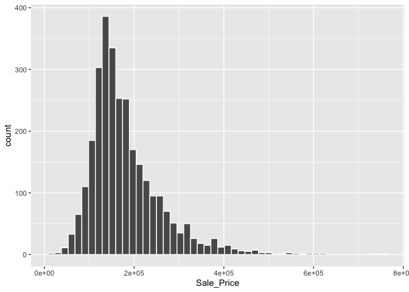
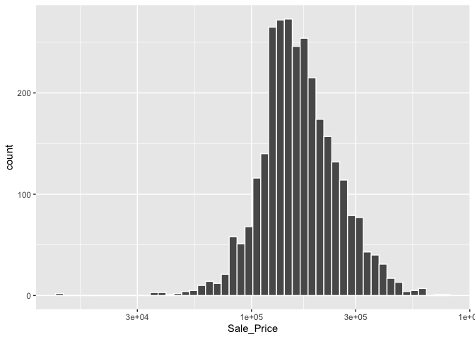

# Chapter 4 - Ames Housing Data

Things to consider when exploring data:

-   How to handle missing values? NA or some other filler appropriate?
-   Convert categorical predictors to factor type? The factor data type is better for storing qualitative data for modeling than simple strings.
-   Consider what variables should be outcomes vs. predictors.

## Load the Ames Data


```r
library(modeldata) # This is also loaded by the tidymodels package
data(ames)

# or, in one line:
data(ames, package = "modeldata")

dim(ames)
```

```
## [1] 2930   74
```

## Exploratory Data Analysis

Trying to predict the last sale price of the house

### Create histogram of sale prices


```r
library(tidymodels)
```

```
## ── Attaching packages ────────────────────────────────────── tidymodels 1.1.1 ──
```

```
## ✔ broom        1.0.5     ✔ rsample      1.2.0
## ✔ dials        1.2.0     ✔ tibble       3.2.1
## ✔ dplyr        1.1.3     ✔ tidyr        1.3.0
## ✔ ggplot2      3.4.3     ✔ tune         1.1.2
## ✔ infer        1.0.5     ✔ workflows    1.1.3
## ✔ parsnip      1.1.1     ✔ workflowsets 1.0.1
## ✔ purrr        1.0.2     ✔ yardstick    1.2.0
## ✔ recipes      1.0.8
```

```
## ── Conflicts ───────────────────────────────────────── tidymodels_conflicts() ──
## ✖ purrr::discard() masks scales::discard()
## ✖ dplyr::filter()  masks stats::filter()
## ✖ dplyr::lag()     masks stats::lag()
## ✖ recipes::step()  masks stats::step()
## • Learn how to get started at https://www.tidymodels.org/start/
```

```r
tidymodels_prefer()

ggplot(ames, aes(x = Sale_Price)) + 
  geom_histogram(bins = 50, col= "white")
```

<!-- -->

The data is right skewed. Should try a log transformation


```r
ggplot(ames, aes(x = Sale_Price)) + 
  geom_histogram(bins = 50, col= "white") +
  scale_x_log10()
```

<!-- -->

Not perfect, but probably better than the original transformation.

Disclaimer about transformations: "The units of the model coefficients might be more difficult to interpret, as will measures of performance. For example, the root mean squared error (RMSE) is a common performance metric used in regression models. It uses the difference between the observed and predicted values in its calculations. If the sale price is on the log scale, these differences (i.e., the residuals) are also on the log scale. It can be difficult to understand the quality of a model whose RMSE is 0.15 on such a log scale."

Make the transformation permanent in the data frame:


```r
ames <- ames %>% mutate(Sale_Price = log10(Sale_Price))
```

## Other things to consider during EDA

-   "Is there anything odd or noticeable about the distributions of the individual predictors? Is there much skewness or any pathological distributions?

-   Are there high correlations between predictors? For example, there are multiple predictors related to house size. Are some redundant?

-   Are there associations between predictors and the outcomes?"

While exploring maps of the houses/neighborhoods, they found some discrepancies and outliers in the locations of the neighborhoods/houses.
