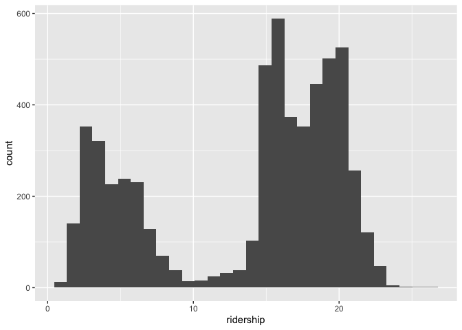
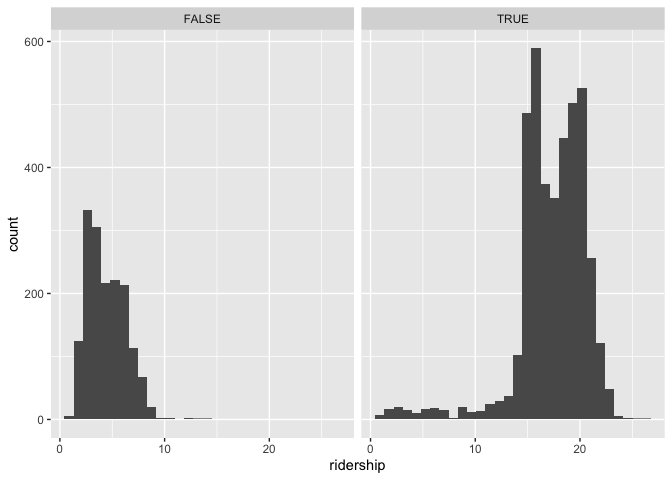
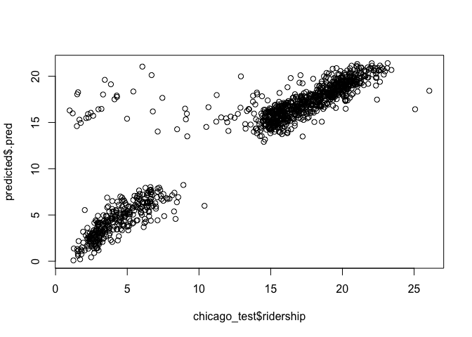

We will practice using the Chicago data set on public transit ridership.  You can access it with:


```r
library(tidyverse)
```

```
## ── Attaching core tidyverse packages ──────────────────────── tidyverse 2.0.0 ──
## ✔ dplyr     1.1.3     ✔ readr     2.1.4
## ✔ forcats   1.0.0     ✔ stringr   1.5.0
## ✔ ggplot2   3.4.3     ✔ tibble    3.2.1
## ✔ lubridate 1.9.2     ✔ tidyr     1.3.0
## ✔ purrr     1.0.2     
## ── Conflicts ────────────────────────────────────────── tidyverse_conflicts() ──
## ✖ dplyr::filter() masks stats::filter()
## ✖ dplyr::lag()    masks stats::lag()
## ℹ Use the conflicted package (<http://conflicted.r-lib.org/>) to force all conflicts to become errors
```

```r
library(tidymodels)
```

```
## ── Attaching packages ────────────────────────────────────── tidymodels 1.1.1 ──
## ✔ broom        1.0.5     ✔ rsample      1.2.0
## ✔ dials        1.2.0     ✔ tune         1.1.2
## ✔ infer        1.0.5     ✔ workflows    1.1.3
## ✔ modeldata    1.2.0     ✔ workflowsets 1.0.1
## ✔ parsnip      1.1.1     ✔ yardstick    1.2.0
## ✔ recipes      1.0.8     
## ── Conflicts ───────────────────────────────────────── tidymodels_conflicts() ──
## ✖ scales::discard() masks purrr::discard()
## ✖ dplyr::filter()   masks stats::filter()
## ✖ recipes::fixed()  masks stringr::fixed()
## ✖ dplyr::lag()      masks stats::lag()
## ✖ yardstick::spec() masks readr::spec()
## ✖ recipes::step()   masks stats::step()
## • Use tidymodels_prefer() to resolve common conflicts.
```

```r
tidymodels_prefer()
library(timeDate)
library(modeldata)
```


```r
data(Chicago, package = "modeldata")
head(Chicago)
```

```
## # A tibble: 6 × 50
##   ridership Austin Quincy_Wells Belmont Archer_35th Oak_Park Western Clark_Lake
##       <dbl>  <dbl>        <dbl>   <dbl>       <dbl>    <dbl>   <dbl>      <dbl>
## 1     15.7   1.46         8.37     4.60       2.01     1.42     3.32      15.6 
## 2     15.8   1.50         8.35     4.72       2.09     1.43     3.34      15.7 
## 3     15.9   1.52         8.36     4.68       2.11     1.49     3.36      15.6 
## 4     15.9   1.49         7.85     4.77       2.17     1.44     3.36      15.7 
## 5     15.4   1.50         7.62     4.72       2.06     1.42     3.27      15.6 
## 6      2.42  0.693        0.911    2.27       0.624    0.426    1.11       2.41
## # ℹ 42 more variables: Clinton <dbl>, Merchandise_Mart <dbl>,
## #   Irving_Park <dbl>, Washington_Wells <dbl>, Harlem <dbl>, Monroe <dbl>,
## #   Polk <dbl>, Ashland <dbl>, Kedzie <dbl>, Addison <dbl>,
## #   Jefferson_Park <dbl>, Montrose <dbl>, California <dbl>, temp_min <dbl>,
## #   temp <dbl>, temp_max <dbl>, temp_change <dbl>, dew <dbl>, humidity <dbl>,
## #   pressure <dbl>, pressure_change <dbl>, wind <dbl>, wind_max <dbl>,
## #   gust <dbl>, gust_max <dbl>, percip <dbl>, percip_max <dbl>, …
```


Read about it with `?Chicago`; read more about it in [Kuhn and Johnson](https://bookdown.org/max/FES/chicago-intro.html)

## 1.  Explore the data

Make a histogram of ridership.  What might be causing the two peaks.  Is there a predictor variable that can account for this (or that can be used to make a new variable to account for it)?

I am not suggesting that you do regressions or plots on all variables at this time, rather that you think about what might have this kind of impact.

If you need to make a new predictor variable, go ahead.

```r
names(Chicago)
```

```
##  [1] "ridership"        "Austin"           "Quincy_Wells"     "Belmont"         
##  [5] "Archer_35th"      "Oak_Park"         "Western"          "Clark_Lake"      
##  [9] "Clinton"          "Merchandise_Mart" "Irving_Park"      "Washington_Wells"
## [13] "Harlem"           "Monroe"           "Polk"             "Ashland"         
## [17] "Kedzie"           "Addison"          "Jefferson_Park"   "Montrose"        
## [21] "California"       "temp_min"         "temp"             "temp_max"        
## [25] "temp_change"      "dew"              "humidity"         "pressure"        
## [29] "pressure_change"  "wind"             "wind_max"         "gust"            
## [33] "gust_max"         "percip"           "percip_max"       "weather_rain"    
## [37] "weather_snow"     "weather_cloud"    "weather_storm"    "Blackhawks_Away" 
## [41] "Blackhawks_Home"  "Bulls_Away"       "Bulls_Home"       "Bears_Away"      
## [45] "Bears_Home"       "WhiteSox_Away"    "WhiteSox_Home"    "Cubs_Away"       
## [49] "Cubs_Home"        "date"
```

```r
Chicago %>% ggplot(aes(ridership)) + geom_histogram()
```

```
## `stat_bin()` using `bins = 30`. Pick better value with `binwidth`.
```

<!-- -->

```r
Chicago <- Chicago %>%
  mutate(weekend = isBizday(as.timeDate(date)))
head(Chicago)
```

```
## # A tibble: 6 × 51
##   ridership Austin Quincy_Wells Belmont Archer_35th Oak_Park Western Clark_Lake
##       <dbl>  <dbl>        <dbl>   <dbl>       <dbl>    <dbl>   <dbl>      <dbl>
## 1     15.7   1.46         8.37     4.60       2.01     1.42     3.32      15.6 
## 2     15.8   1.50         8.35     4.72       2.09     1.43     3.34      15.7 
## 3     15.9   1.52         8.36     4.68       2.11     1.49     3.36      15.6 
## 4     15.9   1.49         7.85     4.77       2.17     1.44     3.36      15.7 
## 5     15.4   1.50         7.62     4.72       2.06     1.42     3.27      15.6 
## 6      2.42  0.693        0.911    2.27       0.624    0.426    1.11       2.41
## # ℹ 43 more variables: Clinton <dbl>, Merchandise_Mart <dbl>,
## #   Irving_Park <dbl>, Washington_Wells <dbl>, Harlem <dbl>, Monroe <dbl>,
## #   Polk <dbl>, Ashland <dbl>, Kedzie <dbl>, Addison <dbl>,
## #   Jefferson_Park <dbl>, Montrose <dbl>, California <dbl>, temp_min <dbl>,
## #   temp <dbl>, temp_max <dbl>, temp_change <dbl>, dew <dbl>, humidity <dbl>,
## #   pressure <dbl>, pressure_change <dbl>, wind <dbl>, wind_max <dbl>,
## #   gust <dbl>, gust_max <dbl>, percip <dbl>, percip_max <dbl>, …
```

```r
Chicago %>% ggplot(aes(ridership)) + geom_histogram() + facet_grid(~weekend)
```

```
## `stat_bin()` using `bins = 30`. Pick better value with `binwidth`.
```

<!-- -->


## 2. Training and Test

Make an 80/20 train/test split.  Do you need to stratify over anything?  

So that we are working on the same split, use `set.seed(010324)` in you code chunk

```r
set.seed(010324)
chicago_split <- initial_split(Chicago, prop = 0.80, strata = ridership)
chicago_train <- training(chicago_split)
chicago_test <- testing(chicago_split)
```

## 3. Workflow set

Let's compare the effectiveness  of the temp and percip [sic] predictors.  

### 3A 

Use a workflow set (see chapter 7) to fit six models, each of which has your predictor from Q1 along with one of the following variables:

`temp_min`, `temp`, `temp_max`, `temp_change`, `percip`, `percip_max`

The formula for one of these would be something like `ridership ~ temp_min + Q1_predictor`.

```r
weather <- list(
  temp_min = ridership ~ temp_min + weekend,
  temp = ridership ~ temp + weekend,
  temp_max = ridership ~ temp_max + weekend,
  temp_change = ridership ~ temp_change + weekend,
  percip = ridership ~ percip + weekend,
  percip_max = ridership ~ percip_max + weekend
)

weather_models <- workflow_set(preproc = weather, models = list(lm = linear_reg()))
weather_models
```

```
## # A workflow set/tibble: 6 × 4
##   wflow_id       info             option    result    
##   <chr>          <list>           <list>    <list>    
## 1 temp_min_lm    <tibble [1 × 4]> <opts[0]> <list [0]>
## 2 temp_lm        <tibble [1 × 4]> <opts[0]> <list [0]>
## 3 temp_max_lm    <tibble [1 × 4]> <opts[0]> <list [0]>
## 4 temp_change_lm <tibble [1 × 4]> <opts[0]> <list [0]>
## 5 percip_lm      <tibble [1 × 4]> <opts[0]> <list [0]>
## 6 percip_max_lm  <tibble [1 × 4]> <opts[0]> <list [0]>
```

```r
weather_models$info[[1]] #basic info about the first workflow
```

```
## # A tibble: 1 × 4
##   workflow   preproc model      comment
##   <list>     <chr>   <chr>      <chr>  
## 1 <workflow> formula linear_reg ""
```

```r
extract_workflow(weather_models, id = "percip_lm") #full details about the workflow of interest 
```

```
## ══ Workflow ════════════════════════════════════════════════════════════════════
## Preprocessor: Formula
## Model: linear_reg()
## 
## ── Preprocessor ────────────────────────────────────────────────────────────────
## ridership ~ percip + weekend
## 
## ── Model ───────────────────────────────────────────────────────────────────────
## Linear Regression Model Specification (regression)
## 
## Computational engine: lm
```


### 3B 

Compare the model fits / predictors (this can be using any of the p-value of the predictor, R2, AIC, log-lik).  Don't worry about the test set, just compare goodness of fit when fit with the training set.

```r
weather_models <-
   weather_models %>%
   mutate(fit = map(info, ~ fit(.x$workflow[[1]], chicago_train)))
weather_models
```

```
## # A workflow set/tibble: 6 × 5
##   wflow_id       info             option    result     fit       
##   <chr>          <list>           <list>    <list>     <list>    
## 1 temp_min_lm    <tibble [1 × 4]> <opts[0]> <list [0]> <workflow>
## 2 temp_lm        <tibble [1 × 4]> <opts[0]> <list [0]> <workflow>
## 3 temp_max_lm    <tibble [1 × 4]> <opts[0]> <list [0]> <workflow>
## 4 temp_change_lm <tibble [1 × 4]> <opts[0]> <list [0]> <workflow>
## 5 percip_lm      <tibble [1 × 4]> <opts[0]> <list [0]> <workflow>
## 6 percip_max_lm  <tibble [1 × 4]> <opts[0]> <list [0]> <workflow>
```

```r
weather_models$fit[[1]]
```

```
## ══ Workflow [trained] ══════════════════════════════════════════════════════════
## Preprocessor: Formula
## Model: linear_reg()
## 
## ── Preprocessor ────────────────────────────────────────────────────────────────
## ridership ~ temp_min + weekend
## 
## ── Model ───────────────────────────────────────────────────────────────────────
## 
## Call:
## stats::lm(formula = ..y ~ ., data = data)
## 
## Coefficients:
## (Intercept)     temp_min  weekendTRUE  
##     2.64689      0.03921     12.89625
```

```r
weather_models %>%
  mutate(tidy=map(fit, tidy)) %>%
  select(wflow_id, tidy) %>%
  unnest(tidy)
```

```
## # A tibble: 18 × 6
##    wflow_id       term        estimate std.error statistic   p.value
##    <chr>          <chr>          <dbl>     <dbl>     <dbl>     <dbl>
##  1 temp_min_lm    (Intercept)   2.65     0.128      20.6   2.93e- 90
##  2 temp_min_lm    temp_min      0.0392   0.00223    17.6   7.95e- 67
##  3 temp_min_lm    weekendTRUE  12.9      0.0946    136.    0        
##  4 temp_lm        (Intercept)   2.45     0.137      17.9   2.31e- 69
##  5 temp_lm        temp          0.0383   0.00217    17.7   9.99e- 68
##  6 temp_lm        weekendTRUE  12.9      0.0946    136.    0        
##  7 temp_max_lm    (Intercept)   2.23     0.148      15.1   3.39e- 50
##  8 temp_max_lm    temp_max      0.0360   0.00205    17.5   1.95e- 66
##  9 temp_max_lm    weekendTRUE  12.9      0.0946    137.    0        
## 10 temp_change_lm (Intercept)   3.92     0.138      28.4   9.60e-164
## 11 temp_change_lm temp_change   0.0313   0.00710     4.41  1.06e-  5
## 12 temp_change_lm weekendTRUE  12.9      0.0977    132.    0        
## 13 percip_lm      (Intercept)   4.41     0.0827     53.4   0        
## 14 percip_lm      percip       -7.58    12.6        -0.601 5.48e-  1
## 15 percip_lm      weekendTRUE  12.9      0.0978    132.    0        
## 16 percip_max_lm  (Intercept)   4.37     0.0837     52.2   0        
## 17 percip_max_lm  percip_max    1.11     0.346       3.21  1.32e-  3
## 18 percip_max_lm  weekendTRUE  12.9      0.0977    132.    0
```

```r
#all weather factors seem significant except percip

weather_models %>%
  mutate(glance=map(fit, glance)) %>%
  select(wflow_id, glance) %>%
  unnest(glance) %>% 
  arrange(AIC)
```

```
## # A tibble: 6 × 13
##   wflow_id  r.squared adj.r.squared sigma statistic p.value    df  logLik    AIC
##   <chr>         <dbl>         <dbl> <dbl>     <dbl>   <dbl> <dbl>   <dbl>  <dbl>
## 1 temp_lm       0.806         0.806  2.89     9464.       0     2 -11294. 22595.
## 2 temp_min…     0.806         0.806  2.89     9453.       0     2 -11296. 22599.
## 3 temp_max…     0.806         0.806  2.89     9449.       0     2 -11297. 22601.
## 4 temp_cha…     0.794         0.794  2.98     8757.       0     2 -11435. 22878.
## 5 percip_m…     0.793         0.793  2.98     8735.       0     2 -11440. 22887.
## 6 percip_lm     0.793         0.793  2.98     8711.       0     2 -11445. 22897.
## # ℹ 4 more variables: BIC <dbl>, deviance <dbl>, df.residual <int>, nobs <int>
```

```r
#seems like the temperature models are a better fit 
```

## 4 Recipes

### 4A

Create a workflow recipe does the following:

* normalizes all weather and station predictors
* creates a set of PCs for the weather-related predictors, keeping enough PCs to explain 75% of the variance in the weather variables
* creates a second set of PCs for the station-related predictors, keeping enough PCs to explaining 75% of the variance in these variables

Hint: `tidy()`, `prep()`, and `bake()` methods for recipes may be helpful in examining what you have done.  The help file on `recipe` is good to0.

Hint2: You can use various dplyr::select functions and regular expressions to avoid having to type out the variable names.  But as a fair-warning, it took me a lot longer to figure that out than it would have to just type then out.  (But next time it might be faster).  I can demo.

```r
chicago_recipe <- 
  recipe(ridership ~ .,
         data = chicago_train) %>%
  step_normalize(Austin, Quincy_Wells, Belmont, Archer_35th, Oak_Park, Western, Clark_Lake, Clinton,
                 Merchandise_Mart, Irving_Park, Washington_Wells, Harlem, Monroe, Polk, Ashland, Kedzie, 
                 Addison, Jefferson_Park, Montrose, California, temp_min, temp, temp_max, temp_change, dew,
                 humidity, pressure, pressure_change, wind, wind_max, gust, gust_max, percip, percip_max,
                 weather_rain, weather_snow, weather_cloud, weather_storm) %>% 
  step_pca(temp_min, temp, temp_max, temp_change, dew,
             humidity, pressure, pressure_change, wind, wind_max, gust, gust_max, percip, percip_max,
             weather_rain, weather_snow, weather_cloud, weather_storm, 
           prefix = "W_PC", threshold = .75, id = "weather_pca") %>% 
  step_pca(Austin, Quincy_Wells, Belmont, Archer_35th, Oak_Park, Western, Clark_Lake, Clinton,
             Merchandise_Mart, Irving_Park, Washington_Wells, Harlem, Monroe, Polk, Ashland, Kedzie, 
             Addison, Jefferson_Park, Montrose, California, 
           prefix = "St_PC", threshold = .75, id = "station_pca")
chicago_recipe
```

```
## 
```

```
## ── Recipe ──────────────────────────────────────────────────────────────────────
```

```
## 
```

```
## ── Inputs
```

```
## Number of variables by role
```

```
## outcome:    1
## predictor: 50
```

```
## 
```

```
## ── Operations
```

```
## • Centering and scaling for: Austin, Quincy_Wells, Belmont, Archer_35th, ...
```

```
## • PCA extraction with: temp_min, temp, temp_max, temp_change, dew, ...
```

```
## • PCA extraction with: Austin, Quincy_Wells, Belmont, Archer_35th, ...
```

```r
tidy(chicago_recipe)
```

```
## # A tibble: 3 × 6
##   number operation type      trained skip  id             
##    <int> <chr>     <chr>     <lgl>   <lgl> <chr>          
## 1      1 step      normalize FALSE   FALSE normalize_atjOK
## 2      2 step      pca       FALSE   FALSE weather_pca    
## 3      3 step      pca       FALSE   FALSE station_pca
```

```r
chicago_recipe %>% prep()
```

```
## 
```

```
## ── Recipe ──────────────────────────────────────────────────────────────────────
```

```
## 
```

```
## ── Inputs
```

```
## Number of variables by role
```

```
## outcome:    1
## predictor: 50
```

```
## 
```

```
## ── Training information
```

```
## Training data contained 4557 data points and no incomplete rows.
```

```
## 
```

```
## ── Operations
```

```
## • Centering and scaling for: Austin, Quincy_Wells, Belmont, ... | Trained
```

```
## • PCA extraction with: temp_min, temp, temp_max, temp_change, ... | Trained
```

```
## • PCA extraction with: Austin, Quincy_Wells, Belmont, ... | Trained
```

```r
chicago_recipe %>% prep() %>% bake(chicago_train[1:6,])
```

```
## # A tibble: 6 × 20
##   Blackhawks_Away Blackhawks_Home Bulls_Away Bulls_Home Bears_Away Bears_Home
##             <dbl>           <dbl>      <dbl>      <dbl>      <dbl>      <dbl>
## 1               0               0          0          1          0          0
## 2               0               0          0          0          0          0
## 3               0               0          0          0          0          0
## 4               0               0          0          0          0          0
## 5               0               0          0          1          0          0
## 6               0               0          0          0          0          0
## # ℹ 14 more variables: WhiteSox_Away <dbl>, WhiteSox_Home <dbl>,
## #   Cubs_Away <dbl>, Cubs_Home <dbl>, date <date>, weekend <lgl>,
## #   ridership <dbl>, W_PC1 <dbl>, W_PC2 <dbl>, W_PC3 <dbl>, W_PC4 <dbl>,
## #   W_PC5 <dbl>, W_PC6 <dbl>, St_PC1 <dbl>
```

```r
chicago_recipe2 <- #you don't need to write out each variable, just need to know the order of the column names
  recipe(ridership ~ .,
         data = chicago_train) %>%
  step_normalize(Austin:weather_storm) %>% 
  step_pca(temp_min:weather_storm, 
           prefix = "W_PC", threshold = .75, id = "weather_pca") %>% 
  step_pca(Austin: California, 
           prefix = "St_PC", threshold = .75, id = "station_pca")
chicago_recipe2
```

```
## 
```

```
## ── Recipe ──────────────────────────────────────────────────────────────────────
```

```
## 
```

```
## ── Inputs
```

```
## Number of variables by role
```

```
## outcome:    1
## predictor: 50
```

```
## 
```

```
## ── Operations
```

```
## • Centering and scaling for: Austin:weather_storm
```

```
## • PCA extraction with: temp_min:weather_storm
```

```
## • PCA extraction with: Austin:California
```

```r
tidy(chicago_recipe2)
```

```
## # A tibble: 3 × 6
##   number operation type      trained skip  id             
##    <int> <chr>     <chr>     <lgl>   <lgl> <chr>          
## 1      1 step      normalize FALSE   FALSE normalize_pqlqv
## 2      2 step      pca       FALSE   FALSE weather_pca    
## 3      3 step      pca       FALSE   FALSE station_pca
```

```r
chicago_recipe2 %>% prep()
```

```
## 
```

```
## ── Recipe ──────────────────────────────────────────────────────────────────────
```

```
## 
```

```
## ── Inputs
```

```
## Number of variables by role
```

```
## outcome:    1
## predictor: 50
```

```
## 
```

```
## ── Training information
```

```
## Training data contained 4557 data points and no incomplete rows.
```

```
## 
```

```
## ── Operations
```

```
## • Centering and scaling for: Austin, Quincy_Wells, Belmont, ... | Trained
```

```
## • PCA extraction with: temp_min, temp, temp_max, temp_change, ... | Trained
```

```
## • PCA extraction with: Austin, Quincy_Wells, Belmont, ... | Trained
```

```r
chicago_recipe2 %>% prep() %>% bake(chicago_train[1:6,])
```

```
## # A tibble: 6 × 20
##   Blackhawks_Away Blackhawks_Home Bulls_Away Bulls_Home Bears_Away Bears_Home
##             <dbl>           <dbl>      <dbl>      <dbl>      <dbl>      <dbl>
## 1               0               0          0          1          0          0
## 2               0               0          0          0          0          0
## 3               0               0          0          0          0          0
## 4               0               0          0          0          0          0
## 5               0               0          0          1          0          0
## 6               0               0          0          0          0          0
## # ℹ 14 more variables: WhiteSox_Away <dbl>, WhiteSox_Home <dbl>,
## #   Cubs_Away <dbl>, Cubs_Home <dbl>, date <date>, weekend <lgl>,
## #   ridership <dbl>, W_PC1 <dbl>, W_PC2 <dbl>, W_PC3 <dbl>, W_PC4 <dbl>,
## #   W_PC5 <dbl>, W_PC6 <dbl>, St_PC1 <dbl>
```

```r
lm_model <- linear_reg() %>% set_engine("lm")
lm_wflow <- 
  workflow() %>% 
  add_model(lm_model) %>% 
  add_recipe(chicago_recipe2)
```


### 4B

Use the recipe from 4A to fit a linear regression of ridership on the new PCs and all remaining predictors (i.e. those not used in making the PCs).  Use the training data.

```r
lm_fit <- fit(lm_wflow, chicago_train)
lm_fit
```

```
## ══ Workflow [trained] ══════════════════════════════════════════════════════════
## Preprocessor: Recipe
## Model: linear_reg()
## 
## ── Preprocessor ────────────────────────────────────────────────────────────────
## 3 Recipe Steps
## 
## • step_normalize()
## • step_pca()
## • step_pca()
## 
## ── Model ───────────────────────────────────────────────────────────────────────
## 
## Call:
## stats::lm(formula = ..y ~ ., data = data)
## 
## Coefficients:
##     (Intercept)  Blackhawks_Away  Blackhawks_Home       Bulls_Away  
##      -7.9604340        0.1150911        0.0314563       -0.0075918  
##      Bulls_Home       Bears_Away       Bears_Home    WhiteSox_Away  
##       0.3136544       -0.3323989       -0.1567557       -0.2319575  
##   WhiteSox_Home        Cubs_Away        Cubs_Home             date  
##              NA               NA               NA        0.0009374  
##     weekendTRUE            W_PC1            W_PC2            W_PC3  
##      11.7029704        0.3633653       -0.0188409        0.0228392  
##           W_PC4            W_PC5            W_PC6           St_PC1  
##       0.0342987       -0.0545339        0.0451229        0.1397542
```

```r
# To tidy the model fit: 
lm_fit %>% 
  # This returns the parsnip object:
  extract_fit_parsnip() %>% 
  # Now tidy the linear model object:
  tidy()
```

```
## # A tibble: 20 × 5
##    term             estimate  std.error statistic    p.value
##    <chr>               <dbl>      <dbl>     <dbl>      <dbl>
##  1 (Intercept)     -7.96      0.435      -18.3     3.27e- 72
##  2 Blackhawks_Away  0.115     0.116        0.993   3.21e-  1
##  3 Blackhawks_Home  0.0315    0.119        0.264   7.92e-  1
##  4 Bulls_Away      -0.00759   0.116       -0.0657  9.48e-  1
##  5 Bulls_Home       0.314     0.116        2.70    7.06e-  3
##  6 Bears_Away      -0.332     0.229       -1.45    1.47e-  1
##  7 Bears_Home      -0.157     0.212       -0.740   4.59e-  1
##  8 WhiteSox_Away   -0.232     0.0999      -2.32    2.03e-  2
##  9 WhiteSox_Home   NA        NA           NA      NA        
## 10 Cubs_Away       NA        NA           NA      NA        
## 11 Cubs_Home       NA        NA           NA      NA        
## 12 date             0.000937  0.0000248   37.9     9.75e-273
## 13 weekendTRUE     11.7       0.189       61.8     0        
## 14 W_PC1            0.363     0.0237      15.3     1.08e- 51
## 15 W_PC2           -0.0188    0.0184      -1.02    3.06e-  1
## 16 W_PC3            0.0228    0.0237       0.963   3.36e-  1
## 17 W_PC4            0.0343    0.0273       1.26    2.09e-  1
## 18 W_PC5           -0.0545    0.0336      -1.63    1.04e-  1
## 19 W_PC6            0.0451    0.0352       1.28    2.00e-  1
## 20 St_PC1           0.140     0.0203       6.88    6.96e- 12
```

```r
# Get the recipe after it has been estimated:
lm_fit %>% 
  extract_recipe(estimated = TRUE)
```

```
## 
```

```
## ── Recipe ──────────────────────────────────────────────────────────────────────
```

```
## 
```

```
## ── Inputs
```

```
## Number of variables by role
```

```
## outcome:    1
## predictor: 50
```

```
## 
```

```
## ── Training information
```

```
## Training data contained 4557 data points and no incomplete rows.
```

```
## 
```

```
## ── Operations
```

```
## • Centering and scaling for: Austin, Quincy_Wells, Belmont, ... | Trained
```

```
## • PCA extraction with: temp_min, temp, temp_max, temp_change, ... | Trained
```

```
## • PCA extraction with: Austin, Quincy_Wells, Belmont, ... | Trained
```


### 4C

Use the fit from 4B to predict ridership in the test data.  Evaluate the predictions.

```r
predicted <-predict(lm_fit, chicago_test)
```

```
## Warning in predict.lm(object = object$fit, newdata = new_data, type =
## "response", : prediction from rank-deficient fit; consider predict(.,
## rankdeficient="NA")
```

```r
predicted
```

```
## # A tibble: 1,141 × 1
##     .pred
##     <dbl>
##  1  0.425
##  2  0.795
##  3 14.0  
##  4 13.7  
##  5 13.8  
##  6  1.64 
##  7 13.9  
##  8  1.18 
##  9  0.891
## 10  0.211
## # ℹ 1,131 more rows
```

```r
plot(chicago_test$ridership, predicted$.pred)
```

<!-- -->

```r
cor.test(chicago_test$ridership, predicted$.pred)
```

```
## 
## 	Pearson's product-moment correlation
## 
## data:  chicago_test$ridership and predicted$.pred
## t = 83.233, df = 1139, p-value < 2.2e-16
## alternative hypothesis: true correlation is not equal to 0
## 95 percent confidence interval:
##  0.9180558 0.9344921
## sample estimates:
##      cor 
## 0.926716
```

