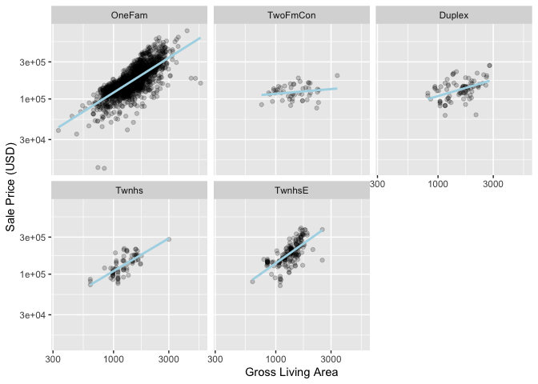
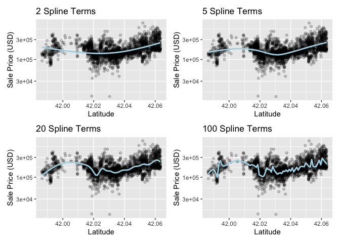

# Chapter 8 - Feature Engineering with recipes

<https://www.tmwr.org/recipes>

Feature engineering entails reformatting predictor variables to make them easier for a model to use effectively. Ex: transformations or ratios or centering and scaling predictors

**Recipes package combines different feature enginerring and pre-processing tasks into a single object and then apply those transformations to different data sets.**

### Carry Over AMES code:


```r
library(tidymodels)
```

```
## ── Attaching packages ────────────────────────────────────── tidymodels 1.1.1 ──
```

```
## ✔ broom        1.0.5     ✔ recipes      1.0.8
## ✔ dials        1.2.0     ✔ rsample      1.2.0
## ✔ dplyr        1.1.3     ✔ tibble       3.2.1
## ✔ ggplot2      3.4.3     ✔ tidyr        1.3.0
## ✔ infer        1.0.5     ✔ tune         1.1.2
## ✔ modeldata    1.2.0     ✔ workflows    1.1.3
## ✔ parsnip      1.1.1     ✔ workflowsets 1.0.1
## ✔ purrr        1.0.2     ✔ yardstick    1.2.0
```

```
## ── Conflicts ───────────────────────────────────────── tidymodels_conflicts() ──
## ✖ purrr::discard() masks scales::discard()
## ✖ dplyr::filter()  masks stats::filter()
## ✖ dplyr::lag()     masks stats::lag()
## ✖ recipes::step()  masks stats::step()
## • Search for functions across packages at https://www.tidymodels.org/find/
```

```r
tidymodels_prefer()
data(ames)

ames <- mutate(ames, Sale_Price = log10(Sale_Price))

set.seed(502)
ames_split <- initial_split(ames, prop = 0.80, strata = Sale_Price)
ames_train <- training(ames_split)
ames_test  <-  testing(ames_split)

lm_model <- linear_reg() %>% set_engine("lm")

lm_wflow <- 
  workflow() %>% 
  add_model(lm_model) %>% 
  add_variables(outcome = Sale_Price, predictors = c(Longitude, Latitude))

lm_fit <- fit(lm_wflow, ames_train)
```

## A Simple recipe () for the Ames Housing Data

Example using small subset of predictors in the data:

-   The neighborhood (qualitative, with 29 neighborhoods in the training set)

-   The gross above-grade living area (continuous, named `Gr_Liv_Area`)

-   The year built (`Year_Built`)

-   The type of building (`Bldg_Type` with values `OneFam` (n=1,936), `TwoFmCon` (n=50), `Duplex` (n=88), `Twnhs` (n=77), and `TwnhsE` (n=191))

Standard call to lm( ) example:


```r
lm(Sale_Price ~ Neighborhood + log10(Gr_Liv_Area) + Year_Built + Bldg_Type, data = ames)
```

```
## 
## Call:
## lm(formula = Sale_Price ~ Neighborhood + log10(Gr_Liv_Area) + 
##     Year_Built + Bldg_Type, data = ames)
## 
## Coefficients:
##                                         (Intercept)  
##                                          -0.8551717  
##                           NeighborhoodCollege_Creek  
##                                           0.0135485  
##                                NeighborhoodOld_Town  
##                                          -0.0289607  
##                                 NeighborhoodEdwards  
##                                          -0.0493174  
##                                NeighborhoodSomerset  
##                                           0.0499653  
##                      NeighborhoodNorthridge_Heights  
##                                           0.1335758  
##                                 NeighborhoodGilbert  
##                                          -0.0337334  
##                                  NeighborhoodSawyer  
##                                          -0.0042779  
##                          NeighborhoodNorthwest_Ames  
##                                           0.0004589  
##                             NeighborhoodSawyer_West  
##                                          -0.0174582  
##                                NeighborhoodMitchell  
##                                           0.0004695  
##                               NeighborhoodBrookside  
##                                          -0.0110205  
##                                NeighborhoodCrawford  
##                                           0.0914254  
##                  NeighborhoodIowa_DOT_and_Rail_Road  
##                                          -0.0839821  
##                              NeighborhoodTimberland  
##                                           0.0604062  
##                              NeighborhoodNorthridge  
##                                           0.0845868  
##                             NeighborhoodStone_Brook  
##                                           0.1459657  
## NeighborhoodSouth_and_West_of_Iowa_State_University  
##                                          -0.0282535  
##                             NeighborhoodClear_Creek  
##                                           0.0480071  
##                          NeighborhoodMeadow_Village  
##                                          -0.0899124  
##                               NeighborhoodBriardale  
##                                          -0.0465821  
##                     NeighborhoodBloomington_Heights  
##                                           0.0402528  
##                                 NeighborhoodVeenker  
##                                           0.0885538  
##                         NeighborhoodNorthpark_Villa  
##                                           0.0262051  
##                                 NeighborhoodBlueste  
##                                           0.0322372  
##                                  NeighborhoodGreens  
##                                           0.1751507  
##                             NeighborhoodGreen_Hills  
##                                           0.2229230  
##                                NeighborhoodLandmark  
##                                          -0.0119925  
##                                  log10(Gr_Liv_Area)  
##                                           0.6343996  
##                                          Year_Built  
##                                           0.0020678  
##                                   Bldg_TypeTwoFmCon  
##                                          -0.0312306  
##                                     Bldg_TypeDuplex  
##                                          -0.1038443  
##                                      Bldg_TypeTwnhs  
##                                          -0.0968859  
##                                     Bldg_TypeTwnhsE  
##                                          -0.0414929
```

The formula above defines a series of steps for data processing

1.  Sale price is defined as the outcome while neighborhood, gross living area, the year built, and building type variables are all defined as predictors.

2.  A log transformation is applied to the gross living area predictor.

3.  The neighborhood and building type columns are converted from a non-numeric format to a numeric format (since least squares requires numeric predictors).

A recipe can also define a series of steps for data processing, but through step\_\*() functions and w/o immediately executing them.

Example equivalent to above:


```r
library(tidymodels) # Includes the recipes package
tidymodels_prefer()

simple_ames <- 
  recipe(Sale_Price ~ Neighborhood + Gr_Liv_Area + Year_Built + Bldg_Type,
         data = ames_train) %>%
  step_log(Gr_Liv_Area, base = 10) %>% 
  step_dummy(all_nominal_predictors())
simple_ames
```

```
## 
```

```
## ── Recipe ──────────────────────────────────────────────────────────────────────
```

```
## 
```

```
## ── Inputs
```

```
## Number of variables by role
```

```
## outcome:   1
## predictor: 4
```

```
## 
```

```
## ── Operations
```

```
## • Log transformation on: Gr_Liv_Area
```

```
## • Dummy variables from: all_nominal_predictors()
```

1.  The call to `recipe()` with a formula tells the recipe the *roles* of the \"ingredients\" or variables (e.g., predictor, outcome). It only uses the data `ames_train` to determine the data types for the columns.

2.  `step_log()` declares that `Gr_Liv_Area` should be log transformed.

3.  `step_dummy()` specifies which variables should be converted from a qualitative format to a quantitative format, in this case, using dummy or indicator variables. An indicator or dummy variable is a binary numeric variable (a column of ones and zeroes) that encodes qualitative information; we will dig deeper into these kinds of variables in Section [8.4.1](https://www.tmwr.org/recipes#dummies).

    1.  This function is specific to the recipes package (but similar to starts_with())

    2.  Other selectors specific to the **recipes** package are: `all_numeric_predictors()`, `all_numeric()`, `all_predictors()`, and `all_outcomes()`.

Benefits of recipes:

-   Can be used across different models

-   Compact syntax

-   Prevents having to copy and paste scripts

## Using Recipes

Can add recipes to workflows:


```r
#lm_wflow %>% 
 # add_recipe(simple_ames)
#> Error in `add_recipe()`:
#> ! A recipe cannot be added when variables already exist.
```

Need to remove the pre-processor we already had in the workflow:


```r
lm_wflow <- 
  lm_wflow %>% 
  remove_variables() %>% 
  add_recipe(simple_ames)
lm_wflow
```

```
## ══ Workflow ════════════════════════════════════════════════════════════════════
## Preprocessor: Recipe
## Model: linear_reg()
## 
## ── Preprocessor ────────────────────────────────────────────────────────────────
## 2 Recipe Steps
## 
## • step_log()
## • step_dummy()
## 
## ── Model ───────────────────────────────────────────────────────────────────────
## Linear Regression Model Specification (regression)
## 
## Computational engine: lm
```

Can estimate the recipe and the model using fit():


```r
lm_fit <- fit(lm_wflow, ames_train)
lm_fit
```

```
## ══ Workflow [trained] ══════════════════════════════════════════════════════════
## Preprocessor: Recipe
## Model: linear_reg()
## 
## ── Preprocessor ────────────────────────────────────────────────────────────────
## 2 Recipe Steps
## 
## • step_log()
## • step_dummy()
## 
## ── Model ───────────────────────────────────────────────────────────────────────
## 
## Call:
## stats::lm(formula = ..y ~ ., data = data)
## 
## Coefficients:
##                                          (Intercept)  
##                                            -0.669137  
##                                          Gr_Liv_Area  
##                                             0.619899  
##                                           Year_Built  
##                                             0.001996  
##                           Neighborhood_College_Creek  
##                                             0.017766  
##                                Neighborhood_Old_Town  
##                                            -0.032952  
##                                 Neighborhood_Edwards  
##                                            -0.051724  
##                                Neighborhood_Somerset  
##                                             0.056846  
##                      Neighborhood_Northridge_Heights  
##                                             0.140402  
##                                 Neighborhood_Gilbert  
##                                            -0.031526  
##                                  Neighborhood_Sawyer  
##                                            -0.002966  
##                          Neighborhood_Northwest_Ames  
##                                             0.003300  
##                             Neighborhood_Sawyer_West  
##                                            -0.014389  
##                                Neighborhood_Mitchell  
##                                             0.004039  
##                               Neighborhood_Brookside  
##                                            -0.015150  
##                                Neighborhood_Crawford  
##                                             0.093970  
##                  Neighborhood_Iowa_DOT_and_Rail_Road  
##                                            -0.087830  
##                              Neighborhood_Timberland  
##                                             0.064063  
##                              Neighborhood_Northridge  
##                                             0.094539  
##                             Neighborhood_Stone_Brook  
##                                             0.153048  
## Neighborhood_South_and_West_of_Iowa_State_University  
##                                            -0.017363  
##                             Neighborhood_Clear_Creek  
##                                             0.053761  
##                          Neighborhood_Meadow_Village  
##                                            -0.087585  
##                               Neighborhood_Briardale  
## 
## ...
## and 26 more lines.
```

The predict method will apply the same pre-processing that was used on the training set:


```r
predict(lm_fit, ames_test %>% slice(1:3))
```

```
## Warning in predict.lm(object = object$fit, newdata = new_data, type =
## "response", : prediction from rank-deficient fit; consider predict(.,
## rankdeficient="NA")
```

```
## # A tibble: 3 × 1
##   .pred
##   <dbl>
## 1  5.08
## 2  5.32
## 3  5.28
```

Can use extract\_\* to retrieve the bare model object or recipe:


```r
# Get the recipe after it has been estimated:
lm_fit %>% 
  extract_recipe(estimated = TRUE)
```

```
## 
```

```
## ── Recipe ──────────────────────────────────────────────────────────────────────
```

```
## 
```

```
## ── Inputs
```

```
## Number of variables by role
```

```
## outcome:   1
## predictor: 4
```

```
## 
```

```
## ── Training information
```

```
## Training data contained 2342 data points and no incomplete rows.
```

```
## 
```

```
## ── Operations
```

```
## • Log transformation on: Gr_Liv_Area | Trained
```

```
## • Dummy variables from: Neighborhood, Bldg_Type | Trained
```

```r
# To tidy the model fit: 
lm_fit %>% 
  # This returns the parsnip object:
  extract_fit_parsnip() %>% 
  # Now tidy the linear model object:
  tidy() %>% 
  slice(1:5)
```

```
## # A tibble: 5 × 5
##   term                       estimate std.error statistic   p.value
##   <chr>                         <dbl>     <dbl>     <dbl>     <dbl>
## 1 (Intercept)                -0.669    0.231        -2.90 3.80e-  3
## 2 Gr_Liv_Area                 0.620    0.0143       43.2  2.63e-299
## 3 Year_Built                  0.00200  0.000117     17.1  6.16e- 62
## 4 Neighborhood_College_Creek  0.0178   0.00819       2.17 3.02e-  2
## 5 Neighborhood_Old_Town      -0.0330   0.00838      -3.93 8.66e-  5
```

## Examples of Recipe Steps 

### Qualitative Data --\> Numeric Format

Prior to transforming qualitative data to be encoded numerically, factor levels can be altered:

-   `step_unknown()` can be used to change missing values to a dedicated factor level.

-   `step_novel()` can allot a new level for cases where a new factor level may be encountered in future data.

-   `step_other()` can be used to analyze the frequencies of the factor levels in the training set and convert infrequently occurring values to a catch-all level of \"other,\" with a threshold that can be specified.

    -   Ex: Neighbors that have less than 5 properties can be lumped together


```r
simple_ames <- 
  recipe(Sale_Price ~ Neighborhood + Gr_Liv_Area + Year_Built + Bldg_Type,
         data = ames_train) %>%
  step_log(Gr_Liv_Area, base = 10) %>% 
  step_other(Neighborhood, threshold = 0.01) %>% #the bottom 1% of neighborhoods will be lumped into a level called "other" 
  step_dummy(all_nominal_predictors())
```

Default method for converting a factor to numeric format is to create dummy variables.

-   In R, the convention is to exclude a column for the first factor level b/c if you know the value for the other columns, you can determine the value of that column (they are mutually exclusive catgs). Plus, w/ linear regression, if all columns are included, the would add up to the intercept column and cause issues with the math.

-   The full set of encodings can be used for some models. This is traditionally called the one-hot encoding and can be achieved using the `one_hot` argument of `step_dummy()`.

-   step_dummy() also allows for more control over how dummy variables are named. Default is to use an underscore as the separator b/t name and level. This makes it easier to use selector functions in the future.

### Interaction Terms

`step_interact(~ interaction terms)` where the terms on the right-hand side of the tilde are the interactions.

Example with AMES:


```r
ggplot(ames_train, aes(x = Gr_Liv_Area, y = 10^Sale_Price)) + 
  geom_point(alpha = .2) + 
  facet_wrap(~ Bldg_Type) + 
  geom_smooth(method = lm, formula = y ~ x, se = FALSE, color = "lightblue") + 
  scale_x_log10() + 
  scale_y_log10() + 
  labs(x = "Gross Living Area", y = "Sale Price (USD)")
```

<!-- -->

```r
#Shows you may need an interaction term for Gross Living aArea and Building type
```


```r
#add the interaction to the recipe 
simple_ames <- 
  recipe(Sale_Price ~ Neighborhood + Gr_Liv_Area + Year_Built + Bldg_Type,
         data = ames_train) %>%
  step_log(Gr_Liv_Area, base = 10) %>% 
  step_other(Neighborhood, threshold = 0.01) %>% 
  step_dummy(all_nominal_predictors()) %>% 
  # Gr_Liv_Area is on the log scale from a previous step
  step_interact( ~ Gr_Liv_Area:starts_with("Bldg_Type_") ) #interaction step 
```

Additional interactions can be specified in this formula by separating them by `+`.

DON'T use a factor column that has not already been transformed to a dummy variable in step_interact().

Recipes also provides more coherent names for interaction terms (underscores and x).

### Spline Functions 

"When a predictor has a nonlinear relationship with the outcome, some types of predictive models can adaptively approximate this relationship during training. However, simpler is usually better and it is not uncommon to try to use a simple model, such as a linear fit, and add in specific nonlinear features for predictors that may need them, such as longitude and latitude for the Ames housing data. One common method for doing this is to use *spline* functions to represent the data. Splines replace the existing numeric predictor with a set of columns that allow a model to emulate a flexible, nonlinear relationship. As more spline terms are added to the data, the capacity to nonlinearly represent the relationship increases. Unfortunately, it may also increase the likelihood of picking up on data trends that occur by chance (i.e., overfitting)."

Geom_smooth uses a spline representation of the data.


```r
library(patchwork)
library(splines)

plot_smoother <- function(deg_free) {
  ggplot(ames_train, aes(x = Latitude, y = 10^Sale_Price)) + 
    geom_point(alpha = .2) + 
    scale_y_log10() +
    geom_smooth(
      method = lm,
      formula = y ~ ns(x, df = deg_free), #ns function generates feature columsn using functions called "natural splines"
      color = "lightblue",
      se = FALSE
    ) +
    labs(title = paste(deg_free, "Spline Terms"),
         y = "Sale Price (USD)")
}

( plot_smoother(2) + plot_smoother(5) ) / ( plot_smoother(20) + plot_smoother(100) )
```

<!-- -->

Recipes version of splines:


```r
recipe(Sale_Price ~ Neighborhood + Gr_Liv_Area + Year_Built + Bldg_Type + Latitude,
         data = ames_train) %>%
  step_log(Gr_Liv_Area, base = 10) %>% 
  step_other(Neighborhood, threshold = 0.01) %>% 
  step_dummy(all_nominal_predictors()) %>% 
  step_interact( ~ Gr_Liv_Area:starts_with("Bldg_Type_") ) %>% 
  step_ns(Latitude, deg_free = 20) #spline step 
```

```
## 
```

```
## ── Recipe ──────────────────────────────────────────────────────────────────────
```

```
## 
```

```
## ── Inputs
```

```
## Number of variables by role
```

```
## outcome:   1
## predictor: 5
```

```
## 
```

```
## ── Operations
```

```
## • Log transformation on: Gr_Liv_Area
```

```
## • Collapsing factor levels for: Neighborhood
```

```
## • Dummy variables from: all_nominal_predictors()
```

```
## • Interactions with: Gr_Liv_Area:starts_with("Bldg_Type_")
```

```
## • Natural splines on: Latitude
```

*Note: All of these AMES models are just for demonstration. For example, neighborhood and latitude likely represent the same underlying data so you should probably exclude one of them.*

### Feature Extraction 

Ex: PCA

Recipe step for PCA with AMES size predictors:


```r
# Use a regular expression to capture house size predictors: 
# step_pca(matches("(SF$)|(Gr_Liv)"))
```

*Note: you should probably include `step_normalize()`, which will center and scale each column, prior to the PCA step.*

### Row Sampling Steps 

Ex: subsampling techniques.

See section 8.4.5 for more info.

### General Transformations 

Mirroring the original **dplyr** operation, `step_mutate()` can be used to conduct a variety of basic operations to the data.

Be careful to avoid data leakage. Ex: a mutate that includes multiple steps like, x= w\>mean(w). The mean would come from the new data and not the training set.

### Natural Language Processing 

See section 8.4.7 for more info.

## Skipping Steps for New Data 

For simple transformations of the outcome column(s), conduct those outside the recipe

-   If you included the log transformation of Sale_Price in the recipe, there would be a failure when the recipe is applied to new properties w/ unknown sale price (Ex: predict step).

When using subsampling, you don't want the same subsampling to be applied to the data being predicted.

-   Each step function has an option called `skip` that, when set to `TRUE`, will be ignored by the `predict()` function. In this way, you can isolate the steps that affect the modeling data without causing errors when applied to new samples. However, all steps are applied when using `fit()`.

## Tidy a Recipe ()

Extended recipe for AMES:


```r
ames_rec <- 
  recipe(Sale_Price ~ Neighborhood + Gr_Liv_Area + Year_Built + Bldg_Type + 
           Latitude + Longitude, data = ames_train) %>%
  step_log(Gr_Liv_Area, base = 10) %>% 
  step_other(Neighborhood, threshold = 0.01) %>% 
  step_dummy(all_nominal_predictors()) %>% 
  step_interact( ~ Gr_Liv_Area:starts_with("Bldg_Type_") ) %>% 
  step_ns(Latitude, Longitude, deg_free = 20)
```

Tidy the recipe (summarize the recipe steps):


```r
tidy(ames_rec)
```

```
## # A tibble: 5 × 6
##   number operation type     trained skip  id            
##    <int> <chr>     <chr>    <lgl>   <lgl> <chr>         
## 1      1 step      log      FALSE   FALSE log_NSTJP     
## 2      2 step      other    FALSE   FALSE other_5HSyx   
## 3      3 step      dummy    FALSE   FALSE dummy_DMSaM   
## 4      4 step      interact FALSE   FALSE interact_ULMsR
## 5      5 step      ns       FALSE   FALSE ns_HMcZA
```

Specify id for the other step:


```r
ames_rec <- 
  recipe(Sale_Price ~ Neighborhood + Gr_Liv_Area + Year_Built + Bldg_Type + 
           Latitude + Longitude, data = ames_train) %>%
  step_log(Gr_Liv_Area, base = 10) %>% 
  step_other(Neighborhood, threshold = 0.01, id = "my_id") %>% 
  step_dummy(all_nominal_predictors()) %>% 
  step_interact( ~ Gr_Liv_Area:starts_with("Bldg_Type_") ) %>% 
  step_ns(Latitude, Longitude, deg_free = 20)

tidy(ames_rec)
```

```
## # A tibble: 5 × 6
##   number operation type     trained skip  id            
##    <int> <chr>     <chr>    <lgl>   <lgl> <chr>         
## 1      1 step      log      FALSE   FALSE log_PW6gd     
## 2      2 step      other    FALSE   FALSE my_id         
## 3      3 step      dummy    FALSE   FALSE dummy_for8K   
## 4      4 step      interact FALSE   FALSE interact_zm0tx
## 5      5 step      ns       FALSE   FALSE ns_9aI3F
```

Add the recipe to the workflow:


```r
lm_wflow <- 
  workflow() %>% 
  add_model(lm_model) %>% 
  add_recipe(ames_rec)

lm_fit <- fit(lm_wflow, ames_train)
```

Tidy the results from the recipe steps after fitting the data:


```r
estimated_recipe <- 
  lm_fit %>% 
  extract_recipe(estimated = TRUE)

tidy(estimated_recipe, id = "my_id") #tells it to pull out the results from step_other()
```

```
## # A tibble: 22 × 3
##    terms        retained           id   
##    <chr>        <chr>              <chr>
##  1 Neighborhood North_Ames         my_id
##  2 Neighborhood College_Creek      my_id
##  3 Neighborhood Old_Town           my_id
##  4 Neighborhood Edwards            my_id
##  5 Neighborhood Somerset           my_id
##  6 Neighborhood Northridge_Heights my_id
##  7 Neighborhood Gilbert            my_id
##  8 Neighborhood Sawyer             my_id
##  9 Neighborhood Northwest_Ames     my_id
## 10 Neighborhood Sawyer_West        my_id
## # ℹ 12 more rows
```

```r
#can also pull out the results for a particular step using its number:
tidy(estimated_recipe, number = 2)
```

```
## # A tibble: 22 × 3
##    terms        retained           id   
##    <chr>        <chr>              <chr>
##  1 Neighborhood North_Ames         my_id
##  2 Neighborhood College_Creek      my_id
##  3 Neighborhood Old_Town           my_id
##  4 Neighborhood Edwards            my_id
##  5 Neighborhood Somerset           my_id
##  6 Neighborhood Northridge_Heights my_id
##  7 Neighborhood Gilbert            my_id
##  8 Neighborhood Sawyer             my_id
##  9 Neighborhood Northwest_Ames     my_id
## 10 Neighborhood Sawyer_West        my_id
## # ℹ 12 more rows
```

## Column Roles 

In some cases, it may be useful to keep a column that isn't a predictor or outcome. Ex: street address in the AMES data.


```r
#ames_rec %>% update_role(address, new_role = "street address")
#address is no longer a predictor, just a street address 
```

## For Future Reference:

"All possible recipe steps are enumerated at [`tidymodels.org/find`](https://www.tidymodels.org/find/). The **recipes** framework provides a rich data manipulation environment for preprocessing and transforming data prior to modeling. Additionally, [`tidymodels.org/learn/develop/recipes/`](https://www.tidymodels.org/learn/develop/recipes/) shows how custom steps can be created."

Code for future chapters:


```r
library(tidymodels)
data(ames)
ames <- mutate(ames, Sale_Price = log10(Sale_Price))

set.seed(502)
ames_split <- initial_split(ames, prop = 0.80, strata = Sale_Price)
ames_train <- training(ames_split)
ames_test  <-  testing(ames_split)

ames_rec <- 
  recipe(Sale_Price ~ Neighborhood + Gr_Liv_Area + Year_Built + Bldg_Type + 
           Latitude + Longitude, data = ames_train) %>%
  step_log(Gr_Liv_Area, base = 10) %>% 
  step_other(Neighborhood, threshold = 0.01) %>% 
  step_dummy(all_nominal_predictors()) %>% 
  step_interact( ~ Gr_Liv_Area:starts_with("Bldg_Type_") ) %>% 
  step_ns(Latitude, Longitude, deg_free = 20)
  
lm_model <- linear_reg() %>% set_engine("lm")

lm_wflow <- 
  workflow() %>% 
  add_model(lm_model) %>% 
  add_recipe(ames_rec)

lm_fit <- fit(lm_wflow, ames_train)
```
