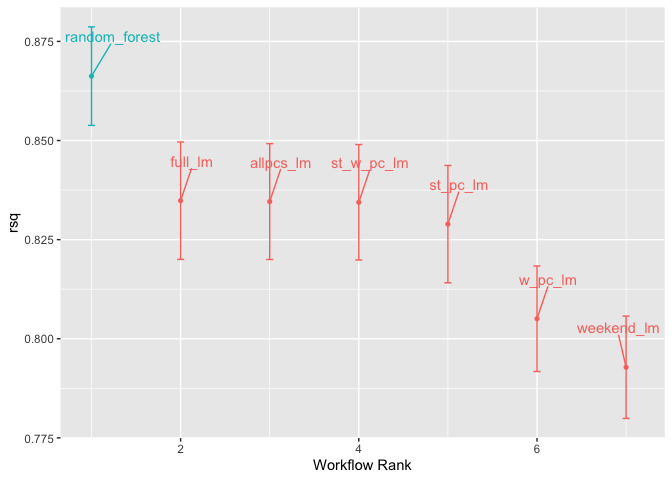
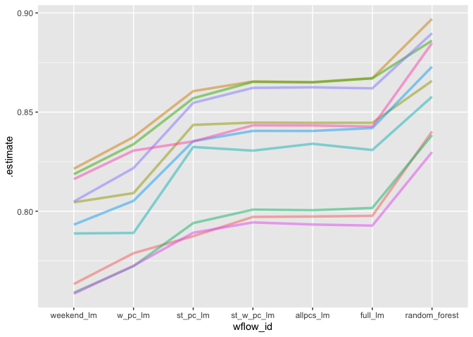
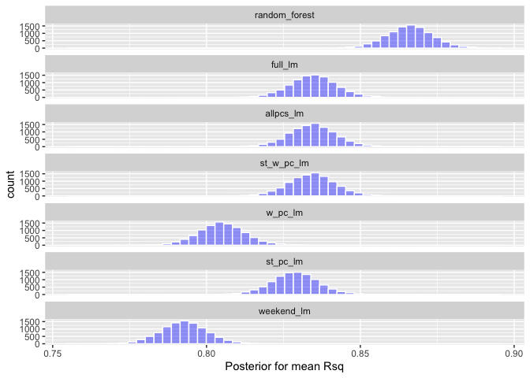
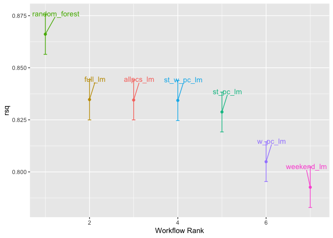
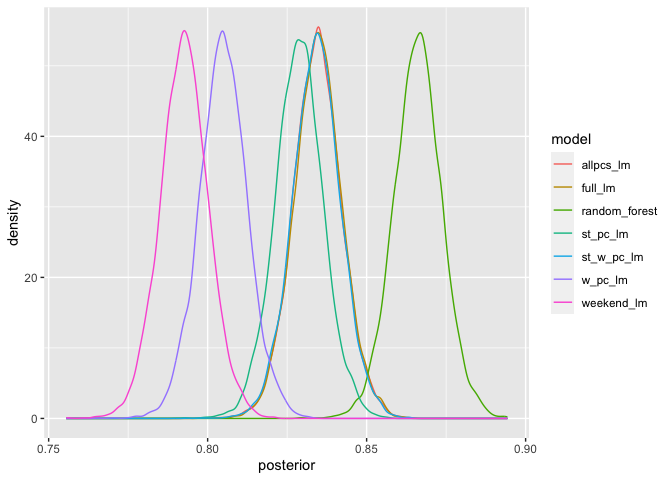

# 2/12 Assignment

Return to the Chicago data and Q4 from the previous Chicago assignment.

For Q4 we were predicting ridership from weather PCs, station PCs, and
remaining predictors.

Use Cross-fold validation and the model selection techniques shown in
chapter 11 to compare models with:

1.  All PCs and remaining predictors (same as Q4)

    1.  optional: compare random forest and lm for this full data set

2.  The PCs + the weekend variable (no sports team data)

3.  1 weather PC, 1 station PC, + the weekend variable

4.  1 weather PC + the weekend variable

5.  1 station PC + the weekend variable

6.  The weekend variable only

7.  Feel free to add additional models if there are things you want to
    test

## Load necessary packages 

```r
library(tidyverse)
```

```
## ── Attaching core tidyverse packages ──────────────────────── tidyverse 2.0.0 ──
## ✔ dplyr     1.1.3     ✔ readr     2.1.4
## ✔ forcats   1.0.0     ✔ stringr   1.5.0
## ✔ ggplot2   3.4.3     ✔ tibble    3.2.1
## ✔ lubridate 1.9.2     ✔ tidyr     1.3.0
## ✔ purrr     1.0.2     
## ── Conflicts ────────────────────────────────────────── tidyverse_conflicts() ──
## ✖ dplyr::filter() masks stats::filter()
## ✖ dplyr::lag()    masks stats::lag()
## ℹ Use the conflicted package (<http://conflicted.r-lib.org/>) to force all conflicts to become errors
```

```r
library(tidymodels)
```

```
## ── Attaching packages ────────────────────────────────────── tidymodels 1.1.1 ──
## ✔ broom        1.0.5     ✔ rsample      1.2.0
## ✔ dials        1.2.0     ✔ tune         1.1.2
## ✔ infer        1.0.5     ✔ workflows    1.1.3
## ✔ modeldata    1.2.0     ✔ workflowsets 1.0.1
## ✔ parsnip      1.1.1     ✔ yardstick    1.2.0
## ✔ recipes      1.0.8     
## ── Conflicts ───────────────────────────────────────── tidymodels_conflicts() ──
## ✖ scales::discard() masks purrr::discard()
## ✖ dplyr::filter()   masks stats::filter()
## ✖ recipes::fixed()  masks stringr::fixed()
## ✖ dplyr::lag()      masks stats::lag()
## ✖ yardstick::spec() masks readr::spec()
## ✖ recipes::step()   masks stats::step()
## • Use suppressPackageStartupMessages() to eliminate package startup messages
```

```r
tidymodels_prefer()
library(timeDate)
library(modeldata)
```

## Load the Data

```r
data(Chicago, package = "modeldata")
head(Chicago)
```

```
## # A tibble: 6 × 50
##   ridership Austin Quincy_Wells Belmont Archer_35th Oak_Park Western Clark_Lake
##       <dbl>  <dbl>        <dbl>   <dbl>       <dbl>    <dbl>   <dbl>      <dbl>
## 1     15.7   1.46         8.37     4.60       2.01     1.42     3.32      15.6 
## 2     15.8   1.50         8.35     4.72       2.09     1.43     3.34      15.7 
## 3     15.9   1.52         8.36     4.68       2.11     1.49     3.36      15.6 
## 4     15.9   1.49         7.85     4.77       2.17     1.44     3.36      15.7 
## 5     15.4   1.50         7.62     4.72       2.06     1.42     3.27      15.6 
## 6      2.42  0.693        0.911    2.27       0.624    0.426    1.11       2.41
## # ℹ 42 more variables: Clinton <dbl>, Merchandise_Mart <dbl>,
## #   Irving_Park <dbl>, Washington_Wells <dbl>, Harlem <dbl>, Monroe <dbl>,
## #   Polk <dbl>, Ashland <dbl>, Kedzie <dbl>, Addison <dbl>,
## #   Jefferson_Park <dbl>, Montrose <dbl>, California <dbl>, temp_min <dbl>,
## #   temp <dbl>, temp_max <dbl>, temp_change <dbl>, dew <dbl>, humidity <dbl>,
## #   pressure <dbl>, pressure_change <dbl>, wind <dbl>, wind_max <dbl>,
## #   gust <dbl>, gust_max <dbl>, percip <dbl>, percip_max <dbl>, …
```

## Here is how Julin set up the weekend variable:

```r
Chicago <- Chicago %>%
  mutate(weekend = timeDate::isBizday(timeDate::as.timeDate(date)))
```

## Cross Fold Validation

```r
set.seed(010324)
chicago_split <- initial_split(Chicago, prop = 0.80, strata = ridership)
#could also have stratified by weekend
chicago_train <- training(chicago_split)
chicago_test <- testing(chicago_split)

chicago_folds <- vfold_cv(chicago_train, v = 10)
chicago_folds
```

```
## #  10-fold cross-validation 
## # A tibble: 10 × 2
##    splits             id    
##    <list>             <chr> 
##  1 <split [4101/456]> Fold01
##  2 <split [4101/456]> Fold02
##  3 <split [4101/456]> Fold03
##  4 <split [4101/456]> Fold04
##  5 <split [4101/456]> Fold05
##  6 <split [4101/456]> Fold06
##  7 <split [4101/456]> Fold07
##  8 <split [4102/455]> Fold08
##  9 <split [4102/455]> Fold09
## 10 <split [4102/455]> Fold10
```

## Recipes for the different models

```r
chicago_basic_recipe <- recipe(ridership ~ ., 
         data = chicago_train) %>%
  update_role(date, new_role = "date") %>% #need to get rid of the column date so it's not a predictor 
  add_role(matches("Home|Away$"), new_role="sports") %>%
  add_role(matches("^[A-Z]", ignore.case=FALSE), -has_role("sports"), new_role="station") %>%
  add_role(matches("^[a-z]", ignore.case=FALSE), -date, -weekend, -ridership, new_role="weather") %>% 
  step_normalize(has_role("weather"), has_role("station")) 

chicago_full_rec <-
    chicago_basic_recipe %>%
  step_pca(has_role("station"), threshold = 0.75, prefix = "S_PC", id="station_pca")  %>%
  step_pca(has_role("weather"), threshold = 0.75, prefix = "W_PC", id = "weather_pca") 

allPCs_rec <-
  chicago_full_rec %>% 
  step_rm(has_role("sports"))
allPCs_rec %>% prep() %>% bake(chicago_train[1:6,])
```

```
## # A tibble: 6 × 10
##   date       weekend ridership S_PC1 W_PC1  W_PC2  W_PC3  W_PC4 W_PC5  W_PC6
##   <date>     <lgl>       <dbl> <dbl> <dbl>  <dbl>  <dbl>  <dbl> <dbl>  <dbl>
## 1 2001-01-27 FALSE        2.42 -7.02 -3.00 -0.550  0.131 -0.227 0.618  0.281
## 2 2001-01-28 FALSE        1.47 -8.58 -3.14 -1.90  -1.24   0.141 0.357 -0.284
## 3 2001-02-10 FALSE        2.43 -7.03 -3.60 -0.314  0.839  0.736 0.760  0.670
## 4 2001-02-11 FALSE        1.79 -8.55 -3.27 -2.66  -0.614  0.119 1.47  -0.327
## 5 2001-02-17 FALSE        2.44 -7.18 -4.17 -1.41   1.24   1.39  1.33  -0.555
## 6 2001-02-18 FALSE        1.60 -8.53 -3.40 -2.17   0.779  0.467 1.88  -0.166
```

```r
station_weatherPC_rec <- 
  chicago_basic_recipe %>% 
  step_rm(has_role("sports")) %>% 
  step_pca(Austin:California, 
           prefix = "St_PC", num_comp=1, id = "station_pca") %>% 
  step_pca(temp_min:weather_storm, 
           prefix = "W_PC", num_comp=1, id = "weather_pca")
station_weatherPC_rec %>% prep() %>% bake(chicago_train[1:6,])
```

```
## # A tibble: 6 × 5
##   date       weekend ridership St_PC1 W_PC1
##   <date>     <lgl>       <dbl>  <dbl> <dbl>
## 1 2001-01-27 FALSE        2.42  -7.02 -3.00
## 2 2001-01-28 FALSE        1.47  -8.58 -3.14
## 3 2001-02-10 FALSE        2.43  -7.03 -3.60
## 4 2001-02-11 FALSE        1.79  -8.55 -3.27
## 5 2001-02-17 FALSE        2.44  -7.18 -4.17
## 6 2001-02-18 FALSE        1.60  -8.53 -3.40
```

```r
weatherPC_rec <- 
  chicago_basic_recipe %>%
  step_rm(has_role("sports")) %>%
  step_rm(has_role("station")) %>%
  step_pca(temp_min:weather_storm, 
           prefix = "W_PC", num_comp=1, id = "weather_pca")
weatherPC_rec %>% prep() %>% bake(chicago_train[1:6,])
```

```
## # A tibble: 6 × 4
##   date       weekend ridership W_PC1
##   <date>     <lgl>       <dbl> <dbl>
## 1 2001-01-27 FALSE        2.42 -3.00
## 2 2001-01-28 FALSE        1.47 -3.14
## 3 2001-02-10 FALSE        2.43 -3.60
## 4 2001-02-11 FALSE        1.79 -3.27
## 5 2001-02-17 FALSE        2.44 -4.17
## 6 2001-02-18 FALSE        1.60 -3.40
```

```r
stationPC_rec <- 
  chicago_basic_recipe %>%
  step_rm(has_role("sports")) %>%
  step_rm(has_role("weather")) %>%
  step_pca(Austin:California, 
           prefix = "St_PC", num_comp=1, id = "station_pca")
tidy(stationPC_rec)
```

```
## # A tibble: 4 × 6
##   number operation type      trained skip  id             
##    <int> <chr>     <chr>     <lgl>   <lgl> <chr>          
## 1      1 step      normalize FALSE   FALSE normalize_1Bvf0
## 2      2 step      rm        FALSE   FALSE rm_RY9kD       
## 3      3 step      rm        FALSE   FALSE rm_8lzKM       
## 4      4 step      pca       FALSE   FALSE station_pca
```

```r
stationPC_rec %>% prep() %>% bake(chicago_train[1:6,])
```

```
## # A tibble: 6 × 4
##   date       weekend ridership St_PC1
##   <date>     <lgl>       <dbl>  <dbl>
## 1 2001-01-27 FALSE        2.42  -7.02
## 2 2001-01-28 FALSE        1.47  -8.58
## 3 2001-02-10 FALSE        2.43  -7.03
## 4 2001-02-11 FALSE        1.79  -8.55
## 5 2001-02-17 FALSE        2.44  -7.18
## 6 2001-02-18 FALSE        1.60  -8.53
```

```r
weekend_recipe <-
  recipe(ridership ~ weekend,
         data = chicago_train)

preproc <- 
  list(full = chicago_full_rec, 
       allpcs = allPCs_rec,
       st_w_pc = station_weatherPC_rec,
       w_pc = weatherPC_rec, 
       st_pc = stationPC_rec,
       weekend = weekend_recipe
  )

lm_models <- workflow_set(preproc, list(lm = linear_reg()), cross = FALSE) #combine the recipes into a single workflow set
lm_models
```

```
## # A workflow set/tibble: 6 × 4
##   wflow_id   info             option    result    
##   <chr>      <list>           <list>    <list>    
## 1 full_lm    <tibble [1 × 4]> <opts[0]> <list [0]>
## 2 allpcs_lm  <tibble [1 × 4]> <opts[0]> <list [0]>
## 3 st_w_pc_lm <tibble [1 × 4]> <opts[0]> <list [0]>
## 4 w_pc_lm    <tibble [1 × 4]> <opts[0]> <list [0]>
## 5 st_pc_lm   <tibble [1 × 4]> <opts[0]> <list [0]>
## 6 weekend_lm <tibble [1 × 4]> <opts[0]> <list [0]>
```

## Resample each model 

```r
keep_pred <- control_resamples(save_pred = TRUE, save_workflow = TRUE)

lm_models <- 
  lm_models %>% 
  workflow_map("fit_resamples", 
               # Options to `workflow_map()`: 
               seed = 1102, #makes sure each model uses the same random number stream 
               verbose = TRUE, #prints the progress 
               # Options to `fit_resamples()`: 
               resamples = chicago_folds,
               control = keep_pred) #saves the predictions and workflows from the assessment set
```

```
## i 1 of 6 resampling: full_lm
```

```
## → A | warning: prediction from rank-deficient fit; consider predict(., rankdeficient="NA")
```

```
## 
There were issues with some computations   A: x1

There were issues with some computations   A: x2

There were issues with some computations   A: x3

There were issues with some computations   A: x4

There were issues with some computations   A: x5

There were issues with some computations   A: x6

There were issues with some computations   A: x7

There were issues with some computations   A: x8

There were issues with some computations   A: x9

There were issues with some computations   A: x10

There were issues with some computations   A: x10
## ✔ 1 of 6 resampling: full_lm (3.9s)
## i 2 of 6 resampling: allpcs_lm
## ✔ 2 of 6 resampling: allpcs_lm (2.5s)
## i 3 of 6 resampling: st_w_pc_lm
## ✔ 3 of 6 resampling: st_w_pc_lm (2.1s)
## i 4 of 6 resampling: w_pc_lm
## ✔ 4 of 6 resampling: w_pc_lm (2.1s)
## i 5 of 6 resampling: st_pc_lm
## ✔ 5 of 6 resampling: st_pc_lm (2.1s)
## i 6 of 6 resampling: weekend_lm
## ✔ 6 of 6 resampling: weekend_lm (737ms)
```

```r
lm_models
```

```
## # A workflow set/tibble: 6 × 4
##   wflow_id   info             option    result   
##   <chr>      <list>           <list>    <list>   
## 1 full_lm    <tibble [1 × 4]> <opts[2]> <rsmp[+]>
## 2 allpcs_lm  <tibble [1 × 4]> <opts[2]> <rsmp[+]>
## 3 st_w_pc_lm <tibble [1 × 4]> <opts[2]> <rsmp[+]>
## 4 w_pc_lm    <tibble [1 × 4]> <opts[2]> <rsmp[+]>
## 5 st_pc_lm   <tibble [1 × 4]> <opts[2]> <rsmp[+]>
## 6 weekend_lm <tibble [1 × 4]> <opts[2]> <rsmp[+]>
```

```r
#full_lm warning: prediction from rank-deficient fit; consider predict(., rankdeficient="NA")
lm_models$option[1]
```

```
## [[1]]
## a list of options with names:  'resamples', 'control'
```

## Compare Models 

```r
collect_metrics(lm_models) %>% 
  filter(.metric == "rmse") #smaller value is better
```

```
## # A tibble: 6 × 9
##   wflow_id   .config        preproc model .metric .estimator  mean     n std_err
##   <chr>      <chr>          <chr>   <chr> <chr>   <chr>      <dbl> <int>   <dbl>
## 1 full_lm    Preprocessor1… recipe  line… rmse    standard    2.66    10  0.0710
## 2 allpcs_lm  Preprocessor1… recipe  line… rmse    standard    2.66    10  0.0697
## 3 st_w_pc_lm Preprocessor1… recipe  line… rmse    standard    2.66    10  0.0697
## 4 w_pc_lm    Preprocessor1… recipe  line… rmse    standard    2.89    10  0.0634
## 5 st_pc_lm   Preprocessor1… recipe  line… rmse    standard    2.70    10  0.0690
## 6 weekend_lm Preprocessor1… recipe  line… rmse    standard    2.98    10  0.0581
```

```r
#measure the difference b/t the predicted and observed values

collect_metrics(lm_models) %>% 
  filter(.metric == "rsq") #closer to 1 is better
```

```
## # A tibble: 6 × 9
##   wflow_id   .config        preproc model .metric .estimator  mean     n std_err
##   <chr>      <chr>          <chr>   <chr> <chr>   <chr>      <dbl> <int>   <dbl>
## 1 full_lm    Preprocessor1… recipe  line… rsq     standard   0.835    10 0.00900
## 2 allpcs_lm  Preprocessor1… recipe  line… rsq     standard   0.835    10 0.00888
## 3 st_w_pc_lm Preprocessor1… recipe  line… rsq     standard   0.834    10 0.00885
## 4 w_pc_lm    Preprocessor1… recipe  line… rsq     standard   0.805    10 0.00809
## 5 st_pc_lm   Preprocessor1… recipe  line… rsq     standard   0.829    10 0.00899
## 6 weekend_lm Preprocessor1… recipe  line… rsq     standard   0.793    10 0.00785
```

```r
#squared correlation b/t the predicted and observed values

#first three models have pretty similar performance (better than the other models)
```

## Add Random Forest Model (of full recipe only)

```r
rf_model <- 
  rand_forest(trees = 1000) %>% 
  set_engine("ranger") %>% 
  set_mode("regression")

rf_wflow <- 
  workflow() %>% 
  add_recipe(chicago_full_rec) %>% 
  add_model(rf_model) 

set.seed(1003)
rf_res <- rf_wflow %>% fit_resamples(resamples = chicago_folds, control = keep_pred)

seven_models <- 
  as_workflow_set(random_forest = rf_res) %>% 
  bind_rows(lm_models)
seven_models
```

```
## # A workflow set/tibble: 7 × 4
##   wflow_id      info             option    result   
##   <chr>         <list>           <list>    <list>   
## 1 random_forest <tibble [1 × 4]> <opts[0]> <rsmp[+]>
## 2 full_lm       <tibble [1 × 4]> <opts[2]> <rsmp[+]>
## 3 allpcs_lm     <tibble [1 × 4]> <opts[2]> <rsmp[+]>
## 4 st_w_pc_lm    <tibble [1 × 4]> <opts[2]> <rsmp[+]>
## 5 w_pc_lm       <tibble [1 × 4]> <opts[2]> <rsmp[+]>
## 6 st_pc_lm      <tibble [1 × 4]> <opts[2]> <rsmp[+]>
## 7 weekend_lm    <tibble [1 × 4]> <opts[2]> <rsmp[+]>
```

## Plot R^2^

```r
library(ggrepel)
autoplot(seven_models, metric = "rsq") +
  geom_text_repel(aes(label = wflow_id), nudge_x = 1/8, nudge_y = 1/100) +
  theme(legend.position = "none")
```

<!-- -->

```r
#random forest seems to be best?
```

## Comparing Resampled Performance Statistically
Plot the different resamples 

```r
rsq_indiv_estimates <- 
  collect_metrics(seven_models, summarize = FALSE) %>% 
  filter(.metric == "rsq") #filter to get only R2

rsq_wider <- 
  rsq_indiv_estimates %>% 
  select(wflow_id, .estimate, id) %>% 
  pivot_wider(id_cols = "id", names_from = "wflow_id", values_from = ".estimate")

rsq_indiv_estimates %>% 
  mutate(wflow_id = reorder(wflow_id, .estimate)) %>% 
  ggplot(aes(x = wflow_id, y = .estimate, group = id, color = id)) + 
  geom_line(alpha = .5, linewidth = 1.25) + #lines connect the resamples 
  theme(legend.position = "none")
```

<!-- -->

```r
#mostly parallel but a few criss cross... --> Assume the resamples only change the intercept of the model?
```

Bayesian Random Intercept Model 

```r
library(tidyposterior)
library(rstanarm)
```

```
## Loading required package: Rcpp
```

```
## 
## Attaching package: 'Rcpp'
```

```
## The following object is masked from 'package:rsample':
## 
##     populate
```

```
## This is rstanarm version 2.32.1
```

```
## - See https://mc-stan.org/rstanarm/articles/priors for changes to default priors!
```

```
## - Default priors may change, so it's safest to specify priors, even if equivalent to the defaults.
```

```
## - For execution on a local, multicore CPU with excess RAM we recommend calling
```

```
##   options(mc.cores = parallel::detectCores())
```

```r
rsq_anova <-
  perf_mod(
    seven_models,
    metric = "rsq",
    prior_intercept = rstanarm::student_t(df = 1), #use default priors except for the random intercepts 
    chains = 4,
    iter = 5000, #tells the function how long to run the estimation process in each chain 
    seed = 1102 #estimation process uses random numbers 
  )
```

```
## 
## SAMPLING FOR MODEL 'continuous' NOW (CHAIN 1).
## Chain 1: 
## Chain 1: Gradient evaluation took 0.000207 seconds
## Chain 1: 1000 transitions using 10 leapfrog steps per transition would take 2.07 seconds.
## Chain 1: Adjust your expectations accordingly!
## Chain 1: 
## Chain 1: 
## Chain 1: Iteration:    1 / 5000 [  0%]  (Warmup)
## Chain 1: Iteration:  500 / 5000 [ 10%]  (Warmup)
## Chain 1: Iteration: 1000 / 5000 [ 20%]  (Warmup)
## Chain 1: Iteration: 1500 / 5000 [ 30%]  (Warmup)
## Chain 1: Iteration: 2000 / 5000 [ 40%]  (Warmup)
## Chain 1: Iteration: 2500 / 5000 [ 50%]  (Warmup)
## Chain 1: Iteration: 2501 / 5000 [ 50%]  (Sampling)
## Chain 1: Iteration: 3000 / 5000 [ 60%]  (Sampling)
## Chain 1: Iteration: 3500 / 5000 [ 70%]  (Sampling)
## Chain 1: Iteration: 4000 / 5000 [ 80%]  (Sampling)
## Chain 1: Iteration: 4500 / 5000 [ 90%]  (Sampling)
## Chain 1: Iteration: 5000 / 5000 [100%]  (Sampling)
## Chain 1: 
## Chain 1:  Elapsed Time: 11.173 seconds (Warm-up)
## Chain 1:                8.673 seconds (Sampling)
## Chain 1:                19.846 seconds (Total)
## Chain 1: 
## 
## SAMPLING FOR MODEL 'continuous' NOW (CHAIN 2).
## Chain 2: 
## Chain 2: Gradient evaluation took 6.3e-05 seconds
## Chain 2: 1000 transitions using 10 leapfrog steps per transition would take 0.63 seconds.
## Chain 2: Adjust your expectations accordingly!
## Chain 2: 
## Chain 2: 
## Chain 2: Iteration:    1 / 5000 [  0%]  (Warmup)
## Chain 2: Iteration:  500 / 5000 [ 10%]  (Warmup)
## Chain 2: Iteration: 1000 / 5000 [ 20%]  (Warmup)
## Chain 2: Iteration: 1500 / 5000 [ 30%]  (Warmup)
## Chain 2: Iteration: 2000 / 5000 [ 40%]  (Warmup)
## Chain 2: Iteration: 2500 / 5000 [ 50%]  (Warmup)
## Chain 2: Iteration: 2501 / 5000 [ 50%]  (Sampling)
## Chain 2: Iteration: 3000 / 5000 [ 60%]  (Sampling)
## Chain 2: Iteration: 3500 / 5000 [ 70%]  (Sampling)
## Chain 2: Iteration: 4000 / 5000 [ 80%]  (Sampling)
## Chain 2: Iteration: 4500 / 5000 [ 90%]  (Sampling)
## Chain 2: Iteration: 5000 / 5000 [100%]  (Sampling)
## Chain 2: 
## Chain 2:  Elapsed Time: 10.482 seconds (Warm-up)
## Chain 2:                8.515 seconds (Sampling)
## Chain 2:                18.997 seconds (Total)
## Chain 2: 
## 
## SAMPLING FOR MODEL 'continuous' NOW (CHAIN 3).
## Chain 3: 
## Chain 3: Gradient evaluation took 4.4e-05 seconds
## Chain 3: 1000 transitions using 10 leapfrog steps per transition would take 0.44 seconds.
## Chain 3: Adjust your expectations accordingly!
## Chain 3: 
## Chain 3: 
## Chain 3: Iteration:    1 / 5000 [  0%]  (Warmup)
## Chain 3: Iteration:  500 / 5000 [ 10%]  (Warmup)
## Chain 3: Iteration: 1000 / 5000 [ 20%]  (Warmup)
## Chain 3: Iteration: 1500 / 5000 [ 30%]  (Warmup)
## Chain 3: Iteration: 2000 / 5000 [ 40%]  (Warmup)
## Chain 3: Iteration: 2500 / 5000 [ 50%]  (Warmup)
## Chain 3: Iteration: 2501 / 5000 [ 50%]  (Sampling)
## Chain 3: Iteration: 3000 / 5000 [ 60%]  (Sampling)
## Chain 3: Iteration: 3500 / 5000 [ 70%]  (Sampling)
## Chain 3: Iteration: 4000 / 5000 [ 80%]  (Sampling)
## Chain 3: Iteration: 4500 / 5000 [ 90%]  (Sampling)
## Chain 3: Iteration: 5000 / 5000 [100%]  (Sampling)
## Chain 3: 
## Chain 3:  Elapsed Time: 12.536 seconds (Warm-up)
## Chain 3:                6.52 seconds (Sampling)
## Chain 3:                19.056 seconds (Total)
## Chain 3: 
## 
## SAMPLING FOR MODEL 'continuous' NOW (CHAIN 4).
## Chain 4: 
## Chain 4: Gradient evaluation took 7.2e-05 seconds
## Chain 4: 1000 transitions using 10 leapfrog steps per transition would take 0.72 seconds.
## Chain 4: Adjust your expectations accordingly!
## Chain 4: 
## Chain 4: 
## Chain 4: Iteration:    1 / 5000 [  0%]  (Warmup)
## Chain 4: Iteration:  500 / 5000 [ 10%]  (Warmup)
## Chain 4: Iteration: 1000 / 5000 [ 20%]  (Warmup)
## Chain 4: Iteration: 1500 / 5000 [ 30%]  (Warmup)
## Chain 4: Iteration: 2000 / 5000 [ 40%]  (Warmup)
## Chain 4: Iteration: 2500 / 5000 [ 50%]  (Warmup)
## Chain 4: Iteration: 2501 / 5000 [ 50%]  (Sampling)
## Chain 4: Iteration: 3000 / 5000 [ 60%]  (Sampling)
## Chain 4: Iteration: 3500 / 5000 [ 70%]  (Sampling)
## Chain 4: Iteration: 4000 / 5000 [ 80%]  (Sampling)
## Chain 4: Iteration: 4500 / 5000 [ 90%]  (Sampling)
## Chain 4: Iteration: 5000 / 5000 [100%]  (Sampling)
## Chain 4: 
## Chain 4:  Elapsed Time: 11.559 seconds (Warm-up)
## Chain 4:                6.193 seconds (Sampling)
## Chain 4:                17.752 seconds (Total)
## Chain 4:
```

Extract Posterior Distributions

```r
model_post <- 
  rsq_anova %>% 
  # Take a random sample from the posterior distribution
  # so set the seed again to be reproducible. 
  tidy(seed = 1103) 

glimpse(model_post)
```

```
## Rows: 70,000
## Columns: 2
## $ model     <chr> "random_forest", "full_lm", "allpcs_lm", "st_w_pc_lm", "w_pc…
## $ posterior <dbl> 0.8698511, 0.8388672, 0.8380402, 0.8383637, 0.8062631, 0.832…
```

Plot distributions

```r
model_post %>% 
  mutate(model = forcats::fct_inorder(model)) %>%
  ggplot(aes(x = posterior)) + 
  geom_histogram(bins = 50, color = "white", fill = "blue", alpha = 0.4) + 
  xlab("Posterior for mean Rsq") +
  facet_wrap(~ model, ncol = 1)
```

<!-- -->

```r
autoplot(rsq_anova) +
  geom_text_repel(aes(label = workflow), nudge_x = 1/8, nudge_y = 1/100) +
  theme(legend.position = "none")
```

<!-- -->

```r
autoplot(model_post) #overlaid density plots from the tidied object 
```

<!-- -->

