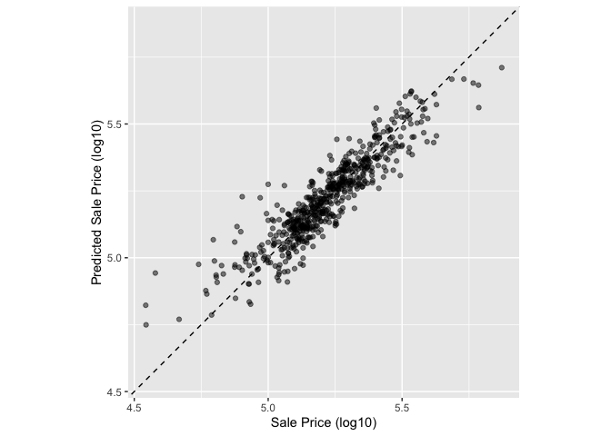
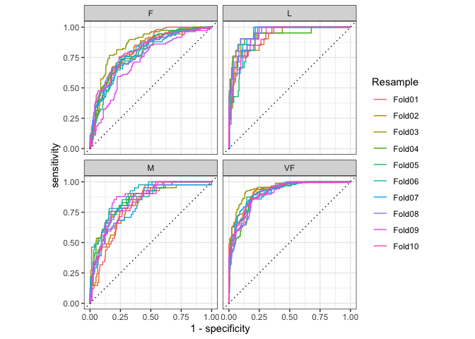

# Chapter 9 - Judging Model Effectiveness

<https://www.tmwr.org/performance>

Which metrics you use to examine model effectiveness matters!

-   Root mean square (RMSE) = measure of accuracy

    -   Can result in more variability, but uniform accuracy in model predictions

-   Coefficient of determination (R^2^) = measure of correlation

    -   Can result in tighter correlation b/t observed and predicted, [except in the tails]{.underline}

**Tidymodels package of relevance: yardstick.**

### Carry Over AMES Code:


```r
library(tidymodels)
```

```
## ── Attaching packages ────────────────────────────────────── tidymodels 1.1.1 ──
```

```
## ✔ broom        1.0.5     ✔ recipes      1.0.8
## ✔ dials        1.2.0     ✔ rsample      1.2.0
## ✔ dplyr        1.1.3     ✔ tibble       3.2.1
## ✔ ggplot2      3.4.3     ✔ tidyr        1.3.0
## ✔ infer        1.0.5     ✔ tune         1.1.2
## ✔ modeldata    1.2.0     ✔ workflows    1.1.3
## ✔ parsnip      1.1.1     ✔ workflowsets 1.0.1
## ✔ purrr        1.0.2     ✔ yardstick    1.2.0
```

```
## ── Conflicts ───────────────────────────────────────── tidymodels_conflicts() ──
## ✖ purrr::discard() masks scales::discard()
## ✖ dplyr::filter()  masks stats::filter()
## ✖ dplyr::lag()     masks stats::lag()
## ✖ recipes::step()  masks stats::step()
## • Use suppressPackageStartupMessages() to eliminate package startup messages
```

```r
data(ames)
ames <- mutate(ames, Sale_Price = log10(Sale_Price))

set.seed(502)
ames_split <- initial_split(ames, prop = 0.80, strata = Sale_Price)
ames_train <- training(ames_split)
ames_test  <-  testing(ames_split)

ames_rec <- 
  recipe(Sale_Price ~ Neighborhood + Gr_Liv_Area + Year_Built + Bldg_Type + 
           Latitude + Longitude, data = ames_train) %>%
  step_log(Gr_Liv_Area, base = 10) %>% 
  step_other(Neighborhood, threshold = 0.01) %>% 
  step_dummy(all_nominal_predictors()) %>% 
  step_interact( ~ Gr_Liv_Area:starts_with("Bldg_Type_") ) %>% 
  step_ns(Latitude, Longitude, deg_free = 20)
  
lm_model <- linear_reg() %>% set_engine("lm")

lm_wflow <- 
  workflow() %>% 
  add_model(lm_model) %>% 
  add_recipe(ames_rec)

lm_fit <- fit(lm_wflow, ames_train)
```

## Performance Metrics and Inference 

Inferential vs. predictive models

-   Inferential model - used to understand relationships

    -   Underlying statistical qualities are important

    -   Should still use functions that describe/measure predictive strength --\> increased credibility of the model

-   Predictive model - predictive strength = primary importance

    -   Underlying statistical qualities not as important

## Regression Metrics 

General syntax of yardstick functions: function(data, truth, ...)

-   data = data frame or tibble

-   truth = observed outcome values

-   ... = other arguments used to specify the columns containing the predictors

### Example with AMES data:

#### Produce Predictions:


```r
ames_test_res <- predict(lm_fit, new_data = ames_test %>% select(-Sale_Price))
ames_test_res 
```

```
## # A tibble: 588 × 1
##    .pred
##    <dbl>
##  1  5.07
##  2  5.31
##  3  5.28
##  4  5.33
##  5  5.30
##  6  5.24
##  7  5.67
##  8  5.52
##  9  5.34
## 10  5.00
## # ℹ 578 more rows
```

\*Note: they use the test set here for illustration, but suggest that a resampling method would be better than using the test set at this step of the modeling process.

#### Match predicted values with corresponding observed outcome 


```r
ames_test_res <- bind_cols(ames_test_res, ames_test %>% select(Sale_Price))
ames_test_res
```

```
## # A tibble: 588 × 2
##    .pred Sale_Price
##    <dbl>      <dbl>
##  1  5.07       5.02
##  2  5.31       5.39
##  3  5.28       5.28
##  4  5.33       5.28
##  5  5.30       5.28
##  6  5.24       5.26
##  7  5.67       5.73
##  8  5.52       5.60
##  9  5.34       5.32
## 10  5.00       4.98
## # ℹ 578 more rows
```

\*Note: Remember that we previously transformed the data with log10 --\> we are still in that scale. It's best to analyze the predictions on the transformed scale, even if the predictions will be reported using the original units.

#### Plot the observed vs. predicted figure


```r
ggplot(ames_test_res, aes(x = Sale_Price, y = .pred)) + 
  # Create a diagonal line:
  geom_abline(lty = 2) + 
  geom_point(alpha = 0.5) + 
  labs(y = "Predicted Sale Price (log10)", x = "Sale Price (log10)") +
  # Scale and size the x- and y-axis uniformly:
  coord_obs_pred()
```

<!-- -->

#### Compute RMSE


```r
rmse(ames_test_res, truth = Sale_Price, estimate = .pred)
```

```
## # A tibble: 1 × 3
##   .metric .estimator .estimate
##   <chr>   <chr>          <dbl>
## 1 rmse    standard      0.0736
```

#### Create a metric set


```r
ames_metrics <- metric_set(rmse, rsq, mae) #mae = mean absolute error 
ames_metrics(ames_test_res, truth = Sale_Price, estimate = .pred)
```

```
## # A tibble: 3 × 3
##   .metric .estimator .estimate
##   <chr>   <chr>          <dbl>
## 1 rmse    standard      0.0736
## 2 rsq     standard      0.836 
## 3 mae     standard      0.0549
```

-   RMSE and MAE - measure the difference b/t the predicted and observed values

    -   In the scale of the outcome

-   R^2^ = squared correlation b/t the predicted and observed values

    -   Closer to 1 = better

\*Note: There isn't a function for adjusted R^2^ b/c it is used when the same data used to fit the model are used to evaluate the model. Tidymodels creators believe that it is always better to compute performance on a separate data set than the one used to fit the model.

## Binary Classification Metrics

Example predictions from a test data set with two classes:


```r
data(two_class_example)
tibble(two_class_example)
```

```
## # A tibble: 500 × 4
##    truth   Class1   Class2 predicted
##    <fct>    <dbl>    <dbl> <fct>    
##  1 Class2 0.00359 0.996    Class2   
##  2 Class1 0.679   0.321    Class1   
##  3 Class2 0.111   0.889    Class2   
##  4 Class1 0.735   0.265    Class1   
##  5 Class2 0.0162  0.984    Class2   
##  6 Class1 0.999   0.000725 Class1   
##  7 Class1 0.999   0.000799 Class1   
##  8 Class1 0.812   0.188    Class1   
##  9 Class2 0.457   0.543    Class2   
## 10 Class2 0.0976  0.902    Class2   
## # ℹ 490 more rows
```

Columns "Class1" and "Class2" = predicted class probabilities

Column "predicted" = discrete predictions

### Yardstick functions for discrete predictions 


```r
# A confusion matrix: 
conf_mat(two_class_example, truth = truth, estimate = predicted)
```

```
##           Truth
## Prediction Class1 Class2
##     Class1    227     50
##     Class2     31    192
```

```r
# Accuracy:
accuracy(two_class_example, truth, predicted)
```

```
## # A tibble: 1 × 3
##   .metric  .estimator .estimate
##   <chr>    <chr>          <dbl>
## 1 accuracy binary         0.838
```

```r
# Matthews correlation coefficient:
mcc(two_class_example, truth, predicted)
```

```
## # A tibble: 1 × 3
##   .metric .estimator .estimate
##   <chr>   <chr>          <dbl>
## 1 mcc     binary         0.677
```

```r
# F1 metric:
f_meas(two_class_example, truth, predicted)
```

```
## # A tibble: 1 × 3
##   .metric .estimator .estimate
##   <chr>   <chr>          <dbl>
## 1 f_meas  binary         0.849
```

```r
# Combining these three classification metrics together
classification_metrics <- metric_set(accuracy, mcc, f_meas)
classification_metrics(two_class_example, truth = truth, estimate = predicted)
```

```
## # A tibble: 3 × 3
##   .metric  .estimator .estimate
##   <chr>    <chr>          <dbl>
## 1 accuracy binary         0.838
## 2 mcc      binary         0.677
## 3 f_meas   binary         0.849
```

"The Matthews correlation coefficient and F1 score both summarize the confusion matrix, but compared to `mcc()`, which measures the quality of both positive and negative examples, the `f_meas()` metric emphasizes the positive class, i.e., the event of interest."

The functions have an argument called `event_level` to distinguish positive and negative levels.

-   Default = the *first* level of the outcome factor is the event of interest.

-   Note: other R functions use the second level to denote the event b/c of cases where outcome is encoded as 0/1 (1 = event). Since tidymodels requires a categorical outcome to be encoded as a factor, this is no longer necessary.

#### Ex when 2nd level = event:


```r
f_meas(two_class_example, truth, predicted, event_level = "second")
```

```
## # A tibble: 1 × 3
##   .metric .estimator .estimate
##   <chr>   <chr>          <dbl>
## 1 f_meas  binary         0.826
```

### Yardstick functions for predicted probabilities 

Receiver operating characteristic (ROC) curve - computes the sensitivity and specificity over a continuum of diff event thresholds

-   roc_curve() - computes the data points that make up the ROC curve

-   roc_auc() - computes the area under the under the curve


```r
two_class_curve <- roc_curve(two_class_example, truth, Class1) #add an argument for the event of interest 
two_class_curve
```

```
## # A tibble: 502 × 3
##    .threshold specificity sensitivity
##         <dbl>       <dbl>       <dbl>
##  1 -Inf           0                 1
##  2    1.79e-7     0                 1
##  3    4.50e-6     0.00413           1
##  4    5.81e-6     0.00826           1
##  5    5.92e-6     0.0124            1
##  6    1.22e-5     0.0165            1
##  7    1.40e-5     0.0207            1
##  8    1.43e-5     0.0248            1
##  9    2.38e-5     0.0289            1
## 10    3.30e-5     0.0331            1
## # ℹ 492 more rows
```

```r
roc_auc(two_class_example, truth, Class1)
```

```
## # A tibble: 1 × 3
##   .metric .estimator .estimate
##   <chr>   <chr>          <dbl>
## 1 roc_auc binary         0.939
```

```r
autoplot(two_class_curve)
```

<!-- -->

```r
#if the curve was close to the diagonal line, then the predictiosn wouldn't be better than random guessing
#upper left hand corner --> model performs well at different thresholds 
```

Other functions that use probability estimates: `gain_curve()`, `lift_curve()`, and `pr_curve()`

## Multiclass Classification Metrics 

For 3 or more classes...

Example data set:


```r
data(hpc_cv)
tibble(hpc_cv) 
```

```
## # A tibble: 3,467 × 7
##    obs   pred     VF      F       M          L Resample
##    <fct> <fct> <dbl>  <dbl>   <dbl>      <dbl> <chr>   
##  1 VF    VF    0.914 0.0779 0.00848 0.0000199  Fold01  
##  2 VF    VF    0.938 0.0571 0.00482 0.0000101  Fold01  
##  3 VF    VF    0.947 0.0495 0.00316 0.00000500 Fold01  
##  4 VF    VF    0.929 0.0653 0.00579 0.0000156  Fold01  
##  5 VF    VF    0.942 0.0543 0.00381 0.00000729 Fold01  
##  6 VF    VF    0.951 0.0462 0.00272 0.00000384 Fold01  
##  7 VF    VF    0.914 0.0782 0.00767 0.0000354  Fold01  
##  8 VF    VF    0.918 0.0744 0.00726 0.0000157  Fold01  
##  9 VF    VF    0.843 0.128  0.0296  0.000192   Fold01  
## 10 VF    VF    0.920 0.0728 0.00703 0.0000147  Fold01  
## # ℹ 3,457 more rows
```

```r
#4 classes 
```

### Functions for discrete class probabilities are identical to binary ones:


```r
accuracy(hpc_cv, obs, pred)
```

```
## # A tibble: 1 × 3
##   .metric  .estimator .estimate
##   <chr>    <chr>          <dbl>
## 1 accuracy multiclass     0.709
```

```r
mcc(hpc_cv, obs, pred)
```

```
## # A tibble: 1 × 3
##   .metric .estimator .estimate
##   <chr>   <chr>          <dbl>
## 1 mcc     multiclass     0.515
```

Sensitivity measures the true positive rate, which is specific to two classes (event vs. nonevent).

-   Wrapper methods can be used to apply sensitivity to multiclass outcomes. These options are macro-averaging, macro-weighted averaging, and micro-averaging:

    -   "Macro-averaging computes a set of one-versus-all metrics using the standard two-class statistics. These are averaged.

    -   Macro-weighted averaging does the same but the average is weighted by the number of samples in each class.

    -   Micro-averaging computes the contribution for each class, aggregates them, then computes a single metric from the aggregates."

"Using sensitivity as an example, the usual two-class calculation is the ratio of the number of correctly predicted events divided by the number of true events. The manual calculations for these averaging methods are:"


```r
class_totals <- 
  count(hpc_cv, obs, name = "totals") %>% 
  mutate(class_wts = totals / sum(totals))
class_totals
```

```
##   obs totals  class_wts
## 1  VF   1769 0.51023940
## 2   F   1078 0.31093164
## 3   M    412 0.11883473
## 4   L    208 0.05999423
```

```r
cell_counts <- 
  hpc_cv %>% 
  group_by(obs, pred) %>% 
  count() %>% 
  ungroup()

# Compute the four sensitivities using 1-vs-all
one_versus_all <- 
  cell_counts %>% 
  filter(obs == pred) %>% 
  full_join(class_totals, by = "obs") %>% 
  mutate(sens = n / totals)
one_versus_all
```

```
## # A tibble: 4 × 6
##   obs   pred      n totals class_wts  sens
##   <fct> <fct> <int>  <int>     <dbl> <dbl>
## 1 VF    VF     1620   1769    0.510  0.916
## 2 F     F       647   1078    0.311  0.600
## 3 M     M        79    412    0.119  0.192
## 4 L     L       111    208    0.0600 0.534
```

```r
# Three different estimates:
one_versus_all %>% 
  summarize(
    macro = mean(sens), 
    macro_wts = weighted.mean(sens, class_wts),
    micro = sum(n) / sum(totals)
  )
```

```
## # A tibble: 1 × 3
##   macro macro_wts micro
##   <dbl>     <dbl> <dbl>
## 1 0.560     0.709 0.709
```

#### Use yardstick to do the calculations for you:


```r
sensitivity(hpc_cv, obs, pred, estimator = "macro") #use the estiamator argument to applly the above methods 
```

```
## # A tibble: 1 × 3
##   .metric     .estimator .estimate
##   <chr>       <chr>          <dbl>
## 1 sensitivity macro          0.560
```

```r
sensitivity(hpc_cv, obs, pred, estimator = "macro_weighted")
```

```
## # A tibble: 1 × 3
##   .metric     .estimator     .estimate
##   <chr>       <chr>              <dbl>
## 1 sensitivity macro_weighted     0.709
```

```r
sensitivity(hpc_cv, obs, pred, estimator = "micro")
```

```
## # A tibble: 1 × 3
##   .metric     .estimator .estimate
##   <chr>       <chr>          <dbl>
## 1 sensitivity micro          0.709
```

### Functions for probability estimates - analogs to binary ones

ROC:


```r
roc_auc(hpc_cv, obs, VF, F, M, L) #have to give it all of the class prob cols
```

```
## # A tibble: 1 × 3
##   .metric .estimator .estimate
##   <chr>   <chr>          <dbl>
## 1 roc_auc hand_till      0.829
```

Can also use macro-weighting


```r
roc_auc(hpc_cv, obs, VF, F, M, L, estimator = "macro_weighted")
```

```
## # A tibble: 1 × 3
##   .metric .estimator     .estimate
##   <chr>   <chr>              <dbl>
## 1 roc_auc macro_weighted     0.868
```

Can also use grouping:


```r
hpc_cv %>% 
  group_by(Resample) %>% 
  accuracy(obs, pred)
```

```
## # A tibble: 10 × 4
##    Resample .metric  .estimator .estimate
##    <chr>    <chr>    <chr>          <dbl>
##  1 Fold01   accuracy multiclass     0.726
##  2 Fold02   accuracy multiclass     0.712
##  3 Fold03   accuracy multiclass     0.758
##  4 Fold04   accuracy multiclass     0.712
##  5 Fold05   accuracy multiclass     0.712
##  6 Fold06   accuracy multiclass     0.697
##  7 Fold07   accuracy multiclass     0.675
##  8 Fold08   accuracy multiclass     0.721
##  9 Fold09   accuracy multiclass     0.673
## 10 Fold10   accuracy multiclass     0.699
```

```r
hpc_cv %>% 
  group_by(Resample) %>% 
  roc_curve(obs, VF, F, M, L) %>% 
  autoplot()
```

<!-- -->

```r
#VF is predicted better than the F or M classes 
```
