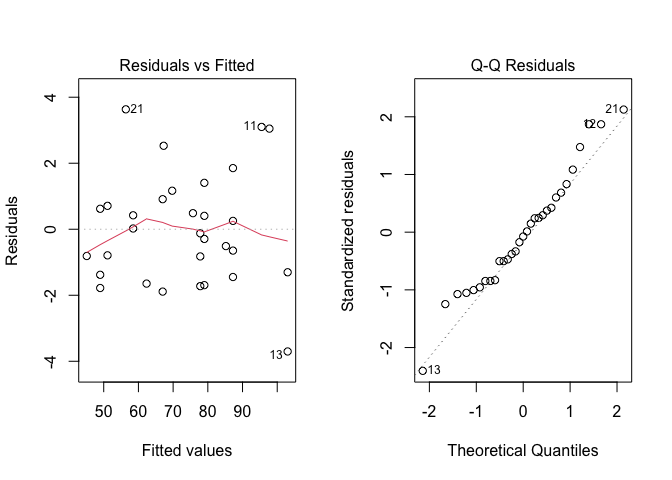
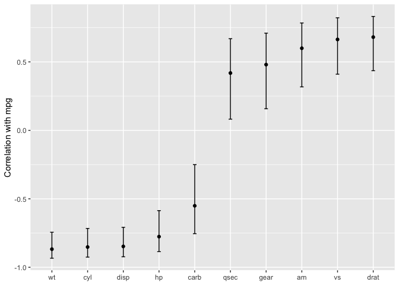

# Necessary libraries 

```r
library(tidyverse)
```

```
## ── Attaching core tidyverse packages ──────────────────────── tidyverse 2.0.0 ──
## ✔ dplyr     1.1.3     ✔ readr     2.1.4
## ✔ forcats   1.0.0     ✔ stringr   1.5.0
## ✔ ggplot2   3.4.3     ✔ tibble    3.2.1
## ✔ lubridate 1.9.2     ✔ tidyr     1.3.0
## ✔ purrr     1.0.2     
## ── Conflicts ────────────────────────────────────────── tidyverse_conflicts() ──
## ✖ dplyr::filter() masks stats::filter()
## ✖ dplyr::lag()    masks stats::lag()
## ℹ Use the conflicted package (<http://conflicted.r-lib.org/>) to force all conflicts to become errors
```

```r
library(modeldata)
library(broom)
```

# Chapter 1 - https://www.tmwr.org/software-modeling

* Important for models to be easy to use properly and promote good methodological practice 

## Types of Models
* Descriptive - illustrate characteristics of some data

* Inferential - produce a decision for a research question or explore a particular hypothesis
  + linear regressions are primarily used for inferential models, but can also be predictive 
  + have to be careful with model selection; using only p-values can sacrifice accuracy of the model (can't ignore the predictive potential of the model)
  
* Predictive - produce best possible prediction of new data 

Models can be supervised or unsupervised:

* Unsupervised - learn patterns or chars. of data but lack an outcome (ex: pCA)
* Supervised - have an outcome variable
  + Regression - numeric outcome
  + Classification - qualitative outcome 
  
## Data Analysis Process
1. Clean the data
2. Understand the data (Exploratory data analysis or EDA)
3. Feature engineering - creation of specific model terms that make it easier to model the observed data (Exs: PCA or taking the ratio of two predictors)
4. Model tuning and selection 
5. Model evaluation 


# Chapter 2 - https://www.tmwr.org/tidyverse
## Tidyverse principles
* Design for humans
* Reuse existing data structures
* The pipe and functional programming 
  + When designing for functional programming, the output should only depend on the inputs and the function should have no side effects (see below example)

```r
compute_log_ratio <- function(mpg, wt) {
  log_base <- getOption("log_base", default = exp(1)) # gets external data
  results <- log(mpg/wt, base = log_base)
  print(mean(results))                                # prints to the console
  done <<- TRUE                                       # sets external data
  results
}

#beter version:
compute_log_ratio <- function(mpg, wt, log_base = exp(1)) {
  log(mpg/wt, base = log_base)
}
```

  + "The purrr package contains tools for functional programming. Let’s focus on the map() family of functions, which operates on vectors and always returns the same type of output. The most basic function, map(), always returns a list and uses the basic syntax of map(vector, function)."

```r
#to take square root of data 
map(head(mtcars$mpg, 3), sqrt)
```

```
## [[1]]
## [1] 4.582576
## 
## [[2]]
## [1] 4.582576
## 
## [[3]]
## [1] 4.774935
```

```r
#There are specialized variants of map() that return values when we know or expect that the function will generate one of the basic vector types. 
map_dbl(head(mtcars$mpg, 3), sqrt)
```

```
## [1] 4.582576 4.582576 4.774935
```

```r
#There are also mapping functions that operate across multiple vectors:
log_ratios <- map2_dbl(mtcars$mpg, mtcars$wt, compute_log_ratio)
head(log_ratios)
```

```
## [1] 2.081348 1.988470 2.285193 1.895564 1.693052 1.654643
```

```r
#The map() functions also allow for temporary, anonymous functions defined using the tilde character. The argument values are .x and .y for map2():
map2_dbl(mtcars$mpg, mtcars$wt, ~ log(.x/.y)) %>% 
  head()
```

```
## [1] 2.081348 1.988470 2.285193 1.895564 1.693052 1.654643
```


# Chapter 3 - https://www.tmwr.org/base-r
## R modeling fundamentals 
lm() function is used for ordinary linear models
* syntax: outcome ~ predictor
* plus sign is used to add main effects
* most model functions cannot operate on nonnumeric data 
  + the model will convert them to dummy variables 
  + if 5 levels instead of two, the model formula would create four binary columns that are binary indicators for four of the levels The reference level of the factor (i.e., the first level) is always left out of the predictor set. The idea is that, if you know the values of the four indicator variables, the value of the species can be determined. The "+" creates different y-intercepts for each level
  + Interactions 

```r
#basic ineraction syntax 
rate ~ temp + species + temp:species
```

```
## rate ~ temp + species + temp:species
```

```r
# A shortcut can be used to expand all interactions containing
# interactions with two variables:
rate ~ (temp + species)^2
```

```
## rate ~ (temp + species)^2
```

```r
# Another shortcut to expand factors to include all possible
# interactions (equivalent for this example):
rate ~ temp * species
```

```
## rate ~ temp * species
```
  
* "In-line functions can be used in the formula. For example, to use the natural log of the temperature, we can create the formula rate ~ log(temp). Since the formula is symbolic by default, literal math can also be applied to the predictors using the identity function I(). To use Fahrenheit units, the formula could be rate ~ I( (temp * 9/5) + 32 ) to convert from Celsius."

* "R has many functions that are useful inside of formulas. For example, poly(x, 3) adds linear, quadratic, and cubic terms for x to the model as main effects. The splines package also has several functions to create nonlinear spline terms in the formula."

* "For data sets where there are many predictors, the period shortcut is available. The period represents main effects for all of the columns that are not on the left-hand side of the tilde. Using ~ (.)^3 would add main effects as well as all two- and three-variable interactions to the model."

* Diagnostic plots

```r
data(crickets, package = "modeldata")
interaction_fit <-  lm(rate ~ (temp + species)^2, data = crickets) 

# Place two plots next to one another:
par(mfrow = c(1, 2))

# Show residuals vs predicted values:
plot(interaction_fit, which = 1)

# A normal quantile plot on the residuals:
plot(interaction_fit, which = 2)
```

<!-- -->

* The anova() function can compare models that do and don't have an interaction effect.

* The predict() function can be used to estimate the outcome at levels not observed in the experiment. It takes the model object and a data frame of new values for prediction.

```r
main_effect_fit <-  lm(rate ~ temp + species, data = crickets) 
new_values <- data.frame(species = "O. exclamationis", temp = 15:20)
predict(main_effect_fit, new_values)
```

```
##        1        2        3        4        5        6 
## 46.83039 50.43314 54.03589 57.63865 61.24140 64.84415
```

## Purposes of the R model formula
* defines the columns that the model uses
* uses the formula to encode the columns into an appropriate format
* defines the roles of the columns 

## Why tidiness is important for modeling
* predict() methods can have different argument values depending on the function used to do the initial modeling --> lack of consistency

* Conventions for missing data are handled inconsistently. When models make predictions, the vast majority require all of the predictors to have complete values. There are several options baked in to R at this point with the generic function na.action(). This sets the policy for how a function should behave if there are missing values. The two most common policies are na.fail() and na.omit(). The former produces an error if missing data are present while the latter removes the missing data prior to calculations by case-wise deletion. 

```r
# Add a missing value to the prediction set
new_values$temp[1] <- NA

# The predict method for `lm` defaults to `na.pass`:
predict(main_effect_fit, new_values)
```

```
##        1        2        3        4        5        6 
##       NA 50.43314 54.03589 57.63865 61.24140 64.84415
```

```r
#>     1     2     3     4     5     6 
#>    NA 50.43 54.04 57.64 61.24 64.84

# Alternatively 
#predict(main_effect_fit, new_values, na.action = na.fail)
#> Error in na.fail.default(structure(list(temp = c(NA, 16L, 17L, 18L, 19L, : missing values in object

predict(main_effect_fit, new_values, na.action = na.omit)
```

```
##        2        3        4        5        6 
## 50.43314 54.03589 57.63865 61.24140 64.84415
```

```r
#>     2     3     4     5     6 
#> 50.43 54.04 57.64 61.24 64.84
```

Design goals for the tidymodels packages:

* "R has excellent capabilities for object-oriented programming, and we use this in lieu of creating new function names (such as a hypothetical new predict_samples() function)."

* "Sensible defaults are very important. Also, functions should have no default for arguments when it is more appropriate to force the user to make a choice (e.g., the file name argument for read_csv())."

* "Similarly, argument values whose default can be derived from the data should be. For example, for glm() the family argument could check the type of data in the outcome and, if no family was given, a default could be determined internally."

* "Functions should take the data structures that users have as opposed to the data structure that developers want. For example, a model function’s only interface should not be constrained to matrices. Frequently, users will have non-numeric predictors such as factors."

"The broom::tidy() function, which we use throughout this book, is another tool for standardizing the structure of R objects. It can return many types of R objects in a more usable format. For example, suppose that predictors are being screened based on their correlation to the outcome column. Using purrr::map(), the results from cor.test() can be returned in a list for each predictor:"

```r
corr_res <- map(mtcars %>% select(-mpg), cor.test, y = mtcars$mpg)

# The first of ten results in the vector: 
corr_res[[1]]
```

```
## 
## 	Pearson's product-moment correlation
## 
## data:  .x[[i]] and mtcars$mpg
## t = -8.9197, df = 30, p-value = 6.113e-10
## alternative hypothesis: true correlation is not equal to 0
## 95 percent confidence interval:
##  -0.9257694 -0.7163171
## sample estimates:
##       cor 
## -0.852162
```

```r
#> 
#>  Pearson's product-moment correlation
#> 
#> data:  .x[[i]] and mtcars$mpg
#> t = -8.9, df = 30, p-value = 6e-10
#> alternative hypothesis: true correlation is not equal to 0
#> 95 percent confidence interval:
#>  -0.9258 -0.7163
#> sample estimates:
#>     cor 
#> -0.8522
```

"If we want to use these results in a plot, the standard format of hypothesis test results are not very useful. The tidy() method can return this as a tibble with standardized names:"

```r
tidy(corr_res[[1]])
```

```
## # A tibble: 1 × 8
##   estimate statistic  p.value parameter conf.low conf.high method    alternative
##      <dbl>     <dbl>    <dbl>     <int>    <dbl>     <dbl> <chr>     <chr>      
## 1   -0.852     -8.92 6.11e-10        30   -0.926    -0.716 Pearson'… two.sided
```

```r
#> # A tibble: 1 × 8
#>   estimate statistic  p.value parameter conf.low conf.high method        alternative
#>      <dbl>     <dbl>    <dbl>     <int>    <dbl>     <dbl> <chr>         <chr>      
#> 1   -0.852     -8.92 6.11e-10        30   -0.926    -0.716 Pearson's pr… two.sided
```

"These results can be “stacked” and added to a ggplot()"

```r
corr_res %>% 
  # Convert each to a tidy format; `map_dfr()` stacks the data frames 
  map_dfr(tidy, .id = "predictor") %>% 
  ggplot(aes(x = fct_reorder(predictor, estimate))) + 
  geom_point(aes(y = estimate)) + 
  geom_errorbar(aes(ymin = conf.low, ymax = conf.high), width = .1) +
  labs(x = NULL, y = "Correlation with mpg")
```

<!-- -->

## Combining base R models and the tidyverse
"R modeling functions from the core language or other R packages can be used in conjunction with the tidyverse, especially with the dplyr, purrr, and tidyr packages. For example, if we wanted to fit separate models for each cricket species, we can first break out the cricket data by this column using dplyr::group_nest():"

```r
names(crickets)
```

```
## [1] "species" "temp"    "rate"
```

```r
split_by_species <- crickets %>% group_nest(species)
split_by_species
```

```
## # A tibble: 2 × 2
##   species                        data
##   <fct>            <list<tibble[,2]>>
## 1 O. exclamationis           [14 × 2]
## 2 O. niveus                  [17 × 2]
```

"The data column contains the rate and temp columns from crickets in a list column. From this, the purrr::map() function can create individual models for each species:"

```r
model_by_species <- 
  split_by_species %>% 
  mutate(model = map(data, ~ lm(rate ~ temp, data = .x)))
model_by_species
```

```
## # A tibble: 2 × 3
##   species                        data model 
##   <fct>            <list<tibble[,2]>> <list>
## 1 O. exclamationis           [14 × 2] <lm>  
## 2 O. niveus                  [17 × 2] <lm>
```

"To collect the coefficients for each of these models, use broom::tidy() to convert them to a consistent data frame format so that they can be unnested:"

```r
model_by_species %>% 
  mutate(coef = map(model, tidy)) %>% 
  select(species, coef) %>% 
  unnest(cols = c(coef))
```

```
## # A tibble: 4 × 6
##   species          term        estimate std.error statistic  p.value
##   <fct>            <chr>          <dbl>     <dbl>     <dbl>    <dbl>
## 1 O. exclamationis (Intercept)   -11.0      4.77      -2.32 3.90e- 2
## 2 O. exclamationis temp            3.75     0.184     20.4  1.10e-10
## 3 O. niveus        (Intercept)   -15.4      2.35      -6.56 9.07e- 6
## 4 O. niveus        temp            3.52     0.105     33.6  1.57e-15
```

* "List columns can be very powerful in modeling projects. List columns provide containers for any type of R objects, from a fitted model itself to the important data frame structure."

## The tidymodels metapackage loads a core set of tidymodels and tidyverse packages 

```r
library(tidymodels)
```

```
## ── Attaching packages ────────────────────────────────────── tidymodels 1.1.1 ──
```

```
## ✔ dials        1.2.0     ✔ tune         1.1.2
## ✔ infer        1.0.5     ✔ workflows    1.1.3
## ✔ parsnip      1.1.1     ✔ workflowsets 1.0.1
## ✔ recipes      1.0.8     ✔ yardstick    1.2.0
## ✔ rsample      1.2.0
```

```
## ── Conflicts ───────────────────────────────────────── tidymodels_conflicts() ──
## ✖ scales::discard() masks purrr::discard()
## ✖ dplyr::filter()   masks stats::filter()
## ✖ recipes::fixed()  masks stringr::fixed()
## ✖ dplyr::lag()      masks stats::lag()
## ✖ yardstick::spec() masks readr::spec()
## ✖ recipes::step()   masks stats::step()
## • Use suppressPackageStartupMessages() to eliminate package startup messages
```

Loading the package shows when there are function naming conflicts with previously loaded packages. There are few ways to deal with this"
* "The function can be called with its namespace (e.g., stats::filter()). This is not bad practice, but it does make the code less readable."

* "Another option is to use the conflicted package. We can set a rule that remains in effect until the end of the R session to ensure that one specific function will always run if no namespace is given in the code. As an example, if we prefer the dplyr version of the previous function:"

```r
library(conflicted)
conflict_prefer("filter", winner = "dplyr")
```

```
## [conflicted] Will prefer dplyr::filter over any other package.
```

* "For convenience, tidymodels contains a function that captures most of the common naming conflicts that we might encounter:"

```r
tidymodels_prefer(quiet = FALSE)
```

```
## [conflicted] Will prefer agua::refit over any other package.
## [conflicted] Will prefer dials::Laplace over any other package.
## [conflicted] Will prefer dials::max_rules over any other package.
## [conflicted] Will prefer dials::neighbors over any other package.
## [conflicted] Will prefer dials::prune over any other package.
## [conflicted] Will prefer dials::smoothness over any other package.
## [conflicted] Will prefer dplyr::collapse over any other package.
## [conflicted] Will prefer dplyr::combine over any other package.
## [conflicted] Removing existing preference.
## [conflicted] Will prefer dplyr::filter over any other package.
## [conflicted] Will prefer dplyr::rename over any other package.
## [conflicted] Will prefer dplyr::select over any other package.
## [conflicted] Will prefer dplyr::slice over any other package.
## [conflicted] Will prefer ggplot2::`%+%` over any other package.
## [conflicted] Will prefer ggplot2::margin over any other package.
## [conflicted] Will prefer parsnip::bart over any other package.
## [conflicted] Will prefer parsnip::fit over any other package.
## [conflicted] Will prefer parsnip::mars over any other package.
## [conflicted] Will prefer parsnip::pls over any other package.
## [conflicted] Will prefer purrr::cross over any other package.
## [conflicted] Will prefer purrr::invoke over any other package.
## [conflicted] Will prefer purrr::map over any other package.
## [conflicted] Will prefer recipes::discretize over any other package.
## [conflicted] Will prefer recipes::step over any other package.
## [conflicted] Will prefer rsample::populate over any other package.
## [conflicted] Will prefer scales::rescale over any other package.
## [conflicted] Will prefer themis::step_downsample over any other package.
## [conflicted] Will prefer themis::step_upsample over any other package.
## [conflicted] Will prefer tidyr::expand over any other package.
## [conflicted] Will prefer tidyr::extract over any other package.
## [conflicted] Will prefer tidyr::pack over any other package.
## [conflicted] Will prefer tidyr::unpack over any other package.
## [conflicted] Will prefer tune::parameters over any other package.
## [conflicted] Will prefer tune::tune over any other package.
## [conflicted] Will prefer yardstick::get_weights over any other package.
## [conflicted] Will prefer yardstick::precision over any other package.
## [conflicted] Will prefer yardstick::recall over any other package.
## [conflicted] Will prefer yardstick::spec over any other package.
## [conflicted] Will prefer recipes::update over Matrix::update.
## ── Conflicts ──────────────────────────────────────────── tidymodels_prefer() ──
```
  + "Be aware that using this function opts you in to using conflicted::conflict_prefer() for all namespace conflicts, making every conflict an error and forcing you to choose which function to use. The function tidymodels::tidymodels_prefer() handles the most common conflicts from tidymodels functions, but you will need to handle other conflicts in your R session yourself."
